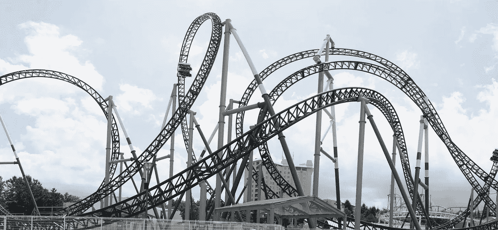

# 无价的

> 原文：<https://medium.com/hackernoon/priceless-5ee7102afdec>

今天一个比特币的价格下跌了很多。不到一周前，它触及 3000 美元。今天，它暴跌到 2100 多美元。对于外行人来说，这无疑是一个巨大的下降。对于那些短期记忆比普通金鱼稍好的人来说，这仅仅是道路上的一个突起，几乎不值得注意。三月底价格低于 1000 美元。与一年前相比，2100 美元仍然是 200%的收益。这就是比特币价格的作用。它吓跑了那些心胸狭窄的人，并有利于那些更有耐心的人。正如一则啤酒广告曾经宣称的那样，好东西会降临到那些耐心等待的人身上。这曾经是个谎言，但现在不是了。不是为了比特币。你看比特币是有限的东西，是稀缺资源。每一次上涨都是真实的，每一次下跌都是买入的机会。购买的最佳时机永远是现在的*。*昨天不会回来。还记得当初是什么让你卷进来的吗？比特币仍然是世界上第一种加密货币，也仍然是最安全的。它拥有最大的基础设施、最强的哈希能力和最敬业的开发团队，尽管最近所有的努力都在玷污他们。当前的缩放问题*将*得到解决，这只是时间问题。

卖出的最佳时机永远不会。用你的比特币的一部分来实现你所有的梦想，但要等到你能负担得起更多的时候。包括那架私人飞机和那个你一直想要的袒胸女链锯杂耍队。保持专注，这只是时间问题。忽略那些唱反调的人，末日预言家，也许最重要的是，忽略那些血腥的山寨币！他们中的大多数充其量只不过是分散注意力。如果比特币下跌，构成加密市场其余部分的纸牌屋很快也会跟着下跌。毕竟比特币才是最初的实验。我们能完全分散信任吗？嗯，我们首先要相信的是我们能够相信的*想法*。如果比特币失败，你认为其他所有加密货币会发生什么？没有人会再相信他们了。他们为什么要这么做？它们都是基于同一个想法。比特币可能发生的一切，都可能发生在一个替代币身上。贪婪是普遍的。

不过，比特币不会消失。如果你在日内交易中赚了钱，恭喜你。如果你在 3000 买入，恭喜你。如果你没有比特币，那么恭喜你，今天它们有折扣。关注奖品，而不是价格。在这里，长期目标才是最重要的，当每个人都达到这个目标时，请做好准备。不要停止成为它的一部分。毕竟，你从来没有投资超过你能承受的损失，不是吗？

> [黑客中午](http://bit.ly/Hackernoon)是黑客如何开始他们的下午。我们是 [@AMI](http://bit.ly/atAMIatAMI) 家庭的一员。我们现在[接受投稿](http://bit.ly/hackernoonsubmission)，并乐意[讨论广告&赞助](mailto:partners@amipublications.com)机会。
> 
> 如果你喜欢这个故事，我们推荐你阅读我们的[最新科技故事](http://bit.ly/hackernoonlatestt)和[趋势科技故事](https://hackernoon.com/trending)。直到下一次，不要把世界的现实想当然！

