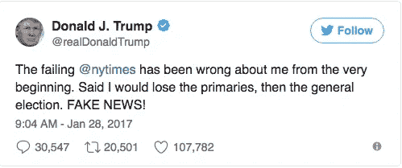
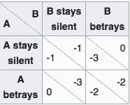

# 囚徒困境解释假新闻

> 原文：<https://medium.com/hackernoon/prisoner-dilemma-explains-fake-news-7db77791e70b>

正如一个比权威更强大的迷因(meme)所宣传的那样，第四种力量正在衰落:这是后真相政治和“假新闻”的崛起。

# **问题**

你可以尽情指责特朗普，但“假新闻”的概念流行是有原因的:人口众多的人越来越怀疑媒体宣传的故事。无论你是否相信福克斯新闻[积极传播关于奥巴马的错误信息](http://www.politicususa.com/2015/05/17/cnn-busts-fox-news-lying-president-obamas-remarks-poverty.html)，或者 NYT 和华盛顿邮报通过传播 Buzzfeed 捏造的故事做同样的事情，你从根本上不信任定期向你更新世界的媒体网络。

社交媒体的兴起让传统媒体公司(报纸和广播新闻网)与超级媒体公司(脸书和 Twitter)展开了竞争。由于社交媒体在受众拓展方面甚至比 CNN 的 24 小时广播更占上风，传统媒体发现自己的大部分内容都被榨干了，因为每日新闻已经被供稿取代。

# **奖励制度**

比特传播的速度比纸张快，这种动态导致了一场底部竞赛，因为这两种不同的媒体范式试图通过以更快的速度将人们与新闻联系起来而超越彼此。因为大多数新闻是被消费的(快速信息提取)而不是被加工的(信息的深度加工)，奖励制度变成了赢家通吃，传统媒体在很大程度上一直在输。

在赢家通吃的游戏中，第一就是一切，这就是为什么为了效率而降低质量标准。然而，就新闻而言，质量标准使记者能够区分事实和捏造，并破坏操纵叙事，至少在理想的情况下是如此。在很大程度上，新闻是事件更新，这种商品从《纽约时报》获得的价值并不比从 bro-joe.com 获得的多，因为品牌对新闻消费偏好几乎没有影响(毕竟，大多数人更信任他们的扩展好友群，而不是随机的报纸)。

> 假新闻总是会占据主导地位，所有媒体都不是有罪的，而是这种趋势的同谋，这是因为博弈论。

# **囚徒困境**

囚徒困境是博弈论中的一个场景，用来展示严格理性(自利)行为的局限性。[维基百科](https://en.wikipedia.org/wiki/Prisoner%27s_dilemma)解释道:

> 两名犯罪团伙成员被捕入狱。每个囚犯都被单独监禁，无法与他人交流。检察官缺乏足够的证据来判定这两个人的主要罪名成立。他们希望以较轻的罪名判处两人一年监禁。同时，检察官向每个囚犯提出了一个交易。每个囚犯都有机会要么通过证明对方犯了罪来背叛对方，要么通过保持沉默来与对方合作。报价是:
> 
> 如果 A 和 B 都背叛了对方，他们每个人都要在监狱里服刑 2 年
> 
> 如果 A 背叛了 B，但 B 保持沉默，A 将被释放，B 将在监狱服刑 3 年(反之亦然)
> 
> 如果 A 和 B 都保持沉默，他们都将只服刑 1 年(以较轻的罪名)

这是“黑客帝国”的可视化，不，它不是指电影，而是指基于对手所做的一系列选择及其相关的回报(奖励)。

纳什均衡(A 和 B 的一对决策，偏离它变得不合理)是 A 和 B 都背叛对方。如果 A 背叛 B，不管 B 保持沉默(0 > -1)还是背叛(-2 > -3)，A 都会更好，因为矩阵是对称的(A 和 B 都有相同的选择和收益)，所以 B 背叛 A 也会更好，因为 B 会更好，不管 A 决定做什么。因此，为了最大化他们的自身利益，A 和 B 倾向于一系列实际上使他们最糟糕的行动，如果他们以某种方式设法协调，都是因为 A 和 B 没有理由理性地信任对方，因为自私的事情就是背叛。

囚徒困境(PD)表明协调有时是不可能的，因为它是非理性的，PD 动力学在生物学、心理学、经济学、政治学等领域都有体现。

# **从囚徒困境到公地悲剧**

媒体发现自己陷入了一个更糟糕的 PD 版本:公地悲剧[(ToC)。ToC 就像 PD 一样，只是它不是 1 对 1，而是一个群体游戏，群体决定以可持续的方式消耗共享资源以避免枯竭，但即使只有一个人出现问题，整个计划也会崩溃，因为这个人可以访问全部资源。就像在 PD 中一样，ToC 中的每一个参与者都不能相信任何一个其他参与者不会背叛协议，因为这符合他们的最大利益，这会导致每个人都背叛，从而耗尽资源。](https://en.wikipedia.org/wiki/Tragedy_of_the_commons)

ToC 本质上是 PD 动态的一个更加脆弱的版本，因为无论多少人找到协调的方法，团体中极少数人背叛协议都会使协议崩溃。这的确是悲剧。

# **ToC 适用于假新闻**

在阿伦·索尔金的《新闻编辑室》中有一个很棒的场景，当 ACN 的记者团队在节目的中心不得不考虑是否继续宣布 Gabby Giffords 在她试图开枪后死亡。来自医院的确认还没有到来，但其他新闻媒体已经宣布她已经死亡，这意味着观众正在转向他们而不是 ACN。他们在等待证实故事真实性的每一刻，都在财务上输给了竞争对手。

这正是新闻机构发现自己每天都处于的情景，因为社交媒体正在接管并成为消费新闻的首选来源。速度变化如此之快，以至于当一个事件及其叙述被新闻媒体核实时，它已经过时并成为“旧新闻”，因为观众已经在社交媒体上阅读了所有相关信息。

因此，公地悲剧导致假新闻，因为制造假新闻要便宜得多(不需要付钱给记者核实事实)，不分享在社交媒体上传播的新闻也是不理性的(因为未能解决这样的事件会让竞争对手领先)，因此我们陷入了假新闻传播如此迅速的恶性循环，以至于当真相被证实时，我们作为观众已经离开了。

# 结论

博弈论准确地解释了假新闻上升的原因，这是因为公地悲剧的动态破坏了媒体作为一个整体协调防止恶性竞争的基础。

可悲的是，假新闻不仅破坏了我们社会中制衡的支柱之一，还可能导致真正的悲剧，如[继披萨门阴谋](https://www.washingtonpost.com/news/local/wp/2016/12/04/d-c-police-respond-to-report-of-a-man-with-a-gun-at-comet-ping-pong-restaurant/?utm_term=.ed92c3ced2ca)之后在 DC 发生的未遂大规模枪击事件。