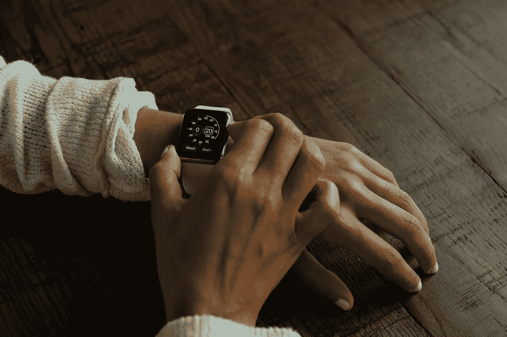

# 可穿戴设备引发隐私和安全担忧

> 原文：<https://medium.com/hackernoon/privacy-security-concerns-grow-for-wearables-677b70afa6e0>

随着可穿戴设备在我们的社会中日益普及，隐私和安全问题必须通过复杂的解决方案来解决，以保护重要的商业和消费者信息免受恶意利用。

在收集和存储信息时，存在数据落入坏人之手的内在风险。可穿戴设备最受消费者欢迎的用途之一是健康监测器，可以全天佩戴，以收集关于睡眠、锻炼、心率等信息，并存储在设备的云软件中。虽然许多人成功地利用这一工具来更好地了解他们的身体状况并改善他们的整体健康状况，但想象一下如果不小心存储了这些数据会产生什么问题。管理不善的信息有可能通过恶意第三方的数据泄露而被窃取，并随后被出售给肆无忌惮的组织，这些组织使用这些数据来评估消费者的健康风险。此次数据泄露事件的受害者可能面临医疗保险金额大幅增加，甚至保单被取消的情况。

然而，在敲响太多警钟之前，有必要指出，这些问题是可穿戴设备和相关软件开发人员最关心的问题。数据安全是所有物联网设备和技术的重要组成部分，公司必须继续改善软件和硬件，以尽可能减少漏洞。此外，许多公司购买网络责任保险，以便在数据泄露导致消费者诉讼时有资金可用。

可穿戴相机市场也在呈指数级增长，ABI 研究公司预计 2022 年的出货量将接近 2400 万部。毫无疑问，这种大规模的扩展必须伴随着复杂的隐私和数据保护安全。从可穿戴相机收集的数据可以包括无辜旁观者、潜在的犯罪目击者，甚至事故或不法行为的受害者的记录。其中一个主要问题是，如果不小心保护这些信息不被怀有恶意的人利用，这些数据可能会被用来威胁或勒索被摄像头捕捉到的人。

物联网的爆炸意味着开发人员、制造商和供应商必须实施强大的加密机制来保护个人数据，无论是由活动跟踪器、可穿戴相机还是联网汽车收集的数据。然而，只要技术专家、政府和组织合作为所有物联网设备开发全面的安全和数据隐私标准，消费者和企业就可以放心，他们的信息不会受到伤害。

*由* [*DataArt*](https://www.dataart.com/industry/iot-and-m2m-solutions?utm_source=medium&utm_medium=social&utm_campaign=i-spring-2018) *物联网负责人伊洛宁撰写。*