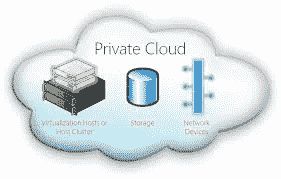
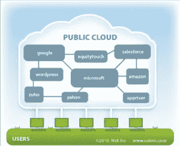
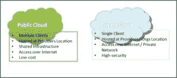

# 私有云与公共云计算

> 原文：<https://medium.com/hackernoon/private-cloud-vs-public-cloud-computing-e2aeed6df46>

您正在研究云解决方案吗？那么，您一定非常了解私有云与公共云之间的争论**。**这已经成为 IT 行业最热门的话题之一，也是一种典型的趋势，因为它提供了超越传统数据中心扩建的优势，可以增强可扩展性、性能甚至安全性。

因此，当这些组织在开发各种策略的同时试图实现云计算时，就会出现困惑，因此组织需要在两种云之间做出选择。因为如果操作得当，[云基础虚拟基础设施](https://www.techopedia.com/definition/30459/virtual-infrastructure)比传统数据中心更具优势。

那么，你想站在哪一边？当您思考这个问题时，您需要做的第一件也是最重要的事情是了解公共云和私有云的区别。但在此之前，先详细了解一下这两位。

# 私有云

私有云归一家公司所有，基本上是提供灵活性、自动化、监控、可扩展性和资源调配的数据中心架构。[私有云技术](https://www.ibm.com/cloud-computing/bluemix/virtual-servers?cm_mmc=Search+Google-_-IBMCloudBluemixMarketing_Infrastructure-_-EU-English-_-CEE-English-English-Search-Search-Google-Cloud-Multiple-IBM&utm_source=Google&utm_medium=CPC&utm_content=Cloud_-_Private_-_Private_Cloud_Technology&utm_campaign=EU_-_CEE_-_English_-_Region_-_Search_-_Google_-_Cloud_-_Multiple_-_IBM)不作为服务向外部客户销售；相反，它就像获得云系统的好处，同时实际上没有放弃维护自己的数据中心的控制权。

因此，私有云可能会很昂贵，通常不是小型或中等规模企业的好选择，主要由大型企业使用。对合规性的关注，甚至是将您的资产保持在防火墙之内，推动了私有云计算的安全性。

**那么，什么时候这种类型的云是显而易见的选择？**请看下面的答案。

*   *当安全性是您企业的主要关注点时。如果数据和应用程序是您最重要的资产，并且您需要同时控制它们，那么私有云就是最好的选择。*
*   *您的企业需要严格的安全性和保密性。*
*   *拥有一家能够非常有效地运营下一代云数据中心的大公司，并且能够独立运营。*

# 优势

私有云有如此多的[优势，因此选择私有云会让你接受这些优势。](http://www.itproportal.com/2014/05/12/the-benefits-of-private-cloud-computing/)

*   **安全性** : *私有云涉及单一组织。这样，您就可以设计网络、数据存储和硬件，确保安全，任何客户端都无法访问它们，即使它们位于同一个数据中心。*
*   **合规性** : *由于私有云专用于单个客户端，因此可以有效地实现合规性。*
*   **可定制:** *这允许您定制和指定网络性能、硬件性能和存储性能。*
*   **混合部署** : *即使需要专用服务器来运行高速数据库应用程序，也可以将硬件集成到私有云。*

# 不足之处

尽管这些云提供了最大的安全性和控制力，但同时所有软件和基础设施的购买和维护都由公司来完成，从而降低了成本节约。

# 公共云

这基本上就是互联网。服务提供商使用互联网来制作资源。像任何形式的应用程序和存储一样，公众也可以使用公共云来实现。值得一提的**这个云系统的例子**有 [Windows Azure 服务平台](http://searchcloudcomputing.techtarget.com/definition/Windows-Azure)，亚马逊弹性计算云(EC2)，Sun Cloud，IBM 的 Blue Cloud 和 Google App Engine。

这些类型的云最适合安装成本不高的用户，因为带宽、应用程序和硬件成本由提供商承担，从而提供最佳的规模经济。使用成本取决于所使用的容量。

但是，你必须意识到这个云系统什么时候能帮到你。从下述几点可知。

*   许多人使用应用程序的工作负载，例如电子邮件。
*   当你需要开发或测试一个应用程序代码时。
*   *当您使用 SaaS(软件即服务)应用程序时，供应商会提供一个实施良好的安全策略。*
*   *当您需要增加容量时*
*   *你参与了合作项目*
*   *使用提供云的平台开发专用软件。*

# 优势

就像私有云一样，公共云也有许多[优势:](http://resource.onlinetech.com/three-benefits-of-public-cloud-computing/)

*   **实用新型** : *该云系统基于现收现付模式；你为你使用的资源付费。如果您经常选择开发服务器，这是一种非常经济的方式。*
*   **没有合同** : *因为你是按小时付费的，所以你可以在使用两个小时后直接关机。*
*   **共享硬件:** *服务器共享相同的存储、网络和硬件设备，就像云中的其他租户一样。*
*   **自我管理** : *想要设置和管理您的服务器的详细信息吗？通过按需付费模式，您可以在云中有效地完成这项工作。*

# 不足之处

尽管它提供了如此多的特性，但对于某些组织来说，它可能不是最好的，因为它限制了安全性、配置和 SLA 细节。因此，对于那些使用敏感数据的服务，它可能会受到法规遵从性的约束。

# 公共云与私有云

**到那时两个云计算的概念就相当清楚了吧？**那么，让我们看看私有云和公共云之间的区别。

公共云由一组由组织购买并由第三方提供商通过互联网交付的服务组成。这些服务包括处理器能力和存储容量，但同样不属于组织本身。因此，该容量可以由云基础架构供应商或主要供应商拥有。

另一方面，私有云是传统数据中心的延伸，它经过优化，以便为不同类型的功能提供处理器能力和存储容量。这个平台基本上是一个非共享资源。

尽管这两种是主要的两种形式，云计算以另一种形式出现，叫做混合云。这同时包括多种公共和私有选项。

因此，虽然由于云服务的安全性，选择云提供商可能是云消费者的主要关注点，但应该有足够的信息来建立信任。但实际上，这些信息是至关重要的，不会被公开。

> [最初发表于 Techeries.com](https://techeries.com/private-cloud-vs-public-cloud-computing/)

> [黑客中午](http://bit.ly/Hackernoon)是黑客如何开始他们的下午。我们是 [@AMI](http://bit.ly/atAMIatAMI) 家庭的一员。我们现在[接受投稿](http://bit.ly/hackernoonsubmission)，并乐意[讨论广告&赞助](mailto:partners@amipublications.com)机会。
> 
> 如果你喜欢这个故事，我们推荐你阅读我们的[最新科技故事](http://bit.ly/hackernoonlatestt)和[趋势科技故事](https://hackernoon.com/trending)。直到下一次，不要把世界的现实想当然！

