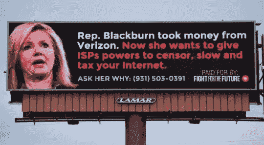

# 网络中立的支持者正在取得胜利*，尽管他们可能并不知道

> 原文：<https://medium.com/hackernoon/pro-net-neutrality-supporters-have-won-even-though-they-may-not-know-it-8739fc913b8c>

支持网络中立的粉丝们，这对你们来说可能是新闻，但是**你们赢了**。你正在击败 [FCC](https://hackernoon.com/tagged/fcc) 主席 Ajit Pai 和大型互联网服务提供商。真的！

但是有一个转折。我们都应该为互联网的胜利干杯——甚至是回退的支持者。

联邦通信委员会可能已经撤销了第二条互联网规则，但由于美国政府代表和互联网服务提供商面临的巨大压力，网络中立原则很可能会得到遵守。所以我们都赢了。至少在可预见的未来。

## 互联网服务提供商将表现出他们最好的行为…否则

像美国电话电报公司、康卡斯特和威瑞森这样的大型互联网服务提供商现在不敢破坏网络中立性，因为他们已经知道消费者对他们现在非常公开的恶作剧有多么不满。这要感谢活动家们，他们传播了这些公司过去是如何试图让消费者处于不利地位的消息。[以下是 ISP 的一些古怪行为](https://www.freepress.net/blog/2017/04/25/net-neutrality-violations-brief-history)，由 freepress.net 提供。

更重要的是，美国国会代表已经“接到通知”。如果大型互联网服务提供商恢复他们的不良行为，如果议员们想保住他们的工作，国会将被迫采取行动。毕竟，调查显示超过 80%的美国消费者希望网络中立。这包括共和党人。事实上，只有五分之一的共和党人支持缩减开支。(为未来而战一直在[让每个人都了解代表的投票立场](https://www.battleforthenet.com/scoreboard/)。)

最重要的是，网络中立回滚支持者公开声称 FCC 的行动符合我们的最佳利益。他们认为，这种逆转将增加竞争，促进自由市场控制(尽管目前缺乏竞争)。如果互联网服务提供商认为他们是傻瓜，你可以打赌，他们会加入大多数呼吁公平互联网政策的声音。

> “我震惊了——震惊了！—人们会在法庭上挑战这个决定！”—阿吉特·派

当然，受到威胁的诉讼也将非常有助于控制网络访问的把关者。互联网服务提供商不希望在法庭上争辩说第二章的规则是不必要的时候被抓到限制竞争对手的网站或初创公司。

归结起来就是:大多数人想要相同的最终结果——一个公平开放的互联网。只是我们如何到达那里的问题。因此，互联网服务提供商没有回旋的余地。立法者、公民和各种各样的基层组织“像鸭子抓虫子一样”紧跟互联网的发展。

## 回滚倡导者也赢了

支持网络中立的积极分子和支持者并不孤单，这不是很好吗？回滚支持者也是赢家，因为互联网服务提供商将在这个收费的环境中表现自己。我预测“回滚”将能够吹嘘如何互联网服务提供商一般行为没有官方的政府公用事业待遇。当然，网络中立的支持者会知道，如果没有他们的努力，事情将会大不相同。

所以我们都赢了。感谢直言不讳的美国组织，如为未来而战、自由新闻、需求进步和 EFF。我们也要感谢[欧盟和国际上支持网络中立的支持者](https://www.theworldfornetneutrality.com/)，如 EDRi、StartPage.com、AccessNow 和 privacytools.io

是时候让*我们所有人*在保持警惕的同时向网络中立低头了。

**后记:**我见过那么多网络中立主义者闷闷不乐，声称吃亏，但是*我们没有吃亏*！

网络中立的战斗还没有结束，除非你宣布失败，沮丧地混战起来。

请不要落入大型互联网服务提供商的手中。他们希望我们放弃，认为我们已经输了，尽管我们已经赢得了重大胜利。这种僵持就是其中之一！

*   我把标题和其他地方的“已经赢了”改成了“赢了”,因为它似乎引起了一些混乱和恐慌。胜利是一个连续体。(当然接受失败是必然的。我们不要忘记这一点！)