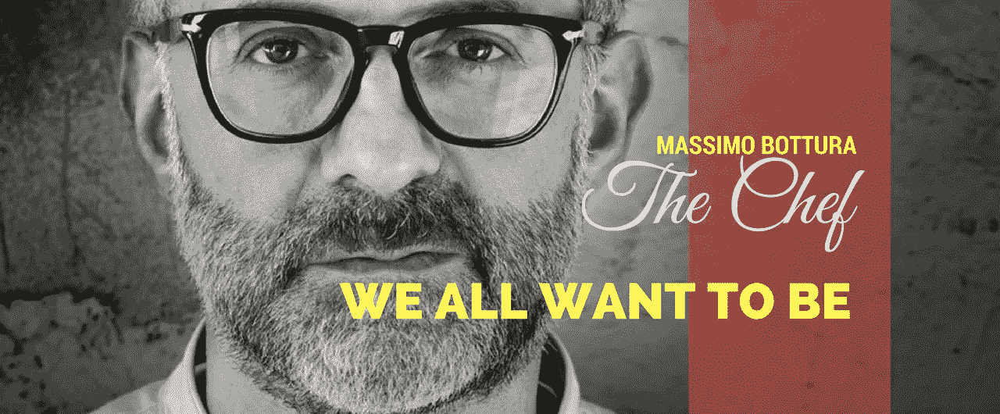
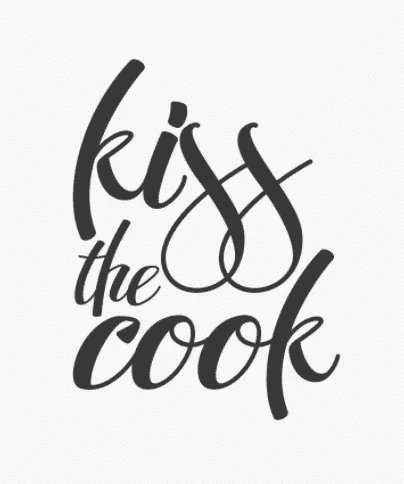

# 企业家忽略的问题——他们想成为世界第一厨师。但是他们知道怎么做饭吗？

> 原文：<https://medium.com/hackernoon/problem-entrepreneurs-overlook-they-want-to-be-massimo-bottura-but-do-they-know-how-to-cook-c37efee2f033>

## 创业，企业家精神

## 马西莫被认为是世界上最好的厨师。你想变成那样吗？要么你已经做得很棒了，要么你需要开始做了。

渴望成为伟大的人是一种自然的情感。无论是厨师，还是企业家。这就是榜样存在的原因。

> 榜样这个概念的问题在于，人们不是被旅程所激励，而是被目的地所激励。

当然，你会看到关于西尔维斯特·史泰龙或艾德·希兰(*是的——昨天看到了这个*)经历的奋斗的随机激励视频，当然——人们会看着它说“**哇！**”。但是他们真的不在乎旅程。他们只是想成为今天那个人所在的地方。没人在乎一个人是否擅长他的工作。这就是为什么当克里斯蒂亚诺·罗纳尔多在街角装扮成无家可归的人炫耀他的技能时，人们没有给予他一天的时间。

这就是为什么人们经常问错误的问题。

今天我遇到了这个问题—

> 没有钱，你能为你的创业公司雇佣一个好的团队和顾问吗？

这个问题没有错。老实说，这是一个非常真实的问题。如果我是诚实的，那么我必须说**我的答案不是**。我的回答是真诚的，但却是错误的。因为在很大程度上，它根本没有解决问题。一个“可以”问题的答案可能只有两个答案——是**和**否**。它们是唯一真正重要的两种反应，也是唯一可以接受的两种反应。我的回答也没有。(*我在写这几行的时候才意识到。*)**

但是为什么不呢？这是一个非常简单的问题；这是许多企业家每天都要经历的事情。这个特别的问题可能会被争论到死，任何企业家都可以从自己的亲身经历中回答这个问题。所以，答案是存在的。那为什么我没有提供呢？我自己也有两个可以分享的个人轶事。

为什么我没有呢？

> 因为我觉得这个问题可能问错了。

我能确定吗？不，当然不是。但根据最近与企业家的数十次互动，这是最稳妥的选择。

我们都想在我们所做的事情上表现出色，我们都想创造不同。渴望卓越是一件很自然的事情，这种渴望是一件伟大的事情。

但是我们可能开始的时候就错了。

你不渴望成为世界第一大厨，因为你想成为世界第一大厨。

你渴望成为第一厨师，因为你做饭，你喜欢做饭，你擅长做饭，人们来你家只是为了吃你做的饭，当你不做你在同龄人中众所周知的期待已久的美味佳肴时，他们会感到愤怒和背叛。

> 你渴望成为第一大厨，因为你已经很擅长了，现在——你想变得更好。你想变得比其他人更好。

生意从来不是从一个想法开始的。一个企业从一个问题开始。一直都是。

你看到一个存在的问题，你评估这个问题对面临它的人们日常生活的影响(*需要*)，你看到这些人的庞大数量(*市场规模*)，然后你渴望成为改变这种情况的解决方案(*愿景*)。然后你开始朝着那个方向前进——缓慢，但是坚定。一个企业就是这样诞生的。

在这个阶段，你不需要顾问，不需要团队，不需要丰厚的薪水。你只需要在你为之解决问题的人面前展示自己。你需要了解他们受到的影响有多严重，问题对他们来说是否足够重要，足以让他们想要解决它，或者他们是否愿意就这样走开？然后你需要找到最大问题的答案——他们愿意为这个解决方案付费吗？*现金还是实物，都无所谓。让我们暂时不要担心那个。*

如果他们不愿意为解决方案付费，那么要么问题不够大，要么解决方案不够好。所以回到绘图板，重新开始你的方法。

## 迭代再迭代

坚持下去，直到你看到很大一部分人真的为你提供的东西付费。做了一打销售？很好！现在我们开始做生意了。现在我们知道如何烹饪了。第一部分完成了。

现在让我们变得更好。这是你需要开始建立一个严肃团队的阶段。这是你开始与行业专家和资深人士交谈的时候——向他们请教。他们如何帮助您改进解决方案，他们能告诉您该领域的哪些细微差别，他们能帮助您参加一些有助于业务发展的战略会议吗？太好了！开始引入合适的人员——以业务需要的任何能力。顾问、联合创始人、核心团队成员或你的第一批雇员。

做更多的销售。达成 50-100 笔销售？太神奇了！你，我亲爱的先生，是一个摇滚明星。我们现在去见见风投吧。

到现在为止，你已经做了很多了。

*   发现了一个问题
*   对如何解决这个问题有一个设想
*   有一个快速而肮脏的第一解决方案——一个不是最有效的，但能完成工作的方案
*   人们为你所提供的东西买单
*   你有一个团队
*   你有一群行业专家指导你。

风险投资公司的业务是投资他们认为潜力巨大的公司。站在他们的角度，重新审视以上几点。你认为提出这些观点的人现在机会大吗？我想是的。

这就是你上路的方式，成为马西莫的旅程。慢慢地，但肯定地。但是如果你分不清迷迭香和百里香——所有的 youtube 食谱视频和 instagram foodporn 都不会帮你做到这一点。

联系很容易。我在[推特](http://twitter.com/@abyshake)、[脸书、](http://facebook.com/abyshake) [Quora、](http://bit.ly/abyshake) [LinkedIn](http://in.linkedin.com/in/abyshake) 上有空。我写在媒体上，但我猜你已经知道了。我也有一个[邮件](mailto:mail@abyshake.com)账号。:-)

玩得开心！我们聊聊吧。人类、机器人——对我来说真的没什么区别。

> [黑客中午](http://bit.ly/Hackernoon)是黑客如何开始他们的下午。我们是 AMI 家庭的一员。我们现在[接受投稿](http://bit.ly/hackernoonsubmission)并乐意[讨论广告&赞助](mailto:partners@amipublications.com)机会。
> 
> 如果你喜欢这个故事，我们推荐你阅读我们的[最新科技故事](http://bit.ly/hackernoonlatestt)和[趋势科技故事](https://hackernoon.com/trending)。直到下一次，不要把世界的现实想当然！

