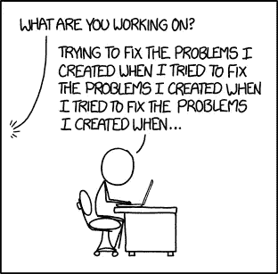

# 问题！问题？问题。

> 原文：<https://medium.com/hackernoon/problems-problems-problems-ac83d2ab567c>

[https://xkcd.com/1739/](https://xkcd.com/1739/)

1.  所有公司都有问题(它们预示着机遇)
2.  有些问题比其他问题更重要
3.  试图一次解决太多问题是有问题的
4.  但是，重要的是，忽略一个问题会影响你的团队
5.  受影响的人会想知道为什么你会让他们焦虑、不确定、降低职业满意度和减少职业机会
6.  说“耐心点，它只是没有[更重要的选项]重要，这是为什么，这是我们将如何衡量进展”是很难做到的。它需要透明度和心理安全。
7.  因此，我们编造模糊和中等的陈述和/或试图以半吊子的方式解决问题。它变成“中等优先级”。这在多个问题中重复出现。理解相对优先级变得很困难
8.  没有人愿意承认某件事不重要(目前)。与此同时，那些受到影响的人开始拒绝明显的一致性问题。他们在乎吗？为什么不呢？他们一定不怀好意！
9.  解决中等优先级问题的资源不足的努力失去了动力。这让人们对受影响的人(以及管理他们的人)产生了怀疑。这引发了对抗性的保护立场。
10.  这导致了更多的问题

给领导者的教训:解释原因。专注。表现出谦逊。不要骗自己也不要骗别人。尊重你的决定产生的影响。让您的员工参与解决影响业务的最重要问题。