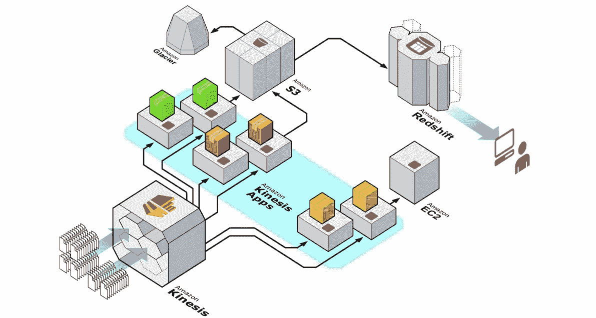
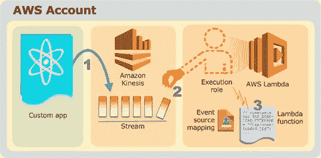
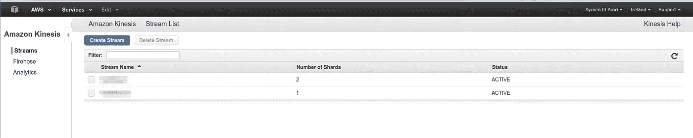
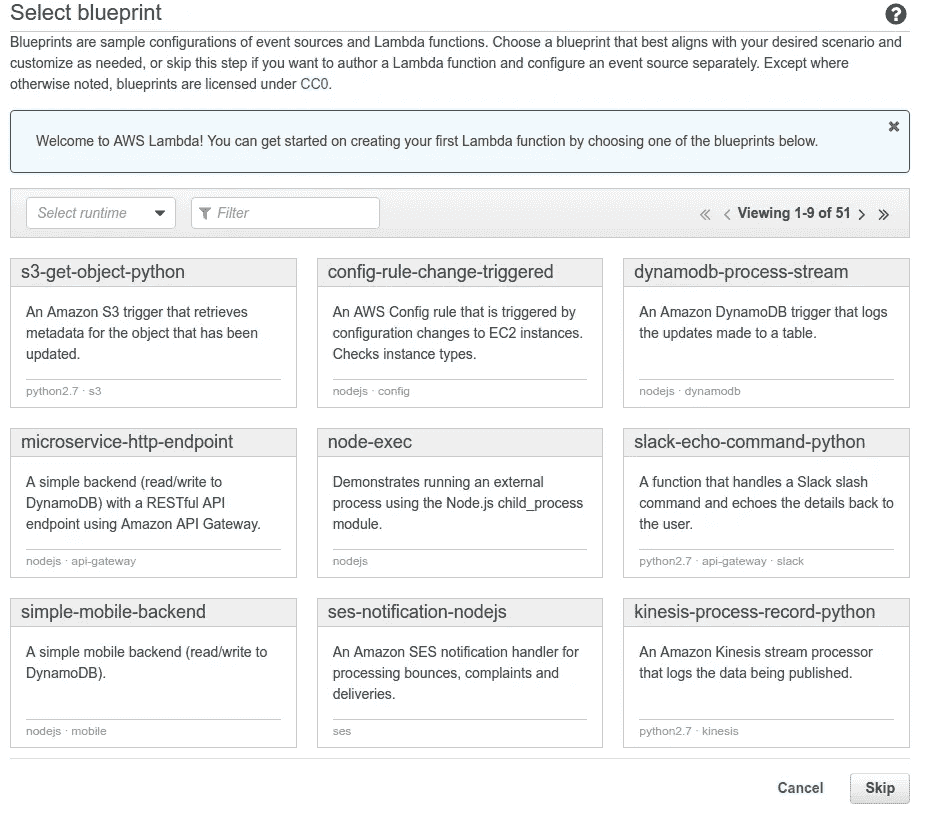
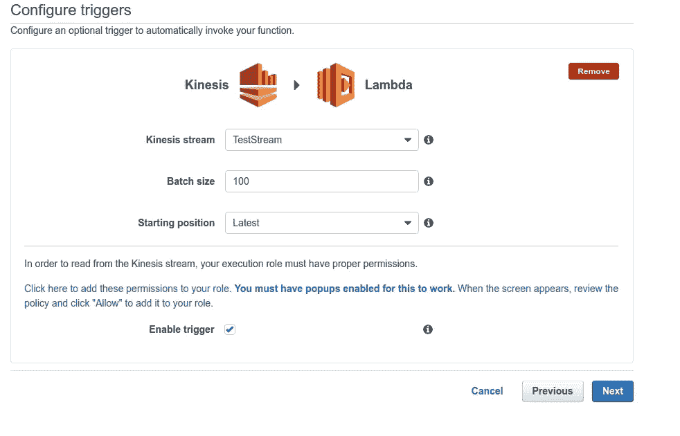
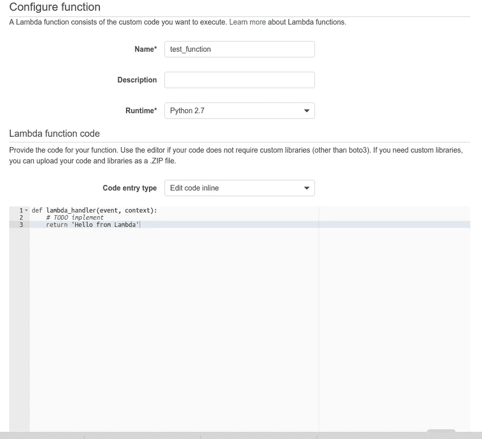
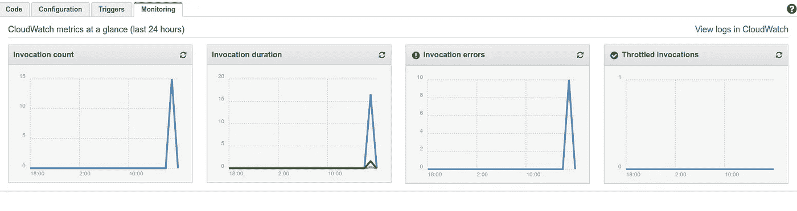
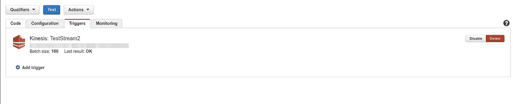
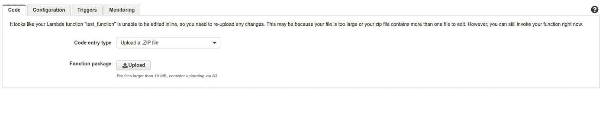

# 使用 motis & Lambda 处理实时大数据流

> 原文：<https://medium.com/hackernoon/processing-real-time-big-data-streams-using-kinesis-lambda-561a029ef305>

## 放弃

此内容是我们某个在线课程/培训的一部分或受其启发。在 2019 年**黑色星期五**期间，我们对这些材料提供高达 80%的折扣。

您可以在这里享受[折扣。](http://bf.eralabs.io/)


我正在创建一个 AWS 在线课程，我的目标是让人们有机会通过高质量的课程和实用的学习途径来学习 DevOps 技术。

> 如果您对[实用 AWS 培训](https://practicalaws.com)感兴趣，您可以[现在就预订](http://practicalaws.com)以半价获得培训。
> 
> 您也可以下载我们的迷你电子书 [8 学习 AWS 的好技巧](https://app.getresponse.com/site2/practical_aws?u=hWKcs&webforms_id=BSioY)。

这是上一篇文章[的第 2 部分，文章名为【使用亚马逊驱动程序创建大数据实时分析&事件处理系统](/@eon01/creating-a-realtime-analytics-event-processing-system-for-big-data-using-amazon-kinesis-756f5e5d1abf)。

完成本教程后，您将能够向您的 AWS 基础架构发送大量数据，同时在每次检测到事件时实时发送 Hipchat 通知。

我们将使用:亚马逊驱动，蟒蛇和亚马逊λ

最后一个教程面向工程师、开发人员和架构师，他们希望为从多个来源收集的大量数据构建实时分析和事件处理系统:物联网、服务器日志、路由器、分布式处理系统..等等

这一个更加关注事件处理部分，尽管这两个教程是逻辑链接的。我建议你至少快速阅读一下上一篇[。](/@eon01/creating-a-realtime-analytics-event-processing-system-for-big-data-using-amazon-kinesis-756f5e5d1abf)

在这篇文章中，我们将看到如何尽可能快地处理和响应实时事件。有多种使用情况，但让我们想象成千上万的物联网设备发送日志，在某些情况下，如果检查到一个条件，就应该触发一个操作。

简而言之，数据将通过驱动程序，将由 AWS Lambda 检查，后者可能会触发其他 Lambda 功能。

## 什么是运动？

如果您已经习惯了阿帕奇卡夫卡，那么驱动程序是基于云的卡夫卡的托管替代品。

换句话说，驱动系统是一个用于构建实时数据管道和流式应用程序，并将相同数据存储到 AWS 红移或 S3 的系统。



## 什么是λ？

AWS Lambda 是一个计算服务器，它允许开发人员和工程师创建一个无服务器架构来执行上传的代码。

AWS Lambda 可用作:

*   作为通过运行代码来响应 HTTP 请求的计算服务。HTTP 请求使用 Amazon API Gateway 或 AWS APIs。
*   作为一个事件驱动的服务，其中 AWS Lambda 运行您的代码以响应其他 AWS 服务中的事件，如 S3 桶或文件、Kinesis 流或 DynamoDB 表..等等

在我们的教程中，第二个场景用于 Kinesis 流。



## 从 Kinesis 到λ

在这一步，我们应该有一个设置 Kinesis 流。

Kinesis 流将收集和流式传输数据，以便进行有序、可回放的实时处理。去你的控制台，只需创建一个流。



这是 *describe_stream()* 函数输出的一个例子(在上一个教程中已经看到了):

```
{  
   'StreamDescription':{  
      'StreamARN':'arn:aws:kinesis:eu-west-1:95312312312:stream/TestStream',
      'EnhancedMonitoring':[  
         {  
            'ShardLevelMetrics':[]
         }
      ],
      'StreamStatus':'ACTIVE',
      'RetentionPeriodHours':24,
      'HasMoreShards':False,
      'StreamName':'TestStream',
      'Shards':[  
         {  
            'SequenceNumberRange':{  
               'StartingSequenceNumber':'495662365138256951538110533149564956654'
            },
            'HashKeyRange':{  
               'EndingHashKey':'4956312312314956123124956124956',
               'StartingHashKey':'0'
            },
            'ShardId':'shardId-000000000000'
         }
      ]
   }
}
```

然后转到 Lambda 仪表板，跳过这一步:



选择 Kinesis 作为上游服务，启用触发器，不要忘记启用弹出窗口来添加权限。



现在，您应该单击 Next，在下一个屏幕中设置您的代码。

您可以选择其他选项，如允许的内存、超时或 VPC..等等



我现在要执行 producer 函数(一个 python 脚本，它将连接到一个 API，获取数据(在本例中是一个用户列表)并将其发送给 Kinesis):

```
from api.users import Users
import json
from boto import kinesisstream_name = "TestStream"
u = get_users()
x = u.list()for line in x.iter_lines():
        kinesis = kinesis.connect_to_region("eu-west-1")
        kinesis.put_record(stream_name, line, "partitionkey")
        if line:
            print (line)
```

出于测试目的，我一直在终端上执行这个脚本，同时查看 Lambda 的监控仪表板，结果是:



如果您看到调用计数增加，那么您就在正确的道路上。这很正常，因为每个传输流都会触发代码执行。



## 一个简单的基于 Lambda 的微服务

现在一切都设置好了，我们要上传一个 Python 应用程序，每次我们有一个 Kinesis 流时都会执行这个应用程序。

在这个例子中，我将通知一个 Hipchat 聊天室，我将使用我开发的工具:[Hippy——hip chat Api v2](https://github.com/eon01/Hippy)的 Python 包装器。

从 Github 下载代码到你的 app 目录，在同一个文件夹中安装依赖项，并重命名 example.py yo lambda_function.py

```
mkdir app
pip install -r requirements.txt -t app/
cd app
mv example.py lambda_function.py 
```

这是 example.py 的原代码(重命名为 lambda_function.py):

```
from api.notify import Notify key = ""room_id = ""n = Notify(key, room_id)n.notify( "Testing Hippy", "red", "false", "text")
```

这不足以让我们的应用程序使用 Lambda，代码应该是这样的

```
def lambda_handler(event, context):
    from api.notify import Notify
    key = ""
    room_id = ""
    n = Notify(key, room_id)
    n.notify( "Testing Hippy From AWS Lambda", "red", "false", "text")
```

我们在同一个文件夹中安装了依赖项，我们更改了 example.py 的名称和它的结构，现在所有的东西都应该放到一个 zip 存档中:

```
zip -r lambda.zip .
```

转到 Lambda dashboard，选择上传 zip，然后上传 lambda.zip:



现在，在每一个流检测，一条消息将被发送到您的 Hipchat 房间。

您可以使用云观察调试您的应用程序，并查看其日志。

这就是所有的乡亲:-)

# 连接更深

如果你对这篇文章有共鸣，请订阅 [DevOpsLinks](http://devopslinks.com) :一个由来自世界各地的热情的 DevOps、系统管理员&开发人员组成的在线社区。

你可以在 [Twitter](https://twitter.com/eon01) 、 [Clarity](https://clarity.fm/aymenelamri/) 或者我的[博客](http://eon01.com/blog)上找到我，你也可以查看我的书: [SaltStack For DevOps](http://saltstackfordevops.com) 、 [The Jumpstart Up](http://thejumpstartup.com) & [无痛 Docker](http://painlessdocker.com) 。


如果你喜欢这篇文章，请推荐并分享给你的追随者。