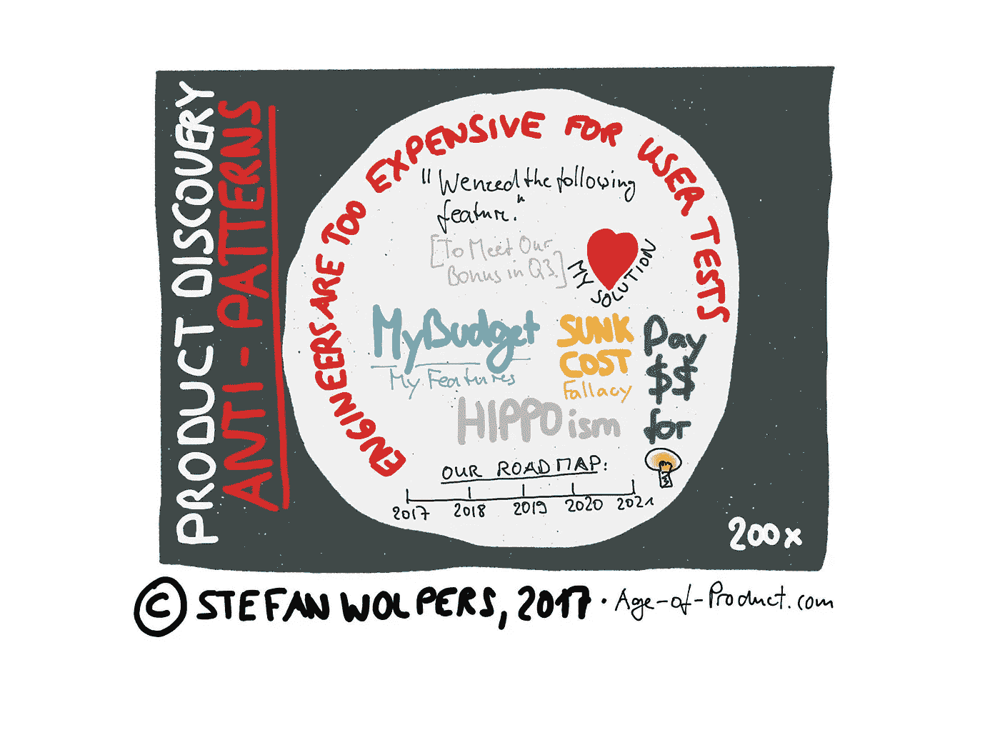

# 产品发现反模式

> 原文：<https://medium.com/hackernoon/product-discovery-anti-patterns-b14dac80c77b>

# TL；速度三角形定位法(dead reckoning)

Scrum 已经被证明是像应用程序这样的数字产品的有效的产品交付框架。然而，Scrum 同样适合高效地构建错误的产品，因为它的致命弱点一直是产品发现部分。什么产品发现部分，你现在可能会想。这正是问题的关键:产品负责人通过对产品待办事项进行筛选和优先级排序，奇迹般地确定了团队工作的最佳方式。Scrum 指南中没有描述这应该如何发生。因此，当每个人都为自己时，产品发现反模式就出现了。

了解更多关于众多产品发现反模式的知识，当您试图填补 Scrum 的产品发现空白时，这些反模式会显现出来。

# Scrum 的致命弱点:产品发现

为了填补 Scrum 的产品发现空白，产品交付组织经常求助于其他敏捷框架，如精益 UX、待完成工作、精益创业、设计思维、设计冲刺——仅举几例。近几年来，敏捷过渡项目的浪潮，特别是在大型的、已建立的组织中，为那些框架提供了巨大的推动力。与此同时，一些想法在这个过程中获得了流行词的地位，并在这个过程中偶尔造成附带损害。(例如，当我当前项目的利益相关者以不正确的方式使用“MVP”时，我停止了纠正他们——主要是从业务方面。)

一般来说，与特定框架(如 Scrum)的反模式相比，假设敏捷产品发现反模式源于更广泛的问题是安全的。(**免费下载**:[Scrum 反模式指南](https://age-of-product.com/scrum-anti-patterns/)。)

各种产品发现反模式的主要影响因素有:

*   现有的组织功能障碍，例如，组织的结构是功能孤岛，
*   个体玩家中很大程度的自我问题——什么是我的综合症——导致个人议程被追求，
*   组织内部复杂的多层报告结构，过滤并延迟了信息流，从而阻碍了沟通和决策。

此外，特别大的组织在成为一个敏捷的、学习型的组织的过程的核心中挣扎着必要的转变:从分配预算给配备了 fte 的临时团队的项目，到建立和资助持久的产品团队。

我确实相信，产品发现(产品管理)和产品交付(工程)之间的分离如今不再是一种可行的方法。为了在当今以创新为基础的加速竞争中获胜——软件正在吞噬世界——每个组织都需要对敏捷产品创建过程有一个全面的了解:

一个愿景导致一个战略，这个战略(可能)导致产品(和服务)的组合。这些产品中的每一个都有一个产品路线图，需要反映在产品的 backlog 中，这最终提供了 sprint backlog。这个核心的敏捷产品创建过程与产品交付框架无关，无论是 Scrum、XP 还是任何其他框架。

组织需要在适当的时间间隔内持续检查和调整这个层次结构的每一层。显然，当策略和 sprint backlog 相互比较时，inspect & adapt 步调是不同的。(**例**:[2006 年 8 月 2 日开始的秘密特斯拉汽车公司总体规划(仅在你我之间)](https://www.tesla.com/blog/secret-tesla-motors-master-plan-just-between-you-and-me)。)

记住这个整体的产品创建过程，您可以在实践中经常观察到以下一些产品发现反模式。

***请点击【拍手】*👏如果你觉得这篇文章有用——它对我来说意义重大！**

# 产品发现反模式:了解更多的谬误

*   **“我们知道要做什么”**:没有用户研究，也没有产品交付组织与客户的任何其他互动。(造成这种现象的原因有几个，从创始人或企业家追求他或她的产品愿景而不从事客户发现活动。或者产品交付组织仅由关键客户经理间接汇报。销售部门可能认为产品人员与客户的直接接触风险太大，因此阻止了这种情况的发生。这些模式所共有的要么是伤害学习努力的偏见，要么是个人议程。虽然前者可以通过教育来克服，但后者更难实现，因为罪犯通常拒绝接受他们受自私动机驱使的想法。为了成为一个有效的产品交付组织，团队必须定期与客户直接沟通。)
*   **喜欢解决方案**:这是‘我们知道要建造什么’综合症的一种变体。(没有长得丑的孩子，至少从父母的角度来看没有。这种偏见似乎也适用于产品和服务，想想宜家:人们看重自己创造的东西，而不是其他产品。这也是你避免询问陌生人意见的原因:他们可能不同意你的信念。这个产品发现反模式的解决方案很简单:爱上问题，而不是你的解决方案。)
*   **没有共同的理解**:产品交付组织没有试图在团队和涉众之间就基于什么原因构建什么达成共同的理解。(确保与内部和外部利益相关者进行积极有效沟通的最佳方式是让他们参与到产品创造过程中。人们关心他们帮助创造的东西。根据我的经验，最好的方法是 Jeff Patton 的用户故事映射。这不仅仅是在战术层面将“需求”转化为可行的用户故事的好方法。用户故事映射也非常适合理解产品路线图和发布计划。)
*   **人物角色驱动的自我实现预言**:你首先根据你认为我们下一个产品或服务的顾客或用户来创建人物角色。(这是一个潜在的危险心理模型，因为你可能成为自我实现预言的受害者。你很有可能会无意识地创建用户测试，并在过程中验证你的角色。相反，你应该翻转这个过程:首先，你观察潜在客户的自然栖息地，找出一个值得解决的问题。然后，您创建一个原型来解决之前发现的问题。有了原型之后，你可以根据在相关研究中获得的洞察力创建初步的人物角色。“初步的”也需要强调，因为人物角色设计需要在持续运行用户测试的同时，不断地用你所学到的东西进行校准。没有静态的人物角色。**阅读更多**:[创建人物角色](https://blog.prototypr.io/personas-74c4e1c12ee2)。”)
*   **年度路线图**:提前十二个月，每年规划一次产品路线图。(与传统指挥的流行观念相反&控制组织的产品路线图受到持续规划的影响。敏捷产品交付过程的中心思想是，在任何给定的时间，只专注于那些为客户和组织提供最高价值的想法。为了达到这个标准，产品路线图需要适应从以适当的节奏定期运行产品实验中获得的知识。)
*   渐进主义陷阱:你太专注于渐进式改进，以至于错过了可利用的创新飞跃。补救方法:应用[埃隆·马斯克的第一原则思维模型](http://jamesclear.com/first-principles)，把一个情况分解成基本的部分，然后再重新组合起来，让[更好地服务于你的目的](https://www.youtube.com/watch?v=NV3sBlRgzTI)。

# 敏捷过渡——来自战壕的手册

最新的 171 页的版本**“敏捷过渡——来自战壕的实践手册”**就在这里**、**可以找到，而且是**免费的！**

# 产品发现反模式:孤岛在工作

*   **设计孤岛**:有一个 UX/UI 设计团队/部门，在开发团队之外组织成功能孤岛。(UX/UI 能力对于许多跨职能团队来说是必不可少的。如果这些能力只能通过从不同的实体采购来获得，那么组织就创建了一个人工移交。这种中断会影响团队工作的速度和质量，因为重要的信息和知识只能被传递，而不能亲身体验。)
*   作为筒仓的用户测试/用户研究:用户测试需要被移交给一个功能筒仓。一旦有了结果，研究人员就会回来报告。(用户测试是产品发现过程不可或缺的一部分，因此也是持续的一部分。因此，用户研究应该由团队自己来进行，将具备必要能力的人嵌入到团队中。阅读更多:如何运行精益用户测试。)
*   不要在用户测试上浪费工程师:工程师不参与用户测试，因为他们被认为太有价值/太昂贵。(他们应该编码，因为相比之下，雇佣一个额外的 UX 设计师更容易。这是错误的思维模式:工程师越早参与确定一个值得解决的问题，他们参与的投资回报率就越好，因为他们会将可行性方面的技术专长带到桌面上。由于隔离工程师而构建错误的东西，有几个原因是非常昂贵的。这是一种巨大的资源浪费，并且会有重大的延迟成本——团队本可以在此期间建立更有价值的东西。最后，看着你的努力付诸东流是令人难以置信的沮丧，不管你为此付出了多少。(**阅读更多** : (1)丹丹粉红:[驱](https://www.amazon.com/Drive-Surprising-Truth-About-Motivates/dp/1594484805/ref=sr_1_1?ie=UTF8&qid=1508851609&sr=8-1&keywords=daniel+pink+drive+book)。(2)在他的书“[非理性的优势](https://www.amazon.com/Upside-Irrationality-Unexpected-Benefits-Defying/dp/0061995045/ref=sr_1_1?s=books&ie=UTF8&qid=1508851697&sr=1-1&keywords=dan+ariely+%282011%29+upside+of+irrationality)”的第二章“劳动的意义”中，丹·艾瑞里描述了一个被称为“构建生物模型”(2011 年平装版，第 66 至 77 页)的实验，哈佛大学的学生被付费组装乐高玩具。该实验旨在更好地理解人们对工作意义轻微降低的反应。他的结论是:“将快乐转化为工作意愿，似乎在很大程度上取决于我们能赋予自己的劳动多少意义。”(见上文，第 74 页。))
*   **没有工程师或设计师在客户支持部门工作**:工程师或设计师不经常与客户支持部门一起工作。(你听说过“支持驱动的开发”吗？公司里的每个人都应该花 5%的时间在客户支持上。这不是一个新的想法，许多成功的公司都采用它来简化从客户问题到解决方案的信息流。事实证明，这是发现痛点和创造客户喜欢的产品的有效方法。【Kayak.com】联合创始人保罗·英格利西:“客户是我电子邮件的一大来源。任何时候任何人联系我们有问题，无论是通过电子邮件还是电话，他们都会得到一个个人的答复。工程师和我负责客户支持。当我告诉别人的时候，他们看着我，好像我在吸可卡因。他们说，“你为什么要付给一个工程师 15 万美元去接电话，而在亚利桑那州你可以付给一个人 8 美元一小时？“如果你让工程师回复客户的电子邮件和电话，当他们第二次或第三次收到同样的问题时，他们就会停下手头的工作，修改代码。那我们就不再有那些问题了。”**阅读更多** : [大家多多支持。](https://signalvnoise.com/posts/3676-everyone-on-support))
*   **真实的唯一来源**:产品交付组织完全依赖于定量或定性的反馈。(要做出明智的决定，你需要考虑这两个来源。数据没有提供任何关于事情发生的“原因”的信息。数据只处理“发生了什么”。与此同时，只关注定性反馈可能会让你容易受到偏见和不利的心理模型的影响。自我实现预言的道路是由良好的意愿铺成的。)

# 产品发现反模式:货物崇拜发现

*   你会使用这项功能吗？你的产品发现过程相当于询问潜在客户他们有什么问题。([按焦点小组设计产品真的很难。很多时候，人们不知道他们想要什么，直到你给他们看。](https://en.wikiquote.org/wiki/Steve_Jobs)“著名的史蒂夫·乔布斯的名言，每个从事产品设计和管理的人都听过。事实是，事先询问潜在顾客他们会喜欢新产品的什么特点是没有用的。无论你是发调查问卷还是在面试中直接问他们，他们通常都无法想象情况以及新产品，无法为你提供可操作的见解。由于需要高度的抽象思维，这个问题被称为“心理干扰”。**阅读更多** : [让客户价值成为你的首要任务的四条经验](https://age-of-product.com/four-lessons-learned-from-making-customer-value-your-priority/)。)
*   **销售不存在的功能**:您需要我们提供哪些功能来达成交易？销售经理通过向潜在客户询问功能需求列表来实现销售目标，并根据需求向产品交付组织提供这些功能。(客户的问题是他们通常缺乏对这个问题提供有用答案所需的知识深度。大多数时候，他们也缺乏提出可行的、有用的和可行的解决方案所必需的抽象思维水平。俗话说:如果你唯一熟悉的工具是锤子，那么所有问题看起来都像钉子。以这种方式追求销售过程将会导致产品进入一场性能比较竞赛，很可能是受到奖金和个人议程的启发。这就是为什么产品人员喜欢在客户使用产品的典型环境中观察客户，以避免在议程驱动的功能上分配资源不当。在系统层面，重新考虑销售人员的个人货币激励也是有帮助的。在一个学习型组织中，团队而不是个人赢得胜利。)
*   今年你需要什么功能？平心而论，一些产品经理在询问内部客户需要什么功能时，表现得与销售类似。(一个发送需求的电话通常以一个史诗般的、圣诞节般的“需求”愿望清单结束如果开发团队的资源基本上是免费的，那么就有动机通过扩展列表来获取尽可能多的资源，无论这些请求对组织是否有价值。您还可能观察到涉众定义了他们不期望实现需求，只是为了在将来与产品交付组织的“谈判”中获得优势。这个提交过程通常是在利益相关方的推动下，通过优化努力实现局部最大化。(注意:以这种方式行事的内部利益相关者在这种情况下表现得完全理性。)相反，产品交付组织需要最大化整个组织的成果。这种最大化的努力需要在所有内部利益相关者之间进行思想竞赛，以将资源导向最有价值的思想。)

# 产品发现反模式:想法、假设和反馈

*   **#NoTransparency** :产品交付组织如何为假设候选列表选择想法，以及这些想法如何从候选列表进入实验待定项，这些都是不透明的。(确立内部利益相关者必须参与思想竞赛以避免以组织为代价创造局部最大值的原则本身就具有挑战性。成功过渡到这一原则的先决条件一方面是透明度，另一方面是竞争监督机构。否则，利益相关者可能会选择退出这个过程，因为他们的努力似乎是徒劳的，谣言可能会出现:是河马在推动选择过程吗？或者，当想法进入实验积压时，那些喊得最响的人会有特权吗？我必须凌晨两点在酒吧向产品负责人推销我的想法吗？确保每个人都明白决策是如何做出的，以及为什么要做出决策。可视化的假设漏斗以及积压的实验已被证明是支持。)
*   **没有反馈过程**:产品交付组织没有处理新功能或其他想法的建议的过程，反馈最多是随机提供的。(让利益相关者和组织成员积极参与产品发现过程是一个好主意。人们喜欢有目标，喜欢成为比自己更大的事物的一部分。为组织中的每个人提供贡献的机会，而不考虑级别，会使作为产品所有者的工作更容易。这样的过程不需要复杂的技术——一个简单的共享电子表格或表单就足以让它开始。最初，建议新产品特性的模板可以由解决为什么、如何、做什么和为谁做的问题组成。它可以说明建议的战术或战略性质、可能的时间框架或对投资预期回报的估计。最重要的是，设计一个处理产品想法的过程应该保持敏捷:该过程应该从一个简单的解决方案开始，然后在分析了利益相关者对该过程的最初反馈后进行改进。)
*   **忽略销售**:销售组织没有有效地包括在假设创建过程中。(不过，要注意的是，一旦本季度接近实现销售目标，销售人员就会要求增加新功能，以获得奖金。这就开启了关于奖金是一般性的讨论；一个学习型组织不应该提供个人财务激励。否则，道德风险的可能性就太大了:免费使用组织的资源来实现对个人有益的目标，这太人性化了。你还记得 2008 年金融危机的起源吗？)
*   **忽视客户支持**:客户支持组织没有充分参与假设创建过程。(根据我的经验，与客户服务团队紧密合作对任何产品交付组织都是最有益的。未能包括它们是最糟糕的产品发现反模式之一。)
*   **没有工程师的假设选择**:在识别要测试的潜在假设的早期过程中，产品管理不包括工程师。(想法不值钱，执行力值钱。通常，一个产品交付组织充斥着来自各个地方的想法:客户、销售、内部利益相关者、河马、朋友和家人——你能想到的都有。因此，产品人员最重要的工作是通过建立一个过程，将想法和需求的长列表转化为短列表，从而使混乱变得有序和透明。这个短列表的目的是运行实验来验证或证伪短列表中的想法，因为只有有价值的、可用的和可行的想法才能成为产品 backlog 的一部分。为了做到这一点，来自产品管理(业务)、设计和工程的三人组决定假设清单上的哪些项目进入实验的待办事项，这已被证明是有用的。将工程师排除在决策过程之外，从一开始就破坏了整个过程。)

# 产品发现反模式:自我在起作用

*   **河马主义**:产品发现过程至少部分是由高层管理阶层的个人信念驱动的。(网景公司时任首席执行官吉姆·巴克斯代尔的名言可以很好地描述这一点:“[如果我们有数据，就让我们看看数据。如果我们只有意见，那就用我的](http://www.goodreads.com/quotes/655987-if-we-have-data-let-s-look-at-data-if-all)。想一想:工资等级，以及个人在组织的社会等级中的地位，如何使这个人有资格拥有“正确”的想法？麦金塔电脑是史蒂夫·乔布斯的智慧结晶，他应该为此受到表扬。他还拒绝在设计中增加扩展槽，几乎过早地扼杀了它。我确实相信麦金塔 II 让 iPhone 成为可能。)
*   **“我的预算”综合症**:利益相关者不争取开发资源，但声称他们在他们认为合适的时候分配“他们的”预算给特性请求。(该过程导致在竖井或部门级别创建本地优化。这种效应在将额外福利与个人挂钩的组织中尤其明显。相反，需要本着优化整个组织的精神来分配资源。注意:“宠物项目”也属于这一类。)
*   **沉没成本谬误**:“我们已经投入了这么多。让我们完成它。”(不管已经花了多少钱，过去的支出都不能证明继续开发一种价值很小或没有价值的产品是合理的。)
*   我们正接近一个季度的尾声。与奖金相关的 KPI(关键绩效指标)面临无法实现的风险。负责的实体要求产品改变或扩展，希望这些将刺激额外的销售。(这种行为类似于“你需要什么特征来完成交易”反模式，但它以更紧迫的方式要求，通常是在奖金期结束前四周。创新的财务激励:组织从金钱上激励新的想法和建议。(有助于长长的想法列表，因此假设短列表应该是内在激励的。任何可能的个人利益都可能增加建议的数量，而不会增加价值。)

# 产品发现反模式:结论

全面的产品发现和交付流程是任何学习型组织的核心。因此，填补你所选择的产品交付框架的产品发现空白成为一种必要。为此，有大量的敏捷框架和方法可供选择。注意上面列出的产品发现反模式将为您的组织节省大量资源。

我遗漏了哪些产品发现反模式？请在评论中与我分享。

# 产品发现反模式—相关帖子

[28 产品积压和精化反模式](https://age-of-product.com/28-product-backlog-anti-patterns/)

[免费下载“Scrum 反模式指南”](https://age-of-product.com/scrum-anti-patterns/)

*请点击【拍手】*👏如果你觉得这篇文章有用，那将对我意义重大！

*要不要这样多读书？嗯:*

*   📰*加入 12，366 位同行和* [*报名参加本周简讯*](https://age-of-product.com/subscribe/?ref=Food4ThoughtMedium)
*   🐦*关注我的* [*推特*](https://twitter.com/stefanw) *并订阅我的博客* [*产品时代*](https://age-of-product.com)
*   💬*或者，免费加入* [*Slack 团队的 1900 多名同行“手把手的敏捷”*](https://goo.gl/forms/XIsABn0fLn9O0hqg2) *…*

[产品发现导致失败的反模式](https://age-of-product.com/product-discovery-anti-patterns/)首次发布于产品时代。