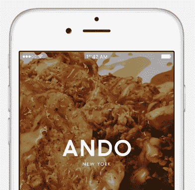
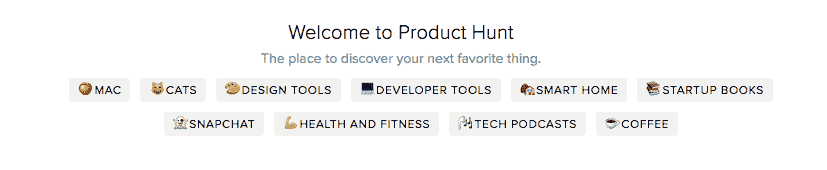
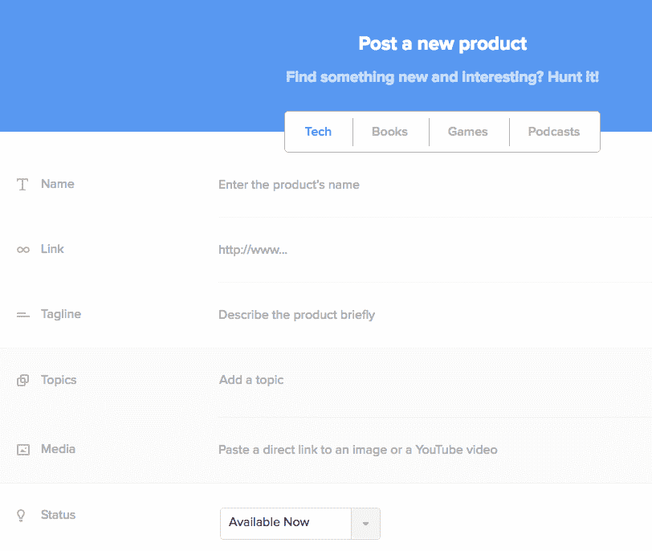

# 产品搜寻——发布计划的一部分

> 原文：<https://medium.com/hackernoon/product-hunt-part-of-your-launch-plan-7a213908265c>

我今天把 [Ando](http://www.andofood.com) 提交给了 [Product Hunt](https://www.producthunt.com/) ，这是一家由[常伟](https://momofuku.com/our-company/team/)(出自[桃福](https://momofuku.com/))和[胡曼·拉德法尔](https://www.linkedin.com/in/hooman)共同创办的只送外卖的新餐厅。在产品搜索网站[上查看 Ando 网站](https://www.producthunt.com/tech/ando)为纽约人提供的特别套餐。

因为我提交产品已经有一段时间了(10！见下文)，我想我会分享我的想法，因为我从一开始就是一个球迷。我查看了我以前的电子邮件，似乎[产品搜索](https://hackernoon.com/tagged/product-hunt)一开始就进入了我的视线。我记得我签了名，并给了瑞安·胡佛一些反馈，他非常善于与社区互动。

鉴于产品搜寻为我提供了如此多的价值，我想分享一下我的想法，如果你要推出新的东西，它应该如何被包括在[发布](https://hackernoon.com/tagged/launch)计划中。我非常感谢 PH 社区总是问很棒的问题，提交很棒的反馈，并对参与我提交的东西持开放态度。

# 什么是产品搜寻？

产品搜索是一种很好的方式，可以与一个非常活跃和有帮助的社区分享一些特别的东西。我通常倾向于面向技术的产品和服务，但他们在构建支持许多不同类别的平台方面做得很好。有一个重点是让产品的创造者或制造商参与进来，得到真正的问题和答案——这是许多其他地方所缺少的。

# 为什么要寻找产品？

我发现将 PH 作为你的发布计划的一部分非常有帮助，原因如下:

1.  迫使你变得有条理——你需要整理出一些东西，比如描述，一行解释，你将如何处理常见问题，以及整体愿景。
2.  强制发布功能——我总是告诉人们在周二发布东西，远离其他大型活动(想想 WWDC ),这给了你一个发布日期，这对团队来说是一个很好的集合。
3.  反馈——这个社区很棒，你会从各种各样的人那里得到很多很棒的问题和评论。
4.  注意/公关——很明显，但在我的名单上，因为我不认为这是参与的主要原因。这能让你被那些写你的应用或产品类别的人注意到，并有助于告诉市场你在做什么。

# 你应该何时在产品搜索上发帖？

俗话说“如果你不为你产品的第一个版本感到尴尬，那你就推出得太晚了。”

一旦你准备好进行公开测试并获得真实的反馈，是时候与世界分享了。我总是建议早上第一件事就是发布，越早越好，这样你就可以把它从你的清单上划掉，然后去做其他的事情。

# 谁应该在产品搜索上发帖？

产品、服务、功能、应用或“东西”的“制造者”。这并不总是指创始人。我最喜欢的一些帖子来自不是某个产品的“首席执行官”或“联合创始人”的人。因为我在那里工作了很长时间，这是我的一个好朋友 Jonathan Crowley 的评论，他现在是 [Foursquare](http://www.foursquare.com) 的产品主管，关于 [Swarm](https://www.producthunt.com/tech/swarm-3-0-by-foursquare#comment-134528) 的巨大变化。

# 你应该如何在产品搜索上发帖？

在 PH 上发布应该是你发布清单的一部分。如果你和[纳文·塞尔瓦杜莱](https://twitter.com/naveen)(Expa[的合伙人](http://www.expa.com))相处过，他会和你谈论清单的重要性，可能会给你一份清单宣言[。](http://amzn.to/2a0HbaH)

通过把 PH 作为清单的一部分，你将会把事情组织好，并以正确的方式完成。这当然是一个完全独立的帖子，但它的要点是要有一个列表，并确保你有一个所有者和时间表。认为你可以把一些东西扔在一起不是正确的方法。相反，这是一个很好的方式来协调分享你正在做的事情，比如在你自己的网站上发布官方博客，协调你可能拥有的任何社交媒体账户，如果你可以的话，在新闻和禁运之外。

最后，我想分享的是，虽然这些项目中有一些是我自己的，但我特别自豪地看到我建议的朋友和公司在这个平台上启动，因为它非常有价值。从会见潜在雇员和投资者，到与竞争对手和其他过去尝试过类似事情的人建立联系，这个社区令人难以置信。

最后，我想我会分享我张贴的东西，这也是一个有趣的回忆…

1.  [iOS 版 Skillshare】(我朋友 Mike 的公司——他不知道我在提交！)](https://www.producthunt.com/tech/skillshare-for-ios)
2.  [休闲看客](https://www.producthunt.com/tech/casual-spectator)
3.  [LRN](https://www.producthunt.com/tech/lrn)
4.  [输入](https://www.producthunt.com/tech/input-the-cloud-console)
5.  [元数据库](https://www.producthunt.com/tech/metabase) (Expa Studio)
6.  [套件](http://www.kit.com/) (Expa 工作室)
7.  [Abovo42](https://www.producthunt.com/tech/abovo42)
8.  [抹刀](https://www.producthunt.com/tech/spatula)
9.  [当前](https://www.producthunt.com/tech/spatula) (Expa 工作室)
10.  [安藤](https://www.producthunt.com/tech/ando)

*原载于 2016 年 7 月 11 日 www.ericgfriedman.com**的* [*。*](http://www.ericgfriedman.com/2016/07/11/product-hunt-part-of-your-launch-plan/)

> [黑客中午](http://bit.ly/Hackernoon)是黑客如何开始他们的下午。我们是 [@AMI](http://bit.ly/atAMIatAMI) 家庭的一员。我们现在[接受投稿](http://bit.ly/hackernoonsubmission)并乐意[讨论广告&赞助](mailto:partners@amipublications.com)机会。
> 
> 如果你喜欢这个故事，我们推荐你阅读我们的[最新科技故事](http://bit.ly/hackernoonlatestt)和[趋势科技故事](https://hackernoon.com/trending)。直到下一次，不要把世界的现实想当然！

