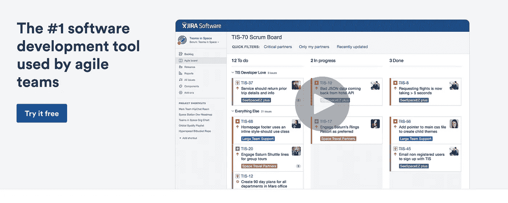
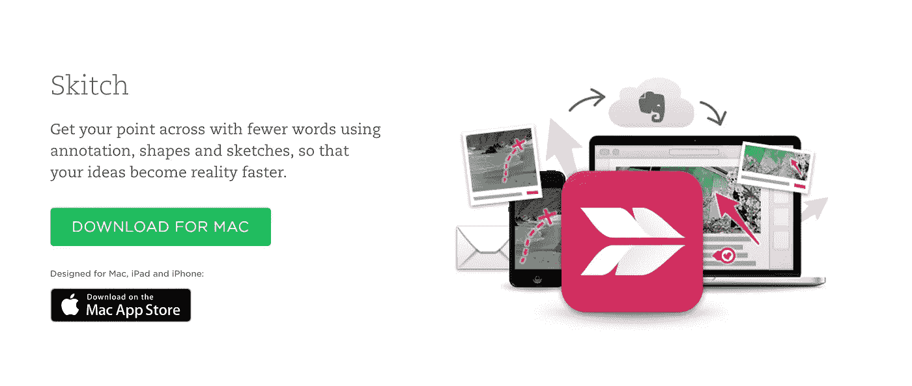

# Product Hunt 为远程工作人员提供的 14 种最佳工具

> 原文：<https://medium.com/hackernoon/product-hunts-14-best-tools-for-remote-workers-850b722bc05b>

*嗨，我是* [*乔丹*](http://www.jordangonen.com/) *，我喜欢帮助人们思考&发展他们的产品。希望这有所帮助！你可以在* [*推特*](https://twitter.com/jrdngonen) *:)* 上找到我

如今，越来越多的初创公司在扩大规模的同时，也在组建远程团队。在 YCombinator 中，我曾与许多远程团队合作执行各种项目，从兼职项目到构建东西。如果你曾经是远程团队的一员，你会知道远程管理一个组织有好处也有坏处。

远程工作的一个巨大缺点是距离带来的固有挑战。这是孤立的。当你所有的同事都坐在一起的时候，你却独自在房间里打字。最重要的是，在没有直接接触到你的队友的情况下，*完成任务通常是具有挑战性的。*

幸运的是，现在有成千上万的软件工具和资源是专门为帮助远程员工更好地工作而开发的。

我整理了一份最好的清单:

## 组织

[**特雷罗**](https://trello.com/)

[T21 吉拉](https://www.atlassian.com/software/jira)

[**大本营**](https://basecamp.com/)

[**收纳箱纸**](https://www.dropbox.com/paper)

[**OneLogin**](https://www.onelogin.com/)

# 开发和设计

[**图玛**](https://www.figma.com/)

[**代码共享**](https://codeshare.io/)

**板为** [**Github**](https://github.com/)

[Skitch](https://evernote.com/skitch/)

# 沟通

[**变焦**](https://zoom.us/) **或** [**变焦**](https://pluot.co/)

[**懈怠**](https://slack.com/)

[**每个时区**](http://everytimezone.com/)

[**嘟嘟**](http://doodle.com/)

非常感谢你的阅读！如果你做到了，那将意味着很多💚和共享:)

**我每天都写作- >** [**在 twitter 上关注我**](https://twitter.com/jrdngonen) **并通过我的** [**时事通讯**](http://whatsnext.email) 保持联系

> [黑客中午](http://bit.ly/Hackernoon)是黑客如何开始他们的下午。我们是阿美族家庭的一员。我们现在[接受投稿](http://bit.ly/hackernoonsubmission)并乐意[讨论广告&赞助](mailto:partners@amipublications.com)机会。
> 
> 如果你喜欢这个故事，我们推荐你阅读我们的[最新科技故事](http://bit.ly/hackernoonlatestt)和[趋势科技故事](https://hackernoon.com/trending)。直到下一次，不要把世界的现实想当然！

