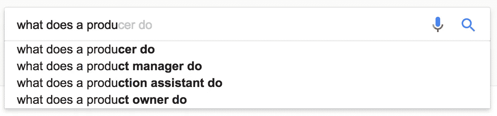
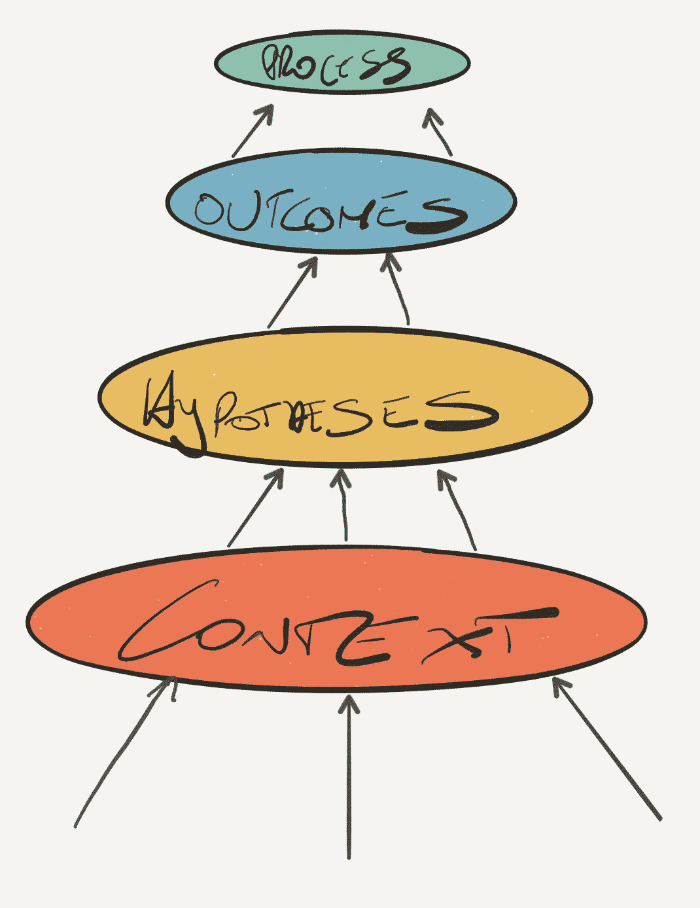
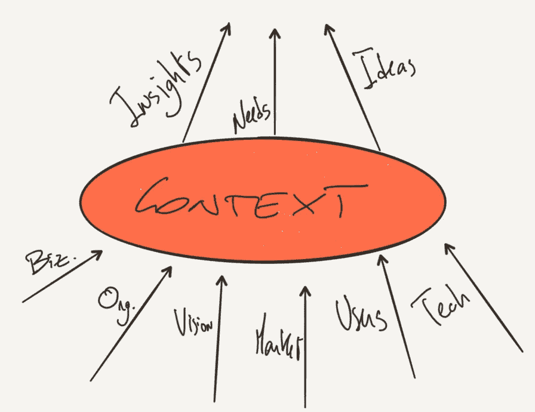
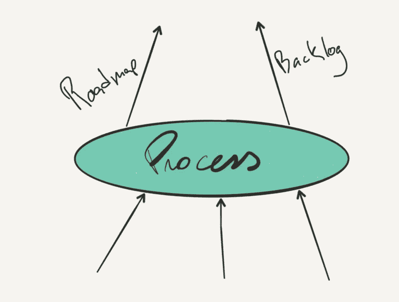

# 产品管理—我们如何做我们所做的

> 原文：<https://medium.com/hackernoon/product-management-how-we-do-what-we-do-9845eb95d90a>

在那里，我试图理解处于许多不同学科交汇点的黑暗艺术，为互联网经济产品创造世界级的体验。

2 out of 4 isn’t too bad.

一段时间以来，我一直在努力解释自己每天都在做什么。产品的迷你 CEO、[好的项目经理/坏的项目经理](http://a16z.com/2012/06/15/good-product-managerbad-product-manager/)和许多其他[的好例子](/@pierosierra/builders-make-the-best-product-people-22fdb8d75dfe)已经框定了我的思维，并帮助我提出了自己的定义。这有助于我理解我每天与我的团队一起解决的问题类型，以及我们的不足和错误，以及它们对我们所创造的东西有多么重要。

我将产品管理[的实践分为 4 个操作层面。](https://hackernoon.com/tagged/management)

从头开始:

> **a .背景> b .假设> c .结果> d .过程**

然后，我用 4 个基本属性对这些平面进行分类:

**1)大问题**——我们在这个层面上试图回答的基本问题是什么？

**2)输入—**要回答这个大问题，我们需要知道什么？

**3)输出**–回答这个问题我们能得到什么？

**4)活动**–为了回答这个问题，我们要做些什么？

因此，从基础开始，让我们提升产品经理的角色。

# 语境

背景层面是关于充分理解你为什么做你正在做的事情。

无论您在解决什么问题，您都需要:

## **1)大问题—**从为什么开始

> 我们为什么要解决这个问题？

在一个陌生的街区买一栋新房子之前，你需要尽可能多地了解它的内在和外在特征:位置、交通选择、附近的学校、犯罪、便利设施、是否有车库、人们是否抱怨噪音、是否有足够的停车位等等。

类似地，一个伟大的产品经理会收集和探索她所在组织的集体见解，以了解他们在哪里构建产品的背景，从而确定为什么需要解决问题。

因为也许…事实并非如此。

## **2)输入——我需要知道什么**

> 你如何知道你的产品将在哪里生产？

我认为你至少需要很好地理解:你的组织，它的愿景和战略，市场，你的用户/客户，技术和商业模式。与人交谈，走出大楼，从客户研究中汲取营养，了解竞争对手正在构建什么和你可以探索的潜在商业模式，以及你面临的技术可能性和限制，这些都将让你做出你需要做出的决定。

## 3)输出——我学到了什么

产品经理最重要的工作之一就是把为什么变成什么。他通过将这些维度(通常是业务职能的领域(增长、商业、工程、客户支持、UX))的见解合成为**跨领域见解**、定量和定性分析，有时是可以改变产品的雄心勃勃的想法，这些想法被淹没在组织的噪音或知识孤岛中。

另一个输出是你的定位。只有完全理解了背景和你为什么要解决问题，你才能清晰自信地陈述你在构建什么，有时更重要的是，你是什么**而不是**。[主要属性是什么？我们如何设计它们才能被理解？我们需要看到对接受它们的用户行为的影响——我们的总体评估标准？](https://medium.com/u/5bd237f31499#.4nh9dm2p0)

从一组属性开始很自然，但是没有给它们赋值——没有退出标准。这就是你需要管理[结果](https://hbr.org/2012/11/its-not-just-semantics-managing-outcomes)的地方。

## **3)产出—指标和关键绩效指标、经验教训**

为成功定义清晰的属性。

假设你正在引入一个朋友发现服务来优化你的社交网络。你期望产生什么影响？你是在衡量领先指标(X 天内增加的朋友数量)还是落后指标(保持率、参与度)——你在它们之间建立了因果关系吗？你知道你需要什么样的效果，才能获得统计学意义吗？如果你在 7 天内从 5 个朋友变成 6 个朋友，这对你的星级标准有影响吗？5 到 8 个朋友怎么样？5 到 10？

成果管理意味着了解解决方案需要交付什么，以及交付这些成果需要具备哪些关键属性。

## **4)活动**

使用上面的假设工具包给你可以测量的最小预期影响。它仍然没有解决统计显著性 vs 产品显著性的问题。一个人可以工作一年来实现 0.02%的转化率增长。值得吗？

定义现实的延伸目标——观看里克·克劳的 [OKR 演讲](https://www.youtube.com/watch?v=mJB83EZtAjc)获得一些指导。如果你需要 5%的增长才能在一年中对你的 star 指标产生影响，但很可能你的产品增量不会超过 2%，那么把你的目标定为 2.5%。迫使你的解决方案创造性地验证你实现最终目标的能力，而不挫伤你团队的士气。70%成就的 OKR 原则总是一个好的开始。成果管理意味着真正理解指标以及解决方案将如何交付它们。不要低估你的努力。推动冲击。

# 流程——或者说我们如何完成工作

## **1)TBQ——我们如何解决这个问题？我们什么时候解决？**

许多产品经理首先决定过程，然后让过程决定结果。我认为过程是管理的一个重要层面，但它应该由你想要实现的结果来驱动。

此外，这两层是很多产品经理陷入困境的地方。他们关注结果和过程，却不真正理解是什么或为什么。积压工作得到了完美的整理，故事点交付率为 20/20，因此他们制作出了精美的路线图。但是当我们回顾我们所带来的影响时，我们根本没有动过针。

你真的需要一个产品经理吗？

这并不是说这些不重要。给你的团队一种进步感、可预测性和目标感是你想要从过程中得到的。设定明确的截止日期可以让我们管理范围，提供自主权，激发掌控力和创造力，并管理期望。

## **2)输入——指标和 KPI、约束条件、经验教训**

你的结果平面输入如何影响你的过程？简单。假设你需要验证一个主要的特性。您有 6 个月的时间来证明它会产生影响，现在您已经了解了什么是现实可行的。

因此，让我们开始使用 Sprints，因为公司中的每个人都使用它…

嗯…请不要。或者做。但是仔细想想。

你有一个时间框，你了解你的限制，什么有效什么无效，你的团队是什么，成功的标准是什么。现在有没有一种方法可以廉价地检验这个假设？你能花 2 或 3 周时间快速迭代原型吗？你能从无设定流程到看板，从无评估到 t 恤尺寸吗？我相信你可以，也应该这样做，这取决于你所交付的东西的风险和不确定性的程度。如果你的基本假设是错误的，那就利用这个过程。一旦你面前的路变得更清晰，重新评估，再做一遍。

## **3)输出—路线图**

一个待办事项，一组里程碑，一种工作方式。操作原则。仪式。社交日。截止日期。

所有这些都是为了让你的团队朝着终点线前进，并交付一些东西。我们只是普通人，喜欢得到回报、认可和欣赏。交付本身就是一种奖励，但只有影响力才能让它持久。

## **4)活动**

有许多关于产品所有权的[书籍](https://hackernoon.com/tagged/books)和课程专注于过程。如何整理你的待办事项，如何评估你的功能卡，如何设定截止日期，如何进行回顾和回顾。如何识别约束和保证流程？没有必要详细描述有哪些[的剧目](/great-products-dont-happen-by-accident/great-products-dont-happen-by-accident-f46323d8ad94)。确保你的过程适合团队，确保团队理解为什么过程是达到目的的手段。确保你记住进步不是影响，而是让你更容易达到目标。

# 结论

有些产品和功能要求您在某些平面上比在其他平面上管理更多内容。关注每一个方面的需求也会随着时间的推移而改变，但最终我认为一个伟大的产品经理在这四个方面都很强，并且能够自信地在它们之间移动。从这些角度思考这个问题有助于我规划我的工作和我需要掌握的技能。

如果你已经做到了这一步，希望它也能帮助你。

> [黑客中午](http://bit.ly/Hackernoon)是黑客如何开始他们的下午。我们是 [@AMI](http://bit.ly/atAMIatAMI) 家庭的一员。我们现在[接受投稿](http://bit.ly/hackernoonsubmission)并乐意[讨论广告&赞助](mailto:partners@amipublications.com)机会。
> 
> 如果你喜欢这个故事，我们推荐你阅读我们的[最新科技故事](http://bit.ly/hackernoonlatestt)和[趋势科技故事](https://hackernoon.com/trending)。直到下一次，不要把世界的现实想当然！

