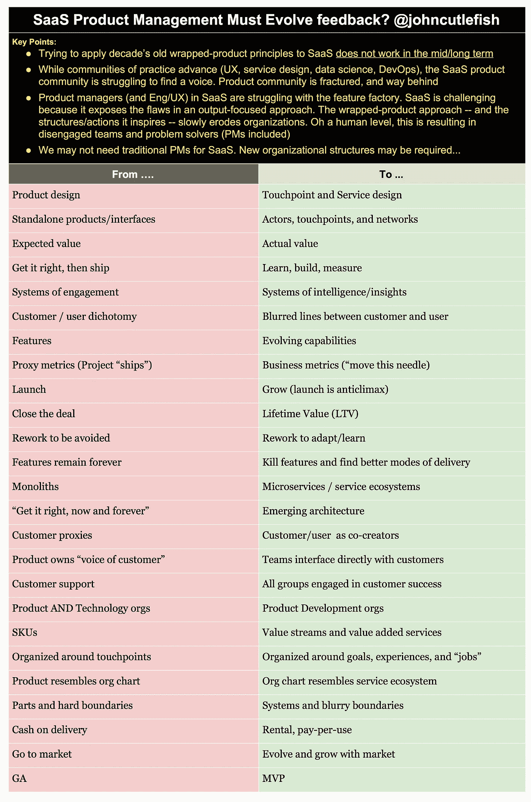

# 产品管理必须适应

> 原文：<https://medium.com/hackernoon/product-management-must-adapt-3ab23da15e0a>

我把这个留言本放在了一起，准备进行一次谈话/培训。Medium 不支持表格，所以我能提供的最好的就是这张图片(以及这个[到 pdf](https://drive.google.com/file/d/0B04yoW1JFDHGUTk2eTVuTU9vcDg/view?usp=sharing) 的链接)。

这篇比较文章的动机是什么？我一直看到同样的实践/方法/词语/想法“工作”于 SaaS(软件即服务)使用的包装产品。考虑到以科技标准衡量，SaaS 几乎已经老龄化，这非常令人不安。再加上物联网、人工智能、人工智能、零接口……每个服务公司现在都是技术公司……你会想“我们能进化吗？”。我们正在驱动功能工厂，我们必须停下来。

总之…过去两个星期很忙，所以抱歉没有发更多的帖子。

> [黑客中午](http://bit.ly/Hackernoon)是黑客如何开始他们的下午。我们是 [@AMI](http://bit.ly/atAMIatAMI) 家庭的一员。我们现在[接受投稿](http://bit.ly/hackernoonsubmission)并乐意[讨论广告&赞助](mailto:partners@amipublications.com)机会。
> 
> 如果你喜欢这个故事，我们推荐你阅读我们的[最新科技故事](http://bit.ly/hackernoonlatestt)和[趋势科技故事](https://hackernoon.com/trending)。直到下一次，不要把世界的现实想当然！

