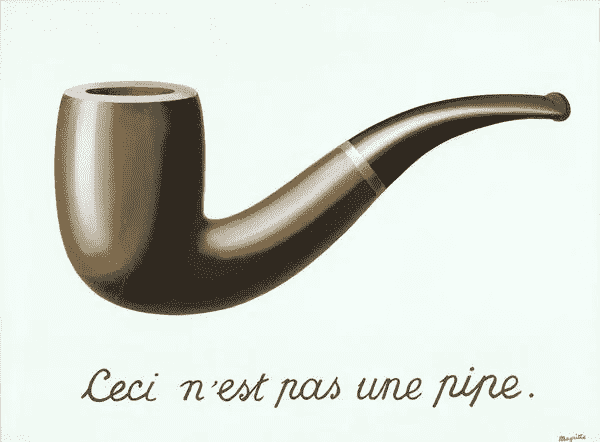
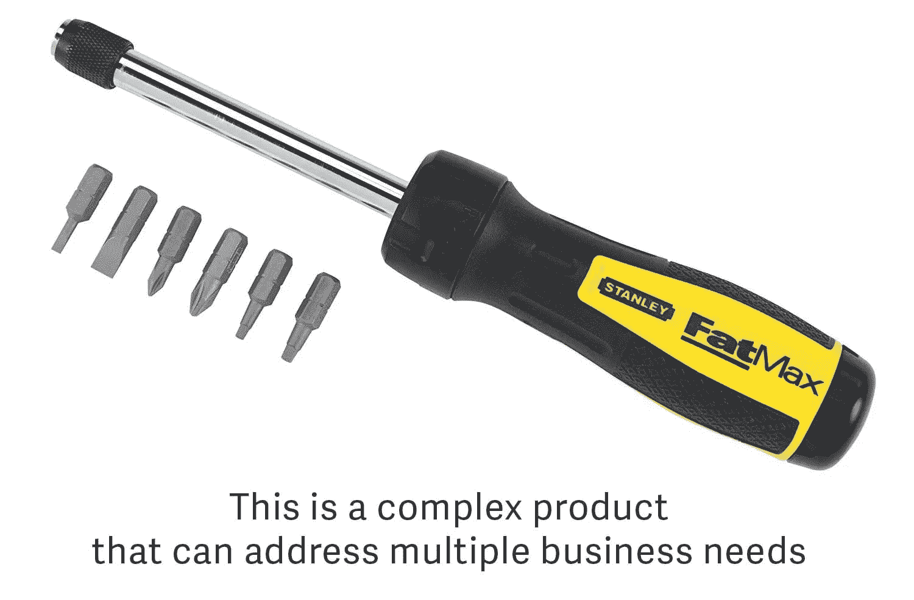
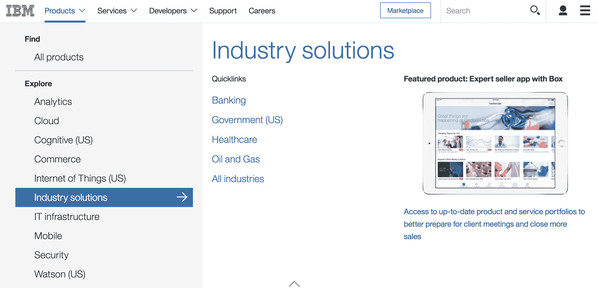
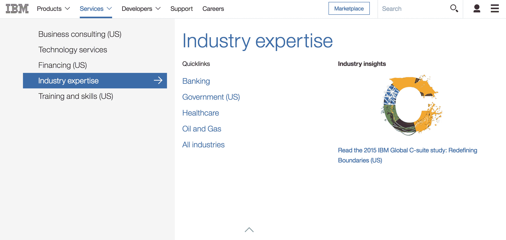
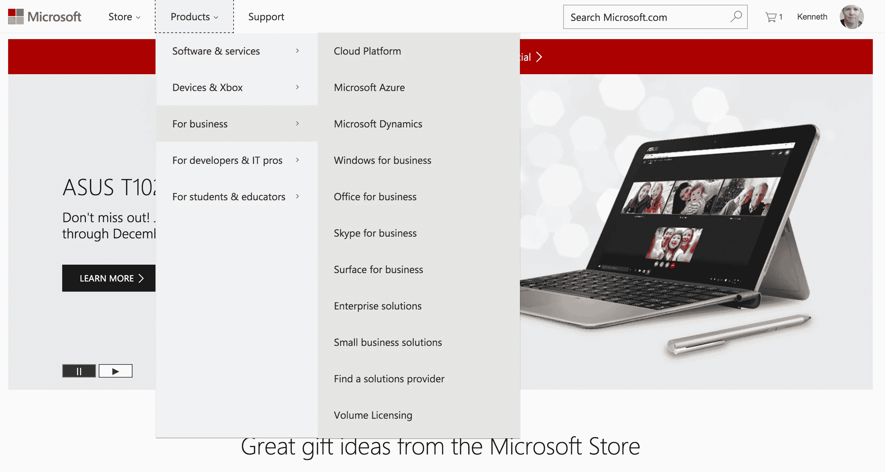
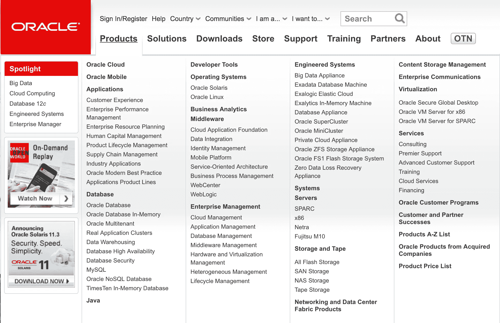
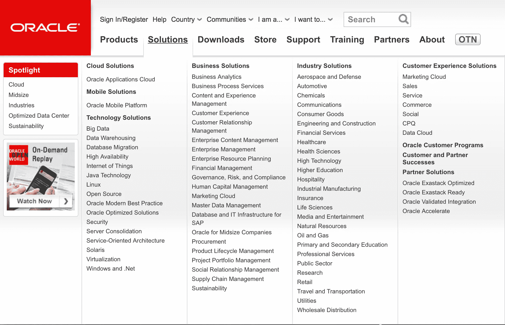
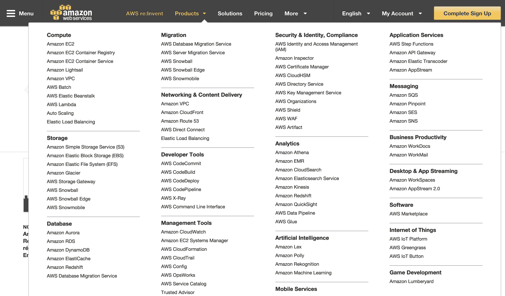
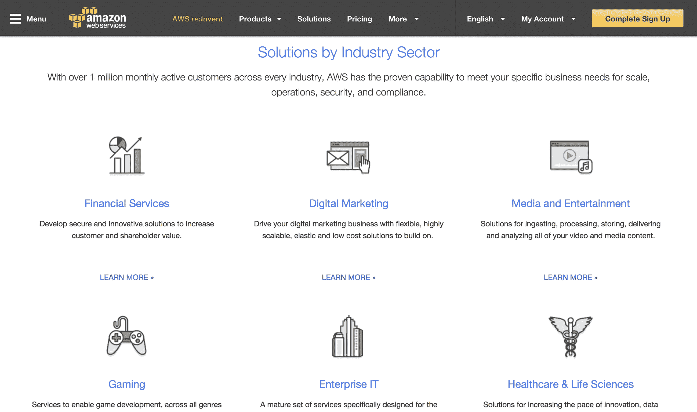

# 产品和解决方案:你知道区别吗？

> 原文：<https://medium.com/hackernoon/products-and-solutions-do-you-know-the-difference-4ff9169cefe3>

虽然有一种倾向是互换使用这两个术语——当然，除非你是一个产品营销人员，应该对此有更好的了解——但产品和解决方案之间有一个重要的区别，应该得到理解和尊重。这种差异影响了各行各业的员工对组织、工作和产出的看法，也影响了客户对组织的看法。

*[*背信弃义的形象*](https://en.wikipedia.org/wiki/The_Treachery_of_Images)*(1928–29)，勒内·马格里特著名的《产品与服务的区别》**

# *什么是产品？*

*产品是对应于独特的公司产品(设备、软件包、咨询产品等)的商品或服务。)通常经过正式流程 [1](#fn1-26288) 进行开发和市场推广，通常有专有名称(通常带有商标或符号)。*

**

*产品可以是商品或服务，也可以是两者的结合。事实上，越来越多以前被认为是严格的产品定义下的商品，正在通过服务得到加强，尽管它们最终仍然是一种产品。出于我们的目的，我们将使用总括术语“产品”来指代商品和服务，以及两者相结合的产品。*

*关于在所有电子和印刷通讯中正确使用产品名称，有正式的规则，记录在公司风格指南中。将商标名用作动词或形容词是一种让营销人员做噩梦的事情。 [2](#fn2-26288) 如果由于使用被认为过于通用的词语或概念而无法为产品注册商标，则可以使用服务商标(在标识旁边表示为“sm”)。*

**

**这款螺丝刀有多种选择。它可以是多种解决方案的一部分。**

*虽然它采用的是通过互联网提供和交互的服务形式，但 Amazon Elastic Compute Cloud(又名 EC2)是产品的一个例子。*

## *产品特性*

*   ***独特的名称:**通常在提供产品的国家注册商标*
*   ***已定义/标准化的功能集:** a)核心产品和 b)预定义的可选功能/特征*
*   ***公布价格:**制造商的建议零售价或“市场价”*
*   ***已定义的交付模式:**风险较低，因为它是在产品化过程中解决的。产品可以交付给多个客户。*
*   ***可重复:**提供给一个客户并不妨碍另一个客户也购买同样的产品 [3](#fn3-26288)*
*   ***文档:**产品的核心功能使用通用术语进行文档化*
*   ***竞争对手:**可以使用一系列变量将产品与竞争对手的产品进行比较，从基本信息(如单位价格)到复杂信息(如系统要求，可能是产品的特定限制)*
*   ***已定义的依赖关系:**使用产品的需求已明确定义。该产品已经过测试，具有所需的依赖关系，在这种情况下，它的正常功能通常由供应商保证*

# *有什么解决办法？*

*鉴于一个产品有做某事的潜力，一个*解决方案*是一个产品的*应用*来*解决*一个*特定的*行业需求或者业务*问题*。注意*这个词具体指*。这里的其他关键概念是*应用*和*解决*，由此衍生出*解决*一词。*

**

*当与螺丝(另一种产品)和木匠(一种服务)搭配时，螺丝刀是建造房屋解决方案的一部分。*

*人们普遍认为解决方案将为客户提供持续的价值。虽然在向客户交付产品的过程中可能会出现一次性事件，如安装和配置，这与产品的传统概念相似，但这些事件有助于客户和组织之间的持续关系。当客户的业务需求发生变化时，当增加与解决方案交互的员工时，当解决方案的产品组件磨损时，等等，这些活动也可以全部或部分重复。，或当组织生产产品的修订版本，要求随后与顾客的运作整合并适应时。*

*为了让解决方案支持与客户的持续关系，它需要着眼于未来进行设计和构建，能够成长、发展并满足不断变化的需求。作为为客户持续创造价值的回报，组织将收取持续费用(从其角度来看是经常性收入)，并签订长期协议，通常以年为单位，正式成为服务合同。*

## *解决方案的特征*

*   ***基于标准产品:**然而，解决方案中使用的标准产品功能相对于其标准功能被打开或关闭，和/或被修改*
*   *一个或多个重要的定制。这些定制是以下一项或多项的功能:行业、市场/地理、组织规模(以员工或地理覆盖范围表示)、业务功能和/或客户的独特特征和要求*
*   ***可选特性:**可能集成第三方产品、专业服务组件、项目管理组件、实施日历*
*   ***非标准定价:**可以基于数量、标价和定制工作的组合*
*   ***收入确认特定于解决方案:**收入时间也不同；交付里程碑开始发挥作用*
*   ***高风险***
*   ***文件变更:**产生新文件*

*从对潜在客户进行营销的角度来看，“解决方案”被定位在特定行业中运营的组织或其中的职能部门所面临的共同挑战的层面上。*

*因此，网站的解决方案部分是按照他们所针对的行业来划分的。正如在本文后面提供的许多公司网站截图中可以看到的那样，特定行业的解决方案可能在其描述中包含“解决方案”一词，也可能不包含。 [5](#fn5-26288)*

## *解决方案类别*

*解决方案可以根据它们所针对的一个或多个行业，以及无论基础行业、市场或组织类别如何都存在的常见业务功能来分类。*

*解决方案类别的示例包括:*

*   *工业*
*   *企业机能*
*   *组织*

*组织型解决方案是一种将市场需求水平分割为组织规模或组织活动类型(创收、追求利润或两者皆非)的方法。还有一些商业挑战是由一个组织的规模决定的，而不是由它所处的行业决定的。*

*一个给定的产品可能包含在多个解决方案中。例如，Oracle Database 12c 可用于多个行业。但是，当它作为一个解决方案交付时，它会附带某些特定于行业的配置决策，这些决策是在与特定客户实际实施之前做出的。例如，它可能会为国防承包商打开某些功能，这些承包商在销售周期、信息保留和其他监管要求方面有自己的现实，而为电子商务公司打开其他功能。*

*这些初始配置决策是由市场研究提供的。*

# *营销产品和解决方案的最佳实践*

## ***这是一个产品***

*搜索*产品*的买家通常对他们商业问题的性质以及如何解决问题有很好的把握。他们在寻找拼图的特定部分，所以他们从产品的角度来考虑，即使最终交付的是根据我们这里的用法的解决方案。营销语言应该清楚地描述产品能做什么和不能做什么。就技术产品而言，潜在买家可能希望看到更多的技术信息，如硬件和软件要求以及其他依赖因素。潜在的购买者应该能够清楚地了解*该产品将如何*解决正在讨论的商业问题。*

## ***一言为定***

*搜索*解决方案*的买家通常处于解决问题过程的早期阶段。他们知道自己遇到了问题，但可能不知道从哪里开始。他们从可能帮助他们的解决方案的角度来思考问题，尽管他们对可能的解决方案的理解或对业务问题的描述可能并不具体。因此，向潜在的购买者提供语言和用法示例是很重要的，这使他们能够自我认同组织的产品并采取适当的行动(例如，下载文档、请求联系、与销售代表交谈等)。).分享技术细节虽然重要，但在早期可能不太必要，因为营销人员有机会在解释*如何进行之前销售问题的解决方案，即*什么*。**

## ***发展解决方案***

*当向客户部署解决方案时，营销人员应该寻找机会，根据为满足客户需求而进行的具体调整来增强核心产品(如我们之前定义的那样)。这是通过获取客户反馈和与客户一起部署产品并随时间推移提供支持的过程相关的其他项目来实现的。从多个客户部署中捕获的数据将使营销人员能够确定是否确实存在未满足的市场需求，或者调整最终是针对客户的。*

*在前一种情况下，调整应该正式化并整合到核心产品中。*

## ***营销解决方案***

*当通过互联网或亲自向潜在客户展示时，应小心使用术语*产品*(即商品或服务)和*解决方案*来帮助潜在客户确定其业务需求和自我认同。企业购买者已经习惯于在这些方法中的一种或两种方法中寻找他们的业务需求的答案。*

## ***定位解决方案***

*应该考虑要解决的业务问题最终是纯粹的费用还是为购买者创造收入的投入，并相应地定位解决方案。在前一种情况下，价格很可能是一个重要的考虑因素，当解决方案可以被证明能够产生增量收入时，价格虽然仍然重要，但在讨论中变得不那么重要，这就为基于其他优点吹嘘解决方案留下了空间。*

# *产品与解决方案示例*

*现在让我们把注意力转向产品和解决方案在现实世界中是如何实现的。下面显示的每个截图都是在 2016 年 12 月 16 日，在每个公司的主要公司网站上拍摄的，便于比较。IBM 的截屏使用了该网站的加拿大(英语)版本，因为 IBM 的美国网站放弃了主页上的传统导航栏。*

## *IBM*

*随着 IBM 的商业模式转向以服务(外包代码)的形式产生经常性收入，它已经将解决方案纳入其网站的产品菜单。正如下面的 IBM 主网站截图(拍摄于 2016 年 12 月 16 日)所示，行业解决方案是产品菜单中一个独特的菜单项。这很可能是为了简化网站而做出的设计决定，而不是与这里描述的概念范式有任何根本性的分歧。*

**

*该屏幕显示了以服务为中心的方法，其中特定行业的服务解决方案作为子菜单项提供。*

**

*正如我们将从 Amazon Web Services 和 Oracle 的例子中看到的，IBM 的方法可能是常规的例外。正如我们将在下面看到的，微软的消费者市场需要一种特殊的方法。*

## ***微软***

*尽管 IBM 严格专注于企业客户，但微软面临着满足消费者、企业和机构客户以及开发商和渠道合作伙伴的需求的挑战，它依赖这些客户在其平台上提供应用程序，并分别向客户提供集成的解决方案。微软的网站近年来更加关注消费者的需求。这可能是因为它非常了解其利益相关者的需求，它相信可以依靠他们自己导航到网站的适当部分。*

**

## ***甲骨文***

*就甲骨文而言，产品和解决方案之间的区别仍然是其网站的固定内容。*

*以下 Oracle 主网站截图显示了**产品**菜单的内容。产品菜单的内容对应于 Oracle 产品的实际名称，很可能是商标，但为了清晰起见，从菜单中去掉了(TM)符号。主要的子部分按照普遍接受的类别与产品组相对应。例如应用程序、数据库、存储等。以及专门命名的技术，如 Java、SPARC 处理器等。*

**

*以下甲骨文网站截图显示了**解决方案**菜单的内容。如您所见，有多种解决方案类别可供选择。商业解决方案和行业解决方案是你在其他地方会看到的更典型的解决方案。*

**

## ***亚马逊网络服务***

*虽然亚马逊网络服务可能在其客户的心目中被视为服务提供商，但它首先将其各种服务列为产品。它们以一个相当长的文本链接列表的形式提供，几乎就像一个购物清单或中文菜单。*

**

*一个单独的网站部分—和网络体验—为访问者提供，以搜索专门为其组织的行业、业务问题、功能组或规模(根据标准实践，在员工中)设计的解决方案。*

**

## ***联合包裹服务公司(UPS)***

*到目前为止，我们关于产品和解决方案之间的区别的讨论范围确实非常集中于技术公司。在联合包裹服务公司(又名 UPS)的案例中，该公司通过专注于*解决方案*和*行业*，而不是*产品*和*解决方案*，后者意味着一个行业。*

**

*当基本网站导航中没有提供产品的概念时，UPS 会用一个标有“产品洞察”的部分(浅蓝色)进一步混淆访问者。*

*我们建议 UPS 根据其*服务*(根据我们的定义的一种产品)及其*解决方案*来组织其网站，以满足访问者的需求，正如我们在下面的最佳实践中所描述的。*

# *结论*

*了解产品——无论是商品还是服务——和解决方案之间的差异，使产品营销人员能够与潜在的商业买家进行适当的沟通，将重点放在关于和*如何声称该产品或解决方案能够做什么的*信息的正确组合上。这种区别对于生产产品或解决方案的组织的员工也有价值，因为它使他们更好地理解组织的业务性质，特别是在专注于提供具有重复结果的解决方案的业务模型的情况下。***

*除了合理的例外，大多数考虑成为解决方案提供商的大型组织以不同的方式展示他们的产品和解决方案，即使底层产品是相同的。企业购买者被训练成对大公司有尽可能多的期望，因此与现有的、公认的信息呈现模式保持一致是有意义的，以便在购买者建立对问题解决方案的理解时限制分心。这是一个充满了足够多干扰和理由的过程，足以让买家说“不”。*

1.  *过程的复杂性和/或正式性取决于组织。重要的一点是，产品是人们有意识地做出购买决定的结果。 [↩︎](#fnr1-26288)*
2.  *一份不是*施乐*——注意小写的‘x’——一份文件，一份*影印*一份文件。实现这一点的过程叫做*静电复印*，这个术语不属于施乐公司。 [↩︎](#fnr2-26288)*
3.  *对于像作者这样的经济学书呆子来说，一种产品可以被认为是一种非竞争性商品，因为一个人的使用——而不是购买——不会降低其他人的可用性(在其他情况下可能适用的制成品除外)。[参见维基百科了解更多](https://en.wikipedia.org/wiki/Public_good) ) [↩︎](#fnr3-26288)*
4.  *除了那些第一次知道产品和解决方案之间有区别的人。谢谢你，亲爱的读者。:-) [↩︎](#fnr4-26288)*
5.  *这与其说是一个问题，不如说是一个风格问题。 [↩︎](#fnr5-26288)*

**如果你喜欢这个，请点击*💚*下图。如果你知道有人也喜欢这个，请通过下面的一个社交媒体按钮来分享。**

******

> *[黑客中午](http://bit.ly/Hackernoon)是黑客如何开始他们的下午。我们是这个家庭的一员。我们现在[接受投稿](http://bit.ly/hackernoonsubmission)并乐意[讨论广告&赞助](mailto:partners@amipublications.com)机会。*
> 
> *如果你喜欢这个故事，我们推荐你阅读我们的[最新科技故事](http://bit.ly/hackernoonlatestt)和[趋势科技故事](https://hackernoon.com/trending)。直到下一次，不要把世界的现实想当然！*

**