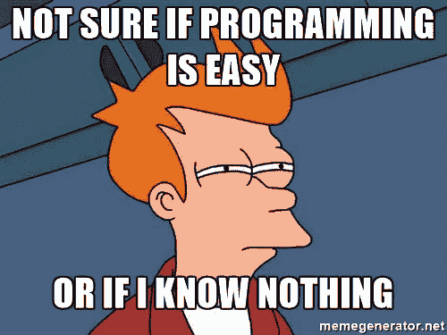
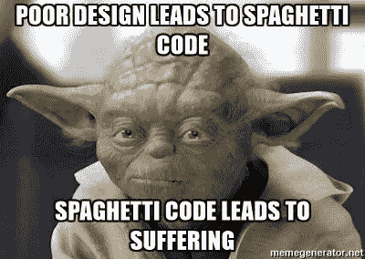

# 编程不容易，编码才容易。

> 原文：<https://medium.com/hackernoon/programming-isnt-easy-coding-is-a1efcf97a264>

在我生命中的一段时间里，当我第一次开始整个编程的事情时，我想，“编程很容易…为什么你需要去学校学这些东西？”但是有了经验和教育，我知道编程是很难的。



[Not sure if programming is easy or if I know nothing.](https://memegenerator.net/instance/78362391/futurama-fry-not-sure-if-programming-is-easy-or-if-i-know-nothing) ~MemeGenerator.net

自我评估对我来说一直很重要，因为归根结底，别人怎么想并不重要，重要的是你怎么想。在评估过程中，我思考了优势、劣势、教育、培训和个人成长。这个过程让我反思、学习、思考作为一名程序员意味着什么。

# 评价:编码？编程？击键？

我在科技行业的第一份工作是专注于 HTML、CSS 和 JavaScript，目的是让元素做一些事情或创造一些视觉上的阴谋。在这段时间里，我从未真正认为自己是一名程序员，那时我也从未真正想成为一名程序员。当我知道如何在 NodeJS、PHP 和 MySQL 中做更多的事情之后，我开始以这种方式看待自己。作为一名程序员，我的第一份工作是和一名名为“软件工程师”的程序员一起工作，在那里我每天都在积极地编写解决方案。

> “经验告诉我，我是在使劲地砍、劈、敲键盘，但我不是在编程。”

编程需要思考和理解各种数据类型、结构，并理解编程语言旨在服务的[技术](https://hackernoon.com/tagged/technology)。不同之处主要在于完成某些任务的过程。焦点不在数据类型、设计模式、算法类型、性能或任何与代码和应用程序质量相关的东西上。相反，它被放入实际工作的机械师和机械师的美学中，这经常在很多时间里变成一个庞大的不可维护的野兽。同时在不同的地方运行输出，并狂热地测试输出，直到它非常类似于一个特性。如果有什么不同的话，这给我的感觉是我在编程，但是我在我的方法上并不务实或深思熟虑。

# 思考数据

数据结构是一个我感觉教育不足的领域。数据结构背后的思想是，你有不同的方法来存储、调用、排序和搜索数据。当我第一次开始编程时，我从未考虑过各种数据任务和数据类型的性能。经常默认使用数组*(包括散列、json、字典和其他键值数据集术语)*来存储、排序或迭代任何需要的东西。

从计算机科学的角度来看，集合、堆栈和队列对我来说很有趣，但在实际看到 ruby [编程](https://hackernoon.com/tagged/programming)语言中的一些应用之后，我就不那么感兴趣了。在我看来，堆栈和队列是一样的，它们允许你从数据的末端获取信息，队列的例外是你只能按照它们连接的顺序获取项目。当我想到这个的时候，我首先想到的是将事情放在一个列表中等待处理，并减少可以在后台运行的任务。实际上，在 Ruby 这样的高级编程语言中将其付诸实践并没有太大意义，因为它基本上只是将元素移入或移出数组。

例如，Ruby 中的堆栈可以像下面的代码一样简单。

```
class Stack
  # init stack 
  def initialize
    [@set](http://twitter.com/set) = Array.new() 
  end
  # put a new item at the end of the stack 
  def push(x)
    [@set](http://twitter.com/set).push x
  end
  # get the last item in the stack
  def grab
    [@set](http://twitter.com/set).pop
  end
  # is the set empty true false bool 
  def empty?
    [@set](http://twitter.com/set).empty?
  end
end# implemented stack s = Stack.new
s.push 'a' 
s.push 'b'
s.push 'c' 
s.inspect #<Stack:0x48b66454 [@set](http://twitter.com/set)=["a", "b", "c"]> 
puts s.grab # "c" 
puts s.grab # "b" 
puts s.grab # "a" 
s.grab.inspect # nil
```

队列在被创建的数据类型上是相对相同的，另外 [Ruby 已经有了一个相应的类](http://ruby-doc.org/stdlib-2.0.0/libdoc/thread/rdoc/Queue.html)。

```
# ruby Queue Class q = Queue.new
q << 'a' 
q << 'b'# Tests Examples using Queue puts q.length  # prints 2 
puts q.pop # prints a
puts q.length # prints 1 
puts q.pop # prints b 
puts q.length #prints 0
```

虽然简单，但它基本上是一个非常简单的数组。这本身可能就是它的美妙之处。我看到自己可能会在命令行脚本中使用堆栈或队列，但是我不确定还能在其他什么地方使用它们。

二叉查找树吸引了我，因为它的搜索时间和检索数据的速度。我经常发现从数组中获取数据非常容易，但是当数组变得很大时，搜索就需要时间了。[这就是二分搜索法树发挥作用的地方，我真的很喜欢哈佛制作的这个视频。虽然我还没有使用过其中的任何一个，但我真的很想用它来实现一些东西，然后将它与带有数组的原生 ruby 方法进行比较，看看二叉树比简单的数组或散列快多少。在我研究二叉树并试图找到实际的实现和用例时，我发现了这些有趣的文章。](http://cs50.tv/2012/fall/shorts/binary_search/binary_search-720p.mp4)

*   [用字符串](https://gist.github.com/yuya-takeyama/812489)搜索—By:[yuya-take yama](https://gist.github.com/yuya-takeyama/812489)via github gists
*   [数字搜索](http://zvkemp.github.io/blog/2014/04/25/binary-search-trees-in-ruby/) —作者:扎克·坎普

# 可维护性

我的第一个 web 应用程序在可维护性方面非常糟糕。我没有使用代码约定，没有设计模式，没有定义方法的顺序，没有名称空间，没有对象或模型。如果我不得不回去修复 bug(我肯定有)，重新编写可能比找出导致 bug 的方法实际存在的地方更快。



Poor design leads to spaghetti code.

我难以克服的一个问题是嵌套的条件和循环。这些循环通常会有大量的 if 语句和验证，但是这个问题是另一个问题的系统性。不了解如何正确地组织和分离程序的各个部分。我试图用大方法来做所有的事情，而不是集中在可以重用的地方，或者创建一个将功能扩展到所有对象和方法的模块。下面的代码是一个实际的代码片段，为了节省长度，对其进行了一些删节和修改。

```
print " <h3> Display Weekdays: </h3> ";// Looping in a view ... should have been factored diff
foreach($imageRecords["display"] as $ => $displayRecords) {         
     // WTF is this a nested foreach 
     foreach($displayRecords as $value => $dispRecord){
       $tempWeekdayValuesArray = array();
          if($value === "weekdays" && !isnull($dispRecord)) {
             // 3rd nested foreach WTF!
             foreach($dispRecord as $weekday => $weekbool) {
                 // :( condition foreach day ::SHAME::
                 if($weekday == "monday" && $weekbool == 1) {
                    // logic removed 
                  }
              }

           }
      }
}
```

我不会把责任转移到其他任何人身上，这段代码是我的错代码，我承认这一点，但是其中一些可以通过代码导师，或者通过代码审查和拉请求来减轻。回顾这段代码，我感到惭愧，但这是一件好事，因为它显示了我作为一名开发人员成长了多少。在某种意义上，自由是一个问题，但在其他意义上却不是。例如，在这个项目中，我不得不使用灯组，这是不可协商的，但同时这也是唯一的限制。我不需要使用设计模式，遵循任何风格指南，使用代码棉条，或者遵循任何关于代码约定的政策。这创造了一个系统，在这个系统中，你可以自由地使用你自己的设备，如果你还没有了解应用程序的寿命和错误修复，它会对你的最终结果产生不利影响。

我越来越喜欢文本编辑器，越来越喜欢它在编写代码时通过林挺(指出潜在错误)为您节省的时间，但我也越来越喜欢与编程相关的更细微的细节。遵循文档标准、清晰约定和风格指南的编写良好的代码库读起来就像电子邮件或互联网文章一样流畅。(当然有时使用的编程语言更适合这种情况)通常我也发现我喜欢这本书里的许多原则，罗伯特·c·马丁 *和其他许多作者写的《干净的代码:敏捷软件工艺手册》。*

# 测试驱动开发

在我看来，测试驱动开发的好处足以证明它的价值，但是我知道不是每个人都同意测试对代码库有任何价值。我不想争论测试的有效性，但是我想分享它是如何帮助我的。在实际创建代码之前编写代码的集成和单元测试在很多方面都有帮助。它帮助我写出更清晰的代码，更高效地编写代码，并帮助我解决我难以理解的问题。

编写更干净、更高效的代码与编程中的许多事情都有交叉。可读性、性能和写作时间是 TDD 帮助我的主要方面。我发现我能够编写在进入生产或版本控制之前不必重构(多次)的代码。它不仅帮助我减少了 bug，还减少了我追踪和修复 bug 的时间。当修复一个我发现的 bug 时，我可以获得预期的输入或输出，编写一个与之匹配的测试，然后努力使这个测试和所有其他测试通过。这消除了 bug，并使代码保持其预期目的。

在我开始编写实际的方法或对象之前，TDD 帮助我组织了我的思路。在更复杂的功能中，它帮助我将功能分解为功能正常工作所需的最小项目集。很多时候，它让我想起写错误或伪代码，因为你的测试将会失败，最终将不得不随着代码的发展而改变。也就是说，边缘情况就是边缘情况，在最初创建代码时，它们通常更难考虑。最终，我觉得测试驱动开发有助于我成为一名更好的程序员。