# Pearls 和 Python 编程失败

> 原文：<https://medium.com/hackernoon/programming-pearls-and-python-fails-c4fc2962c3ed>

计算机科学书籍包含永恒的智慧，但是性能建议[并不总是适用。在阅读乔恩·本特利的《T4 编程》时，我发现了更多现代硬件的进步，打破了传统观念。](https://nopointerexception.wordpress.com/2015/07/16/optimizers-anonymous-1st-step-is-admitting-you-probably-dont-have-a-problem/)

考虑以下问题:

**将 n 个元素的数组向左旋转 I 个位置。例如，将“abcdefgh”旋转 3，得到“defghabc”。有没有可能做到这一点并与 n 成正比？**

该问题模拟了真实计算场景中的几个问题:

*   在文本编辑器中移动文本可以看作是旋转要移动到新位置的文本。
*   交换相邻的不相等的内存块。

考虑到用例，操作不应该懒散地进行。

一种算法涉及到一个微妙的杂耍动作:取第一个元素，然后将 I 处的元素移动到它的最终位置，然后将 2i 处的元素移动到 I，依此类推。重复这一过程，直到整个阵列旋转完毕。

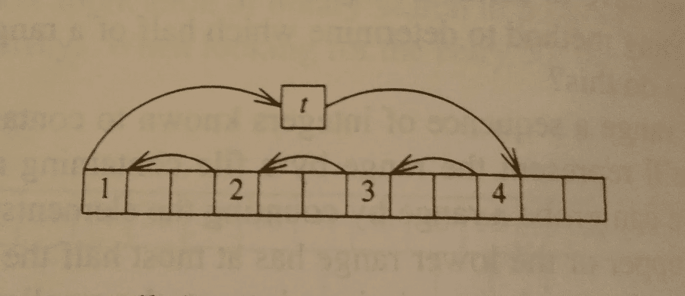

Credits: Programming Pearls, 2nd Edition, page 14.

考虑这个问题的另一种方法是将数组视为两个不同的段，A 和 B，然后旋转数组等同于将数组 AB 转换为数组 BA。如果我们能把 A 倒过来产生 A’，那么

(甲‘乙’)’->巴

杂耍算法对每个数组元素读写一次。反向旋转对每个数组元素读写两次。传统智慧会让我们得出杂耍算法运行更快的结论。在编程 Pearls 时，杂耍代码据说快了一倍。这个结果在 21 世纪仍然成立吗？

以下是用 Python 实现的杂耍旋转:

Juggle Swap

通过使用类型化的 Python 数组，我认为与列表相比，它会产生更好的性能。不幸的是，我犯了过早优化的罪。

在包含 10000 个元素的 Python 数组上运行旋转杂耍并重复 10000 次会得到以下结果:

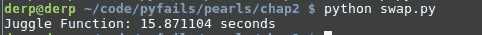

……..15 seconds?

我在 4GHz 英特尔 i7-6700K 上运行了测试。作为快速检查，我的 CPU 应该能够每秒处理几十亿次整数运算。杂耍旋转移动大约 1000 万个整数(10000 个元素* 10000 次重复)，对于它必须做的工作来说，15 秒似乎长得可笑。

使用列表时会发生什么？

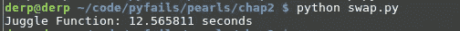

12.56 seconds…. eh….

好点了，但还是不太好。阅读[Python 源代码](https://github.com/python/cpython/blob/master/Modules/arraymodule.c)发现，在元素检索过程中，Python 会创建一个 PyObject 并包装结果。每当它访问一个从未见过的整数时，就会产生这种开销。如果我们内联函数呢？

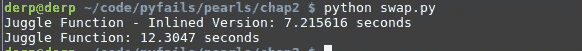

A 5 second improvement via inlining….not bad

对，没有函数内联。对于像 map()和 filter()这样本质上需要反复调用函数的东西来说，这并不好。

反向旋转呢？

从两端开始，我们一次循环一个，交换元素，我们做 3 个片段反转。非常简单。

设置剖析工作台…

我们走吧:

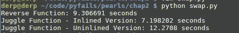

在这一点上，虽然反向函数看起来相当慢，但一切似乎都很慢。

嗯，我们可以用 JIT 运行 Python 环境，比如 [PyPy](http://pypy.org/) 。

让我们试一试

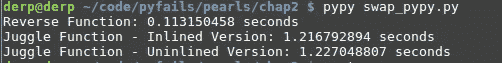

我们已经成功实现了 10 倍的杂耍函数加速和 200 倍的反向函数加速。由于某种原因，反向旋转比杂耍旋转快多了。

我们还能进一步提高吗？

通过 [Cython](http://cython.org/) ，并添加一些类型注释，可以编译代码，省去了更多的开销。这是转换后的函数

Note how similar it is to the Python code we wrote before

我们进展如何？

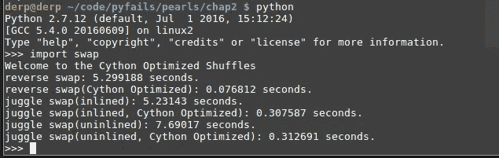

Wow

作为另一个健全性检查，如果我们的 CPU 每秒可以处理几十亿条指令，那么处理 1000 万个整数应该在百分之一秒的范围内，我们的反向交换在 0.07 秒内完成。

所有这些仍然留给我们一个问题:**尽管做了更多的工作，为什么反向旋转函数比杂耍函数快？**

我用 C 重新实现了这两个函数，我们在 Linux 下使用 perf。

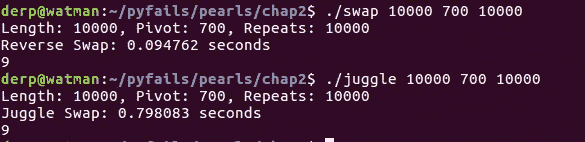

Hmm….

有趣的是，我们的 C 代码似乎比我们的 Cython 优化代码慢，编译后的 Python 怎么可能比 C 跑得快？

我已经将元素的数量增加到一百万个整数，我们现在正在做 5000 次重复，让我们再次重复 Cython 结果

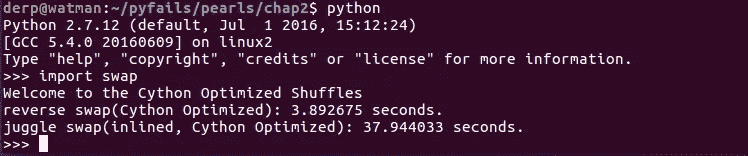

我们的 C 程序表现如何？

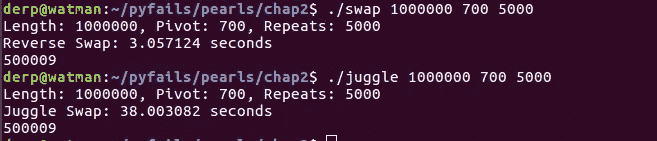

**关于基准测试的重要经验:始终确保它们运行足够长的时间，以便结果不会被其他因素扭曲。**

从我们的基准测试中，我们可以推断出 Cython 已经生成了相当纯的 C。通过分析我们的 C 程序，我们应该能够得到关于我们性能的结论性结果。

运行 perf 给了我们最后的拼图。

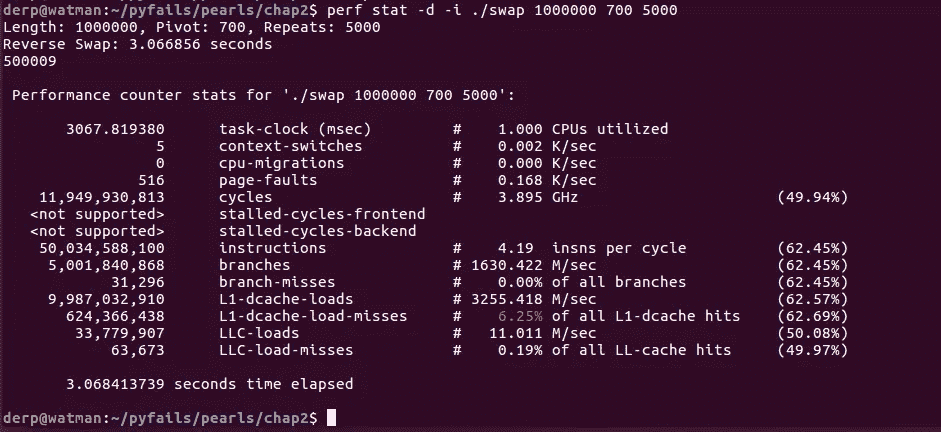

Reverse Rotate

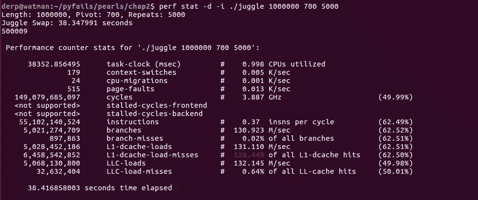

Juggle Rotate

我想强调几个统计数据:

1.  看看 L1 数据缓存加载(L1-dcache-loads)，反向交换的加载量大约是杂耍程序的两倍，这就是我们所期望的:两倍的内存访问。
2.  Swap 程序在 L1 数据和最后一级高速缓存(LLC)中的高速缓存未命中要少得多，而杂耍程序在高速缓存未命中中招致相当大的损失。

简而言之，与进行计算相比，访问主存储器是昂贵的。在 Skylake CPU 上，访问 RAM 的成本是 42 个周期+ 51 纳秒。CPU 缓存基于这样的假设:代码将频繁访问彼此靠近的数据**，而数据访问在时间上靠近的是**。通过将这些数据放入高速缓存，CPU 只需要访问快得多的高速缓存，而不是不断地访问主内存。****

**有些人可能会想，为什么会有 128%的缓存未命中？[有一个复杂的答案](https://sites.utexas.edu/jdm4372/2013/07/14/notes-on-the-mystery-of-hardware-cache-performance-counters/)，但 TL；dr 时，CPU 可能会多次尝试从缓存中检索结果。**

**再看了看杂耍代码:**

****

**杂耍代码通过不断以某个偏移跳跃来访问存储器。在较大的跳转时，这对于 CPU 缓存是有害的—不访问彼此靠近的数据会经常导致缓存未命中。回头看 perf 结果，杂耍轮换中有 3，200 万个最后一级缓存命中，而反向轮换中只有 6.3 万个。**

**在反向循环中，访问内存是按顺序从两端完成的，数据访问非常接近，因此我们获得了更高的速度，尽管读和写的速度是前者的两倍。**

**值得注意的是，两种算法都有相同的渐近增长函数，都是 O(n)算法，但由于使用了高速缓存，它们在运行时的大小不同。还值得注意的是，在 C++中，反向旋转用作 std::rotate 实现的一部分。**

**如果要运行此 blogpost 中的任何代码，它们都将在此处收集:**

** [## FrozenXZeus/pyfairs

### pyfairs——针对 Python 的不同实现的一组实现基准

github.com](https://github.com/FrozenXZeus/pyfails) 

# 最后

*   高速缓存访问模式很重要！他们常常可以成就或破坏业绩。
*   [谨防过早“优化”](https://nopointerexception.wordpress.com/2015/07/16/optimizers-anonymous-1st-step-is-admitting-you-probably-dont-have-a-problem/)。在仔细分析的基础上验证假设。
*   在将代码部署到生产环境时，请考虑不同的 Python 解释器和 Cython。一个例子就是由 Dropbox 编写的 Python JIT[Pyston](https://blog.pyston.org/)。

> [黑客中午](http://bit.ly/Hackernoon)是黑客如何开始他们的下午。我们是 [@AMI](http://bit.ly/atAMIatAMI) 家庭的一员。我们现在[接受投稿](http://bit.ly/hackernoonsubmission)，并乐意[讨论广告&赞助](mailto:partners@amipublications.com)机会。
> 
> 如果你喜欢这个故事，我们推荐你阅读我们的[最新科技故事](http://bit.ly/hackernoonlatestt)和[趋势科技故事](https://hackernoon.com/trending)。直到下一次，不要把世界的现实想当然！

**