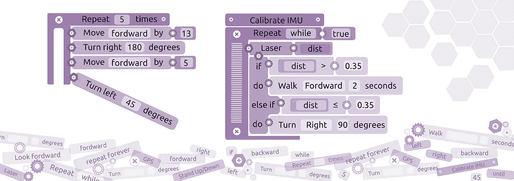

# 用积木给机器人编程

> 原文：<https://medium.com/hackernoon/programming-robots-with-blocks-bb5289555ef6>

## 大众化机器人与功能块的交互

From [Erle Robotics services](http://erlerobotics.com/blog/services/) website.

给机器人编程不是一件容易的事。虽然像机器人操作系统(ROS)这样的工具简化了这一过程，但对一名博士生来说，学习机器人操作系统(ROS)仍然需要平均 3 周的时间。

虽然对于一个[专业机器人专家 ROS 是必须的](/@vmayoral/how-do-i-become-a-roboticist-1fd7390083a8#.mv3yeqhk6)，但许多没有编码背景的人在未来会渴望与机器人互动/操作机器人。为了简化机器人编程的过程，并向更广泛的受众开放机器人技术，我们的团队很高兴地推出了 [robot_blockly](http://wiki.ros.org/robot_blockly) ，这是一个使用谷歌 [blockly](https://github.com/google/blockly) 库为[机器人编程的 ROS 包。](https://hackernoon.com/tagged/programming)

# 动机

Scratch 的幕后人员之一 Mitch Resnick 指出了一些有趣的事情:

> 我们不应该认为年轻人是数字原住民

他声称**年轻人在与新技术互动方面有很多经验，但在用新技术创造和表达自己时却很少。证明这一点并不难，你或许可以举出一些例子，这是我最常看到的一个例子:**

我们真的可以认为这是一个数字原生生物吗？。米奇不同意:

> …就好像他们能读但不能写

的确是这样的感觉。这些人能在知道如何使用各种现代设备(可能包括机器人)的基础上创造东西吗？)?。他们确实带来了新的想法和方法，但是创造具有广泛影响的技术需要文化素养。特别是在机器人学方面。

# 第三语言

现代学校倾向于教孩子们另外两门语言。通常年轻人会接触英语、西班牙语、法语、德语等。关于学习外语给离开带来的好处有一个很大的争论(事实上我在国外学习的时候学了很多)，但是抛开这个不谈，让他们学习一门编程语言不是更有用吗？C 或者 Python 无论在哪里都被广泛使用怎么样？

许多国家正在认识到这个事实，并开始从早期阶段就开始教授如何编码。

# 一种基于块的机器人编程方法:robot_blockly

正如之前指出的，在机器人学中，编码就像写作。换句话说，机器人专家的素养需要知道如何编码。我们确实可以把重点放在教新一代编程上，但如何让现有一代编程更容易呢？。这正是我们的时间已经达到了我们的工作机器人 _ 块状。

下面是用 robot_blockly 对机器人编程的样子:

只需拖放块，将浏览器中的行为放在一起。

[robot_blockly](https://github.com/erlerobot/robot_blockly) 结合了两个世界的精华:ROS 的灵活性和强大功能，以及 Mitch 和他的团队白手起家开创的块编程趋势的简单性。

想知道你能用 robot_blockly 做什么，看看下面的例子:

# 例子

robot_blockly ROS 包是开源的，在 GPLv3 许可下发布。您可以派生代码并根据需要进行修改。此外，如果你碰巧是一个机器人制造商，希望它为你完成[联系我们](http://erlerobotics.com/blog/contact/)并要求定制。

*robot_blockly 将由* [*乐儿机器人*](http://erlerobotics.com) *于 10 月 8 日和 9 日在韩国首尔*[*ROSCon 2016*](http://roscon.ros.org)*期间进行展示和讨论。如果你恰巧在附近，来和我们交谈！*

> 黑客中午是黑客如何开始他们的下午。我们是这个家庭的一员。我们现在[接受投稿](http://bit.ly/hackernoonsubmission)并乐意[讨论广告&赞助](mailto:partners@amipublications.com)机会。
> 
> 如果你喜欢这个故事，我们推荐你阅读我们的[最新科技故事](http://bit.ly/hackernoonlatestt)和[趋势科技故事](https://hackernoon.com/trending)。直到下一次，不要把世界的现实想当然！

