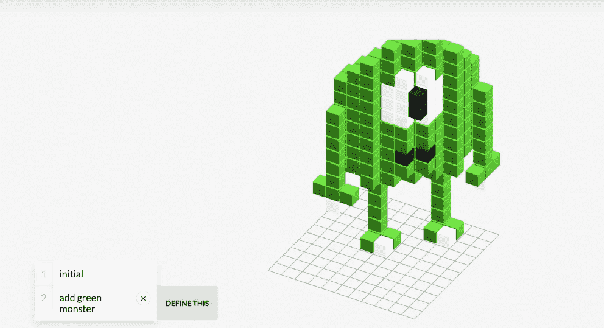

# 无编码编程

> 原文：<https://medium.com/hackernoon/programming-without-coding-33895ff2bc87>

计算机已经渗透到几乎每一个行业；不久，编程将成为大多数行业的必备技能。这种新的工作将要求人们分析和绘制数据，操纵文本，查询数据库，以及控制物联网或机器人。

目前，程序员在这些系统之上构建一个层；非程序员交互的用户界面。因为工业发展很快，所以必须对这些接口进行快速的改变，因为它们只能做被编程的事情。做出这些改变既费时又费钱。

更好的方法是，人们应该能够直接与计算机交互。写代码是一种方式。但是写精确的语句可能是乏味的，即使是对专业程序员来说。对于非程序员来说，这并不是一件容易的事情。因此，我们需要一个替代方案。

斯坦福大学的一组研究人员可能已经找到了解决这个问题的方法。

Voxelurn 允许你用自然语言编程。你可以输入“*添加绿色怪物*来添加一个绿色的怪物。您可以在这里看到支持的命令列表。但是，这还不是最好的部分。你可以做出你的定义。最初，你需要知道制作东西的核心语言。之后，你可以写你的定义。随着计算机学习你的定义，整个编程过程将变得更加自然。

我会在这里写一个小教程供你理解。不幸的是，他们的网站有问题。你可以通过上面的视频进行演示。

研究人员从亚马逊土耳其机械公司招募了 70 名用户。他们被要求在体素上制作结构。这些用户创建的定义是共享的，因此人们可以从其他人的定义中进行构建。

1.)用户 A 创建了一个人脸结构，并将其定义为“*添加一个人脸。*
2。)用户 B 使用命令“*添加面部”*并在其上制作一顶帽子。说“*加个戴帽子的脸。”*
3。)用户 C 可以使用“*添加带帽子的脸”定义和*可能添加身体、手、腿等。

这个想法是随着时间的推移，与用户社区一起发展语言。随着系统的学习，研究人员注意到用户 85%以上的时间倾向于使用自然语言。

这项研究向没有代码的未来迈出了很好的一步。你可以在这里查看技术细节。这里有一个他们的[开源回购](https://github.com/sidaw/shrdlurn)的链接。

> 关注 Hackernoon 和我( [Febin John James](https://medium.com/u/75a616711f4e?source=post_page-----33895ff2bc87--------------------------------) )了解更多故事。我还在写一本书，以提高对蓝鲸挑战的认识，蓝鲸挑战已经夺去了几个国家许多青少年的生命。它旨在帮助父母了解黑暗网络的威胁，并采取行动确保他们孩子的安全。《T2 与蓝鲸战斗》这本书可以在亚马逊上预购。书名将于本月 25 日发布。