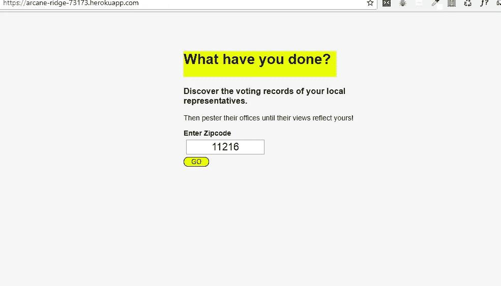

# 进度等级:+1

> 原文：<https://medium.com/hackernoon/progress-level-1-4ba36ed34022>

所以这并不是一篇长文，我只想谈谈我最近完成的[节点项目](https://www.vikingcodeschool.com/dashboard#/professional-development-with-javascript/project-walkthrough-professional-javascript)。

我记得我写下了我在 Node 上面临的[挑战](https://hackernoon.com/the-journey-so-far-b0051fbd5622)，并承诺在能够使用 Node 创造出有意义的东西之前不会放弃。在与我的[教程](http://vikingcodeschool.com)战斗了几个星期后，我完成了最后一个项目，“**一个政治应用**”。

该应用程序将利用[阳光国会 API](https://sunlightlabs.github.io/congress/) 根据立法者的*邮政编码、*每位立法者的个人资料和众议院/参议院最近的投票列表来显示立法者。我开始浏览网站上的文档，以了解我到底需要什么，经过几次尝试后，我决定我准备好了(我没有)。

编写 API 包装器让我意识到我需要了解对象、数组和 JSON，因为我在编写包装器时面临的大部分挑战都是由于我缺乏这些方面的知识。大约一周后，我确信我的包装器在工作，并返回正确的数据(我错了)。将 API 调用返回的数据发送到客户端是我面临的另一个挑战，但是经过几次尝试后，我让它显示出来了。

虽然我的应用程序可能不是 100%，但我从构建它中学到了很多；我需要在哪里工作，阅读什么，如何编写更干净的代码，我将继续努力，并通过 Wes Bos 的 Learn Node 教程视频继续学习更多的内容，我希望在不久的将来开始撰写技术文章，可能是关于 Node 或 JS 相关的内容。

点击查看[。](https://arcane-ridge-73173.herokuapp.com/)

*再次，为越来越好干杯*