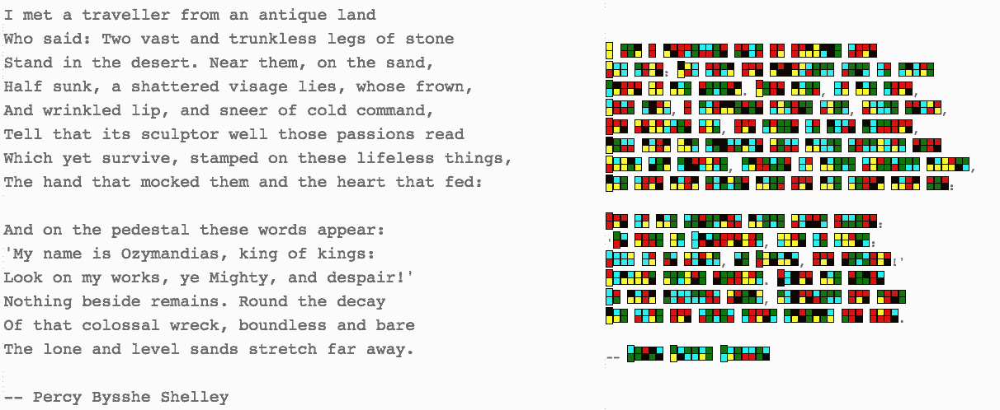

# 项目#7:书写用色块字体

> 原文：<https://medium.com/hackernoon/project-7-color-block-font-for-writing-6b51d716e0e4>

色彩鲜明。纵观有记录的历史，与单色设计相比，彩色设计的成本很高。自从书写系统的发明开始记录历史以来，书写系统一直在不断发展，通常是单色的。

但是现在彩色便宜或者免费，这就产生了问题:

*   书写系统的下一个发展方向是使用颜色吗？
*   有没有可能用基于颜色的系统让我们读得更好？
*   我们有没有可能用一个基于颜色的系统将更清晰的文本打包到一个给定的区域？
*   我们能做出漂亮的东西吗，即使它在技术上并不优于基于字形的系统？
*   学会阅读这个系统有多容易？

25 年前，我在一个工作站上试验了一个彩色书写系统，使用一个图形程序，将字母表示为从有限的调色板中选择的两个方块。然而，今天，创建基于浏览器的彩色书写系统的实现是可能的。看起来是这样的:

An Example Color-block Font Rendering of “Ozymandias”

去[网站](https://pubinv.github.io/color-block-font/)试试你想粘贴的任何文本。

这是一个刚刚启动的[公共发明](https://pubinv.github.io/PubInv/)项目。在它被认为是一个有效的书写系统之前，还有许多工作要做。但更重要的是，玩起来很有趣。这是一个想法，需要一些人和设计者一起玩，看看它是否能变得有趣、漂亮和有效。

像所有的 PubInv [项目](https://hackernoon.com/43-public-invention-projects-that-need-you-a8e4e39130b4)一样，它是完全自由的开源软件，代码发布在 GPL 3.0 下，非代码作品发布在 Creative Commons 下。