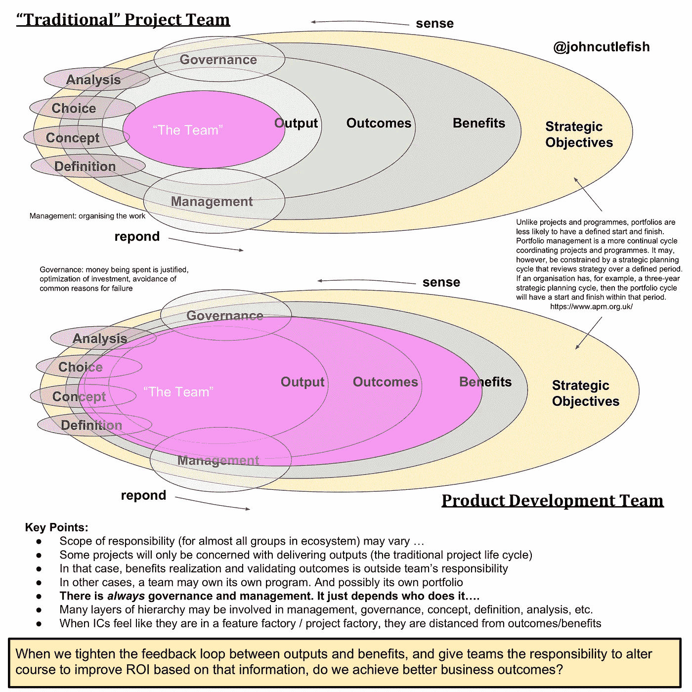

# 项目团队与产品团队

> 原文：<https://medium.com/hackernoon/project-team-vs-product-team-8c6891cd4a22>

在这个图表中，我试图找出一个更窄范围的项目团队和一个更宽范围的产品团队之间的一些区别。

项目*可以*是以结果和利益为中心的(不仅仅是以产出为中心)。[利益实现是一件事](https://en.wikipedia.org/wiki/Benefits_realisation_management)。一个产品团队着手实施计划，并进行投资(也称为项目)。至少在理论上，项目/计划/组合治理关心预期收益和实际收益。所以，我不知道，我不讨厌项目这个词。

我经常遇到关于项目(和评估)的争论。当你退后一步，你会发现它真的与项目这个词没有太大关系(这个词相当开放，具有可塑性)。相反，你看到的是关于责任范围、谁做什么、谁决定什么。这就是我想在这里深究的。

