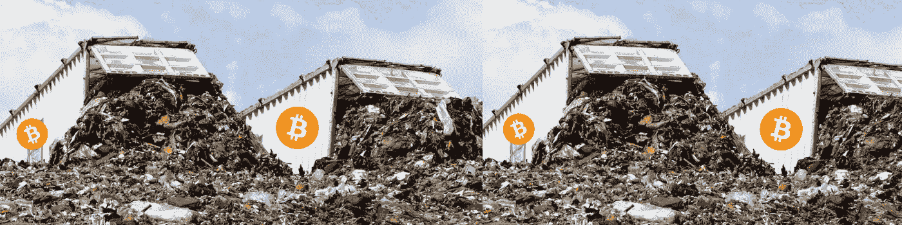
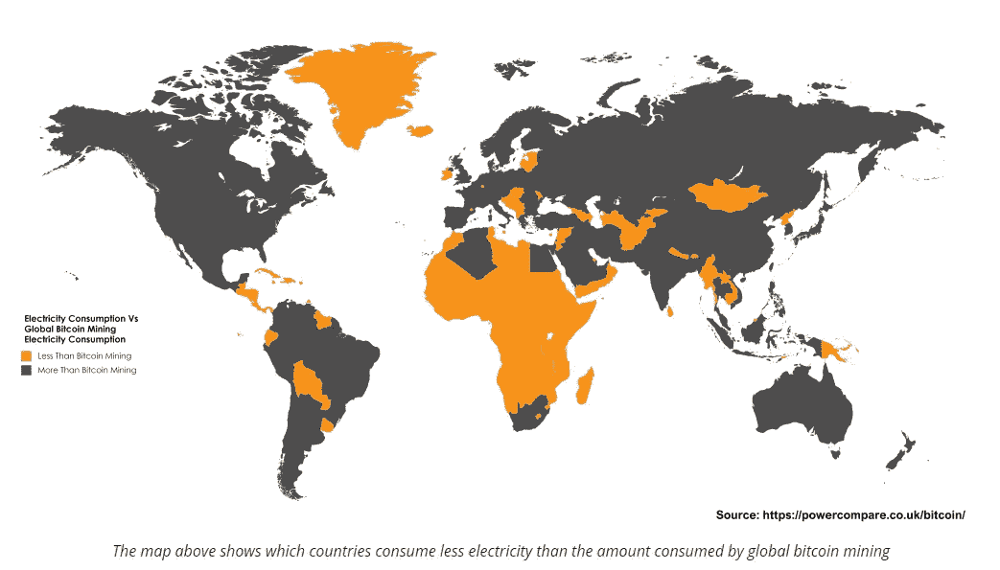

# 工作证明，还是浪费证明？

> 原文：<https://medium.com/hackernoon/proof-of-work-or-proof-of-waste-9c1710b7f025>

# 比特币和能源使用困境

如果你相当熟悉区块链的生态系统，那么你现在应该已经了解了正在发生的与比特币采矿相关的能源消耗争论。是的，比特币[开采](https://hackernoon.com/tagged/mining)需要大量能源，而且数量也不少。采矿(在比特币的*工作证明*算法的当前协议下)是**故意**消耗能源。

事实上，根据最近 [Cointelegraph](https://cointelegraph.com/news/bitcoin-mining-uses-more-power-than-most-african-countries) 的一篇文章，据估计，比特币网络使用了全球能源消耗的 0.14%，比几个发展中国家还要多，如上图所示。

**两个消费者的故事**

现在，简单地说，各国需要为家庭供暖和照明，操作机器，为制造工厂提供动力，为数百万人冷藏食物，等等。另一方面，比特币必须每秒验证 5 次交易，每隔 10 分钟左右向区块链添加新的区块，这几乎不是重大的物理和计算移植，因此，它确实提出了一个问题，工作证明真的是挖掘新硬币和验证交易的最有效方法吗？或者，我们能做得更好吗？我们继续低效率地燃烧国家等量的电力，最终是一场鸡蛋大战，最终不会直接让网络受益，这样做对吗？

这个因素，也许是我与大多数长期比特币社区成员的唯一分歧。除了这件事，我不记得曾经听过(或读过)安德烈亚斯·安东诺普洛斯说过一句我不同意的话。甚至他也承认，在这个地球上，只有一个基于网络的工作证明的空间。这句话的启示是，多重工作算法的证明最终会导致某种能源危机？

**为什么采矿会消耗这么多能源？**

我们为什么需要矿工是第一个重要的问题，答案是双重的。生产新的比特币并保护网络。

为了争夺一个区块，矿业社区需要解决一个已经加密的谜题。我可以进入难度调整级别，让 zero 和 SHA256 解释任务是如何执行的，但在这个阶段，你需要知道的是，解决这个难题对比特币网络没有任何作用，除了创建一个消耗参与者大量能量的彩票系统。

能量的使用被有意地提高，并递增地调整，以便对所有参与者强加不可避免的成本。“Nonce”(谜题的答案)只是一种均衡矿工群体成功可能性的方法。因为它是随机的(并且是加密的)，两个拥有相同装备的矿工有相同的可能性通过找到随机数来解谜，从而带走战利品(用海盗的比喻)。问题是，目前同时参与寻找这个*随机数*的矿工人数意味着难度非常高，并且随着越来越多的人对采矿感兴趣，比特币的价格继续飙升，难度也在不断增加。

因此，我们有越来越多的矿商在解决一个越来越难的难题，以确认相对较少的交易。结果是相当大的浪费。不可否认，矿工参与比特币开采所消耗的能量正变得越来越大，尤其是在累积考虑时。

**这是必需的还是仅仅是临时的感觉？**

问题不在于对电力的需求，如果事实上比特币网络真的*需要*它，就不会有来自社区的争论。相信我，如果为了成功地支持和维护一个分散的、安全的、独立的、公有的和廉洁的货币和全球交易网络，为大众提供银行系统之外的另一种选择，它的成本是现在的 100 倍，那么上帝作证，我会全力支持它——这项事业非常高尚，比特币的价值毋庸置疑。但归根结底，这种权力实际上是被利用了，没有别的原因，只是为了强加一种人为的支出。

比特币矿工被迫通过完成完全多余的计算来“证明他们的工作”，以赢得采矿彩票。

**需要它的原因**

我们亲爱的比特币社区在很大程度上重申的理由是，它被设计成这种方式，以增加挖掘的成本，以免网络变得垃圾邮件或不安全。如果太便宜、太容易开采，人们就会卷入这个网络，冒着批准不良交易的风险，或者索要天价费用，因为你的区块没有被拒绝的风险。我猜，这是一种强迫矿工稀缺和参与者质量的方式？事实上，这是已经被雄辩地提出的论点，并且在很大程度上被大多数支持工作证明的人所重申。但是对于网络的支持和新硬币的创造来说，工作证明是唯一的，甚至是最好的方法吗？

# **以下是我看到的当前工作证明设置的三个主要问题:**

**1。** **垄断的竞争劣势和必然性**

当经济激励和个人利益发生冲突时，就会产生分歧。这些在任何正常运转的生态系统中都是不可避免的，比特币当然不应该失去激励。然而，我们越来越多地看到比特币网络内部出现了一个新的政治阶层。出于纯粹的经济原因，矿商似乎越来越多地将自己的议程推到了前台。这在很大程度上促成了政治分歧的新趋势。[比特币](https://hackernoon.com/why-hard-forks-are-good-for-bitcoin-a966451d3fd6)的分叉几乎完全是关于挖掘困难和使用工作证明算法进行补偿的分歧的结果。

矿商在专用于开采比特币的 ASIC 处理器驱动的“采矿农场”上投入了少量资金，这不仅使新进入者几乎不可能进入比特币采矿池，还导致比特币被分流，形成这些群体的替代收入来源。

Segwit 遭到了矿工的反对，因为采矿奖励减少了(如果在比特币网络中大量采用，闪电网络可能会引起进一步的混乱，因为它使交易脱离了链条，并将大大减少对交易确认和新区块的需求)。自那以来，其他货币通过增加区块规模吸引了矿商，但结果可能是，独立矿商越来越难以与较大的采矿场竞争，从而无意中降低了竞争。支撑比特币安全性的这种集中化，正越来越被那些被比特币去中心化所吸引的人视为一种担忧。

**2。** **贫困社区的进入壁垒和经济劣势**

不管我们愿不愿意承认，整个采矿业在经济上是不公平的。首先有一个基本事实，比特币的价格与石油美元无关(感谢上帝！)，但这最终意味着，如果你生活在一个没有电力补贴的地区，与补贴国家建立的采矿平台相比，你在经济上处于相当不利的地位。除此之外，获得 ASIC 处理器和冷却设备的启动成本使大多数发展中国家陷入困境。事实上，不超过 15 个矿池几乎垄断了整个比特币采矿基础设施。这非常接近于中央集权，也不是 Satoshi 白皮书中所设想的平等主义乌托邦。

 [## 哈希拉特分布

### 一个饼状图显示了主要比特币矿池——区块链之间的哈希分布

blockchain.info](https://blockchain.info/pools) 

**3。** **将比特币与菲亚特经济联系起来**

最后，也是最常被忽视的一点是，将处理能力作为货币承诺在本质上与比特币和法定货币联系在一起，这最终是违背直觉的。逻辑思考一下:我们是为了开采比特币而强制执行 FIAT 的承诺？为什么？比特币是一种创造新生态系统的尝试。不可改变的数字现金，那么为什么要求进行法定交易来保护我们的网络呢？是的，应该有货币支出，但法定货币不是唯一的货币形式。

*你怎么看待工作证明？你是支持呢，还是认为还有其他选择的余地？很明显，我可能会在这一点上偏离太远，所以我肯定会接受所有的社区反馈。对于比特币网络的长期安全来说，这是一种替代方案还是一种不可避免的需要？*

*我正在为硬币创造和网络安全起草两个替代概念，分别叫做“时间证明”和“社区证明”。这些还没有准备好，甚至可能不可行，但看到他们如何被接受会很有趣。请在下面评论。*