# 用 Jscrambler 保护您的 NativeScript 源代码

> 原文：<https://medium.com/hackernoon/protecting-your-nativescript-source-code-with-jscrambler-7c2019fc5612>


**我们很高兴地宣布** [**进展**](https://www.progress.com/?utm_source=jscrambler.com&utm_medium=referral)**[**tele rik**](https://www.telerik.com/?utm_source=jscrambler.com&utm_medium=referral)**已经推荐**[**Jscrambler**](https://jscrambler.com/?utm_source=medium.com&utm_medium=referral)**作为保护**[**NativeScript**](https://www.nativescript.org/?utm_source=jscrambler.com&utm_medium=referral)**应用的首选解决方案。****

**阅读下面关于他们的公告的更多信息。**

**“在本文中，我们将了解为什么您可能想要使用 Jscrambler，它是如何工作的，以及如何将该工具集成到您自己的 NativeScript 应用程序中。让我们从为什么 Jscrambler 可能非常适合您的应用程序开始。**

**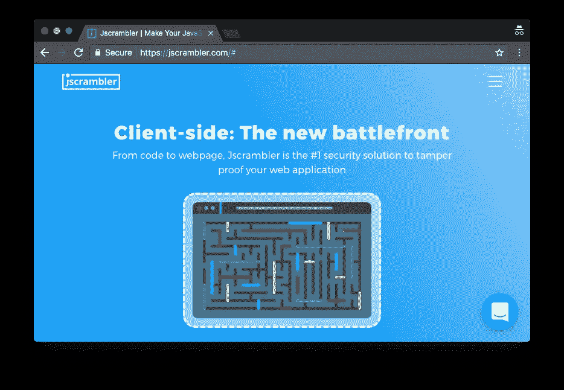**

# **为什么是 Jscrambler？**

**在 NativeScript 中，您用 JavaScript 编写应用程序逻辑。因为 JavaScript 不是编译语言，所以 NativeScript 应用程序的源代码以纯文本的形式作为 Android 和 iOS 应用程序包的一部分分发。如果你深入到`platforms`文件夹，你会发现 NativeScript 应用程序附带的纯文本源代码——恶意用户也有可能找到这些代码。**

**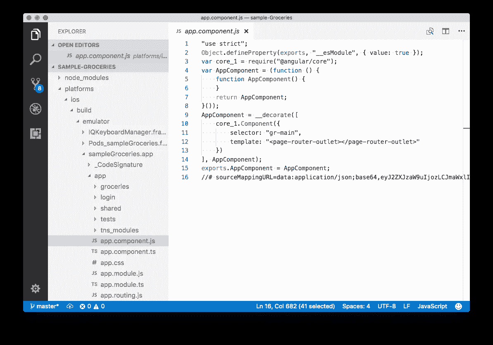**

**An example of the plain text code that gets distributed with your NativeScript applications by default.
This specific code is from a built version of the [NativeScript Groceries sample](https://github.com/nativescript/sample-Groceries).**

**如果你有 web 开发背景，那么这种纯文本部署并不是一个新概念——web 应用程序绝对必须以纯文本形式发布源代码，以便浏览器进行解释。但如果你来自原生开发背景，这是一个新问题，因为原生应用通常只分发编译后的字节码。**

**如果你担心保护你的 NativeScript 应用程序的源代码，你有几个选择。NativeScript 内置了对 UglifyJS 的支持，这是一种压缩 JavaScript 代码的工具。在缩小过程中，丑化替换了变量名并删除了空格，使得你的代码对于普通开发人员来说更难阅读。例如，下面是食品杂货样本的代码经过 UglifyJS 后的样子。**

**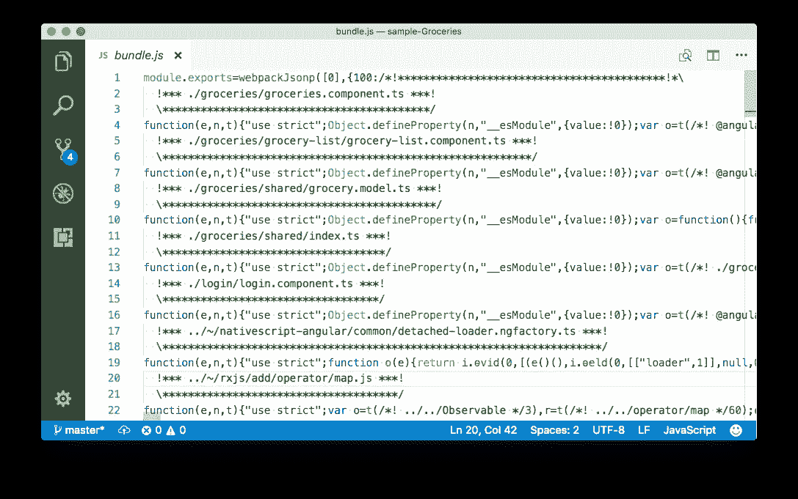**

**The source code of the NativeScript Groceries sample after going through UglifyJS.**

**然而，UglifyJS 的唯一目的是减少你的代码的文件大小，而不是混淆你的代码，这样恶意用户就很难进行逆向工程。例如，如果我从上面拿同样的简化代码，并通过一个在线格式化工具运行它，突然代码变得更可读了。**

**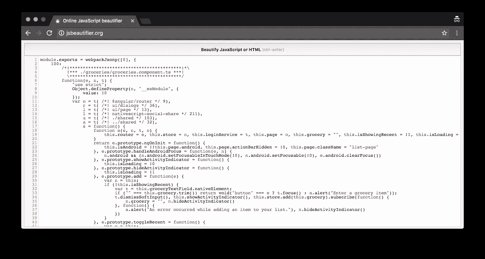**

**The uglified source code of the NativeScript Groceries sample formatted using [jsbeautifier.org](http://jsbeautifier.org/).**

**如果你只是想做一些真正基本的代码隐藏，作为 NativeScript 应用程序部署的一部分，UglifyJS 缩小可能就足够了，但如果你真的想保护你的代码，你需要一个专用于混淆的工具——这就是 Jscrambler 的用武之地。**

# **Jscrambler 如何工作**

**在一个高层次上，Jscrambler 获取您的 JavaScript 代码，并在确保代码继续按预期工作的同时将其破坏得面目全非。为了让您了解这是什么样子，下面是相同的 NativeScript 杂货示例代码通过 Jscrambler 后的样子。**

**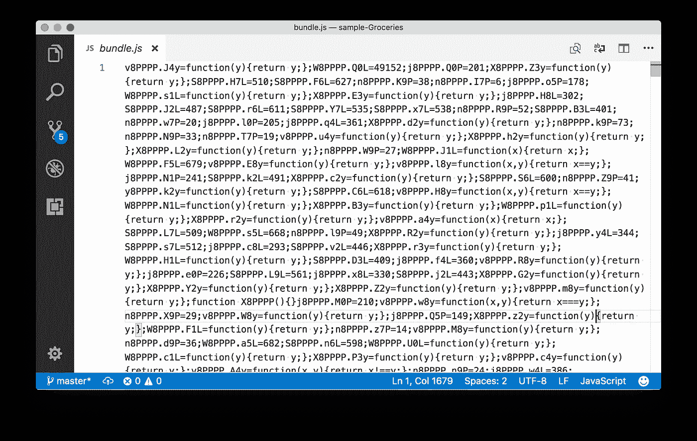**

**The source code of the NativeScript Groceries sample after going through Jscrambler.**

**祝你能搞清楚那里发生了什么。即使您通过美化工具或格式化工具运行这些代码，您仍然需要花费大量时间来破译任何东西。这是同一个文件经过[jsbeautifier.org](http://jsbeautifier.org/)后的样子。**

**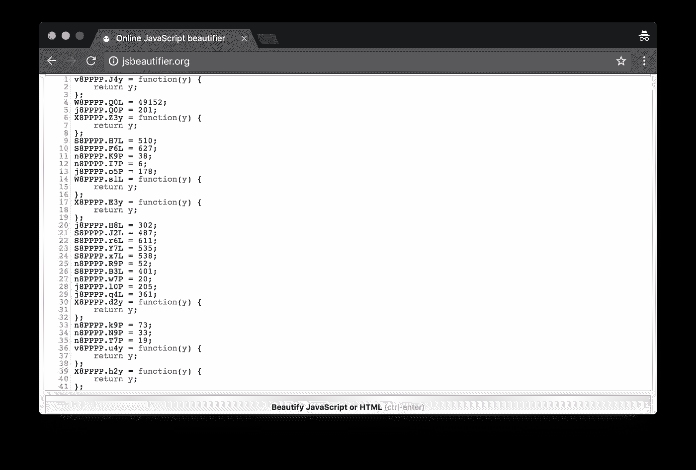**

**The Jscrambler-processed source code of the NativeScript Groceries sample formatted using jsbeautifier.org.**

**正如上面的截图所示，Jscrambler 不仅打乱了你的代码，甚至在经过格式化和更漂亮的工具后仍然不可读。恶意用户将会花很长时间试图理解这些代码在做什么。**

**Jscrambler 提供了[数量的可配置转换](https://docs.jscrambler.com/code-integrity/documentation/transformations)，因此您可以精确地调整该工具如何转换您的代码，但是 Jscrambler 团队为我们提供了一系列针对 NativeScript 开发人员的默认设置。让我们来看看这些设置，看看如何让 Jscrambler 在您的应用程序中工作。**

# **让 Jscrambler 工作**

**首先要注意的是 Jscrambler 是一个[高级工具](https://jscrambler.com/compare-plans/?utm_source=medium.com&utm_medium=referral)，然而，他们确实为任何想尝试 Jscrambler 的人提供免费试用。按照这篇文章中的步骤，你需要使用这个表格在[https://jscrambler.com/](https://jscrambler.com/?utm_source=medium.com&utm_medium=referral)底部注册一个试验。**

**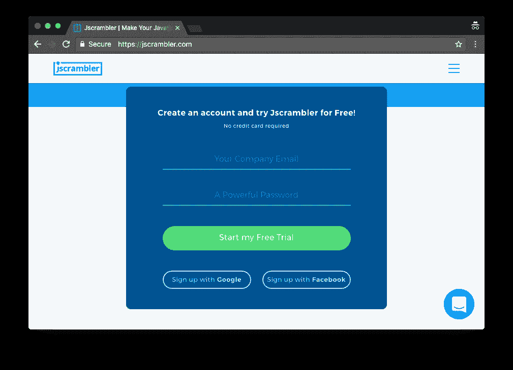**

**创建您的试用帐户后，在您的仪表板上点击绿色的“创建应用程序”按钮。**

**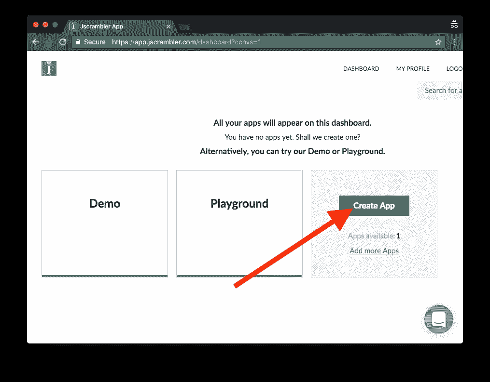**

**为应用程序命名，然后再次单击绿色的“创建应用程序”按钮。**

**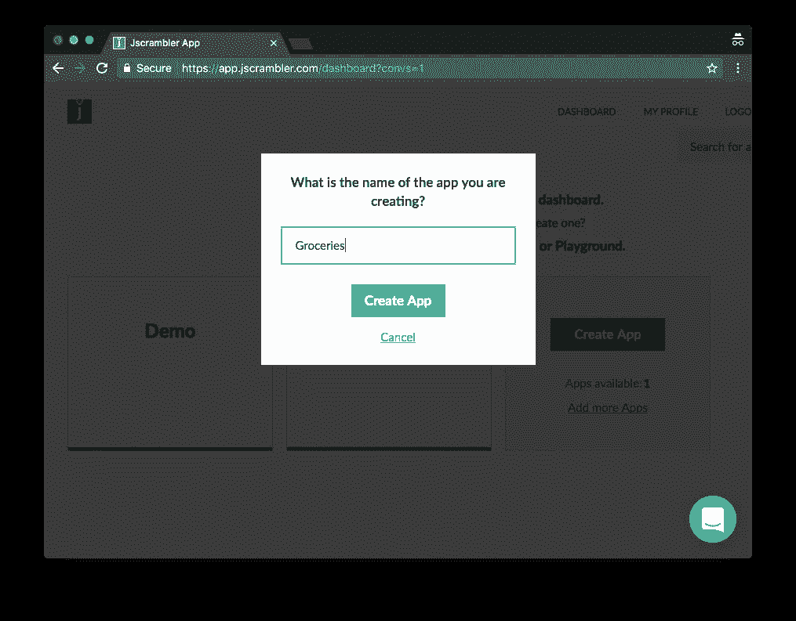**

**在下一个屏幕中，您需要记下您的应用程序的 id(见下图中的红色箭头)，因为您稍后会用到它。**

**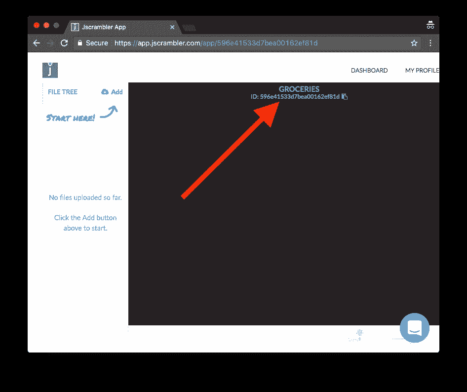**

**现在，您已经完成了必要的 Jscrambler 帐户工作，让我们转到您的 NativeScript 应用程序，看看如何绑定到 Jscrambler 服务。**

# **安装 Jscrambler 插件**

**Jscrambler 的 NativeScript 集成是通过一个 webpack 插件完成的。因此，如果你还没有安装，那么请在你的应用程序中安装 NativeScript webpack 插件。如果一切顺利，安装应该像运行以下两个命令一样简单。**

```
npm install --save-dev nativescript-dev-webpack
```

**然后:**

```
npm install
```

****注意:**如果你在 NativeScript 应用程序中设置 webpack 时遇到问题， [NativeScript 社区论坛](https://discourse.nativescript.org/)是寻求帮助的好地方。**

**一旦安装了 webpack，接下来您需要安装 Jscrambler webpack 插件。**

```
npm i --save-dev jscrambler-webpack-plugin
```

**之后，在应用程序的根目录下创建一个名为 jscrambler.json 的新文件，并粘贴以下代码。**

```
{
  "keys": {
    "accessKey": "YOUR ACCESS KEY HERE",
    "secretKey": "YOUR SECRET KEY HERE"
  },
  "applicationId": "YOUR APPLICATION ID HERE",
  "params": [
    { "name": "whitespaceRemoval" },
    {
      "options": {
        "mode": "SAFEST"
      },
      "name": "identifiersRenaming"
    },
    { "name": "dotToBracketNotation" },
    { "name": "stringConcealing" },
    { "name": "duplicateLiteralsRemoval" },
    { "name": "functionReordering" },
    { "name": "functionOutlining" },
    { "name": "propertyKeysObfuscation" },
    { "name": "propertyKeysReordering" }
  ],
  "areSubscribersOrdered": true,
  "applicationTypes": {
    "webBrowserApp": false,
    "desktopApp": false,
    "serverApp": false,
    "hybridMobileApp": false,
    "javascriptNativeApp": false,
    "html5GameApp": false
  },
  "languageSpecifications": {
    "es5": true,
    "es6": false,
    "es7": false
  },
  "useRecommendedOrder": false,
  "sourceMaps": false
}
```

****注意:**该文件包含在 NativeScript 应用程序中使用 Jscrambler 的推荐设置。请随意查看 Jscrambler 文档，了解关于这些设置的更多细节。**

**您需要用自己的值填充三个占位符值— `YOUR ACCESS KEY HERE`、`YOUR SECRET KEY HERE`和`YOUR APPLICATION ID HERE`。应用程序 ID 是我们之前在 Jscrambler 接口中创建应用程序时注意到的值。**

**一旦你输入了你的应用 id，进入 Jscrambler 网站的“我的帐户”部分，向下滚动找到你的访问密钥和秘密密钥，你将需要复制并粘贴到你的`jscrambler.json`文件中。**

**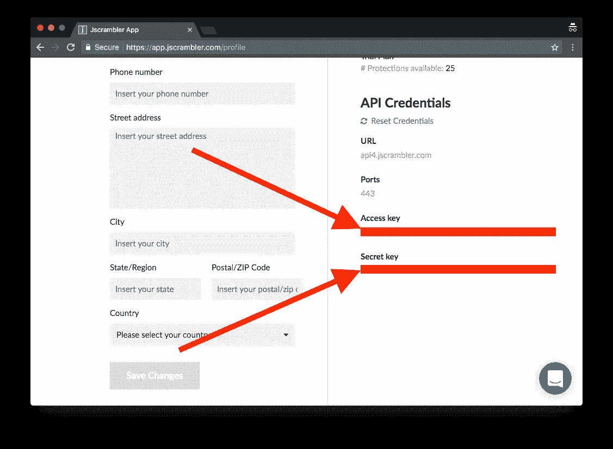**

**配置就绪后，最后一步是在 webpack 配置中添加 Jscrambler 的 webpack 插件。为此，请在应用程序的根目录中打开 webpack.config.js 文件。**

**在这个文件中，首先将这两行代码复制并粘贴到顶部，这将导入插件本身并使其可供使用。**

```
const JscramblerWebpack = require("jscrambler-webpack-plugin");  
const jscramblerConfig = require("./jscrambler.json");
```

**接下来，在同一个`webpack.config.js`文件中向下滚动，直到找到`getPlugins()`函数。要激活 Jscrambler 插件，您需要将以下条目添加到该函数的`plugins`数组中。(我一直在`new BundleAnalyzerPlugin({})`词条后面加我的。)**

```
new JscramblerWebpack(Object.assign({}, jscramblerConfig, {  
    chunks: ["bundle", "vendor"]
})),
```

**至此，您应该可以在您的应用程序中测试这个 Jscramber 了。**

# **打乱你的代码**

**要通过 Jscrambler 运行您的应用程序，您所要做的就是运行 npm 脚本中的一个[来构建启用了 webpack 的 NativeScript 应用程序](https://docs.nativescript.org/best-practices/bundling-with-webpack#npm-scripts)。最容易使用的是 start-ios-bundle 和 start-android-bundle 脚本，它们使用 webpack 构建您的应用程序，并在 ios 或 android 设备上启动它们。**

```
npm run start-ios-bundle
```

**或者**

```
npm run start-android-bundle
```

**构建过程完成后，您必须浏览`platforms`文件夹才能看到混淆的结果。如果你是 iOS 系统，打开你的`platforms/ios/NAME_OF_YOUR_APP_/app`文件夹，如果你是安卓系统，打开你的`platforms/android/src/main/assets/app`文件夹。打开这些文件夹的`bundle.js`和`vendor.js`文件，你应该会发现看起来像这样的代码。**

****

**恶意用户现在将很难弄清楚这段代码做了什么，而你的应用程序应该会继续完全按照预期工作。(如果没有，请告诉我们——我们已经测试了十几个应用程序，没有遇到一个问题。)**

**此外，在我们的测试中，我们还没有检测到任何有意义的性能退化。你的体验可能非常不同，所以一旦你启用了 Jscrambler，就绝对值得对你的应用进行大量测试，但是在我们的实验中，启用 Jscrambler 是一个相当无缝的过程。**

# **包扎**

**Jscrambler 是保护 JavaScript 代码免受恶意用户攻击的强大工具。Jscrambler webpack 插件非常适合 NativeScript webpack 工作流，这使得它成为希望保护其源代码的 NativeScript 开发人员的一个方便的选择。所以试着在你自己的应用程序中完成这篇文章的步骤，看看效果如何。"**

****原载于 2017 年 8 月 17 日** [**NativeScript 博客**](https://www.nativescript.org/blog/protecting-your-source-code-with-jscrambler?utm_source=jscrambler.com&utm_medium=referral) **。****