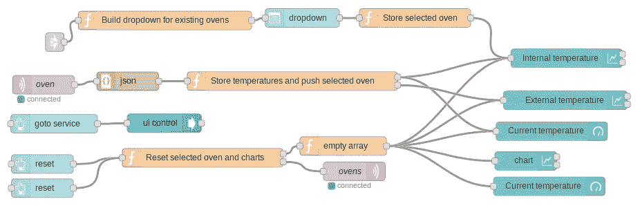
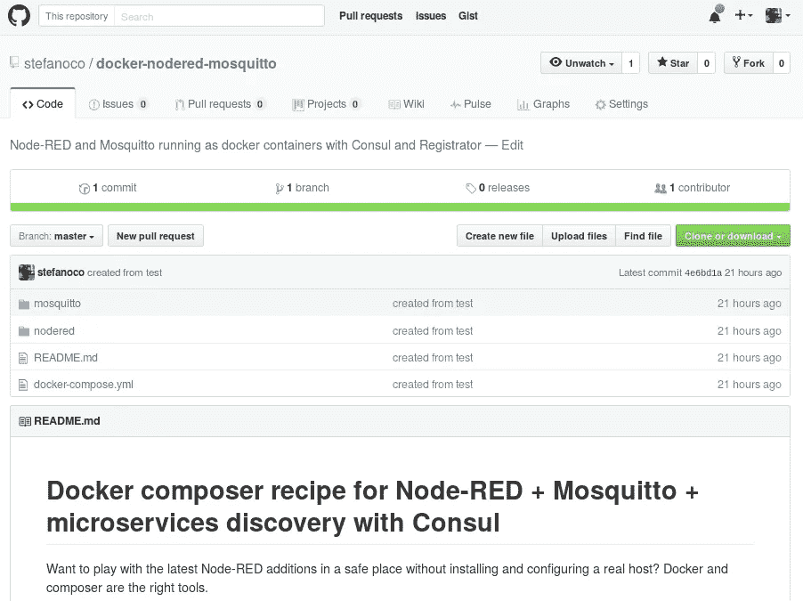

# 用 Node-RED 和 Docker 构建消息传递+ UI 原型

> 原文：<https://medium.com/hackernoon/prototyping-messaging-ui-with-node-red-and-docker-1cc84332c506>

假设你的下一个大挑战是让一些重要的潜在客户感受到来自其产品的大数据将如何转化为现代的、响应迅速的网络用户界面。这是我们许多在嵌入式电子系统设计行业工作的人每天都在发生的事情，在使用几种不同的策略(包括使用 LibreOffice 绘图)进行几次迭代后，我们现在发现 Node-RED 作为一个 [Docker](https://hackernoon.com/tagged/docker) 容器是成功的决定性因素。

Node-RED 作为一个消息+逻辑+ UI 的 Web 解决方案，以优雅的方式解决了许多架构问题，但我同意，基于实际需求、环境、扩展需求和许多其他因素，它可能不是真正产品的最佳解决方案。然而，它在原型阶段有很大的优势，在展示一些惊人的用户故事、模拟场景和制作界面方面没有对手。

# 但是什么是节点红呢？

详细描述 [Node-RED](http://nodered.org/) 超出了本简要说明的范围。它的网站在第一句话就给出了很多: *Node-RED 是一个以新颖有趣的方式将硬件设备、API 和在线服务连接在一起的工具。*我试图将 Node-RED 描述为一个基于 Javascript 和 Node 的客户端/服务器框架。IBM 新兴技术公司和尼克·奥利里发明并维护了 Node-RED 及其生态系统。

> Node-RED 是一个以新颖有趣的方式将硬件设备、API 和在线服务连接在一起的工具(IBM 新兴技术)。

这里的*服务器*指的是运行在提供动态网页的主机上的节点应用程序，而*客户端*是那些显示在浏览器中的页面和包含的用于自动化和渲染的 Javascript 代码的组合。*动态*指的是在浏览器中构建一个完整的图形编辑器的能力，这样开发者就可以通过移动和连接类似乐高的小积木来设计应用程序。每个块充当一个简单的消息转换引擎，通过输入和输出链接到其他块。与主机上现有的真实硬件的连接是一个重要的功能(串行线、USB 端口、文件系统等)，但与消息代理、数据库和基于 URI / API 的挂钩等网络服务的连接是 Node-RED 为原型开发提供最大价值的地方。

Node-RED 转换消息并从信息流中创建输出。输出可以是更多的消息或网页。从这个角度来看，Node-RED 的一个重要部分是用于呈现图表、仪表、图形开关和其他 UI 构建块的库的可用性。简单但有效，可扩展到几乎任何东西，并紧密集成在图形编辑器中。

当构建一个动态网站的原型时，该网站将(当开发一个真实的产品时)显示从位于任何地方并连接到互联网的设备收集的信息视图(听起来是否熟悉*物联网*、*大数据*、*分析*和*预测维护*？)模拟产生数据的设备的一些有趣行为的能力几乎与渲染一样重要。Node-RED 在这方面表现出色，它赋予开发人员在几分钟内更改和添加功能的全部权力，同时保持一致、有吸引力、响应迅速的 Web 视图。

> *物联网*、*大数据* *分析*和*预测维护*听起来耳熟吗？

开发用作演示的原型或获取要包含在报价中的屏幕截图的典型工作流程如下:

*   开始设计一个带有红色节点块的简单 Web 用户界面
*   使用 messages 循环来添加虚假的真实数据，以提供给用户界面
*   (如果真的有用)开始将原型连接到来自硬件或互联网的一些真实数据
*   在与客户讨论时添加更多的用户界面功能

这里要避免的错误是让客户相信，Web 产品的这种表示会神奇地通过类似的努力再次循环而演变成真实的表示。健壮性、弹性、可伸缩性、连续性、安全性、克隆( [DevOps](https://hackernoon.com/tagged/devops) stuff)是非常重要的东西，必须建立在所有面向演示的特性之上，如果这是正确的工具，同样基于 Node-RED。

> 健壮性、弹性、可扩展性、连续性、安全性，克隆是非常严肃的事情。

# 码头和自动化

接下来是 [Docker](http://Docker) as *在主机之间启动和移植一致的自封闭 Node-RED 原型的*方式。同样，这里没有给出细节，所以今天许多开发者使用 Docker 和相关服务，如 docker-compose、Consul 和 Registrator 进行微服务编排。

这个想法是准备一个简单的方法来启动至少一个与一个消息传递代理配对的节点红色服务，以便简单快速地模拟设备之间的消息流动，添加更多的微服务，同时发展到更复杂的情况。所有被封装和自我描述的东西都是一组 Docker 容器，根据 docker-compose 配方启动。简单、可扩展且易于在开发人员主机上扩展。

所以[这里是我提出的解决方案](https://github.com/stefanoco/docker-nodered-mosquitto)，它符合提到的需求，通常基于在谷歌上找到的作品和评论，并记录为 Github 项目。请随意发表评论或公开问题，为食谱做出贡献！

> [黑客中午](http://bit.ly/Hackernoon)是黑客如何开始他们的下午。我们是 [@AMI](http://bit.ly/atAMIatAMI) 家庭的一员。我们现在[接受投稿](http://bit.ly/hackernoonsubmission)并乐意[讨论广告&赞助](mailto:partners@amipublications.com)机会。
> 
> 如果你喜欢这个故事，我们推荐你阅读我们的[最新科技故事](http://bit.ly/hackernoonlatestt)和[趋势科技故事](https://hackernoon.com/trending)。直到下一次，不要把世界的现实想当然！

