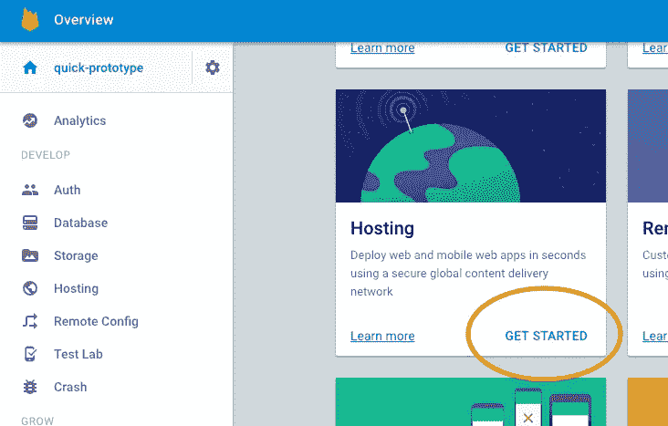
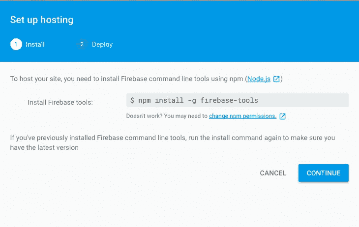
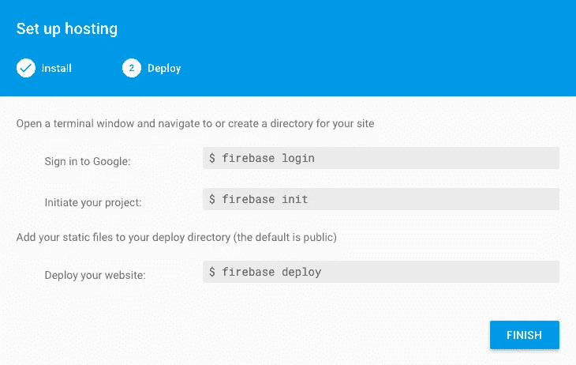
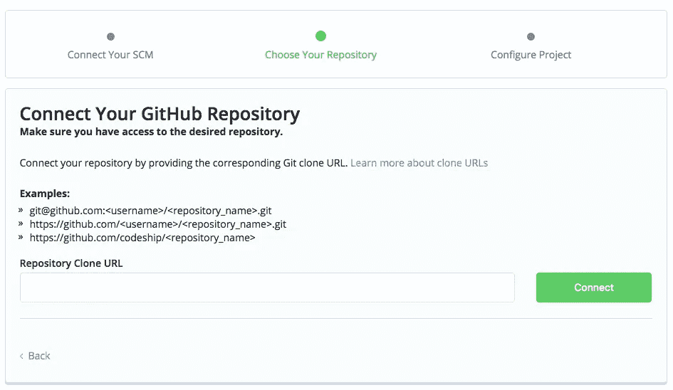
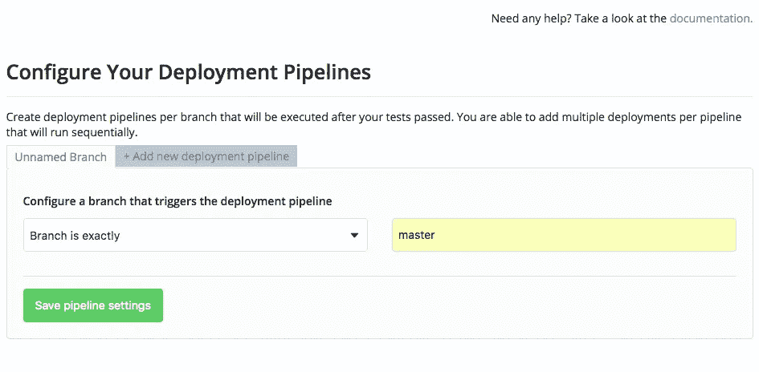
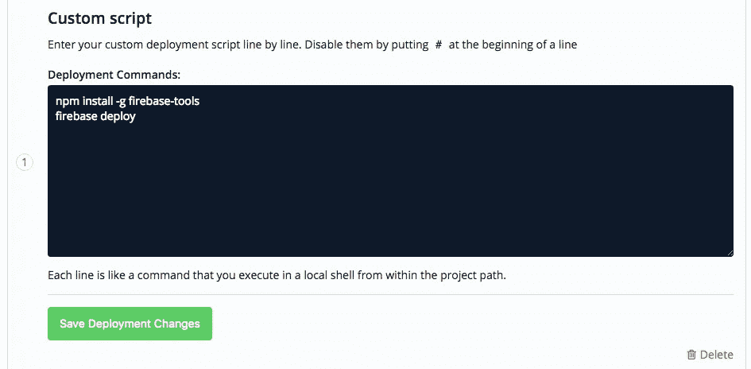
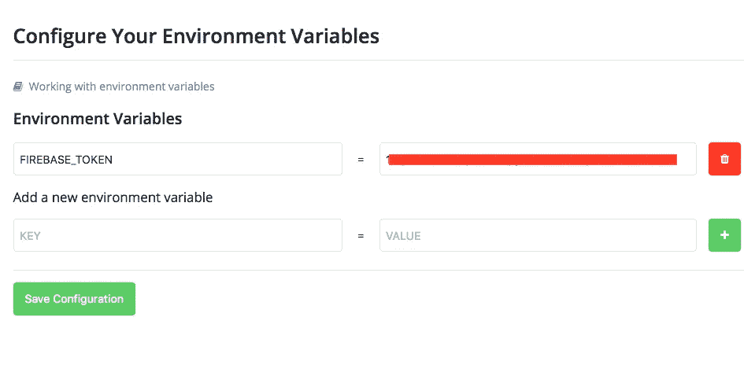
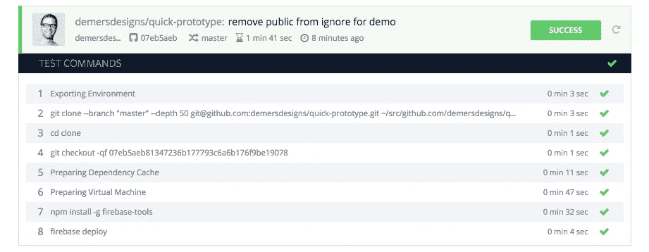

# 使用 Codeship 和 Firebase 构建原型

> 原文：<https://medium.com/hackernoon/prototyping-with-codeship-and-firebase-ddda2257037e>


Photo credit: Luis Llerena via Unsplash

## 有趣的标题。告诉我更多。

这篇文章一开始是一个参考文档，让我在每次需要启动和运行时不用去谷歌。快速原型制作的要点是快速开始，并验证你的想法或方法是可行的。这个过程并不完美，但对我来说效果不错。你可能有另一个适合你的过程。太棒了，我很想听听。

让我们首先把它放在桌子上，那里不缺少好的原型工具。这是我的一位同事对其中一些的精彩评论。很多时候，用[草图](https://www.sketchapp.com/)和[视觉](https://www.invisionapp.com/)构建的可点击原型足以检验你的想法。其他时候，你的目标是在你的互动中更详细一点，需要使用像 [Principle](http://principleformac.com/) 或 [Flinto](https://www.flinto.com/) 这样的工具。然而，当您需要集成来自服务器的数据时，结合 HTML、CSS 和 JavaScript 构建一个原型是有意义的。

在这条路上走了很多次之后，我写了一个名为[基板](http://demersdesigns.github.io/baseplate/)的小型启动项目。它允许我很快地投入进来，几乎不做任何设置，并开始编写原型代码。虽然超级简单和准系统，但底板中的功能允许我启动并运行手头的任务。不管你是发现底板适合你，还是选择提出自己的过程，你都应该有一个过程。

您的过程的一部分不应该涉及到每次进行更改时手动推送代码。这是一种脆弱而危险的工作方式，尤其是当有像 [Codeship](https://www.codeship.com) 和 [Firebase](https://firebase.google.com) 这样的工具可以帮助实现自动化时。计算机擅长做可重复的任务，这些任务需要花费时间来构建令人敬畏的东西。我的同事迈克就这个话题写了一篇很棒的帖子。你应该去看看。我会等的。

本教程的目标是使用 [Codeship](https://codeship.com) 将 Github 库的内容部署到 [Firebase](https://firebase.google.com) 主机上。T4 代码船和 Firebase 都是超级强大的工具，它们的能力远远超过我们在这里所使用的。你应该看看他们能做的其他事情。过程说够了。让我们开始有趣的事情。

## 假设:

1.  你将需要节点和 NPM，如果你还没有的话，你可以[下载并安装](https://nodejs.org/en/)。
2.  您应该创建一个新的 Github 存储库，并将其克隆到本地机器上。
3.  一个[代号](https://codeship.com)的账号。
4.  一个[火基](https://firebase.google.com)账户。

## 让我们开始吧

在您的本地 Github 存储库中，我建议创建一个开发分支。从这里开始，按照以下步骤启动并运行 Firebase。

1.  导航到 [Firebase](https://firebase.google.com) 页面并创建一个 Firebase 帐户
2.  单击“创建新项目”按钮。
3.  在模态中，给你的项目起一个描述性的名字或者一些有意义的东西。



Click the get started link under hosting.

4.在下一个屏幕上，单击主机下的“开始”链接。



Run the command to install firebase-tools (You don’t need to type the $)

5.在新的终端窗口中安装 Firebase 工具。



In a terminal window run firebase login and then run firebase init (You don’t need to type the $)

6.在同一个终端窗口中，通过键入“firebase login”并按照以下步骤登录 Firebase。

7.登录后，在同一个终端窗口中运行“firebase init”来初始化您的项目。

初始化过程将为您提供许多选项，以便创建 firebase.json 文件，该文件将在您部署站点时被引用。

以下是您应该选择的选项:
取消选择数据库选项
使用默认的公共文件夹(这是将被部署到 Firebase 并通过您的公共 URL 可见的文件夹)
如果您打算拥有多个页面，请不要将您的应用程序配置为单页面应用程序。
选择您的新项目作为默认项目

在您新创建的公共文件夹中，您可以构建您的原型，也可以使用 Grunt、Gulp 等构建工具。将完成的文件构建到该目录中。现在，我们可以部署 Firebase 为我们创建的 index.html。

在终端窗口中，运行

```
firebase deploy
```

一旦你这样做了，你的站点将被推送，你将看到你的站点的 URL 以及你的项目仪表板的 URL。在你的浏览器中访问主机 URL，你应该会看到漂亮的默认 Firebase 屏幕！点击会把你带到非常有用的托管文档。

将所有这些更改推送到 Github 库的开发分支。

虽然每次运行 firebase deploy 都有效，但并不理想。让我们看看如何将一些持续部署融入其中。

## 带着代码飞船起飞

1.  导航到 [Codeship](https://codeship.com) 并创建一个帐户。
2.  创建新项目。



Paste the address for your Github repository

3.在下一个屏幕上，将 Codeship 连接到您的 Github 存储库。目标是让 Firebase 在您推送到主分支时自动部署

4.跳过安装命令和测试管道。

5.单击“保存并转到仪表板”按钮。

6.点击右上角的“项目设置”按钮，然后选择“部署”



The deployment pipeline branch should be master

7.在下一个屏幕上，我们希望分支被部署为“主”

8.单击“保存管道设置”,在下一个屏幕上，选择“自定义脚本”作为部署。



Enter in the two Firebase commands to be run on deployment

9.在输入区输入**NPM install-g firebase-tools**安装 firebase 工具，在下一行输入 **firebase deploy** 。单击“创建部署”按钮。

10.为了让 Codeship 能够运行 deploy 命令，您需要从 Firebase 获得一个登录令牌。为此，返回命令行并输入 **firebase login:ci** ，这将生成一个令牌。复制生成的令牌。

11.返回到 Codeship UI，在项目设置下选择环境变量。



Add the environment variable to enable Codeship to deploy to Firebase

12.用 **FIREBASE_TOKEN** 作为键创建一个新变量，并粘贴令牌作为值。保存配置。

13.单击左上角的项目 url 返回主屏幕。

14.现在您已经为 Firebase 令牌创建了一个环境变量，您需要告诉您的部署脚本使用它。因此，再次点击项目设置并选择部署。

15.接下来，单击编辑按钮编辑您的自定义脚本。您需要将 **firebase deploy** 更改为**FIREBASE deploy—only hosting—TOKEN " $ FIREBASE _ TOKEN "**

16.单击保存部署更改按钮。

您已经成功设置了 Codeship 来自动部署您的站点。万岁！

## 现在真正有趣的是

只需再走几步，我们就可以看到我们第一次成功的 Codeship 部署。

1.  在 Github 上导航到您的项目，并从 develop into master 创建一个 pull 请求。一旦你感到满意，确认合并。
2.  返回到 Codeship 窗口，您应该会看到一个新的构建已经启动。如果您单击它，您可以看到进度，它应该随着 firebase deploy 命令的运行而结束。



The result of a successful Codeship build

3.一旦看到构建成功。转到 Firebase 网站的 URL，你应该会看到你的修改。

4.现在，每次你成功地推送 master，它都会自动构建你的 Firebase 站点。

## 从这里去哪里

使用这种方法，或者找到一种方法，允许您拥有一个可重复的系统，让您在设置上花费更少的时间，在构建原型上花费更多的时间。

找到或创建一个框架或样板文件，快速启动并运行。或者，[用我的](http://demersdesigns.github.io/baseplate/)！

发现上述流程中的问题或错误？让我知道！找到更快或更简单的方法？让我知道！

建造令人敬畏的东西…

**感谢阅读！如果您遇到任何问题，请在 Twitter 上与我联系。并且，请与你认为有用的其他人分享。**

[](http://bit.ly/HackernoonFB)[](https://goo.gl/k7XYbx)[](https://goo.gl/4ofytp)

> [黑客中午](http://bit.ly/Hackernoon)是黑客如何开始他们的下午。我们是阿妹家庭的一员。我们现在[接受投稿](http://bit.ly/hackernoonsubmission)并乐意[讨论广告&赞助](mailto:partners@amipublications.com)机会。
> 
> 如果你喜欢这个故事，我们推荐你阅读我们的[最新科技故事](http://bit.ly/hackernoonlatestt)和[趋势科技故事](https://hackernoon.com/trending)。直到下一次，不要把世界的现实想当然！

[](https://goo.gl/Ahtev1)