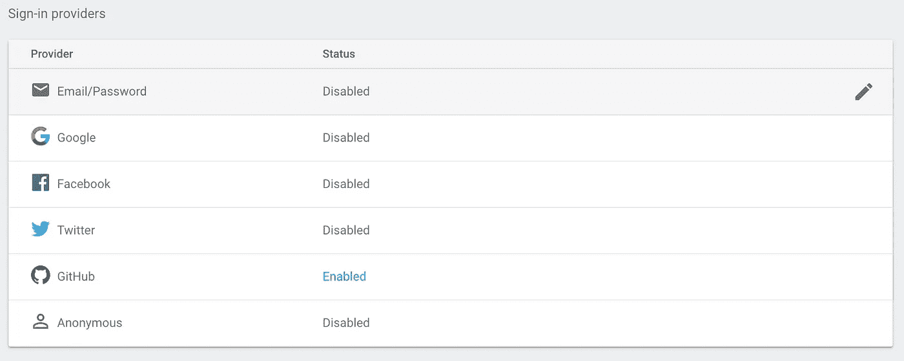

# 用 Firebase 制作原型

> 原文：<https://medium.com/hackernoon/prototyping-with-firebase-5d987c2169ac>

firebase 所做的事情非常出色。他们简化了一个可定制的、分布式的、非关系数据库，前端开发人员可以构建一个可行的[原型](https://hackernoon.com/tagged/prototype)，而无需投资后端资源。这种便利可以节省开发人员宝贵的设置时间，但要注意的是，firebase 的基本实现并不是所有项目的*正确*答案。

*如果*您的项目需要关系数据库和用户连续性，那么您应该使用 SQL 数据库，以避免在不影响用户体验的情况下进行这些更改的成本和尴尬。这里有定制数据结构[的方法，但是掌握这些工具超出了本文的范围。](https://firebase.google.com/docs/database/web/structure-data)

*如果*您需要的只是跟踪用户、基本的聚合信息或单个数据表，那么使用 firebase 是一个很好的选择。OAuth，WebSockets，免费 CDN，免费托管，以及足够大的限制，只有当你有足够多的用户来证明真正的投资是合理的，你才需要付出代价。

当你开始使用 firebase 时，你会注意到[https://www.firebase.com/](https://www.firebase.com/)实际上是一个旧的、不再可行的 firebase 应用程序的网站。鉴于谷歌仍然拥有 firebase，这对我来说是一个难题。如果你在意识到自己走错了地方之前，花时间翻看那些旧文件，你就会理解我的困惑和沮丧。你要保存的链接其实是[https://firebase.google.com/](https://firebase.google.com/)。

在您的项目中启动 firebase 非常简单，只需创建一个 firebase.js 文件，实例化 firebase，然后导出 firebase 数据库的实例以便在您的应用程序中使用。Firebase 为提供者提供了简单而安全的 OAuth 和几个选项。您只需要启用想要使用的登录方法，并按照步骤向该提供商注册您的应用程序。



Sign-In Providers with Firebase

下面是一个代码示例，包括数据库的导出和登录/注销方法。

```
'use strict';
import firebase from 'firebase';const config = {
    apiKey: '##############',
    authDomain: 'turing-fridays.firebaseapp.com',
    databaseURL: '[https://turing-fridays.firebaseio.com'](https://turing-fridays.firebaseio.com'),
    storageBucket: '###########',
    messagingSenderId: '#########'
  };
firebase.initializeApp(config);const auth = firebase.auth();
const provider = new firebase.auth.GithubAuthProvider();export default firebase;
export const signIn = () => auth.signInWithPopup(provider);
export const signOut = () => auth.signOut();
```

在您的应用程序中，您现在可以使用 firebase 并访问用户对象。在一个加载函数中(我使用 react 的 ComponentDidMount)，firebase 将检查用户是否有一个活动的身份验证会话。如果是这样，我可以将该用户对象放在一边供以后使用。如果没有，我可以显示一个登录屏幕。

```
firebase.auth().onAuthStateChanged((newUser) => {
      this.setState({ user: newUser });
    });
```

您还可以在 firebase.js 文件中创建一个数据库引用对象，导出该对象，并可以在应用程序中添加、更新和删除数据库对象。

```
export const reference = firebase.database().ref('messages');
```

稍后在我的应用程序中，我可以使用该参考:

```
let message = { message: title.value };reference.push(message);
reference.update
```

这是使用 firebase 的中央数据存储和 OAuth 创建基本应用程序所需的全部代码。您可以更进一步，让您的应用程序订阅 firebase 数据，这样当服务器上发生更新时，它们就会主动推送给用户。为此，我们可以订阅一个 firebase“值”事件监听器，它在 firebase 中的值发生变化时触发。我也把它放在我的加载函数中，就在解析用户的下面。

```
reference.limitToLast(100).on('value', (snapshot) => {
      const messages = snapshot.val() || {};
      this.setState({
        messages: map(messages, (val, key) => extend(val, { key }))
      });
    });
```

Firebase 解决了 OAuth、访问用户数据、WebSockets 和基本数据库特性等问题，可以加快基本应用程序和原型的开发周期。正如我最初提到的，每个项目都有独特的需求。重要的是选择对你的项目有意义的技术栈，而不是对开发者来说最容易的技术栈。

Firebase 对于概念验证和基本数据库需求来说是一个很好的解决方案，但对于大多数公司来说不是一个长期的解决方案。如果你有一个可行的业务，使用定制后端会更便宜。*如果*你不知道你是否有一个可行的业务，那么 firebase 是一个简单的答案，可以快速将产品推向市场进行测试。

[](http://bit.ly/HackernoonFB)[](https://goo.gl/k7XYbx)[](https://goo.gl/4ofytp)

> [黑客中午](http://bit.ly/Hackernoon)是黑客如何开始他们的下午。我们是 [@AMI](http://bit.ly/atAMIatAMI) 家庭的一员。我们现在[接受投稿](http://bit.ly/hackernoonsubmission)并乐意[讨论广告&赞助](mailto:partners@amipublications.com)机会。
> 
> 如果你喜欢这个故事，我们推荐你阅读我们的[最新科技故事](http://bit.ly/hackernoonlatestt)和[趋势科技故事](https://hackernoon.com/trending)。直到下一次，不要把世界的现实想当然！

