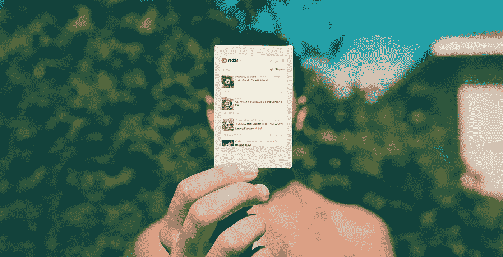
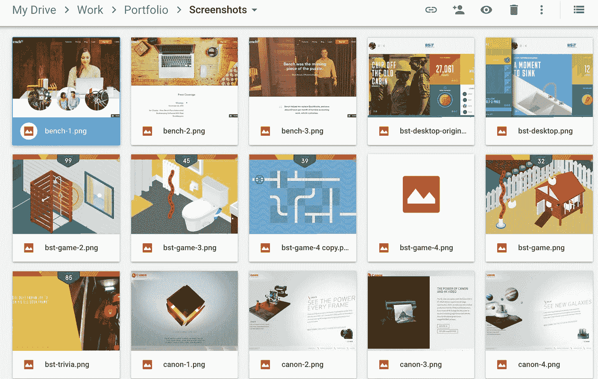
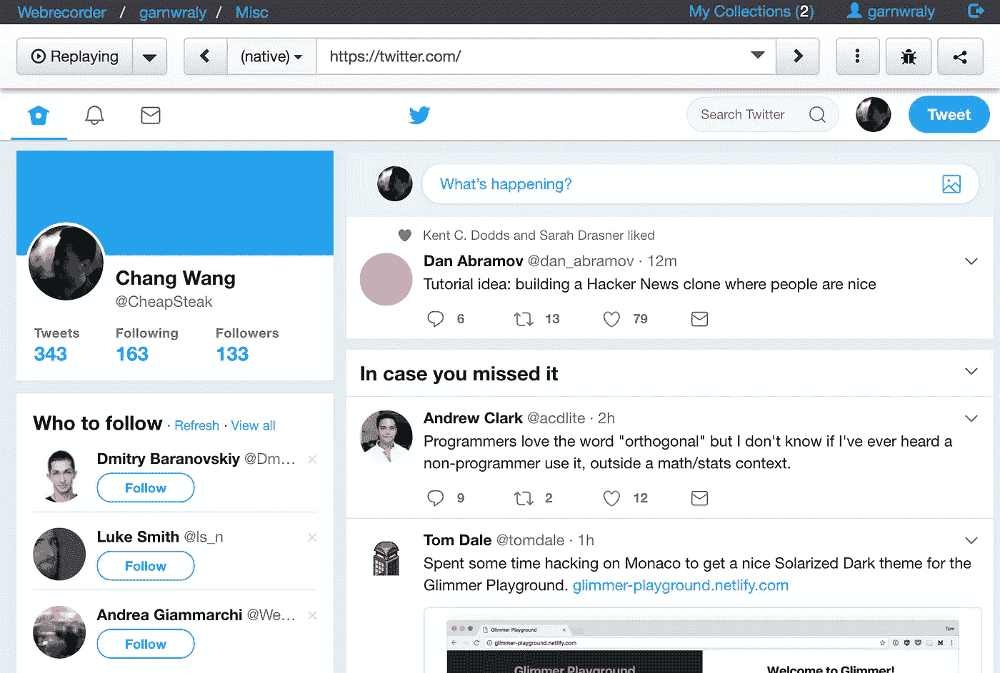
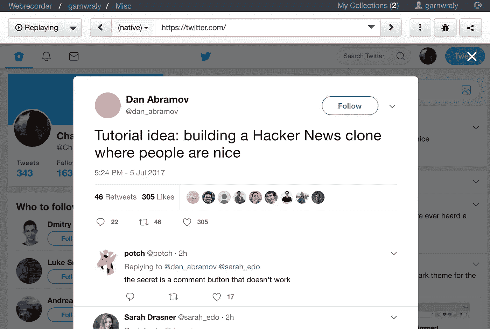

# PSA—快照您的网站📸

> 原文：<https://medium.com/hackernoon/psa-snapshot-your-websites-765ce0cad6cd>

在我开始专业开发网站之前，我的投资组合网站一直是 WIP。其他优先事项总是碍事——付费项目、更有趣的项目、reddit😅

我没有考虑到的一个问题是，在我准备好开始我的投资组合之前，公司不会保留他们的网站。

我工作的机构为脸书事件制作了一个营销网站，这个网站非常值得骄傲，但在那之后的三年里，他们已经彻底改造了这个网站。我工作过的许多其他网站要么被翻新到我只能说是在它们以前的版本上工作过的程度，要么被完全关闭。

# 我开始保存截图

太乏味了。你能抓取所有的页面吗？在什么维度？你也错过了任何互动和动画。当一个潜在客户问你“你在做什么”时，你会怎么做，给他们发送一个截图的 zip 文件，并描述互动部分应该如何工作？

# 你应该做的是——给你的网站拍快照。

互联网档案馆的 [**Wayback Machine**](https://archive.org/) 是一个好的开始，但我最近发现了一个更好的选择——[**web recorder . io**](http://webrecorder.io)**(这是一项免费服务，开源，由非营利组织运营)。它不是屏幕录制服务，而是保存网页及其内容，包括 Ajax 请求。**

**[这是 reddit](https://webrecorder.io/garnwraly/misc/20170706022856/https://www.reddit.com/) 的快照示例**

**但这还不是最酷的部分**

**[这是我的*个人快照* *推特供稿*](https://webrecorder.io/garnwraly/misc/20170706003552/https://twitter.com/) *:***

****

**My personal, logged-in twitter homepage**

**试着点开丹的评论*(编辑:我不是指图中！从* [*点击推文示例快照*](https://webrecorder.io/garnwraly/misc/20170706022856/https://www.reddit.com/) *)***

****

**该窗口被重放的 Ajax 请求填充！写这篇文章时的推文已经有 325 个喜欢，但在这段录音中它将永远停留在 305，即使 Twitter 改变了他们的网站和 API。**

**网站的录音可以作为 warc.gz 文件下载，这是一种开放的标准网络存档格式，可以在线或离线播放。**

**最重要的是，这项服务是 [***开源***](https://github.com/webrecorder/webrecorder) ，可以使用 docker 在本地运行。您可以自托管您自己的实例，永远不用担心它离线！**

**如果你是一名网页开发者或设计师，你应该尽快开始拍摄你的作品。通过这种方式，你可以向你的潜在客户或雇主发送你网站的存档版本的链接，并允许你自己随时回到网站，有选择地为你的作品集截图。**

# **感谢阅读！**

**📬订阅我的时事通讯以便在文章发表前收到草稿。**

**如果你想在数字海洋上建立自己的自托管 webrecorder 实例， [***我有一个无耻的推荐链接给你***](https://m.do.co/c/91557a2689b0) ***！*****

**本文由我的爱好项目资助—[**npmcharts.com**](https://npmcharts.com/)📈**

**这是 [Angular 和 react-router](https://npmcharts.com/compare/react-router,@angular/core) 的互动下载直方图**