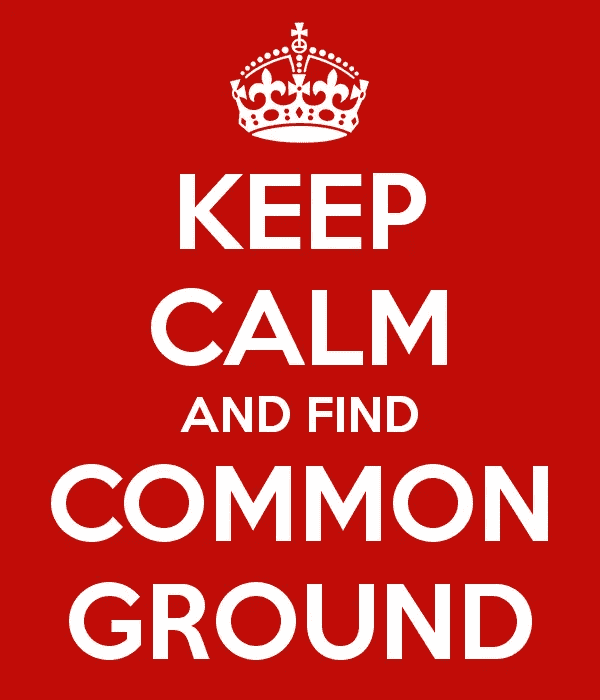

# PSA 对美国人:是时候停止给彼此贴标签，找到一些共同点了

> 原文：<https://medium.com/hackernoon/psa-to-americans-its-time-to-stop-labeling-each-other-and-find-some-common-ground-be558ce6a3c9>

美国人似乎越来越痴迷于给彼此贴标签。我们正在以一种相当二元的方式这样做，每个人要么是自由主义者(又名雪花)，要么是保守主义者(又名可悲)。**切。它。出去。**

我可能*不同意*你的投票，你的政党，你的党派。但是我可能同意你的部分原因。我想和你讨论一下*为什么*，并且这样做不会被诋毁。作为你们的同胞，我想讨论如何走上正确的方向——不管那是什么。

致“自我认同的雪花”:请停止认为半个国家都是种族主义白痴。是的，也许他们中的一些人是，不幸的是他们的声音主导了太多的对话。忽略他们——他们在餐桌上没有座位——和其他人交流。你的许多同胞正在受到伤害，他们应该被倾听。

致“自我认同的可叹者”:请不要再认为半个国家都想夺走你的宗教或枪支，他们是亲恐怖主义的，也不要言论自由，更不要认为任何人都被允许富有，人猫婚姻应该合法化等等。我知道你们很多人都这么想，并且有大量的例子来“证明你的观点”——但是你需要更深入地了解它。你的同胞们根本不想破坏你周围的世界。

各位，我们不会在所有事情上都达成一致。我们不是被设计成那样的。有些力量正在利用人性的这一部分。*他们*才是这里真正的“坏人”。所以我们普通人需要变得比以前更强大。我们需要拥抱我们的共性，对我们的差异保持好奇。我们很容易把所有的时间都花在复制我们自己上，而不是花在街区另一边看世界有点不同的人身上。在我们的讨论中，我们需要让不同的观点变得可以接受，而不是我们试图消灭的东西。事实上，我们如何在日常生活中有意识地寻找另类的声音呢？

现在是自我认同的时候了:

*   我是加拿大出生的美国(双重)公民，住在加利福尼亚。
*   我喜欢看电影(尤其是动作片、喜剧片和所有科幻/漫画/“极客文化”类型的电影)，也读了很多书。
*   我玩桌游，有一台 PS4 和 iPhone，听很多音乐(80 年代！)，每天坐公交上班，享受滑雪，旅游，喝点酒。
*   我在匹兹堡上学，在阿尔伯克基上高中，从事技术工作(已经开始/经营自己的企业，并为一家大公司工作)。
*   我有一辆小货车，我是一个超级冰球迷(加油哈布斯！)，并拥有一套住房(或至少有一笔抵押贷款)。
*   我在当地的食物银行做志愿者，非常喜欢食物(非常喜欢 waaaay)，对咖啡有点自命不凡，尽可能多的和家人在一起。

如果你实际上没有**读完**以上所有内容，请停下来读一读——这很重要。谢了。既然你已经看过了，你应该对我有个像样的印象了。

还有两件事:

*   我投票给希拉里，尽管她有很多缺点。
*   我非常担心特朗普的优先事项错位，他的竞选误导了数百万美国人，让他们认为他会做他不会做的事情。我更乐观地认为，特朗普确实可以给一个存在巨大漏洞的政府带来一些企业式的管理，但迄今为止还没有看到这种情况会发生的迹象。

不管你隶属于什么[政党](https://goo.gl/ejcfUk)，你可能和我有一些共同之处，也有一些不同之处。**这是好事**。

我不会给自己贴上自由派或保守派、民主党或共和党的标签。这些是用来代表积极性和价值的筒仓，但却变成了隐藏和/或攻击他人的筒仓。不会了。把我放在正中间。也许我是个“中间派”也许只是“美国人”也许只是“人类试图做正确的事情。”

对我来说，我已经准备好谈了。我将参与任何建设性的评论，并删除任何对我或其他人的诱惑或敌意。

> [黑客中午](http://bit.ly/Hackernoon)是黑客如何开始他们的下午。我们是 [@AMI](http://bit.ly/atAMIatAMI) 家庭的一员。我们现在[接受投稿](http://bit.ly/hackernoonsubmission)并乐意[讨论广告&赞助](mailto:partners@amipublications.com)机会。
> 
> 如果你喜欢这个故事，我们推荐你阅读我们的[最新科技故事](http://bit.ly/hackernoonlatestt)和[趋势科技故事](https://hackernoon.com/trending)。直到下一次，不要把世界的现实想当然！

