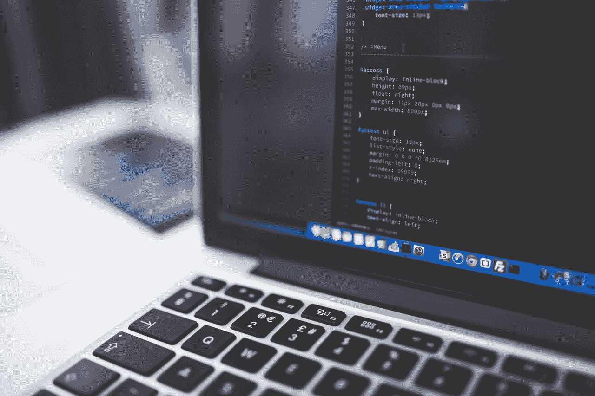

# PSA:升级过时的依赖关系是你能做的最重要的事情之一

> 原文：<https://medium.com/hackernoon/psa-upgrading-out-of-date-dependencies-is-one-of-the-most-important-things-you-can-do-a9e65e28a786>

应用程序、[软件和操作系统收到如此多的更新、补丁和修复是有原因的。是的，它有助于补救突然出现的潜在问题或缺陷——或者一直隐藏在表面之下的问题或缺陷——但它与安全性的关系更大。](https://hackernoon.com/tagged/software)

开发人员和编码人员不可能创造出一个完美无缺、几乎坚不可摧的软件。此外，随着时间的推移和更多更新、功能和内容的发布，它可能会带来新的漏洞和问题，必须加以解决。

事实是，未能发布更新和进一步支持您的代码可能并且将会产生严重的后果，尤其是在涉及到安全性的时候。您不仅将您的公司、可靠性和声誉置于风险之中，还将您的最终用户置于这些危险的最前沿。

例如， [Equifax](https://hackernoon.com/tagged/equifax) 的巨大数据泄露发生在[，原因是一个完全可以避免的简单错误](https://www.wired.com/story/equifax-breach-no-excuse/)。

Equifax 黑客之所以可能，是因为他们所依赖的一个外部库存在巨大的安全漏洞。外部库本身收到了一个补丁来修复这些问题，但 Equifax 从来没有更新他们系统上使用的内部代码。尽管库团队已经公布了这个漏洞，甚至发布了一个安全更新。

但更令人担忧的是，大多数黑客和数据泄露都是因为过时的依赖或类似的用户疏忽而发生的。想想看，这些问题中的大部分都是可以解决的，只需简单地更新软件，或者更具体地说，更新其核心的依赖关系。

不管喜欢与否，现代 web 开发[通常依赖于第三方依赖项和库](https://www.webpagefx.com/blog/web-design/bower/)，它们也必须不时升级。

# 激励是方法

北卡罗来纳州立大学计算机科学研究人员的一项新研究显示，自动修复工具可能是说服更多开发人员修复和升级代码的解决方案。

在审查了 GitHub 上的各种开源项目后，研究人员注意到了自动拉取请求和开发人员支持之间的相关性。他们分析了项目激励更新的各种不同方式，以及它是否对开发人员的工作有直接影响。

两组脱颖而出。

一个项目共有 2，578 个项目。所有这些项目都应用了对 bug 和漏洞报告的自动拉取请求。项目管理员会收到关于代码中过时依赖项急需升级的通知。它还附有潜在解决方案的建议，甚至使用测试功能来检查更新的代码。因此，开发人员不仅可以随时了解他们的项目，还可以获得工具来修复他们的工作，并确保其安全性。

另一个包含没有使用任何种类的激励系统来升级非当前依赖的项目。这一组有 1，273 个项目。

作为一名开发人员，您应该能够正确地猜测哪一组更成功。研究人员发现，拥有自动拉取请求的较大组比没有这一功能的项目多收到 60%的所需升级。

计算机科学团队的助理教授和论文的高级作者克里斯·帕宁透露了一些进一步的见解。

> “[一个]大多数自动化拉式请求项目使用的是最新版本的相关软件，而非集中化的项目[更加分散]。”

本质上，这意味着自动化工具——比如 pull requests——可以帮助开发人员和程序员掌握最新动态。虽然 Parnin 说，“这些工具不能取代优秀的程序员”，但它们确实可以在安全性和开发方面产生“重大影响”。当然，首先部署和利用这些工具“取决于程序员”。

那么，这里的外卖是什么？

作为这些程序和应用程序的开发人员和维护人员，您有责任确保必要的升级发生。但这并不意味着你必须单干。

你可以使用自动化工具和系统来掌控一切，这也是你可以用来提高效率的方法。

*形象由* [*负空格*](https://www.pexels.com/photo/gray-laptop-computer-showing-html-codes-in-shallow-focus-photography-160107/)