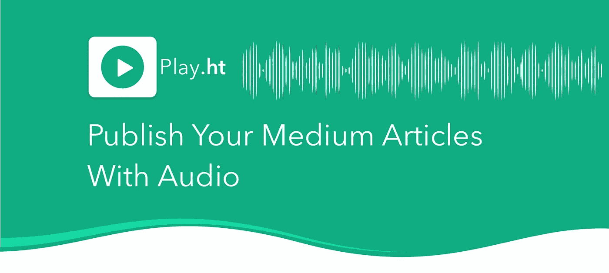
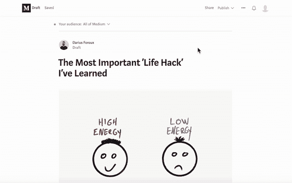
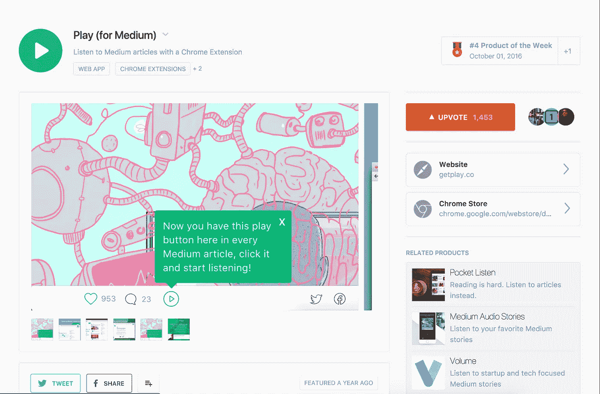
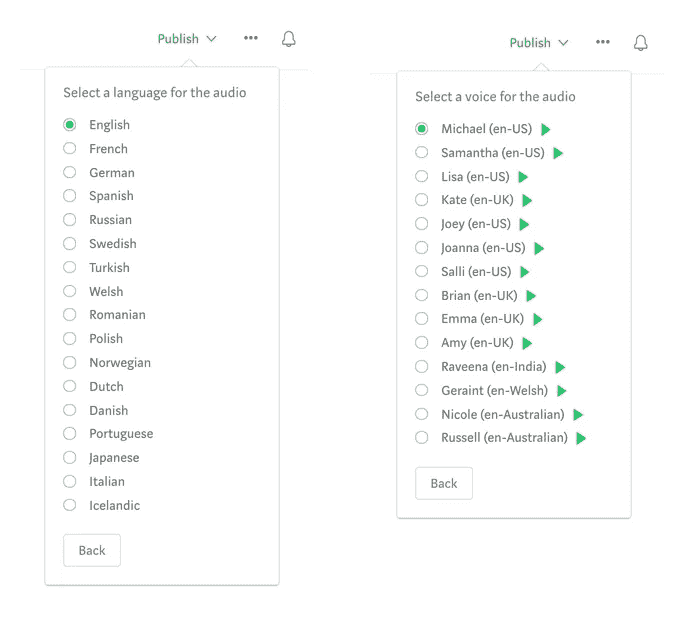
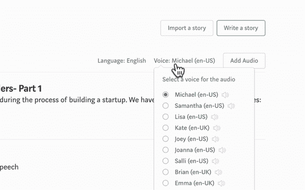
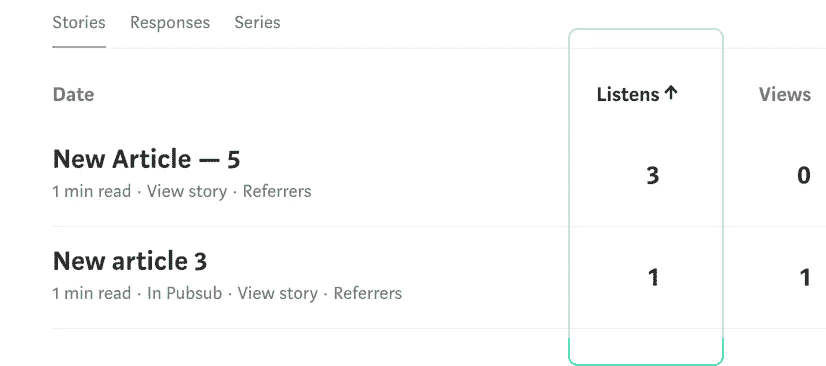

# 发布带音频的媒体文章

> 原文：<https://medium.com/hackernoon/publish-your-medium-articles-with-audio-2d956671296c>

> TL；DR——我们构建了一个 Chrome 扩展，可以立即将您的媒体文章转换为音频，并嵌入到您的文章中。[在这里下载](https://play.ht/extension?utm_source=medium&utm_medium=referral&utm_campaign=hackernoon-publish-your-medium-articles-with-audio&utm_content=tldr)。

Publish any Medium article with Audio!

大约一年前，甚至在 Medium 为他们的文章引入音频之前，我们就开发了一个 [Chrome](https://hackernoon.com/tagged/chrome) 扩展，允许任何人收听 Medium 的任何文章。

当我们推出它的时候，它立刻成为热门产品，成为产品搜索的特色，并成为当时的头号科技产品！播客和[有声读物](https://hackernoon.com/tagged/audiobooks)之间有一个明显的鸿沟，我们已经弥合了，那就是——**人们想要听文章。**

The Chrome Extension featured on Product Hunt with over 1.4K upvotes!

**今天，我们为媒体作者发布了 Chrome 扩展的一个重大更新，该功能使他们可以轻松地创建文章的音频版本。**

你可以在这里下载 Chrome 扩展—[https://play.ht/extension](https://play.ht/extension?utm_source=medium&utm_medium=referral&utm_campaign=hackernoon-publish-your-medium-articles-with-audio&utm_content=middle)

# 它是如何工作的

一旦你下载了 Chrome 扩展，当你要发表文章时，你会看到一个新的选项——**带音频发布**。

单击此按钮将在媒体上发布您的文章，并以所选语言和声音发布文章的音频版本。默认情况下，语言设置为英语。

We designed the experience to be smooth and easy as if the functionality was a part of Medium.

你只需点击它们就可以改变语言或声音。我们支持超过 17 种语言，32 种不同的声音！

Choose from 17 Languages and 30 Voices for your articles

如果你想知道，是的，这是文本到语音转换技术。与灵媒的人类叙事不同，我们使用人工声音。当然，语音爱好者不会喜欢由计算机来讲述，但是文本到语音的技术从第一台会说话的麦金塔电脑到现在已经有了很大的进步，听起来比以前更像人类了。

# 选择多篇文章并转换为音频

在我们构建的特性中，这一个对于那些想要给他们所有的旧文章添加音频的作者和出版物来说非常有用。要做到这一点，只需选择多篇文章，选择一个声音，然后点击“添加音频到文章”按钮。这将为每篇选中的文章添加音频！

Convert multiple articles to audio at the same time!

# 阅读统计数据旁边的收听统计数据

也许最重要的特征是统计数据——看看有多少人听了你的文章。为此，我们在 Medium **Stats** dashboard 中集成了听力统计，您可以在这里看到您的阅读统计。看起来像这样。

Listening stats for each article

# 现在就试试吧！免费下载 Chrome 扩展

我们邀请感兴趣的媒体作者免费下载并试用 chrome 扩展。这里是下载扩展的链接— [下载 CHROME 扩展](https://play.ht/extension?utm_source=medium&utm_medium=referral&utm_campaign=hackernoon-publish-your-medium-articles-with-audio&utm_content=footer)

如果你喜欢这个想法，给我们一些产品搜索的爱，我们今天的特色是: