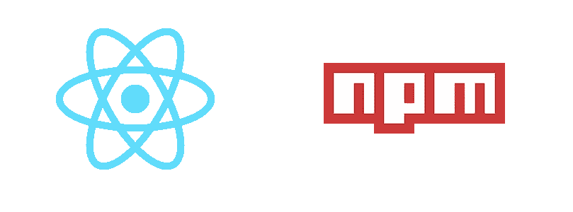

# 发布 Baller React 模块

> 原文：<https://medium.com/hackernoon/publishing-baller-react-modules-2b039d84bce7>

## 用 Rollup 发布现代 React 模块的指南+样板文件



React & NPM living together in harmony.

将一个开源的 React / Preact 组件或库发布到 [npm](https://www.npmjs.com/) 会非常有益，但是开始设置仍然比它应该的更令人生畏，特别是与通过 [create-react-app](https://github.com/facebookincubator/create-react-app) 或 [create-preact-app](https://github.com/just-boris/create-preact-app) 创建 React 应用程序的相对简单的过程相比。

Kylo Ren attempting to publish his first React module…

因为 JS 模块格式和 ES 特性无处不在，而且不太可能在短期内标准化，npm 模块必须支持最低公分母格式(commonjs)和现代 ES6 模块，而不依赖于大多数 React 社区认为理所当然的*普通的*语言特性，如 JSX 和类属性。出于这个原因，很难把你为一个应用程序编写的组件直接发布到 npm。

> 本文的目的是帮助 React 作者轻松发布他们自己的高质量组件模块。

# 目标

有一些现有的 React 库样板文件，但是它们都没有达到我们要达到的目标:

*   在开发过程中支持所有可能的 JS 语言特性
*   将源代码转换为在 npm 上实际使用所需的 commonjs 和 es 模块格式的构建流程
*   将 [Rollup](https://rollupjs.org/) 用于构建过程，将 [Babel](https://babeljs.io/) 用于传输(我们将在本文后面讨论 Rollup vs Webpack)
*   必须附带一个使用 [create-react-app](https://github.com/facebookincubator/create-react-app) 标准的*示例*应用程序
*   允许在库中使用 npm 模块，作为依赖项或对等依赖项
*   支持在你的模块中导入 CSS(注意，如果你使用 css-in-js 方法，CSS 支持将是一个 noop)
*   完整的文档

对于模块作者来说，在模块本身旁边包含一个简单、自包含的示例应用程序尤为重要，因为它有两个有用的用途:

1.  作为开发模块的本地热重装服务器
2.  容易发布到 github 页面，这样用户就可以快速演示你的模块(或者类似的托管选择，如 [surge.sh](http://surge.sh/) 或 [now.sh](https://zeit.co/now)

既然我们的目标已经明确，看看我们将要开始的[样板报告](https://github.com/transitive-bullshit/react-modern-library-boilerplate):

[](https://github.com/transitive-bullshit/react-modern-library-boilerplate) [## 传递-废话/反应-现代-图书馆-样板文件

### react-modern-library-Boilerplate-用 Rollup 发布现代 React 模块的样板文件

github.com](https://github.com/transitive-bullshit/react-modern-library-boilerplate) 

# 游戏攻略

为了使用[样板文件](https://github.com/transitive-bullshit/react-modern-library-boilerplate)，我们建议按照本演练开始。如果这些步骤看起来很复杂，不要担心，因为这意味着非常冗长。

## 入门指南

让我们创建一个名为`react-poop-emoji`的示例 npm 模块，它公开了一个组件`PoopEmoji`💩。我们将假设一个示例 github 用户名为`github-haxor`，其中您的 github 用户名将用于指定`package.json`中的存储库并解析示例 github 页面部署。

Initial setup cloning and replacing boilerplate placeholders

## 地方发展

现在您已经准备好运行 rollup 的本地版本，它将监视您的`src/`组件，并在您做出更改时自动将其重新编译到`dist/`中。

我们还将运行我们的`example/` create-react-app，它链接到您的`react-poop-emoji`模块的本地版本。

Setup for developing your module locally

现在，无论您何时对`src/`中的组件或示例应用程序的`example/src`进行更改，`create-react-app`都会实时重新加载您的本地开发服务器，因此您可以实时迭代您的组件。

Here we have the default exported component that comes with the boilerplate. Feel free to edit it to your liking before moving on while testing your changes in the live create-react-app dev server.

## Git 东西

当您准备好第一次将您的组件推送到 github 时，确保您已经定制了所有的自述文件和元数据，然后正常初始化您的 git repo:

Setup git normally… huzzah!

## NPM 的东西

当您准备好将模块发布到 npm 时，请确保您的依赖项是最新的。您不希望包含在已发布捆绑包中的任何 npm 模块依赖项都应在`package.json`中标记为[对等依赖项](https://nodejs.org/en/blog/npm/peer-dependencies/)，并添加到您的汇总配置中的外部数组。注意，这个样板文件默认将`react`、`react-dom`和`prop-types`设置为对等依赖，这可能是您想要的，除非您真的知道自己在做什么。

## Github 页面

最后，我们建议将您的示例部署到 github 页面，这样您的用户就可以在安装之前快速体验您的库的实时版本。

部署到 github 页面非常简单。我们为展示您的库的示例`create-react-app`创建一个生产构建，然后运行`gh-pages`来部署结果包。这可以通过以下命令完成:

```
npm run deploy
```

注意，为您的`example/package.json`设置正确的`homepage`属性很重要，因为`create-react-app`使用这个值作为解析静态资产 URL 的前缀。

我们建议在您的自述文件中添加一个指向生成的 github 页面示例的链接。

The Dude eloquently describing the engineering [KISS](https://www.wikiwand.com/en/KISS_principle) principle.

# 常见问题解答

## 为什么在 Webpack 上使用 Rollup？

更深入的解释，我推荐阅读 Rich Harris 的文章 [Webpack 和 Rollup:相同但不同](/webpack/webpack-and-rollup-the-same-but-different-a41ad427058c)。简而言之，现在社区的大多数人倾向于对库使用 Rollup，对应用程序使用 Webpack。也就是说，我认为你应该坚持使用你更喜欢的东西，因为只要你喜欢使用其中一个，两者之间就没有太大的区别。

Rollup configs are generally more concise for library development. This config transpiles and bundles the module’s source and external dependencies to CommonJS and ES6 formats.

## 为什么在这个例子中使用 create-react-app？

create-react-app 已经成为几乎每个 react 开发者都熟悉的标准。它的内部设计选择和权衡代表了 React 社区中许多最好的开发人员之间的大量协作。

我们认为，通过利用这样一个标准的应用程序框架，模块作者可以提供尽可能简单的示例应用程序，既可以作为一个成熟的本地开发工具，同时迭代您的模块，也可以作为一个示例展示来轻松发布。

参见本期 CRA [杂志](https://github.com/facebookincubator/create-react-app/issues/737)了解更多关于这一运动的背景。


## 考试在哪里？

我建议您借用 create-react-app 的内置[测试工具设置](https://github.com/facebookincubator/create-react-app/blob/master/packages/react-scripts/template/README.md#running-tests)来测试您的库。也就是说，你可以随意提交一份简历，我很乐意在样板文件中添加一些单独的标准化测试。

## 创建样板文件的目的是什么？一个月后不会过时吗？

这是一个合理的大问题。我想感谢我自己问了这个问题😝

尽管 JS 社区通常发展得太快，对自己不利，但我相信这些类型的时间点最佳实践样板仍然是有用的学习目的，也是有抱负的开源作者和老手们的出发点。我个人感到沮丧的是，在发布了几个开源的 react 模块之后，很难找到一个高质量的、最新的起点，所以我想把我所学到的东西回馈给教会了我这么多的社区。

如果您对如何改进这个样板文件或演练有任何建议，或者如果某个东西从现在起一个月后已经过时，请随时提出问题，或者更好的是，提交一份 PR！

## 如何在我的组件中使用 Typescript？

Rollup 拥有出色的 Typescript 支持。有关如何将 Typescript 与该样板文件集成的详细信息，请参见本[期](https://github.com/transitive-bullshit/react-modern-library-boilerplate/issues/1)。

# 发布的模块是什么样子的？

这里有一个根据本指南创建的 react 模块示例:[react-background-slide show](https://github.com/transitive-bullshit/react-background-slideshow)，React 的一个性感的平铺背景幻灯片。它附带了一个托管在 github 页面上的 create-react-app 示例，应该可以让您很好地了解从这个样板文件开始能够创建的模块类型。


Example boilerplate module [react-background-slideshow](https://github.com/transitive-bullshit/react-background-slideshow) (animations sped up for [demo](https://transitive-bullshit.github.io/react-background-slideshow/))

# 从这里去哪里？

我想对 [js.coach](https://js.coach/react) 大喊一声，这是我最喜欢的寻找高质量、开源 React 组件的资源。如果你正在寻找进一步的灵感或试图找到一个可靠的解决方案，而不是重新发明轮子，机会将会有一些相关的模块列在他们的索引上。

> 如果你觉得这个演练或附带的[样板](https://github.com/transitive-bullshit/react-modern-library-boilerplate)有用，请⭐️ ️️回购，以帮助其他开发人员找到它。

免责声明:作者是脸书的软件工程师，但本文讨论的是一个独立的开源项目，我的观点不代表脸书或其工程人员的整体观点。例如，我写这类东西是为了好玩😃