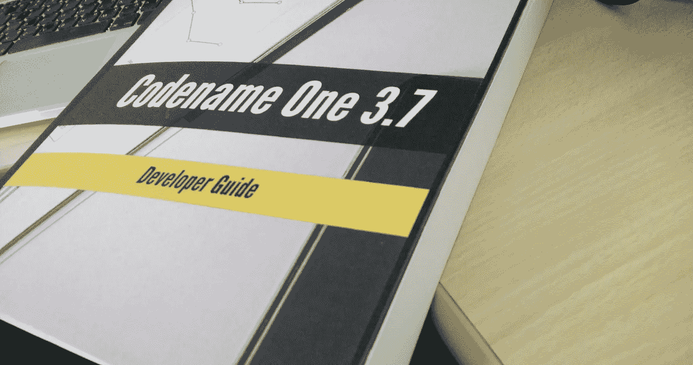

# 在亚马逊上出版我们的 Asciidoc 开发者指南

> 原文：<https://medium.com/hackernoon/publishing-our-asciidoc-developer-guide-as-a-book-on-amazon-9823c54ebf37>

Previous Revision of our Developer guide from Amazon

我认为桌面出版是一个“已解决的问题”,但似乎远非如此。当我为 Sun Microsystems 工作时，我们的技术写作人员会从我们的工作中“神奇地”合成最终文档。当我在其他公司工作时，我们主要写内部文档和使用 Word。然而，随着[代号一](https://www.codenameone.com/)我不得不捡起所有这些，我知道了现实世界中的事情有多糟糕。

在这篇文章中，我想描述我们的工具链，学到的经验教训，以及我们如何将我们的文档作为一个大型的大量记录的开源项目。有很多 asciidoc 教程和资源，这不是其中之一。如果你对 asciidoc 感兴趣，O'Reilly 做了一个关于那个的[很棒的教程。最后，我将根据我使用 asciidoc 的经验给出一些提示，但我写这篇文章主要是为了帮助其他项目决定他们是应该使用 asciidoc 还是坚持他们现有的文档工具链。](http://docs.atlas.oreilly.com/writing_in_asciidoc.html)

# 为什么是 Asciidoc？

最初我用 Open Office 和 Word 工作。作为文本编辑，他们都还可以，我也习惯了和他们一起工作，但当需要做代码高亮或协作工作时，他们就成了一种痛苦。我还发现，你需要知道你在做什么，才能从其中任何一个产生一个好看的文档。没有样式，很容易写得“糟糕”,这使得创建一个合适的统一文档非常困难。

我喜欢编辑的视觉特性，但我并不真的需要它。我最喜欢的功能可能是 Word 中备受诟病的语法检查功能……是的，我知道“这很糟糕”，但我的语法也是如此。

最终的结果看起来很糟糕，而且很难维持。我还想要更多:

*   我想要一个好看的 PDF
*   我想把指南整合到我们的网站上

我们也曾经尝试过使用谷歌文档，但是我们在扩展和协作方面遇到了问题。当社区可以编辑文档时，他们可以打破格式，这使得后续工作非常困难。谷歌文档的输出看起来比 Word 还要糟糕，所以这也不是一个好的选择。

# 输入 JBake

在尝试了多种其他静态站点生成器之后，我们开始为我们的站点使用 [JBake](http://jbake.org/) 。它工作得非常好，我们喜欢为公共元素生成静态站点的想法。JBake 的一个很棒的特性是支持 Asciidoc，在我们回顾了所有其他选项后，这似乎是唯一“合理”的方式来生成一个既可以作为 PDF 又可以作为 HTML 的指南。

除此之外，与文字处理器相比，Asciidoc 还有几个明显的优点:

*   内置源代码突出显示
*   基于文本，因此我们可以自动化工具链的某些部分
*   默认情况下看起来不错
*   可以在 github wiki 页面中使用，并且通常可以被 github 理解
*   由主要出版商使用，如奥赖利

我们也考虑过 markdown，但最终选择了 asciidoc，它似乎更面向桌面出版，而 markdown 更面向网络输出。

asciidoc 最酷的一点是，它实际上是在考虑编码人员的情况下构建的。像“标注”这样的东西，允许你在代码中放置数字，然后在代码完成后详细说明它们，在 asciidoc 中是微不足道的，但在我使用过的几乎所有其他工具中却是痛苦的。

# 我们的流程

因为我们希望一切都可以分解和管理，所以我们将每个片段放在一个单独的 asciidoc 文件中，并将它们托管在我们的 [github wiki](https://github.com/codenameone/CodenameOne/wiki/) 中。这使得几乎任何人都可以编辑文件，也给我们提供了文件更改的历史记录。

然后，我们需要为网站生成 JBake 文件，其中应该包括自定义标题。我创建了一个简单的 shell 脚本，它将文件从 wiki 复制到我们的 JBake web 平台。它有点长，但通常看起来像这样(对每个文件重复):

如果您不熟悉 bash，那么顶部的整个部分只是在将文件转换为静态 HTML 时使用的 JBake 头。

然后，我将输出通过 sed，sed 将 URI 的相对图像转换为 URI 的绝对图像。这里的主要逻辑是，网站中的手册目录不在根目录中，我想将所有的图片存储在一个地方。有了一个绝对的 URL，我可以很容易地将手册移动到不同的位置。然而，wiki 和 PDF 需要相对 URL，因为图像的位置不同。

我还将 asciidoc 提示设置为在显示注释和其他类似元素时使用图标字体，而不是图像。

# 一个文件

当我们开始使用 asciidoc 时，我犯的一个大问题/错误是决定使用一个大文件。脚本的一部分将所有文件连接在一起。更“现代”的方法是使用主文件中的 include 指令，但这在早期会导致一些问题。主要的挑战是以一种既适用于 JBake web 版本又适用于 PDF 打印输出的方式保存链接。这种方法很有效，所以尽管我对它不太满意，我们还是决定暂时坚持使用它。

我们必须使用我们的连接脚本处理的特殊宏，以便在 PDF 和常规网站输出中进行不同的链接:

注意，我在 gist 中使用了 java 扩展，因为如果我使用 asciidoc，gist 将试图呈现输出而不是内容。

我们的串联脚本只是一个简单的小 Java 应用程序，主要是因为对我来说，用 Java 编写代码比其他任何东西都容易。我还需要一些更复杂的东西，而不仅仅是将文件连接在一起，因为我希望在 HTML 输出中有一个目录索引。为此，我需要一些很容易用 Java 实现的逻辑(由于文本文件格式):

请注意，这相对简单，我们只需根据约定找到每个顶层和第二层的头，然后生成 TOC 文件。我们还做了所有的基本工作，如设置开发者指南的日期，这样一切都是 100%自动化的(是的，我知道我可以用 Word 中的一个字段做到这一点等等。).

PDF 的宏是通过切换 PDF only“magic comment”来实现的，以便代码/描述在 PDF 模式下正确运行。

最初我们在做链接的时候用了很多，但是最近我们变懒了，因为特殊的语法有点痛苦。

# 外部链接和浮动图像

当你写一个网站时，你需要尽可能多的链接。由于我们有大量的 JavaDoc，我认为将一个类的每一次提及都超链接到它的 JavaDoc 页面是有意义的。除了 SEO 的好处之外，这对开发者也很有用，他们可以立即找到这个类。

在预处理器中这样做是不可取的。它需要一个更复杂的解析器，我对此不感兴趣。但我做了一个快速的脚本，做了超链接，然后我手动修复了不好的链接。这似乎在最初是有效的，但是有一个有问题的副作用…

当我们生成 PDF 时，每个链接都会生成一个脚注，这在理论上很有意义。然而，在一个关于[按钮](https://www.codenameone.com/javadoc/com/codename1/ui/Button.html)的页面中，我可能会提到它 20 次，这将触发 20 个具有相同 URL 的脚注！

不幸的是，我[找不到那个](https://stackoverflow.com/questions/34992879/how-do-i-merge-or-even-disable-footnote-links-in-asciidoc-fop)的解决方案，所以我不得不检查我们的链接，试图减少数量。这就像

另一个讨厌的是形象行为。你可以很容易地[在 HTML 输出中向右浮动图像，但在 PDF 输出中却不行](https://stackoverflow.com/questions/34975971/is-it-possible-to-wrap-text-around-an-image-using-asciidoc-fopub)。这可能是我遇到的最烦人的格式问题。在某些情况下，我可能会用一些有创意的表结构来解决它，但这似乎是一件微不足道的事情…

# 工具链问题

asciidoc 最大的问题之一是它无处不在。有一些工具链和一些工作，而其他产生“奇怪”的输出或失败没有真正的原因。我们最近尝试直接从我们的手动 asciidoc 生成一个 epub 文件。似乎这在内部将文档翻译成了格式错误的 docbook，然后验证失败。我猜这与我们的 asciidoc 代码有关，但不可能知道为什么，因为这种格式没有经过验证。

我只能用 asciidoctor 来处理 HTML 和 fo-pub 工具链。当翻阅文档时，其他所有东西都会产生伪像。也许在这个过程中会打印出警告，但是当查看数百页的输出时，很难注意到警告。我不确定像“lint”这样的工具是否适用于像 asciidoc 这样的东西，因为它的格式太松散了。

这没什么大不了的，asciidoctor 的 docbook 输出看起来工作得很好，我能够在事后使用像 [pandoc](http://pandoc.org) 这样的工具生成 epub 文档之类的东西。这非常好，因为如果您需要发送输出，您可以相对容易地将输出转换为 word 之类的东西，并且输出看起来很好。

偶尔我不得不在 fo-pub 中修改各种东西，让文档看起来更好看。例如，我想为我用 [Spark](https://spark.adobe.com/) 生成的书做一个好看的封面图片。因此，为了让这个图像“覆盖”PDF，我必须更改 asciidor-fopub/build/fopub/DocBook/fo/division . xsl，并为封面图像添加条目:

我做了很多类似的编辑来定制字体大小、边距等。

对于印刷版本，我必须删除这段代码，因为亚马逊有自己的封面，不接受“出血”的图像(出血是指图像故意离开印刷空间)。

# 编辑

我通常使用 NetBeans，它有一些初始的 asciidoc 支持，但现在还没有。

所以我用 Atom 做文档。它的可用性令人惊讶，尽管它需要频繁重启，因为像这样的大型项目会超过 CPU。我遇到的一个问题是像[这个](https://github.com/atom/language-java/issues/88)这样的奇怪问题。因此，如果你有一个基于 Java 的“尝试使用资源”,你需要在末尾添加一个分号，否则语法高亮块永远不会结束，使编辑变得“奇怪”。它确实有一些很好的扩展，比如“写得好”,这对我过于冗长的写作风格很有帮助。

# 出版

PDF 通常适合出版，但当我们进入 kindle print 阶段时，我们遇到了默认拉伸小图像的问题。这意味着图像的 DPI 对于印刷来说太低，亚马逊不会接受这一点。不幸的是，他们并不总是列出所有有问题的图像，所以我不得不上传一个 PDF 等待处理，打开预览，修复然后冲洗/重复。

解决方案是在所有图像上添加“scaledwidth=30%”或类似的东西，这样它们在文档的打印版本中就不会放大。

最初，当我们发布 kindle reader 版本的文档时，我犯了一个错误，使用了 Kindle Text book Publisher，而没有生成 epub 文件。这意味着我不能回去出版 epub 而不出版这本书！

这是一个遗憾，因为这意味着这本书不能在亚马逊的标准电子墨水设备上观看，只能在 kindle fire 风格的设备上观看。回想起来，我在上传第一本书的时候应该更加小心。

作为开发人员，我们倾向于做的一件常见的事情是使用 A4 或 letter 尺寸。这就产生了一本有点“大”的书。回想起来，我可能会选择一个更小的输出形式，并可能会在下一本书中这样做。电流输出有点大。我担心这会增加已经很大的页面大小…

现在这本书有 600 多页，但是当我开始的时候，它接近 1000 页。似乎亚马逊的页面限制在 890 页左右。因为我不得不缩小图片，缩小字体大小，页面数量明显减少。

我考虑过彩色印刷，但那会使书的成本达到 50 美元或更高，我认为这对开源书来说是不公平的。在这种情况下，大多数图像并不真正需要颜色。我拿到的这本书没有颜色，这没什么，但我认为与其他书相比，文字有点褪色。我不认为这是一个交易破坏者，我不确定其他人会像我一样注意到它。

我用亚马逊向导来生成看起来不错的封面。我使用现成的封面图像，并将其与生成的封面混合。第一本书的一个警告是，背面看起来很大。因为这本书是 A4 大小，所以印刷的文字看起来很大。我建议在发布之前，在您的本地打印机上打印此内容，以获得尺寸感。

当我从亚马逊拿回实体书时，我注意到的第一件事是，它“突然”结束了。我已经习惯了以索引结尾的书，而我们的书却没有索引。我们只是没有在 asciidoc 代码中包含条目的索引标记。目录在 asciidoc 中做起来确实很简单，但是索引需要一些工作，我仍然不明白为什么或者是否有一个更好的替代方法来处理那些带有索引条目的文档。对于一本书来说，它的 PDF 版本是免费的(人们可以在那里使用搜索而不是索引),但这并不理想。

总的来说，亚马逊上的自助出版是相当琐碎的。这些工具将引导您完成大部分步骤，您只需要在早期做出正确的决策，因为有些事情在事后是无法改变的(很容易或根本无法改变):

*   为 kindle 版本使用 epub 或其他动态格式
*   为印刷书籍选择合适的外形。我不会用 A4 纸或信纸，因为它们太大了
*   为一些痛苦做好准备，有很多发布工具的来回，因为它们在亚马逊服务器上失败了

# 最后的想法

我会在下一个项目中使用 asciidoc。它有缺点，但对于编码人员来说，它几乎是一个文档编写工具。所以即使有这些问题，我也会在下一本书里继续写下去。

我认为这是一个强大的工具，允许编码人员自动化，并与 git 和 CI 等熟悉的工具协作。我认为我们的流程可能还可以改进很多，但目前它是有效的。

如果你想看看我们的 asciidoc 代码和我在这里写的所有东西的最终结果，请查看这些链接:

*   我们的 asciidoc 文件在维基中，注意你可以点击编辑并修改我们的手册(请注意)——[https://github.com/codenameone/CodenameOne/wiki](https://github.com/codenameone/CodenameOne/wiki)
*   这里可以看到 JBake+Asciidoc 生成的 HTML 版开发者指南:【https://www.codenameone.com/manual/
*   你可以在这里看到 PDF 输出:【https://www.codenameone.com/files/developer-guide.pdf
*   kindle 和纸质书在这里:[https://www.amazon.com/dp/1549910035](https://www.amazon.com/dp/1549910035)
*   我写的博客文章鼓励 docs 上的社区协作[https://www . codename one . com/blog/tip-edit-docs-fun-profit . html](https://www.codenameone.com/blog/tip-edit-docs-fun-profit.html)