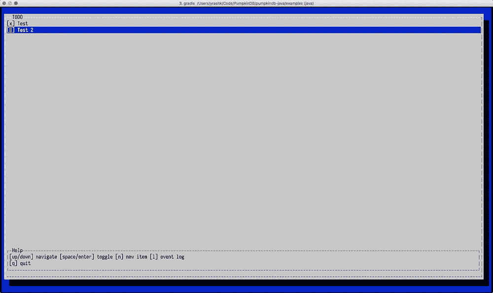

# PumpkinDB:接下来呢？

> 原文：<https://medium.com/hackernoon/pumpkindb-whats-next-cd530fae8f87>

Image courtesy of [Julia Raasch](https://unsplash.com/@julesrsh)

就在最近，我们[发布了 PumpkinDB 0.2](https://github.com/PumpkinDB/PumpkinDB/releases/tag/v0.2.0) ，这是对我们第一次发布的一个很好的改进，吸引了相当多的关注者，尽管只是一个很小的声明(见鬼，只是一个很小的网站链接，我们没有其他材料！).随着这个版本的发布，我们希望吸引下一波早期采用者和贡献者来帮助我们解决项目的下一个挑战。

> PumpkinDB 本质上是一个数据库[编程](https://hackernoon.com/tagged/programming)环境，很大程度上受到了[腮腺炎](https://en.wikipedia.org/wiki/MUMPS)背后核心思想的启发。它没有使用 M，而是使用了受 Forth 启发的基于堆栈的语言 PumpkinScript。它没有分层键，而是有一个平面键名称空间，一旦设置了值，就不允许覆盖它们。不变性的核心动机是，随着存储成本的下降，擦除数据实际上是一个战略错误。
> 
> 虽然不是为通用编程而设计的，但它的主要目标是促进构建专用的特定于应用程序的通用数据库，特别关注不变性，并尽可能靠近存储处理数据，尽可能减少通信损失。

在这个版本中，最显著的外部变化是将 PumpkinDB 分成多个板条箱。为什么这很重要？最大的好处是，现在人们可以:

*a)* 将 PumpkinDB 嵌入到他们的 Rust(也许很快，C)应用程序*和*
*b)* 构建他们自己的定制的 PumpkinDB 兼容服务器，非常容易地添加或减少功能。

毕竟，PumpkinDB 首先是一个数据库引擎，这个变化实际上允许我们在它的基础上进行构建。作为一个例子(我希望有足够的能力在相对短的时间内完成这件事)，这个功能将被用来构建一个 [es4j](https://eventsourcing.com/es4j/) 的继任者——一个[惰性事件源](https://blog.eventsourcing.com/why-use-eventsourcing-database-6b5e2ac61848)引擎，它既可以被嵌入(可行的话)也可以被远程访问。

这个版本中 Dispatcher API 的引入使我们能够将标准的库功能分成可管理的模块。非常重要的是，它允许对引擎平滑地添加、重新配置和删除 API，因此可以轻松地构建上述定制引擎。

在开发这个版本时，我冒险开始使用 [SPDK](http://www.spdk.io/) —一个非常好的库，它允许绕过内核与 NVMe 固态硬盘通信，从而实现与控制器的最有效通信，零拷贝读写和最有效地使用底层磁盘，以减少写放大并消除操作和文件系统引入的变量。现在[还为时尚早](https://github.com/PumpkinDB/rust-spdk)，但我们的想法是，我们可以开始抽象出我们的底层存储层(我们目前有 [lmdb](https://symas.com/lightning-memory-mapped-database/) 硬编码)，以便我们可以用其他引擎替换它，以适应不同的用例。一方面，这将允许贡献者添加其他现有的引擎。另一方面，这将是开发原始 SSD 存储引擎的一个途径，以便从这种类型的硬件中获得最大的好处。那里有很多问题需要解决。它将只是一个为扇区可寻址固态硬盘优化的 B+树，还是我们也能增加对字节可寻址设备的支持？它是建立在硬编码的假设之上，还是能够随着时间的推移从使用模式中学习并推断出最佳的存储技术？天空是极限(*但是，当然，我们真正的极限是我们能吸引多少有才华的人来为此做出贡献*

我们知道缺乏例子是试图理解 PumpkinDB 的人最严重的障碍之一，但是不容易做到。为了解决这个问题，我们用 Java 发布了一个示例应用程序的第一个草案，它使用远程 PumpkinDB 服务器来管理待办事项列表。虽然它仍然有一点问题(在切换到 Rust 之后，我们的 Java 技能肯定萎缩了),并且需要进行重大的重构，但这是一个起点。

Todo List Example

在我最近发表的[去除模糊的抽象](https://blog.eventsourcing.com/removing-obscuring-abstractions-392e74284e47)文章中简要解释了它的架构。希望它能澄清一些细节(额外提示:那篇文章中的 PumpkinScript 说明指向文档！)

我们梦寐以求的另一个重大变化是口译员的重新培训。现在，它非常简单。它甚至从不将代码转换成任何类型的 AST，而是选择完全动态的解释方法。虽然这对于小的、I/O 受限的程序来说工作得比较好，但是这些程序变得越复杂，我们就越能看到解释器相当慢(尽管它在 [Ackermann 函数](https://github.com/PumpkinDB/PumpkinDB/blob/master/pumpkindb_engine/src/script/mod.rs#L583-L601)上比 LuaJIT 好得多，我仍然不知道为什么)。

因此，这里的想法是找到一种方法来将 PumpkinScript 编译成更高级别的 VM 类型的程序集，同时记住我们的一些独特属性和挑战，例如:事务数据生命周期的粒度管理、临时资源管理([这个 bug](https://github.com/PumpkinDB/PumpkinDB/issues/160) 正在乞求它)、堆栈抽象、拆分堆和数据库数据指针(这将帮助我们进行零拷贝读取)、固定堆内存分配(用于基于 SPDK 的存储)等等。

这个想法不仅仅是提高性能或内存管理。这也有助于将其他语言添加到堆栈中。尽管已经有可能为 PumpkinScript 编写一个 transpiler，但删除这一步骤并允许直接编译到 VM，并能够重用所有这些功能模块，肯定会使它变得更加简单。

最后，但同样重要的是，我们需要你的反馈、批评和(耶！)投稿。虽然 PumpkinDB 肯定不适合所有人，但如果你喜欢一些有点古怪的东西，一些在试图窥视[未来](https://hackernoon.com/tagged/future)时从过去汲取的东西，一些挑战一些假设并且暂时不必保持向后兼容性的东西，*(好了，够了！那么你可能会喜欢上它。*

加入我们的 [Gitter chat](https://gitter.im/PumpkinDB/Lobby) 或简单浏览列表[“首发问题”](https://github.com/PumpkinDB/PumpkinDB/issues?q=is%3Aissue+is%3Aopen+label%3AWhatCanIStartWith%3F)——无论哪种方式，欢迎并希望您能享受您的旅程！

> [黑客中午](http://bit.ly/Hackernoon)是黑客如何开始他们的下午。我们是 [@AMI](http://bit.ly/atAMIatAMI) 家庭的一员。我们现在[接受投稿](http://bit.ly/hackernoonsubmission)，并乐意[讨论广告&赞助](mailto:partners@amipublications.com)机会。
> 
> 如果你喜欢这个故事，我们推荐你阅读我们的[最新科技故事](http://bit.ly/hackernoonlatestt)和[趋势科技故事](https://hackernoon.com/trending)。直到下一次，不要把世界的现实想当然！

