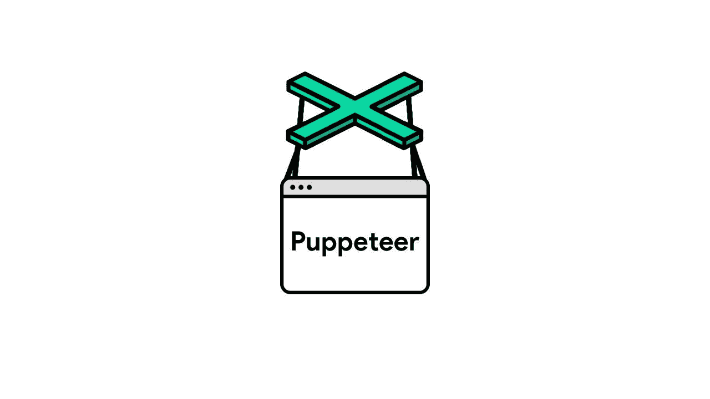
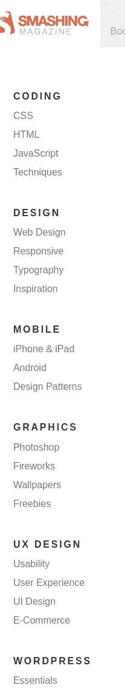
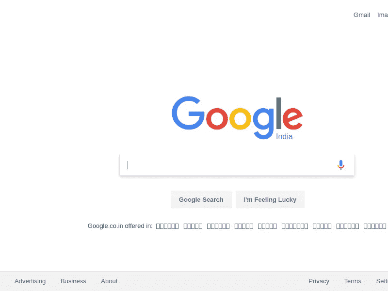
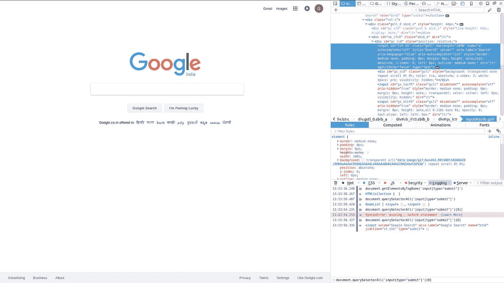
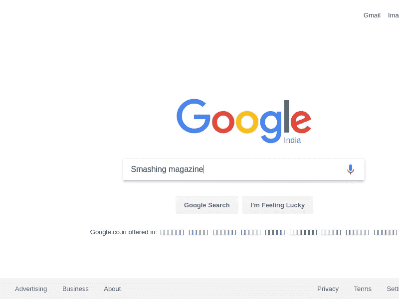
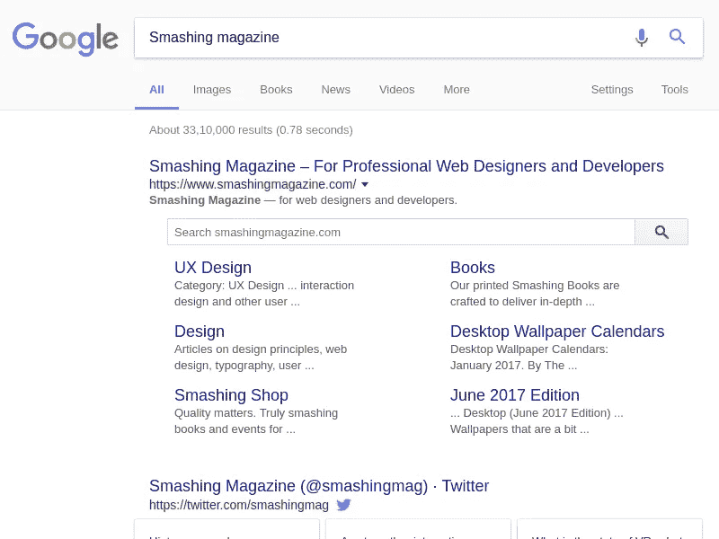
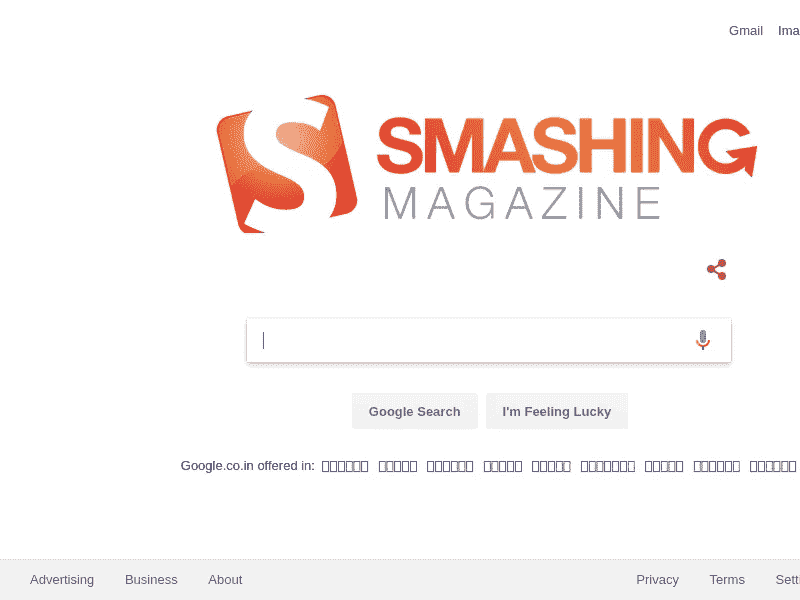
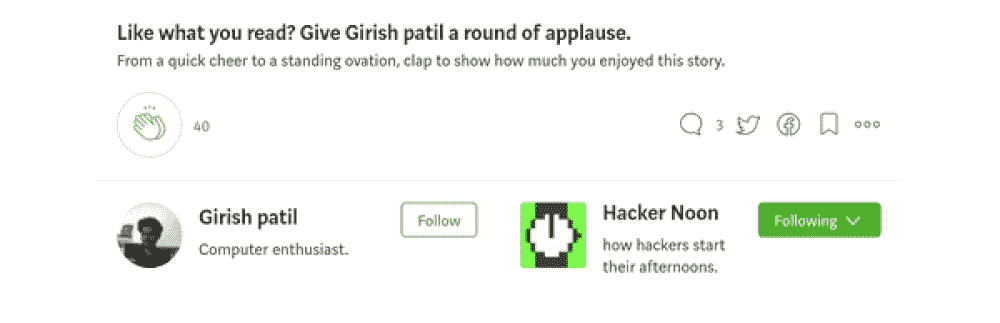

# 进入木偶师:注射|互动|按键|捕捉|选择

> 原文：<https://medium.com/hackernoon/puppeteer-on-fire-inject-interact-keys-capture-select-1cd903d37287>



在本文的最后，我们将学习如何

1.  将自定义 Javascript 函数注入到另一个页面的上下文中。
2.  与表单交互以实现自动化。
3.  从页面中捕获特定元素的屏幕截图
4.  使用键盘/鼠标事件来键入/单击选定的元素。
5.  截图
6.  从 DOM 中选择元素。
7.  访问 cookies

# 介绍

无头浏览器确实在浏览器自动化和测试领域做出了一些很好的贡献。其中大多数用于单元/端到端测试，而很少用于浏览器自动化。不可见浏览器或技术上称为无头浏览器是那些具有普通浏览器的所有功能/特征，但通常通过命令行/代码执行的浏览器。主要用于测试，但也可以用于网页抓取，截图捕捉，注入脚本，以自动化网站上的交互。

在这篇文章中，我们将通过谷歌开发工具团队新推出的谷歌 chrome 节点 api 木偶。除了 puppet er，最近还发布了其他一些产品，包括 Chromeless、Chrominator、Chromy、Navalia、Lambdium、nightmare js(类似于 puppet er，但在幕后使用电子，而 puppet er 仅基于 chromium)以及提供可靠的跨浏览器 api 进行测试的优秀旧 phantomjs。

# 关于木偶师

“Puppeteer 是一个节点库，它提供高级 API 来通过 [devtools 协议](https://github.com/ChromeDevTools/devtools-protocol)控制无头 Chrome。它也可以被配置成使用完整的(或非 headless) Chrome”这是谷歌开发团队所说的。

木偶师可以用来

*   自动化视觉测试。
*   在不打开浏览器的情况下生成网站的图像/pdf 截图。
*   表单提交/浏览器使用模拟
*   抓取网站
*   或者捕捉时间线

还有很多。

让我们从木偶师的基本用法开始。

你也可以在新的木偶游乐场[https://try-puppeteer.appspot.com/](https://try-puppeteer.appspot.com/)试一试

安装木偶师一点也不复杂，我将带您快速安装，

在 Ubuntu 机器上

`sudo apt-get update`

正在从节点源安装节点 v8.4.0。在[https://github.com/nodesource/distributions](https://github.com/nodesource/distributions)找到你的

```
# This installs nodejs on ubuntu based systemcurl -sL https://deb.nodesource.com/setup_8.x | sudo -E bash -sudo apt-get install -y nodejs
```

除此之外，你还需要这些

```
gconf-service libasound2 libatk1.0-0 libc6 libcairo2 libcups2 libdbus-1-3 libexpat1 libfontconfig1 libgcc1 libgconf-2-4 libgdk-pixbuf2.0-0 libglib2.0-0 libgtk-3-0 libnspr4 libpango-1.0-0 libpangocairo-1.0-0 libstdc++6 libx11-6 libx11-xcb1 libxcb1 libxcomposite1 libxcursor1 libxdamage1 libxext6 libxfixes3 libxi6 libxrandr2 libxrender1 libxss1 libxtst6 ca-certificates fonts-liberation libappindicator1 libnss3 lsb-release xdg-utils wget
```

在 Ubuntu 上

```
sudo apt-get install gconf-service libasound2 libatk1.0-0 libc6 libcairo2 libcups2 libdbus-1-3 libexpat1 libfontconfig1 libgcc1 libgconf-2-4 libgdk-pixbuf2.0-0 libglib2.0-0 libgtk-3-0 libnspr4 libpango-1.0-0 libpangocairo-1.0-0 libstdc++6 libx11-6 libx11-xcb1 libxcb1 libxcomposite1 libxcursor1 libxdamage1 libxext6 libxfixes3 libxi6 libxrandr2 libxrender1 libxss1 libxtst6 ca-certificates fonts-liberation libappindicator1 libnss3 lsb-release xdg-utils wgetsudo apt-get install gconf-service libasound2 libatk1.0-0 libc6 libcairo2 libcups2 libdbus-1-3 libexpat1 libfontconfig1 libgcc1 libgconf-2-4 libgdk-pixbuf2.0-0 libglib2.0-0 libgtk-3-0 libnspr4 libpango-1.0-0 libpangocairo-1.0-0 libstdc++6 libx11-6 libx11-xcb1 libxcb1 libxcomposite1 libxcursor1 libxdamage1 libxext6 libxfixes3 libxi6 libxrandr2 libxrender1 libxss1 libxtst6 ca-certificates fonts-liberation libappindicator1 libnss3 lsb-release xdg-utils wget
```

安装 npm

```
sudo apt-get install npm
```

现在进入您的工作目录运行

```
npm initnpm -i puppeteer
```

你可以走了。运行上面的命令，它安装最新版本的铬和木偶。请记住，没有必要安装显示器，因为它是一个无头浏览器，可以在服务器/命令行上运行。如果你遇到了一些问题，请访问此链接进行故障排除[https://github . com/Google chrome/puppet eer/blob/master/docs/trouble shooting . MD](https://github.com/GoogleChrome/puppeteer/blob/master/docs/troubleshooting.md)如果你使用的是 ubuntu xenial 完全没有问题，请跟随我的领导[https://github . com/Google chrome/puppet eer/issues/290 # issuecomment-324838511](https://github.com/GoogleChrome/puppeteer/issues/290#issuecomment-324838511)

# 入门指南

让我们在 iPad pro dimensions 中生成一个网站的屏幕截图。(768px * 1024px)(根据 http://screensiz.es/)。

安装完木偶师后，打开一个. js 文件，我们称之为 npm 项目文件夹中的 snapshot . js 文件，并添加以下代码..

```
const puppeteer = require('puppeteer');
(async () => {
 const browser = await puppeteer.launch();
 const page = await browser.newPage();
 await page.goto('[https://google.com'](https://google.com'));
 await page.setViewport({width : 768 , height : 1024});
 await page.screenshot({path: 'google.png'});
 browser.close();
})();
```

现在在终端中运行脚本

```
node screenshot.js
```

代码成功运行后，你将得到一张 google.com 的截图，只需一行代码，你甚至可以将其保存为 pdf 格式。在 browser.close()之前添加以下代码

```
await page.pdf({path: 'google.pdf', format: 'A4'});
```

除了 A4，你甚至可以捕捉其他尺寸的信，法律，小报，分类帐，A0，A1，A2，A3，A4，A5。更多信息请点击[这里](https://github.com/GoogleChrome/puppeteer/blob/master/docs/api.md#pagepdfoptions)

让我们以稍微不同的方式使用截图功能。最近，当我在 twitter 上浏览我的 feed 时，我看到一个用户在某个 X 公司上发推文，该公司为一项新功能提供屏幕捕捉服务。他想要的是，当你传递一个元素的 ID 或类时，这个元素必须被捕获，而不是整个页面。只是元素。所以想到在这里实现。

来做这个。我们必须找到那个元素的位置和尺寸。使用这些细节，我们可以剪辑截图。在木偶师，你可以剪辑屏幕截图的特定区域。更多关于这个 api 的方法在这里[https://github . com/Google chrome/puppet eer/blob/master/docs/API . MD # pagescreenshotoptions](https://github.com/GoogleChrome/puppeteer/blob/master/docs/api.md#pagescreenshotoptions)

我们将使用页面 api 的$eval 方法来实现这一点。它接受一个选择器和要在页面上下文中执行的函数作为参数。offset height 和 width 给出了元素的尺寸，offsetTop 和 offsetLeft 给出了裁剪该区域所需的位置。

下面的脚本捕获了 Smashing 杂志的侧栏。

```
const puppeteer = require('puppeteer');(async () => {
 const browser = await puppeteer.launch();
 const page = await browser.newPage();
 await page.goto('[https://www.smashingmagazine.com/'](https://www.smashingmagazine.com/'));
 page.setViewport({width : 1400 , height : 2500})
 const html = await page.$eval('.sn', e => [e.offsetWidth,e.offsetHeight,e.offsetTop,e.offsetLeft] );
 await page.screenshot({path : "clip.png", clip : {x : html[2],y : html[3] , width : html[0] , height : html[1]}});
   browser.close();
})();
```



左图是 SM 网站的侧边栏。这些调整在许多情况下特别有用。它可以根据你的需要，以你自己的方式即兴创作和实现。

现在让我们继续与表单交互

# 与网页/表单交互

我认为这是无头浏览器最强大的部分。如同在浏览器中打开页面一样与页面进行交互。

让我们捕捉一个老大哥[https://google.com](https://google.com/)的屏幕截图

页面 api 的屏幕截图方法为我们完成了这项工作。

```
const puppeteer = require('puppeteer');
(async () => {
 const browser = await puppeteer.launch();
 const page = await browser.newPage();
 await page.goto('[https://google.com'](https://google.com'));
 await page.screenshot({path : "google.png"});
})();
```



检查点#1:现在让我们开始在不打开浏览器的情况下输入，多酷啊！！！。在你输入之前，你必须像使用浏览器一样关注输入元素。为此，我们必须关注输入元素。在此之前，让我们找到关注的元素



检查点#2:右键单击输入搜索栏并选择 inspect element。(【https://developer.chrome.com/devtools】点击这里[](https://developer.chrome.com/devtools)*)了解更多关于使用 devtools 检查的信息。现在选择该元素的 id，顺便说一下它的“lst-ib ”,我不知道 lst-ib 是什么意思，page.click()、page.type()、page.tap()是许多交互处理函数中的几个。通过使用 page.click 单击元素来聚焦元素，然后使用 page.type(“传递需要键入的内容”)开始键入，然后捕获屏幕截图。*

```
*const puppeteer = require('puppeteer');
(async () => {
   const browser = await puppeteer.launch();
   const page = await browser.newPage();
   await page.goto('[https://google.com'](https://google.com'));
   await page.screenshot({path : "google.png"});
   page.click("#lst-ib");
   page.type("Smashing magazine"); ## before v0.12.0
   page.click("#lst-ib");
   page.type("Smashing magazine"); ## after v0.12.0 as per suggestion by [https://medium.com/@dan_kim](/@dan_kim)
   page.type("#lst-ib","Smashing magazine");   

   await page.screenshot({path : "google1.png"});
   browser.close();
})();*
```

**

*检查点 3:现在我们必须点击提交或者按回车键。让我们探索这两种方法，你将会知道 api 在处理按键时有多灵活。*

*现在我们已经输入了，让我们点击“谷歌搜索”按钮。因为它没有指定任何 id(元素检查),我们必须使用任何其他选择器，你可以在谷歌主页的控制台中尝试这一点*

```
*document.querySelectorAll('input[type="submit"]')[0]*
```

*为您提供提交输入元素。*

*现在，在 puppeteer 中，我们必须单击按钮并等待它导航，这可以通过 page.waitForNavigation()来完成；然后再抓图。*

```
*const puppeteer = require('puppeteer');(async () => { const browser = await puppeteer.launch();
  const page = await browser.newPage();
  await page.goto('https://google.com');
  await page.screenshot({path : "google.png"});
  page.click("#lst-ib");
  page.type("Smashing magazine");
  await page.screenshot({path : "google1.png"});
  page.click('input[type="submit"]');
  // Note although the page has two input[type="submit"] elements it picks up the   first one more [about it here.](https://github.com/GoogleChrome/puppeteer/blob/master/docs/api.md#pageclickselector-options)
  await page.waitForNavigation();
  await page.screenshot({path : "google2.png"});
  browser.close();})();*
```

**

*现在让我们试试回车键搜索方式。在检查点#2 之后，注意使用[键盘类的](https://github.com/GoogleChrome/puppeteer/blob/master/docs/api.md#class-keyboard)方法 down()。*

```
*(async () => {
    const browser = await puppeteer.launch();
    const page = await browser.newPage();
    await page.goto('https://google.com');
    await page.screenshot({path : "google.png"});
    page.click("#lst-ib"); //Focus on input element
    page.type("Medium top articles");
    await page.screenshot({path : "google1.png"});
    page.keyboard.down('Enter'); // Press enter
    await page.waitForNavigation();
    await page.screenshot({path : "google2.png"});
    browser.close();
})();*
```

## *到目前为止，我们已经看到了如何使用选择器和操纵器来选择元素，以与表单字段交互，模拟鼠标和键盘事件。*

# *在 pages 上下文中运行自定义 javascript 函数。*

*让我们在页面的上下文中执行一个函数，将 google 的标志改为 smashing magazine 的标志。*

*通过检查谷歌在 google.com 的标识，它的 id 是“hplogo”。我们将使用木偶师的页面 api 的 eval 函数，它接受选择器和函数以及它的参数作为它的参数，在页面的上下文中评估传递的函数，在这个例子中是 google.com*

```
*const puppeteer = require('puppeteer');const sleep = require('sleep'); // Not necessary, becuase we are loading the smahingmagazine's logo it takes time to load the image. Hence if we wait its for a while the image will be loaded and then a screenshot can be taken.(async () => {
 const browser = await puppeteer.launch();
 const page = await browser.newPage();
 await page.goto('[https://google.com'](https://google.com'));
 const html = await page.$eval('#hplogo', e => e.children[0].innerHTML = ''); sleep.sleep(2); // wait for 2 seconds so that the SM logo loads completely.await page.screenshot({path : "jack.png"}); //capture the screenshot browser.close();
})();*
```

**

# *混杂的*

*有时你必须看到浏览器显示的内容，所以如果你想无头运行它*

*`const browser = await.puppeteer.launch({headless : false});`*

*这将运行脚本并启动浏览器。*

# *让我们访问 google.com 存储的 cookies*

*page.cookiess 类将为您提供对页面 cookie 的访问。*

```
*(async () => { const browser = await puppeteer.launch();
 const page = await browser.newPage();
 await page.goto('[https://google.com'](https://google.com'));
 var c = await page.cookies();
 console.log(c); // outputs the cookie
 browser.close();})();*
```

*我的盒子上的输出。*

```
*[ 
 { 
  name: '1P_JAR',
  value: '2017-9-12-13',
  domain: '.google.co.in',
  path: '/',
  expires: 1505827402,
  size: 18,
  httpOnly: false,
  secure: false,
  session: false 
 },
 {
  name: 'NID',
  value: 'I have erased the cookies value. Just incase',
  domain: '.google.co.in',
  path: '/',
  expires: 1521033802.002931,
  size: 135,
  httpOnly: true,
  secure: false,
  session: false
 }
]*
```

*最近很多无头浏览器在太空像无铬:[https://github.com/graphcool/chromeless](https://github.com/graphcool/chromeless)Chrominator:[https://github.com/jesg/chrominator](https://github.com/jesg/chrominator)。还有[很多其他的](https://www.google.co.in/url?sa=t&rct=j&q=&esrc=s&source=web&cd=3&cad=rja&uact=8&ved=0ahUKEwiT0ZOsveXWAhXBF5QKHV2iCTQQFggzMAI&url=https%3A%2F%2Fgist.github.com%2Fevandrix%2F3694955&usg=AOvVaw2swRsqm_AY8z8I1fC96MB8)。*

# *有用的链接*

*[https://github.com/GoogleChrome/puppeteer/](https://github.com/GoogleChrome/puppeteer/)*

*[](https://github.com/GoogleChrome/puppeteer/issues/290#issuecomment-324838511) [## Chrome Headless 没有在 Debian 上发布

### 运行自述文件中的示例代码:const puppeter = require('puppeter')；(async() = > { const…

github.com](https://github.com/GoogleChrome/puppeteer/issues/290#issuecomment-324838511) *