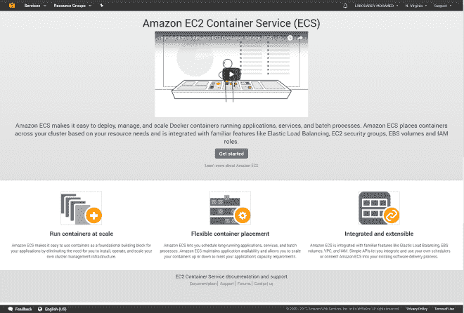
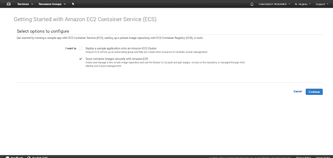
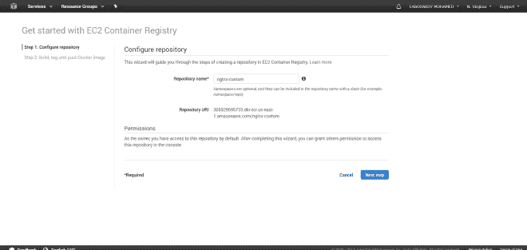
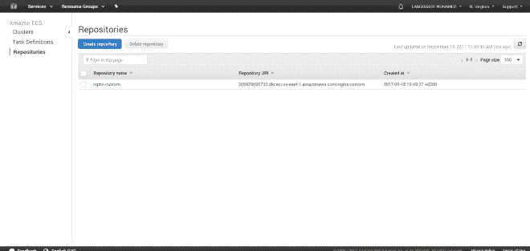
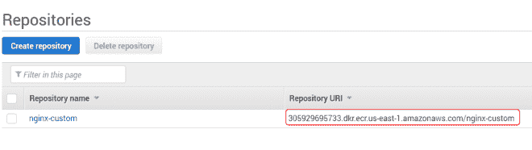

# 将 Docker 映像推送到 EC2 容器注册中心

> 原文：<https://medium.com/hackernoon/pushing-a-docker-image-to-the-ec2-container-registry-e7e00297fc20>

在这篇短文中，我将向你展示如何使用 **EC2 容器注册** ( **ECR** )服务在 **AWS** 上设置 **Docker 注册**，以及如何从亚马逊 **ECR** 推送&图片。

**1 —配置存储库**

首先登录到您的 [**AWS 管理控制台**](https://console.aws.amazon.com/) ，然后导航到 **ECR** :

点击**开始**:

为您的存储库选择一个名称，然后点击“**下一个**”:

此时，您将被带到**存储库仪表板**:

恭喜你！您已经创建了您的第一个 **AWS Docker 注册表**。

为了从 ECR 推送 docker 图像或将 docker 图像拉入 ECR，我们需要从 **AWS CLI** 获取 docker 登录信息:

| eval $(AWS ECR get-log in-region us-east-1)

发出以下命令，用存储库 URI 标记映像:

305929695733.dkr.ecr.us-east-1.amazonaws.com/nginx-custom 码头标签

运行以下命令将其推送到存储库:

码头工人推 305929695733.dkr.ecr.us-east-1.amazonaws.com/nginx-custom

让我们检查一下存储库:

