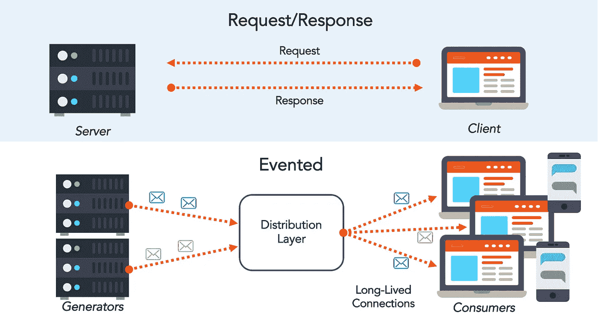
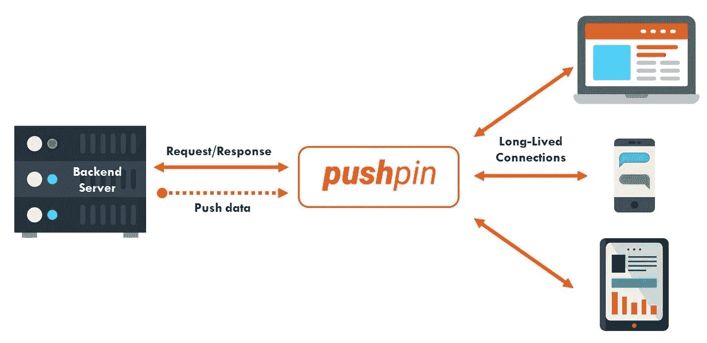
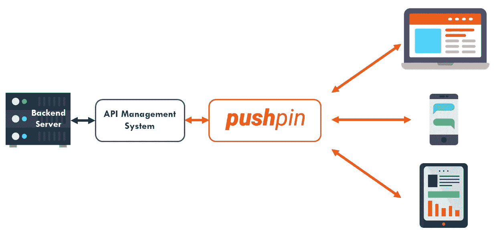

# pushpin——一个将 REST APIs 转化为实时 API 的开源库

> 原文：<https://medium.com/hackernoon/pushpin-an-open-source-library-that-turns-rest-apis-into-realtime-apis-ebb3253e63ce>

## 介绍事件 API 以及如何用图钉构建它们

[Creator Ci20](https://creatordev.io/ci20.html)

“实时”正在成为现代技术堆栈中无处不在的力量。随着消费者要求更快和更频繁的数据交易，公司越来越多地投资于加速这些交易的产品基础设施。尽管我们已经看到 API 成为经济和技术的必需品，但它们通常基于请求-响应风格的交互，这限制了它们在实时领域的范围和有效性。

# 请求-响应与事件驱动的 API

其核心是，请求-响应是一种消息交换模式，其中请求者向回复者系统发送请求消息。replier 系统接收并处理请求，如果一切顺利，它将返回一条消息作为响应。虽然这种交换格式对于更结构化的请求很有效，但是它将集成限制在那些预期的系统清楚地知道自己想从对方那里得到什么的情况下。因此，这些请求-响应风格的 API 必须遵循来自调用服务的交互脚本。

在事件驱动的架构中，应用程序基于事件驱动的交互，平等地集成多种服务和产品。这些交互由事件发射器、事件消费者和事件通道驱动，由此事件本身通常是产生、发布、传播、检测或消费的重大“状态变化”。这种架构模式支持软件组件和服务之间的松散耦合。这样做的好处是事件发射器不需要知道消费者的状态，消费者是谁，或者事件将如何处理(如果有的话)。这是一种通过持久流推送数据的机制。

# 事件 API 解决方案

在技术生态系统中，有许多方法可以处理数据流和事件 API。一些领先的 SAAS 解决方案包括 [PubNub](https://www.pubnub.com/) 、 [Pusher](https://pusher.com/) 、 [Kaazing](https://kaazing.com/) 和[Fanout](https://fanout.io/)——它们各有利弊，并加大投资。为了理解事件驱动架构的基础，我们将探索一些叫做 Pushpin 的开源软件。

# 图钉

[Pushpin 的](http://pushpin.org/)主要价值主张是，它是一个支持实时推送的开源解决方案——这是事件 API 的必备条件( [GitHub Repo](https://github.com/fanout/pushpin) )。它的核心是一个反向代理服务器，使得实现 WebSocket、HTTP 流和 HTTP 长轮询服务变得容易。从结构上来说，图钉使用常规的、短期的 HTTP 请求与后端 web 应用程序进行通信。

这种架构提供了一些核心优势:

*   后端语言可以用任何语言编写，可以使用任何网络服务器。
*   可以通过简单的 HTTP POST 请求将数据推送到 Pushpin 的私有控制 API。
*   它对连接的客户端是不可见的。
*   当需要来自后端服务器的数据时，它通过作为负责方来管理有状态元素。
*   不需要图钉实例之间的通信，因此可水平扩展。
*   它利用发布-订阅模型进行数据传输。
*   它可以充当代理服务器和发布-订阅代理。

# 集成图钉

从更系统的角度来看，有几种方法可以将图钉集成到堆栈中。最基本的设置是将 Pushpin 放在典型的 web 服务后端的前面，后端将数据直接发布到 Pushpin。web 服务本身可能发布数据以响应传入的请求，或者可能有某种后台进程/作业发布数据。

因为 Pushpin 是一个代理服务器，它可以与大多数 API 管理系统一起工作——允许您执行实际的 API 开发。例如，您可以将代理链接在一起，将图钉放在前面，这样您的 API 管理系统就不会受到长期连接的影响。更重要的是，Pushpin 可以将 WebSocket 协议翻译成 HTTP，允许 API 管理系统对翻译后的数据进行操作。

你可以点击这里查看一些用图钉[构建的示例应用程序。](http://pushpin.org/docs/examples/)

# 事件 API 的未来

在一些后续文章中，我将讨论一些我们可以在事件化 API 中看到的独特特性。其中包括事件批处理、显著性过滤器和标准订阅界面。如果您正在寻找一个实时插入式 API 代理，那么我强烈推荐您尝试一下图钉。