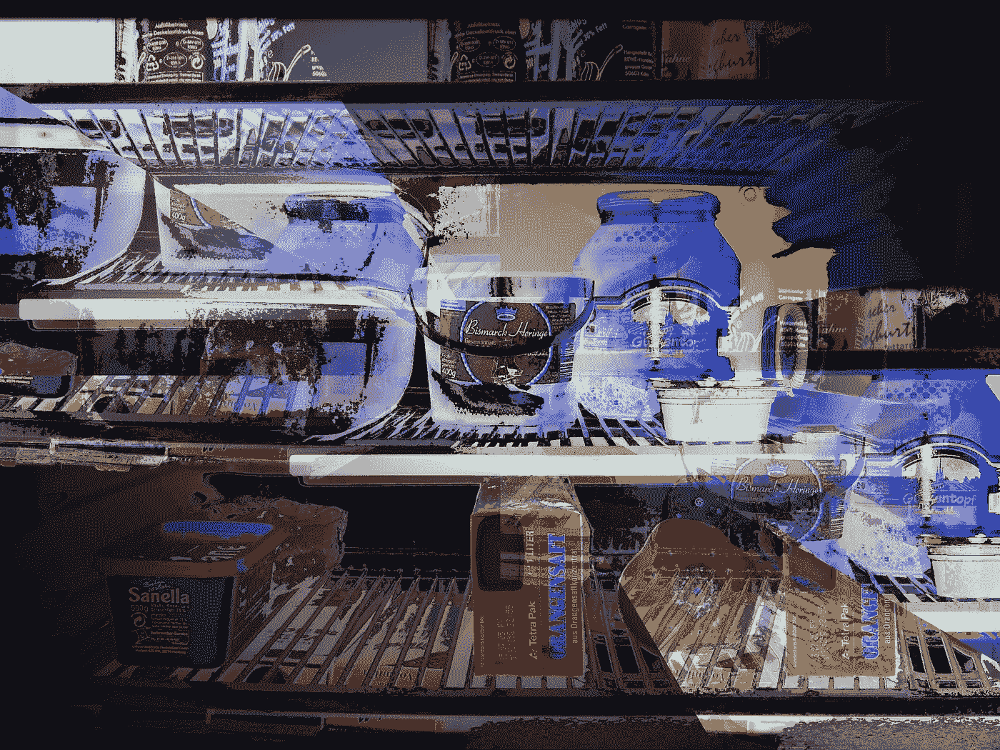
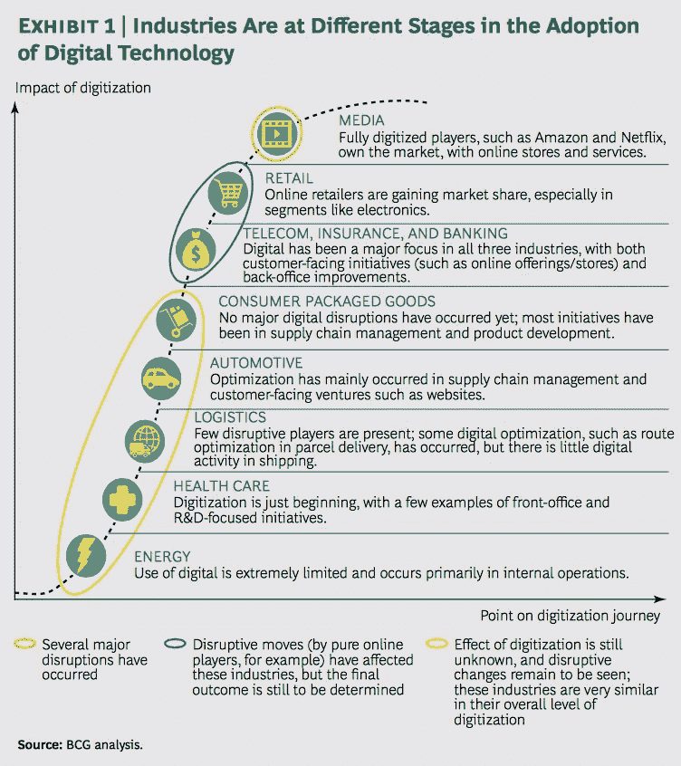

# 把东西放下，离冰箱远点

> 原文：<https://medium.com/hackernoon/put-the-iot-down-and-back-away-from-the-fridge-fb2e211e878c>

Big Brother is watching you and your groceries ([image source](https://www.flickr.com/photos/erix/108856523/in/photolist-aBVfB-5rnLKx-P2jp-oUc4e-37SE-AzK2N-zdhG4-ahT9C-8B9imW-6oPCLM-o9qao-7yATW-4w5jPM-8Q3Xf-bvN5gx-nerbf-3Ebqqs-4CPMFg-KvGkC-753BtH-aQyXzr-PzyFH-4mGkH5-6ANfPD-c9E1u1-9uoewW-7EsW5H-7yAQe-9WHcu-cDp6V-6SjTQ-7y7EjL-eh5sn-4zUUSD-bncxs-dTwbXZ-qg7nL-5UkwY-79xVka-5CMp-gaZG-6HFs-3XQeC-4KHFrN-5UmeC3-sVpt4-uZP8j-5PPLk1-5JVn4X-3Z1G))

又一个消费电子展，又一个短视的互联网冰箱，又一个对不会改变零售和我们家庭的非问题的过度设计的解决方案。

2017 年应该是 CPG/FMCG 品牌、真实世界零售和厨房设备制造商最终走到一起的一年，连接最后一米到货架和最后一英里到家——这是必然的，如果不是设计的话。

## 零售和杂货价值链需要整合在一起。一起。

继媒体之后，零售业面临来自数字技术的最大冲击和破坏。

零售和杂货领域不断变化的消费者预期和行为让通常的怀疑者陷入了被动。

技术创造了新的购物旅程和新的决策，当你改变了购买方式时，你最终会改变购买的东西。

在这种情况下，品牌所有者和零售商需要协同工作，保持相关性，并与制造商合作，以避免亚马逊和新的聚合器以不同的方式出现并塑造消费。

传统上，这两个星球之间的关系并不融洽:品牌所有者在旅程的前端拥有媒体预算和出色的洞察力，零售商在销售点拥有强大的权力和数据，白色家电制造商在家中提供体验。

> 他们都有不同的系统、观点、议程和不确定的投资回报率。

如果协作和数据共享发生了，那么它是不均匀分布的，并且过于集中在像 iBeacons 或[互联网冰箱](http://fuckyeahinternetfridge.tumblr.com)这样的噱头上(顺便提一下，在 2016 年的许多低谷中，终于找到了互联网冰箱的一个用例，而不是肮脏的指纹磁铁——不幸的是，这个用例是作为僵尸网络的一部分的[)。](http://www.theregister.co.uk/2016/09/27/akamai_chief_security_officer_andy_ellis_interview_internet_of_things/)

但是这些失败的镜头为我们如何改变零售价值链指明了道路:通过变得**时尚**或**隐形**和**合作。**

## 时髦？

你的意思是成为一个“看着我”，可触摸，娱乐中心，冰箱的未来焦点像一个自鸣得意？不。相反，我们可以按照文化的速度来思考时尚。想想 Spectacles 从谷歌眼镜中学到的教训。

## 隐形？

与其从要求人们扫描他们进出冰箱的每一件物品，或者要求制造商在每个奶瓶和沙拉上安装 NFC 的立场出发，不如减少商业和消费的摩擦。不要让人们思考，也不要让他们做任何事情——更不用说看着一个应用程序在他们的冰箱里达到远程峰值。

**在零售价值链的未来，重要的是** [**操作系统**](https://stratechery.com/2017/amazons-operating-system/) **而非用户界面，平台而非应用程序。**

2017 年，数据必须流动。由传感器和机器学习支持的计算机视觉和可扩展自动数据处理相结合，可以用更少的线路、自动支付、地理定位提醒、个性化 POS 甚至实时定价来填补空白并提供更好的客户体验。

我们可以将不经常购买的厨房设备**转变为传感器驱动的订阅服务——通过自动升级、真实和虚拟地获取最新时尚食品时尚的指导，以及基于使用、成功和长期客户价值的最新配料交易。品牌所有者可以利用这些数据伙伴关系，不仅将投资回报率归因于他们的[营销](https://hackernoon.com/tagged/marketing)计划，还可以塑造产品创新和新系列。

本质上，在 2017 年的数据中，机器学习和传感器可以导致品牌-食品商-制造商的合作关系，这种合作关系提供的不仅仅是一顿饭。

但我们需要分享。

如果没有，那么亚马逊将会带着所有人的午餐离开。

— — — — — — — — —

*不仅仅是解决[错误问题](http://www.nytimes.com/2016/07/10/opinion/sunday/solving-all-the-wrong-problems.html?_r=0)的花招，还有那些希望妈妈仍然为他们做一切的富裕白人男性的问题。

What fresh hell is this?

* *但请注意，在试图向我们出售昂贵的热饮机和豆荚时，厨房往往是 UX 和理性思维从设计中消失的地方。太棒了。除非你需要热水。或者它已经没有水了。或者它需要自己清洗。或者它正在升温。或者过滤器需要更换。或者地面需要清空。或者如果你不喜欢咖啡。或者它已经没有豆子了。或者豆荚。或者如果你不能破译数百个杯子相关的图标与最小的区别在前面的界面。或者如果你只是想要回你的水壶。

> [黑客中午](http://bit.ly/Hackernoon)是黑客如何开始他们的下午。我们是 [@AMI](http://bit.ly/atAMIatAMI) 家庭的一员。我们现在[接受投稿](http://bit.ly/hackernoonsubmission)，并乐意[讨论广告&赞助](mailto:partners@amipublications.com)机会。
> 
> 如果你喜欢这个故事，我们推荐你阅读我们的[最新科技故事](http://bit.ly/hackernoonlatestt)和[趋势科技故事](https://hackernoon.com/trending)。直到下一次，不要把世界的现实想当然！

