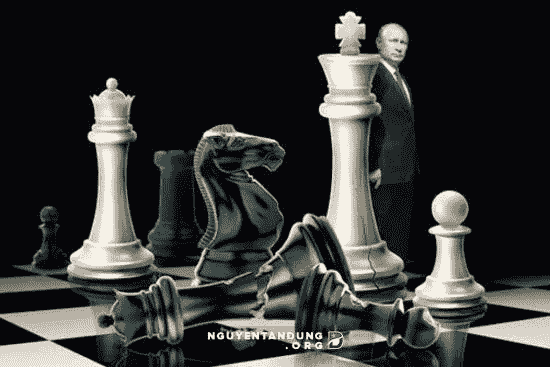

# 普京刚刚用加密卢布改变了游戏

> 原文：<https://medium.com/hackernoon/putin-just-changed-the-game-with-the-crypto-ruble-e15199898642>

Putin’s Meeting with Ethereum Designer Vitalik Buterin May Have Changed the Entire World

几个星期以来，我们一直从俄罗斯政府那里得到关于加密货币的非常混杂的信号。一方面，我们看到它在拥抱新技术的同时，也在向他们宣战。

正因为如此，人们对于 cryptos 在俄罗斯的最终结局有很多困惑。鉴于我们所知道的情况，我将尽力澄清这一困惑。

但是，可以说，这对比特币和俄罗斯经济来说都是非常好的消息。给我几分钟，我会解释原因。

# 普京定律

弗拉基米尔·普京是一个遵守法律和秩序的人。如果你观察普京在公共领域的运作，你会发现他总是着眼于法律。他坚信法律。加密货币尽管对需要加密货币提供的非中介化类型的俄罗斯经济有明显的好处，但却在法律灰色地带运作，这让普京很不舒服。

因此，俄罗斯官方密码政策的目标是杜绝非法活动——洗钱、资助恐怖主义、贩卖人口等。—同时利用技术实现俄罗斯内部资本处理能力的现代化。

这就是密码卢布的意义所在。这是俄罗斯和俄罗斯人在秘密世界和所谓的真实世界之间提供门户的一种方式。它确保了这种新形式的卢布正确地跟踪俄罗斯经济中的资本流动。

通过对无法提供所有权书面记录的人征收资本利得税，俄国和普京刺激了低成本加密支付系统的发展，让卢布只与加密货币交换商品，加密货币也可以追踪所有权，比如以太坊和其他拥有透明区块链历史的货币。

# 俄罗斯首都邀请

普京公开邀请合法的、光明正大的投资资本进入俄罗斯。俄罗斯希望合法企业在俄罗斯以他们喜欢的任何货币经营，只要这些企业是透明的。

加密卢布提供了一种方法，通过这种方法，可以在没有交易成本的情况下，将货币转换回国家“法定”货币，以支付账单、税收等。例如，这与美国对待加密货币的方式截然相反。

2014 年 I.R.S .将比特币归类为“财产”的规定意味着，每一笔比特币交易，无论多么微小，都会产生潜在的资本收益事件。这意味着，在星巴克用比特币购买一杯咖啡，对于购买咖啡的人(出售的资本收益)和星巴克来说，当他们去出售这些比特币、购买美元并支付工资、订购用品等时，都是要征税的。

这就是为什么流入加密货币的资本没有流回。这就是 ICO 市场爆炸式增长的原因。数十亿的利润积极寻找新的投资机会而不纳税。

这也是亚马逊不接受比特币的主要原因。谁想要这种麻烦？

如果接受比特币，你能想象亚马逊的日程 D 吗？

对于那些可以通过区块链证明所有权的人来说，加密卢布的结构不需要加密。比特币允许交易透明，以太坊、莱特币和许多其他货币也是如此。

现在，加密货币可以与卢布共存，而不用担心双重征税的威胁，除非你是在黑暗中赚的钱，此时俄罗斯希望获得 13%的资本利得。这个新系统不会将资本带回俄罗斯经济，但无论如何它也不会回来。

# 俄罗斯拥抱自己的密码

普京和俄罗斯银行将比特币称为庞氏骗局和洗钱渠道，这只是在攻击非本土技术。像市场上的其他人一样，他们在“谈论他们的书”。

普京更希望人们使用俄罗斯的平台。请记住，他也是一个民族主义者，试图在这个重要的市场上提升俄罗斯的声望。

以太坊和 WAVES 都是由俄罗斯设计和建造的平台。所以，你会注意到普京从未公开反对以太坊。[电波继续在很多人的雷达下飞行](http://www.wavesplatform.com/)，但它就像以太坊一样具有破坏性。

它们都提供了一个平台，作为下一代基于互联网的应用的[基础设施即服务](http://searchcloudcomputing.techtarget.com/definition/Infrastructure-as-a-Service-IaaS) (IaaS)。以太坊是一种互联网 3.0 的操作系统，而 WAVES 是下一代外汇交易所，为发行新的公共/私人股权提供了一个简单的平台。

WAVES 将支持莫斯科交易所交易加密货币及其衍生品的举措。它将充当所有货币兑换的关口。因此，如果你有美元、比特币、卢布或以太币，你最终可以在莫斯科交易所买卖股票。

一切都很好而且合法。都是光明正大的。

邪恶的普京正在寻找看到俄罗斯债券交易超过 7%的养老基金投资者，他刚刚给了基金经理一个通过加密后门进入的方法。

不要认为普京不喜欢比特币作为吸引投资者资本的手段。这就是[俄罗斯矿工币的全部意义](https://tomluongo.me/2017/08/09/russian-miner-coin-welcome-to-bitcoin-as-reserve-asset/)。他只是希望对其进行监管，以确保公共领域得到最大化。

# 资本外逃之战

资本总会流向待遇最好的地方。

鉴于全球金融和政治体系的脆弱局面，俄罗斯稳定的政府是一笔财富。投资者需要的是在投入资金后能够取出资金的信心。

密码卢布计划是建立信任过程的一部分。

我现在知道，作为一名美国投资者，我可以直接投资一家俄罗斯公司的股票或债券。我可以用加密卢布支付我的股息或优惠券，并立即将其兑换成比特币或任何我认为合适的货币。

哦，如果我从来没有把它们兑换回美元，我可以推迟纳税，直到我这样做。

这在现在是不可能的，尤其是在受到制裁的情况下。如果这是可能的，它是昂贵的和一个主要的麻烦。普京是个聪明人，身边有一个优秀的团队。像这样的举动是为了回应美国饥饿他的国家的资本的侵略性举动，即约翰·麦凯恩的制裁。

他和他的团队明白，提供一个平台，让资本能够进入目前被正常手段禁止的俄罗斯，是在未来几年生存下去的关键。他没有责任监督美国投资者的行为，只负责他们遵守俄罗斯法律。

先发优势在这里很重要。如果俄罗斯继续开发区块链技术，并以相对免税的方式接受它，那么它“监管”加密技术美丽的分散市场就无关紧要了。

重要的是俄罗斯比其他国家更好地对待其加密投资者。在全球资本流动的争夺中，你不需要做到完美，你只需要比其他人稍微好一点。套利会解决剩下的问题。

免税的卢布/加密交易所是加密市场一直在寻找的杀手级应用程序，以使其更上一层楼。

俄罗斯捷足先登。

## 加入我日益壮大的顾客群吧，他们从每月一期的[金羊枪械通讯中的这些故事中获益。](https://tomluongo.me/2017/10/07/hurricanes-black-swans-gold-goats-guns-newsletter/)