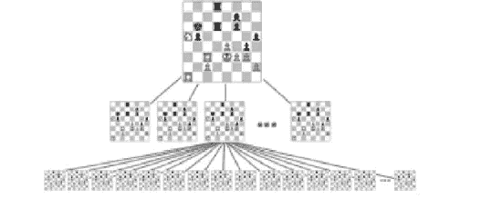

# 将 D 放在深度学习中

> 原文：<https://medium.com/hackernoon/putting-the-d-in-deep-learning-1-713dd20aaac5>

警告:现在事情会变得非常不技术化。

全世界的书呆子都在为 AlphaGo 赢了 T1 而疯狂，所以很自然的，一些在维基百科上读过更多关于这个话题的人会想提醒每个人这个故事不仅仅是 T2 的轰动效应 T3，这就来了。

正如你可能已经读过的，[深度学习](https://hackernoon.com/tagged/deep-learning)最近风靡一时——从[称黑人为大猩猩](http://www.cnet.com/news/google-apologizes-for-algorithm-mistakenly-calling-black-people-gorillas/)和[模仿一个好色的反犹太千禧一代](http://www.complex.com/life/2016/03/microsoft-tay-tweets-about-sex-hitler)到赢得围棋比赛，还有[评判你在社交媒体上的帖子](http://news.mit.edu/2015/csail-deep-learning-algorithm-predicts-photo-memorability-near-human-levels-1215)。数据可用性和处理能力的提高使这些算法能够创建真正强大的模型。但是我想得太多了。在你愤怒地向下滚动到狂怒评论“人工智能是撒旦害怕上帝”之前，让我向你解释到底发生了什么，以及为什么机器人起义是你应该担心的最后一件事，尽管这些人不得不说。

让我们来看一个基于基本技能的任务，一个让它变得有趣的游戏，我们大多数人都可以与之相关——国际象棋。一种双人回合制游戏，玩家一次移动一个棋子，直到国王被杀或其他什么的(我也发现整个安排已经过时，扑克牌[发生了变化](http://whiteknucklecards.com/history/briefhistory.html)，顺便说一下)。在游戏的每一步，你都有一系列可能的走法，你可以从中选择一个最有可能让你成功的走法，然后游戏继续进行。这创造了一个树状结构的步骤，你可以采取，评估你的现状，直到它导致一个残酷的损失，因为你真的不知道关于国际象棋的标准。

Decision tree (courtesy [https://garabedyan.wordpress.com/](https://garabedyan.files.wordpress.com/))

现在，由于在这个“树”的每一点上，你都有这么多的“分支”可以选择(对应于你在任何时刻可能做出的每一个动作)，所以要知道选择哪个“分支”需要很多精确的直觉和简单的智力。对于一台对国际象棋不感兴趣的计算机来说，解决这个难题的一种方法是评估你和它在每一步中可能走的每一步，并找出哪一步赢的机会更大，然后选择一步。随着时间的推移，计算机科学家投入了大量的精力来创建算法，通过选择最有意义的几个分支来简化这项任务，并节省大量时间，最终让天才卡斯帕罗夫(Kasparov)像小母狗(T3)一样哭泣。

由于围棋作为一种游戏太复杂了，无法用基于决策树的方法进行评估(对一个人来说，每一步的分支数量[太高了](https://imgflip.com/s/meme/Too-Damn-High.jpg))，科学家当时对人工智能在这方面击败我们不抱太大希望，特别是在 1997 年使用同样的方法。但是你猜怎么着？DeepMind 获得了 2016 年的人工智能奖金，由[击败围棋界的名人录](http://www.koreaherald.com/view.php?ud=20160315001039)，尽管他们的方式非常不同。这就把我们带到了人工智能的大 D——深度学习。

假设你熟悉[什么是神经网络](http://arxiv.org/pdf/cs/0308031.pdf)，你会发现关于深度学习的每一个教程都会开始向你解释这个概念，所以自然地，我会做一些稍微不同的事情。让我们回到我们的象棋问题上来。还记得我说过选择几个最有意义的分支吗？如何做到这一点是使用一些实际的想法，我们假设这些想法与游戏的结果有很强的相关性，或者被称为[启发式](https://www.wikiwand.com/en/Heuristic_(computer_science))。

例如，在判断一个人有多愚蠢的情况下，一个很好的启发是这个人在他们的句子中说“喜欢”这个词的次数，或者他们谈论“T2”这个词的次数。在国际象棋游戏中，启发法可以包括剩余的棋子数、国王的确切位置、[等等](https://www.research.ibm.com/deepblue/meet/html/d.3.2.html)。这些试探法用于在不玩完整个游戏的情况下获得获胜可能性的感觉，这种技术适用于许多游戏(许多其他问题也被[建模为游戏](https://www.wikiwand.com/en/Algorithmic_game_theory))。

想象一下，一个传统的办公室向客户提供艺术盒子，客户通过与客户一起工作的不同人来指定他们的需求。除了这里的工人非常非常愚蠢——几乎和那些不停飞进窗户的愚蠢鸽子一样聪明。这个以后会派上用场的。我们有小隔间，里面的工人从他们的老板那里得到大量的体力工作。现在，就像每一家随意合作的公司一样，一名员工向多名下属重叠的老板汇报工作。此外，每个老板都希望相关员工从事其他工作。总而言之，你有这样一个办公室，每个员工从多个老板那里得到多项任务，而老板又向多个老板报告，等等——这个地方基本上是一个噩梦，工作条件很糟糕，但因为这是一个比喻，所以我真的不在乎。

现在，这个地方是按照资历来组织的。所有的职员都在一楼，与客户互动，将报告传递给他们的老板，即经理，他们在一楼工作，接收下属的报告，根据老板的要求处理报告，然后传递给下一层。这种情况一直持续到穿着西装、开着奥迪的老板得到最终报告，对报告的愚蠢失去了冷静，并给他们的每个下属打电话，然后[根据他们的错误按比例削减他们的薪水](https://www.wikiwand.com/en/Backpropagation)。

这些沮丧的经理然后去底层，对他们的下属大喊大叫，同时以类似的方式削减他们的薪水，是的，同样的人被他们工作的每个老板吼，然后去对他们的下属做同样的事情。这种情况一直持续到第一层，在那里，员工们只是接受老板的所有废话，抓着抽屉里的安眠药瓶，小声嘟囔着“今天不行”。

但这些人毕竟是人，他们从错误中学习——有些人比其他人更快，并试图不再犯同样的错误，这个过程还在继续。最终，在数以千计的不同客户面前(因为这些人特别愚蠢，就像我之前提到的那样)，这个办公室开始做对一些事情，然后，在数百万的客户面前，开始做对更多的事情，最终整个办公室知道该做什么，在每个客户身上寻找什么来创造客户会喜欢的适当的艺术盒子([可能太多了](http://www.cosmopolitan.com/sex-love/g4035/weirdest-objects-people-have-had-sex-with/))。

A 3-layer(floor) neural network (this is the building laid down horizontally, every different color is one floor)

本质上，这就是神经网络的工作方式(来自这个领域的更有经验和判断力的读者可能已经意识到我的类比省略了很多细节，但是，它仍然是有意义的)。这个模型并不是全新的——第一篇描述“降薪”精确算法的论文可以追溯到 20 世纪 60 年代，正如我简洁地描述的[，从那以后人们一直在研究它们。](http://people.idsia.ch/~juergen/who-invented-backpropagation.html)

随着互联网上更多处理能力和海量数据的发明和可用性(记得我说过这些工人真的真的很笨——这就是他们需要大量信息来学习的原因)，计算机科学家在意识到增加更多层(在不同的增量位置雇用更多人)有助于算法更好地执行之后，恢复了更深层次网络(有更多楼层的建筑物)的概念。

随着 GPU 可以提供的并行化(是的，你可以用这个 12 GB 的庞然大物做更多的事情，而不是坐在沙发上，吃芯片和玩鳕鱼)，这些网络变得更容易创建和训练，并逐渐被用于各种复杂的人工智能决策。深度网络的一个非常重要的方面是大多数人(甚至是一些机器学习的初学者)没有理解的，即深度网络的真正新奇之处在于，它们能够让 T2 学习寻找什么，而不仅仅是 T4 做出最终决定。每一层(我将称之为层，现在不在括号中提供底层)确切地了解需要了解什么，以便为特定的任务做出正确的决定。

例如，考虑识别图像中存在的对象的情况。请记住，对于计算机来说，图像中的信息就像一个 Excel 表格，每个单元格都指定了其中的颜色。如果我们给一个深度网络提供大量图像，并指定每张图像中存在的内容，这个网络就会学到令人惊讶的东西。例如，它可以自己判断出它首先要寻找的是边缘——因为边缘可以区分图像的不同部分。然后它开始识别像正方形、圆形等形状。它后来学会以不同的方式组合，以识别物体的各个部分——手柄、腿等。，最后算出对象是什么。

类似的事情也发生在人类的大脑中(不，它们被称为人工*神经*网络是有原因的),这可能是为什么这些网络在人类擅长的事情上做得如此之好，只是增加了不会疲劳、饥饿或情绪化的能力，你就有了一台能够很好地完成所有这些任务的超级机器——识别图像中存在的对象，识别语言是由什么组成的，回答问题，识别人脸，猜猜猜是什么——下围棋。

所以，是的，回到围棋场景——它背后的算法直接从观察数百万场比赛中学习，观察顶级选手的走法，并独自识别常见的走法和策略*。然后，他们让它与自己的调整版本进行比赛，以完善这些策略，并最终创造出一个几乎与世界上最好的球员不相上下的球员。同样，这里的事实是，网络自己逐渐找出它看到的每个游戏中要寻找的内容，而不是像以前的方法那样仔细策划的试探法。*

*这导致了一些健康的批评和[令人难以置信的愚蠢报道](http://www.theguardian.com/technology/2016/mar/15/sour-grapes-at-facebook-over-googles-ai-victory)，主要是关于这种解决问题的方法明显低效——这是人工智能和机器学习研究人员已经在思考的问题。与我们人类相比，深度网络从每场比赛中学到的东西太少了(是的，自我感觉良好)，这一点已经由比我更聪明、更有经验的人详细阐述过了(查看链接，该死的)，所以我不会在这里详细阐述，但这为我接下来要说的事情(写？类型？)关于。*

*人工智能不会接管世界——至少现在不会，它还是太蠢了。不过，好吧，稍后再说。*

******

> *[黑客中午](http://bit.ly/Hackernoon)是黑客如何开始他们的下午。我们是 [@AMI](http://bit.ly/atAMIatAMI) 家庭的一员。我们现在[接受投稿](http://bit.ly/hackernoonsubmission)并乐意[讨论广告&赞助](mailto:partners@amipublications.com)机会。*
> 
> *如果你喜欢这个故事，我们推荐你阅读我们的[最新科技故事](http://bit.ly/hackernoonlatestt)和[趋势科技故事](https://hackernoon.com/trending)。直到下一次，不要把世界的现实想当然！*

**