# 麦克 OS X 上的皮查姆和阿帕奇火花

> 原文：<https://medium.com/hackernoon/pycharm-and-apache-spark-on-mac-os-x-990af6dc6f38>

> 如果你不知道如何在 Mac 上设置 Spark，请参考[之前的故事](/@pradyumnadoddala/apache-spark-1-6-0-setup-on-mac-os-x-yosemite-d58076e8064e#.5uangvtd5)。


Photo by Pradyumna Doddala using Photopea

现在你已经在你的 Mac 上安装并构建了 [Spark](https://hackernoon.com/tagged/spark) 。让我们做一些更改来运行 IDE。

## 步伐

在 bash_profile 中设置变量

```
sudo vim ~/.bash_profile
```

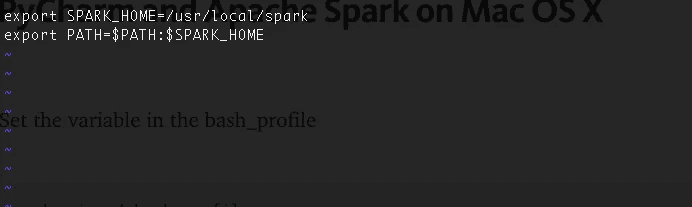

vim editor

```
export SPARK_HOME=/usr/local/sparkexport PATH=$PATH:$SPARK_HOME
```

现在打开 PyCharm。

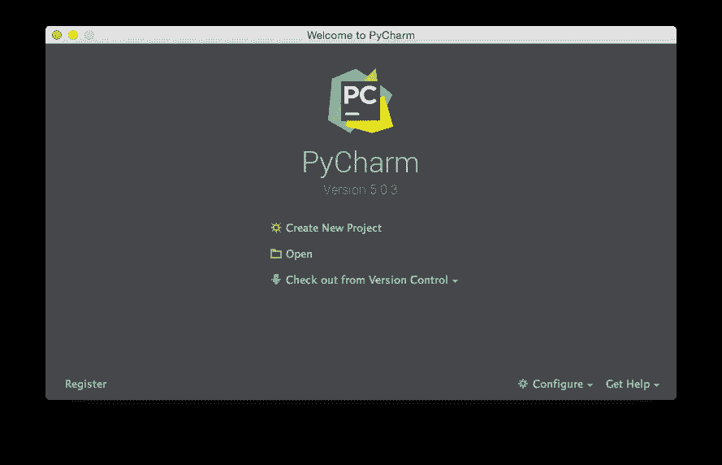

创建一个新项目，并使用纯 Python 模板。

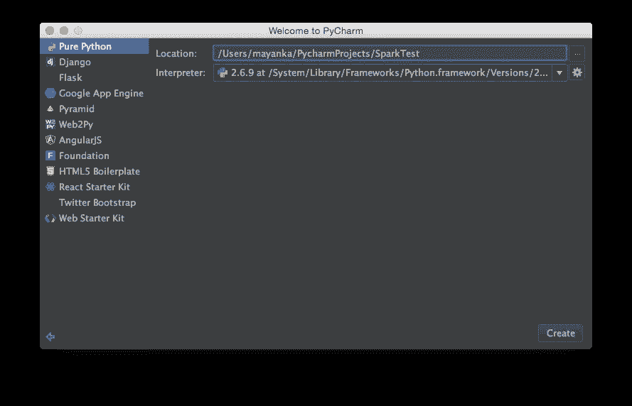

现在让我们创建一个名为“随便你想取什么名字”的 python 文件。

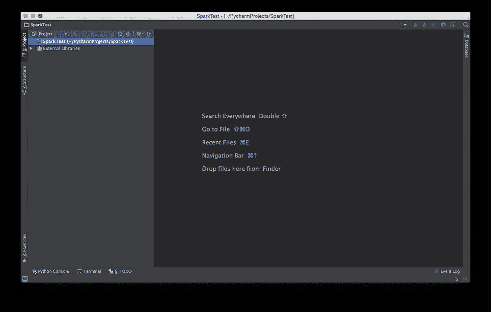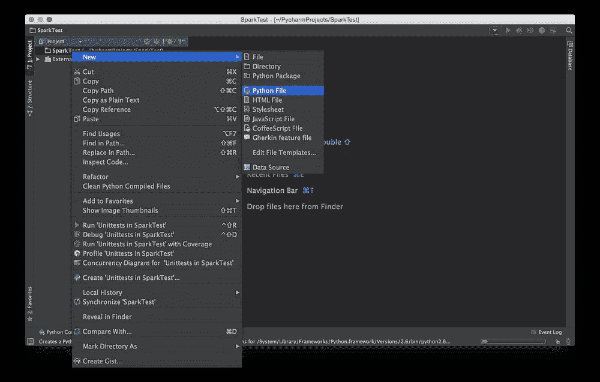

将 Spark python 库添加到解释器中。

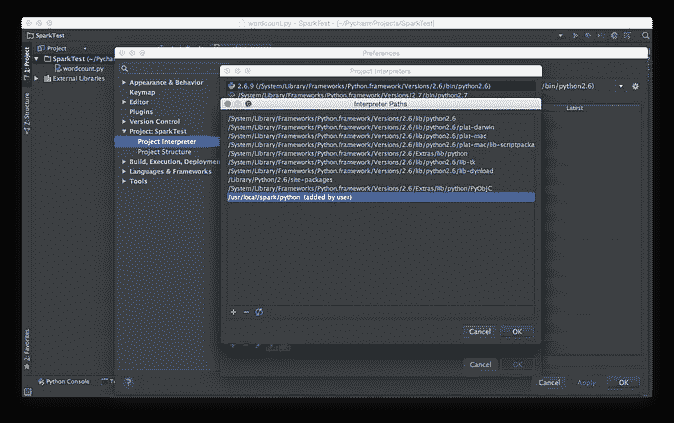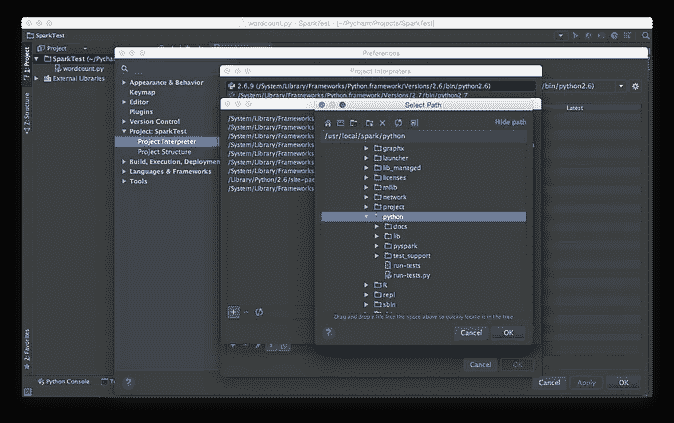

Steps for adding the /usr/local/spark/python as the library for the Project Interpreter.

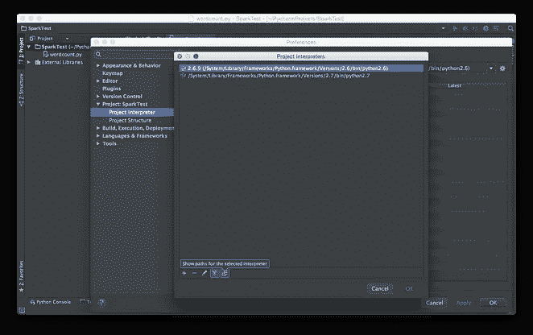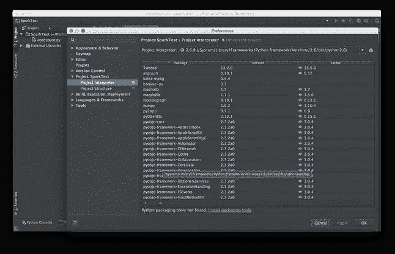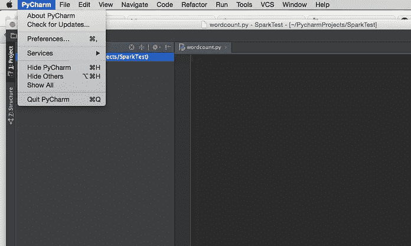

## 字数统计程序

对于字数统计[程序](https://hackernoon.com/tagged/program)，你需要一个文本文件。

首先创建一个样本文本文件，我将给出我已经在这篇文章中写的部分文本作为输入。

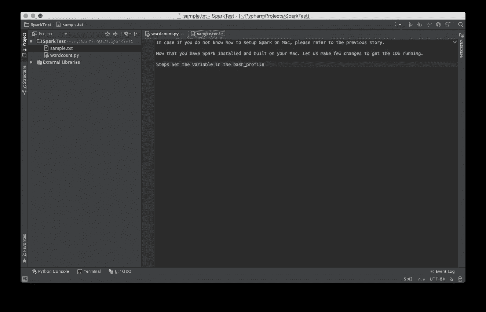

最后这个程序，

```
**import** os

os.environ["SPARK_HOME"] = "/usr/local/spark"**from** operator **import** add

**from** pyspark **import** SparkContext

**if** __name__ == "__main__":
    sc = SparkContext(appName="PythonWordCount")
    lines = sc.textFile("sample.txt", 1)
    counts = lines.flatMap(**lambda** x: x.split(' ')) \
        .map(**lambda** x: (x, 1)) \
        .reduceByKey(add)
    output = counts.collect()
    **for** (word, count) **in** output:
        **print**("%s: %i" % (word, count))

    sc.stop()
```

## 奔跑

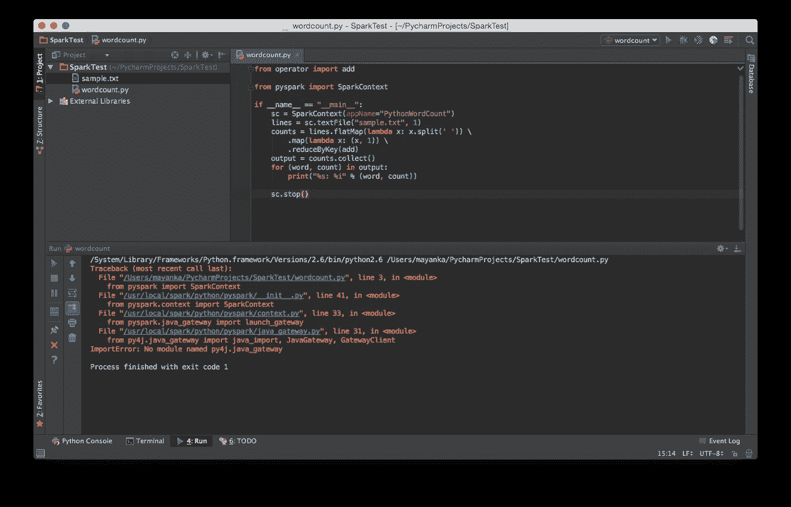

第一次跑步基本上是一场灾难，因为我们错过了许多小事。

所以如果我们可以快速浏览一下错误，它说一个名为 py4j.java_gateway 的模块丢失了。

所以我们必须把它交给翻译。

再次打开首选项，打开当前的解释器设置并添加名为 **py4j-0.9-src.zip** 的库

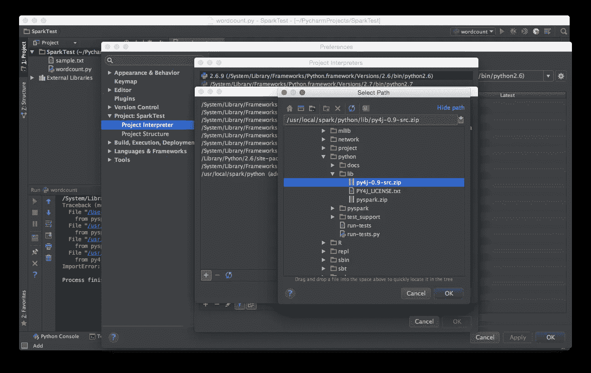

Adding the missing lib.

现在让我们重新运行代码。

我们可以在下面的屏幕截图中看到，单词和相应的计数是可见的。

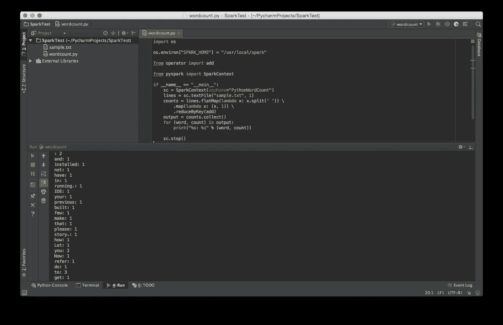

Final Run.

我希望这能让您在接下来的几天里忙于尝试神奇的 Apache Spark。

如果你做到了这一点，你就成功了！！祝您愉快！

如果这对你有所帮助，就拍拍屁股走人。它鼓励我写更多的帖子。谢谢你的支持。

*[***@ pradyumna _ d***](https://twitter.com/pradyumna_d)***|****文件您的加密货币税使用**[***bear tax***](https://bear.tax)***！”*****