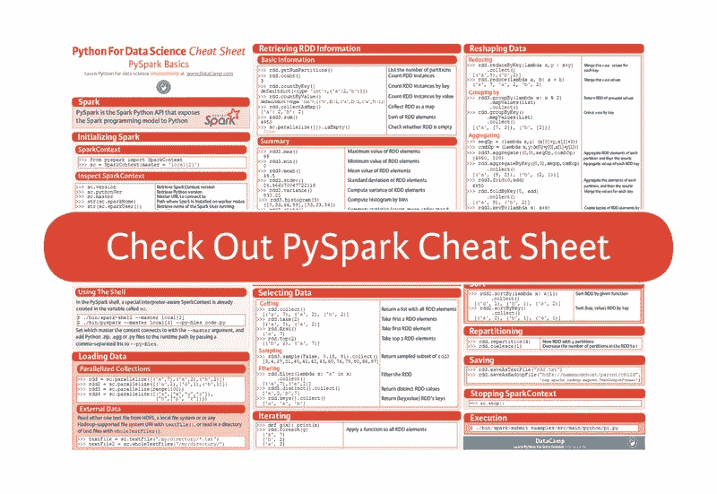

# PySpark 备忘单:Python 中的 Spark

> 原文：<https://medium.com/hackernoon/pyspark-cheat-sheet-spark-in-python-52fd855b78ca>

Apache Spark 通常被称为大数据处理的快速、通用和开源引擎，内置了流、SQL、机器学习和图形处理模块。与当今市场上的技术相比，它可以让您将分析应用程序的速度提高 100 倍。可以通过“PySpark”将 Spark 与 [Python](https://hackernoon.com/tagged/python) 进行接口。这是 Spark Python API 向 Python 公开了 Spark 编程模型。

尽管使用 Spark 会让你想起使用[熊猫数据框](https://www.datacamp.com/community/tutorials/pandas-tutorial-dataframe-python)的许多方式，但你也会发现，熟悉你可以用来查询、转换、检查……你的数据的所有功能是很困难的。此外，如果您从未使用过任何其他编程语言，或者您是该领域的新手，可能很难区分函数。

让我们面对它，map()和 flatMap()有足够的不同，但是当你在分析中面对它们时，决定你真正需要哪一个仍然是一个挑战。或者其他函数呢，比如 reduce()和 reduceByKey()？

在这里下载小抄。

尽管[文档](http://spark.apache.org/docs/latest/api/python/)非常复杂，但随身携带一份备忘单也无妨，尤其是当你刚刚开始阅读的时候。

这个 PySpark 备忘单涵盖了基础知识，从初始化 Spark 和加载数据，到检索 RDD 信息、排序、过滤和采样数据。但这还不是全部。您还将看到，诸如重新分区、迭代、合并、保存数据和停止 SparkContext 等主题都包含在备忘单中。

**请注意**本文中的示例采用小型数据集来说明特定函数对数据的影响。在现实生活的数据分析中，您将使用 Spark 来分析大数据。

你还想吃更多吗？不要错过我们针对[数据科学](https://hackernoon.com/tagged/data-science)的其他 Python 备忘单，它们涵盖的主题有 [Python 基础知识](https://www.datacamp.com/community/tutorials/python-data-science-cheat-sheet-basics)、 [Numpy](https://www.datacamp.com/community/blog/python-numpy-cheat-sheet) 、 [Pandas](https://www.datacamp.com/community/blog/python-pandas-cheat-sheet) 、 [Pandas Data Wrangling](https://www.datacamp.com/community/blog/pandas-cheat-sheet-python) 等等！

*原载于*[*www.datacamp.com*](https://www.datacamp.com/community/blog/pyspark-cheat-sheet-python)*。*

> [黑客中午](http://bit.ly/Hackernoon)是黑客如何开始他们的下午。我们是 T21 家庭的一员。我们现在[接受投稿](http://bit.ly/hackernoonsubmission)并乐意[讨论广告&赞助](mailto:partners@amipublications.com)机会。
> 
> 如果你喜欢这个故事，我们推荐你阅读我们的[最新科技故事](http://bit.ly/hackernoonlatestt)和[趋势科技故事](https://hackernoon.com/trending)。直到下一次，不要把世界的现实想当然！

