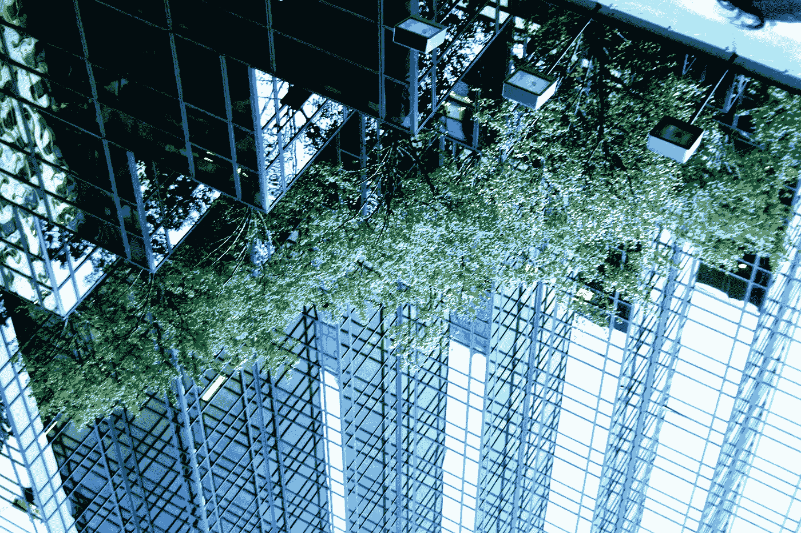

# 毕达哥拉斯，公元 2116 年

> 原文：<https://medium.com/hackernoon/pythagoras-2112-a-d-91d48013ebcc>

我现在做的是机器人做所有的事情。

Image by Kai Schreiber, used with a Creative Commons license

我上班不会迟到。我上班从不迟到，真的，因为我可以在任何地方工作。但这不是一件容易的工作。我不得不整天思考。关于为什么事情会是现在这个样子，过去是什么样子，将来会是什么样子。

成为一名哲学家是一份令人垂涎的工作。这比其他工作更容易，比如体育运动或跳芭蕾。这比在政府工作容易多了。但这比做大多数人做的事情更难，我想，这没什么。从我记事起就这样了。毕竟，机器人在 60 年代接管了大部分工作。

很难相信人类曾经准备食物。见鬼，太神奇了，我们以前自己种的！我们以前也是执业医生。我告诉你——我永远不会把我的手术托付给人类。你在开玩笑吗？他们说，以前总是有人死在医院里。即使他们能告诉你你有什么问题。医生们直到第二阶段才发现我的曾祖父患了癌症。你能相信吗？这是那种你甚至在出生前就可以测试的事情。

癌症。在我祖父母那一代，以及他们之前的一代，这曾经是一个大问题。过去有很多种癌症，但现在只有一种。肺癌。因为人们就是喜欢他们的香烟。当然是在特殊的香烟俱乐部，这样我们其他人就可以幸免了——但是现在新肺可以由机器人在无菌的实验室里培养出来，他们可以更换新肺。我想这对他们来说是好事，但我的朋友希帕提娅的妈妈已经做了 6 次了，因为政策规定一旦有损伤迹象就要更换你的肺。你知道，这样就不会传播了。因为即使我们的部分可以被替换，我们也不能像机器人一样不受疾病的影响。我不抽烟，因为我不喜欢做这么多手术。

门铃响了。一定是我送的；它每天都在这个时候出现，取决于我错过了什么。我打开门，发现了漂浮的椭圆形豆荚，打开后露出一品脱豆浆和新鲜的冷榨果汁。今天刚好够用；毕竟，我为什么要喝昨天准备好的牛奶呢？新鲜是最好的，这是政府的营养研究员告诉我们的。因为机器人正在生产我们所有的食物和饮料，所以每天都可以很容易地买到新鲜的食物。

我迅速喝下加了额外维生素的冰镇果汁，然后把牛奶放进冰箱，冰箱就放在我厨房的台面上。我已经习惯了冰箱根据我的习惯自动为我点餐。我过去不得不从门上的屏幕上选择我想要的东西。我仍然可以，如果我想要新的东西。

我的冰箱比一般的冰箱要小，大约是运送我牛奶的容器的两倍。我是个单身汉，所以我不需要太多的空间。一些家庭有稍微大一点的冰箱放在台面下。在过去，冰箱比一个人还大！我无法想象这样的东西会占这么大的空间。因为我每天都有外卖，我不需要储备几个星期的食物，我想这是人们过去经常做的。我想知道的是——他们是如何吃掉装在大罐子里的所有调味品的？为什么一周后还会有人想用蛋黄酱？人们为什么要用蛋黄酱呢？

我冰箱上的屏幕闪烁着:Aris。

“我要了，”我对着空气说。

Aris 的三维图像出现在我面前，在我厨房岛的另一边，它的顶部是由深色的石头和钻石复合材料制成的。当然是人造钻石，但是已经没人在乎这种东西了。它非常耐用。

“你好吗，皮兹？”他问我。阿里斯和我是大学的朋友。他的名字实际上是亚里士多德——来自古典希腊传统的哲学家名字在 90 年代风靡一时——我很感激我的父母没有选择也给我起这个名字。我大概知道 30 个亚里士多德；我的好友 Aris 选择了这个昵称来让自己与众不同。虽然 Aris 可能和 Jimmy 在 21 世纪初一样是一个普通的昵称。

“好，是啊。你今天干什么？”我回应。

“思考。”

“不写了？”我探查。主要是因为我没有。

“一点点。不多。我还在做我的主厨菜。Aris 已经研究那个东西三年了。没关系——不着急。他会得到和其他人一样的基本工资。如果他创作了短诗，学校会额外支付费用。他是个诗人。我也永远做不到。

“想去购物吗？”我喜欢看精品店。现在每个人都通过 pod 订购他们需要的任何东西，精品购物比其他任何东西都更新奇。想想以前购物效率有多低就觉得好笑。我的曾祖父母过去常常去公寓楼那么大的商店，买很多他们根本不会去那里买的东西。对我来说没有任何意义。但是我承认我不介意去精品店购物，因为奇怪的是人们竟然真的在*制造*东西。

显然，Aris 和我一样渴望离开他的公寓，我们同意在老城见面。每个城市都有一个老城区，一个市中心，很适合四处走走，尤其是在秋天。

“今天天气怎么样？”在我离开家之前，我问空气。

“80 度。今天你不需要穿夹克了，”我的白宫助理用标准的英语说道。我对英国口音很着迷。一切听起来都很聪明，你知道吗？阿里斯让他的家庭助理用中文和他说话。我觉得这很有趣，因为每个人都说中文，所以他并不是没有机会练习。我不知道他为什么需要那个。

我的助手听到我和 Aris 的谈话后，已经为我订购了一辆车。通常情况下，我会在街道上拍摄并拍摄 FLT，但由于我要去老城区，我宁愿更直接地拍摄 zm。FLT 非常适合压缩到大学或去看我有时在海湾对面的女朋友 Aspasia。它使用磁力悬浮技术，所以它可以在地面或水中保持较低的高度。

当我感觉很好的时候，就像今天，我会吃一颗 [Zūm](https://hackernoon.com/tagged/zum) 。稍微贵一点，因为飞行需要更多的能量。工程师们做了很多工作来最大限度地增加窗户的太阳能充电量，这在过去几年里降低了成本。我也喜欢 zhm，因为它会在我 42 楼的门外接我。我看到它穿过我前院的树丛，停在了我的停靠站。

我步入玻璃铜制的椭圆形气泡。这个 Zūm 适合四个人，我占最后一个位置。当我走进去的时候，两个白色的豆荚，和几分钟前拜访我的那一个一样，靠近并附着在车的后面。现在，这些吊舱与 flts 和 Zū ms 的车辆相连，空中交通减少了很多。这些吊舱可以搭乘飞机前往下一个目的地，当它们接近时就会弹出，只靠自己飞行一小段距离——并在安装在车辆上时充电。

“你好，”我向其他三个旅行者打招呼，他们点头微笑。我能看出一个人正在滚动她的信息，因为她在她面前上下移动手指，好像她在挠空气。我们的隐形眼镜让我们能够阅读邮件，这很好；我们以前必须戴眼镜。

在下降到街道高度并允许我下船之前，Zū m 停在老城区东侧的一栋补贴住房建筑的第 30 层。我注意到附在我们车上的运输舱已经不见了。

阿里斯想在老城区 50 家咖啡馆中的一家见面。考虑到我们都喝了多少咖啡，我们居然还能睡得着觉，真是不可思议！但是对大家来说都是打发时间的好方法，尤其是广大没有工作的人。不同的咖啡店吸引了不同的顾客。我们人类热爱身份和群体，咖啡馆迎合了这种欲望。

我经常去四个不同的咖啡馆，这取决于我的心情和我想要见的人。Aris 想去 Universitas，Universitas 是一家咖啡馆，为那些去过我们大学的人服务。不是说别人不能进，而是你为什么会想进？我会发现周围的人都有一些你没有的共同点，这很尴尬。

门开了，阿里斯躺在通风的木头和黄铜咖啡馆里的红木皮沙发上。在角落里，20 个人围着一个坐在凳子上的女人。她正在讨论机器人和人类的爱情，这是一个热门话题。我自己也写过几次，但是我没有兴趣讨论承认婚姻的好处。如果我们越过生物学的争论，这一切都归结到人的权利，无论我们如何定义“人”，电子人还是人。

Aris 冲我笑着打招呼，我也向他挥手致意，但还是从他身边走过，走向咖啡吧，我的饮料正在那里等着。传感器现在知道，当我下午来到 Universitas 时，我想要一杯杏仁香料柿子拿铁，不加奶油。如果我早上来，我想要一个直的埃塞俄比亚红眼。

阿里斯拿着他的饮料站起来，我们一起走了出去。我们谈论天气——每年都在变暖，但谢天谢地，政府和私人基础设施已经能够确保作物的持续生长。似乎每天，研究人员和他们的机器人都在开发新的转基因作物，可以应对温度和气候波动。他们还在实验室里培育新的高蛋白肉类，这种肉类的味道明显像野牛。野牛！想象一下。阿里斯和我一致认为，我们很高兴尝试这一新的创造，因为野牛在 80 年前就灭绝了。尝试灭绝肉类的想法真是太棒了。也许有一天，我们会尝试翼龙。

我们走进一家家庭用品商店。它并不大——也许有我的公寓那么大——因为大多数人都是虚拟订购的。有很多，但它们只在老城区。所有过去有杂乱的购物中心和店面的地方都被拆除了，以建造更多的公寓、餐厅、咖啡馆和储物单元，用于存放人们家中没有空间存放的所有物品。

当你可以在家舒适地轻松订购任何你想要的东西时，就不需要实体店了。但是城市规划者希望美国的老城区成为可爱、温馨的地方，尽管科技赋予了我们独立性，但社区可以聚集在一起，相互交流。这些古老的城镇以精品店为特色，一个街区一个街区的，都卖人造手工艺品。

这种反弹很有趣。回到动荡的 60 年代，机器人真正占据了主导地位。随着机器人能够更快、更好、更可靠地制造东西，制造业工作在 40 年代逐渐消失。传统汽车制造在 50 年代消失了，因为传统汽车完全淘汰了。到了 60 年代，一切似乎都是由机器人制造的。与此同时，人对机器人的暴力行为也很猖獗。街道上的抗议和工厂里的火灾。人们对这些半思考、无情的金属和塑料生物接管了帮助人们养家糊口的工作感到愤怒。我认为这些工作给了他们尊严。我们曾经用我们所做的工作来定义尊严。但那是在有很多工作要做的时候。现在，不工作是有尊严的。

60 年代也见证了一场人造商品的大运动。标签上写着“由人类自豪地制造”。或者更好的是，“由人类自豪地设计”，坦率地说，这意味着机器人可能做到了。一些人购买了人造产品，为了保住工作而忽略了瑕疵和缺陷。但事实是——更便宜、制造更好的商品赢得了胜利。工厂从需要容纳人类的地方——你知道，有空调和浴室——转变为可以容纳机器人的地方，这更经济。机器人不用 2 张纸巾擦手，也不用冲马桶，节约用水。

但是“人造”运动*对*产生了长远的影响。我们都想独一无二，就像我这一代的许多人一样，我喜欢在家里放一些人造物品。没什么大的，比如沙发，但肯定是艺术和家居装饰。一点点不完美很好地提醒了我们，我们只是凡人。我喜欢用升级的电话线制作不相配的陶瓷杯和杯垫。

“我必须拥有这个，”阿里斯对我宣布，拿起一个顶部有槽的青铜存钱罐。这是相当厚颜无耻的，因为我们在 50 多年前就从我们的货币中取消了硬币。“你再也看不到这些了。当朋友打电话来时，这将是一个很好的话题。”

“也许你可以让你的每个朋友在一张纸上写一个句子，然后把它放进投币口。当你清空它时，你可以做一首诗。”

Aris 对这个想法很满意，小心翼翼地把猪放进他的 macramé单肩包里。当我们走出去的时候，门发出哔哔声，这表明他的银行账户已经被扣除了购物费用。

我告别了阿里斯和他的新青铜猪，去了 Le Philosophe，这是我最喜欢的另一家咖啡馆，当我进去时，另一个机器人会自动在岩石上倒一杯甜苦艾酒。毕竟，现在是鸡尾酒时间。我在长毛绒沙发上坐下，一个小盒子随着我的饮料飘到我面前。我凝视着人群。毕竟，沉思是我的本职工作。杯子在茶碟上碰碰作响，顾客们大笑不止，我很难想象当我们都有其他事情要做的时候，生活会是什么样子。

如果你喜欢这个，请点击下面的心形！谢谢！

> [黑客中午](http://bit.ly/Hackernoon)是黑客如何开始他们的下午。我们是 [@AMI](http://bit.ly/atAMIatAMI) 家庭的一员。我们现在[接受投稿](http://bit.ly/hackernoonsubmission)并乐意[讨论广告&赞助](mailto:partners@amipublications.com)机会。
> 
> 如果你喜欢这个故事，我们推荐你阅读我们的[最新科技故事](http://bit.ly/hackernoonlatestt)和[趋势科技故事](https://hackernoon.com/trending)。直到下一次，不要把世界的现实想当然！

