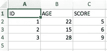
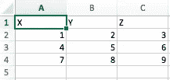
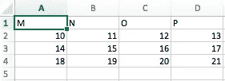

# Python Excel 教程:权威指南

> 原文：<https://medium.com/hackernoon/python-excel-tutorial-the-definitive-guide-934ee6dd15b0>

*最初发布于*[*https://www . data camp . com/community/tutorials/python-excel-tutorial*](https://www.datacamp.com/community/tutorials/python-excel-tutorial)

您可能已经知道 Excel 是由微软开发的电子表格应用程序。您可以使用这个易于访问的工具来组织、分析和存储表格中的数据。更重要的是，这种软件在全世界许多不同的应用领域中被广泛使用。

不管你喜不喜欢，这也适用于数据科学。

在某些时候，您需要处理这些电子表格，但是您也不会总是想要继续在其中工作。这就是为什么 [Python](https://hackernoon.com/tagged/python) 开发人员不仅实现了读取、写入和操作这些文件的方法，还实现了许多其他类型的文件。

今天的教程将让你了解如何使用 Excel 和 Python。它将为您提供一些包的概述，您可以使用这些包在 Python 的帮助下加载这些电子表格并将其写入文件。您将学习如何使用`pandas`、`openpyxl`、`xlrd`、`xlutils`和`pyexcel`等软件包。

看一下 DataCamp 的[在 Python 课程](https://www.datacamp.com/courses/importing-data-in-python-part-1)中导入数据可能会很有趣。如果你还想了解更多关于如何将文件读入 R 的知识，可以考虑上 DataCamp 的 [R 教程，学习如何将 Excel 文件读入 R](https://www.datacamp.com/community/tutorials/r-tutorial-read-excel-into-r) 。


# 起点:数据

当你开始一个[数据科学](https://hackernoon.com/tagged/data-science)项目时，你经常会从你收集的数据中工作，这些数据可能来自网络搜集，但大部分可能来自你从其他地方下载的数据集，比如 [Kaggle](https://www.datacamp.com/community/tutorials/www.kaggle.com) 、 [Quandl](https://www.datacamp.com/community/tutorials/www.quandl.com) 等。

但通常情况下，你也会在谷歌或其他用户共享的存储库上找到数据。这些数据可能在一个 Excel 文件中，或者保存到一个扩展名为`.csv`的文件中，……这种可能性有时似乎是无穷无尽的。但是无论何时你有数据，你的第一步应该是确保你在处理定性数据。

在电子表格的情况下，你应该证实它是定性的，因为你可能不仅要检查这些数据是否能回答你脑海中的研究问题，还要检查你是否能信任电子表格中的数据。

# Excel 电子表格的质量

要检查电子表格的整体质量，您可以查看以下清单:

*   电子表格代表静态数据吗？
*   您的电子表格是否混合了数据、计算和报告？
*   您的电子表格中的数据是否完整且一致？
*   你的电子表格有系统的工作表结构吗？
*   您是否检查了电子表格中的实时公式是否有效？

这个问题列表是为了确保您的电子表格不会“违背”业界公认的最佳实践。当然，上面的列表并不详尽:还有许多更通用的规则可以遵循，以确保您的电子表格不是丑小鸭。然而，当您想要确定电子表格是否是定性的时，上面列出的问题是最相关的。

# 您的数据质量

在 Python 中读取电子表格之前，您还需要考虑调整文件以符合一些基本原则，例如:

*   电子表格的第一行通常是为标题保留的，而第一列用于标识抽样单位；
*   避免名称、值或字段带有空格。否则，每个单词都将被解释为一个单独的变量，从而导致与数据集中每行的元素数量相关的错误。考虑使用下划线、破折号、大小写或连接单词。
*   短名字优先于长名字；
*   尽量避免使用含有`?`、`$`、`%`、`^`、`&`、`*`、`(`、`)`、`-`、`#`、`?`、`,`、`<`、`>`、`/`、`|`、`\`、`[`、`]`、`{`、`}`等符号的名称；
*   删除您在文件中所做的任何注释，以避免在文件中添加额外的列或 NA；和
*   确保数据集中任何缺失的值都用 NA 表示。

接下来，在完成必要的更改后，或者在彻底查看数据后，如果进行了任何更改，请确保保存更改。通过这样做，您可以在以后重新访问数据以编辑它，添加更多数据或更改它们，同时保留您可能用于计算数据的公式，等等。

如果你正在使用 Microsoft Excel，你会看到有相当多的选项来保存你的文件:除了默认的扩展名`.xls`或`.xlsx`，你可以转到“文件”标签，点击“另存为”并选择一个作为“保存类型”选项列出的扩展名。为数据科学保存数据集最常用的扩展是`.csv`和`.txt`(作为制表符分隔的文本文件)。根据您选择的保存选项，数据集的字段由制表符或逗号分隔，这将构成数据集的“字段分隔符”。

既然已经检查并保存了数据，您可以开始准备您的工作空间了！


# 准备您的工作空间

准备你的工作空间是你能做的第一件事，以确保你有一个好的开始。第一步是检查你的工作目录。

当您在终端中工作时，您可能首先导航到您的文件所在的目录，然后启动 Python。这也意味着您必须确保您的文件位于您想要工作的目录中！

但也许更重要的是，如果您已经启动了 Python 会话，但却不知道您正在工作的目录，那么您应该考虑执行以下命令:

```
# Import `os` 
import os # Retrieve current working directory (`cwd`) 
cwd = os.getcwd()# Change directory 
os.chdir("/path/to/your/folder") # List all files and directories in current directory os.listdir('.')
```

很棒吧。

您会发现这些命令不仅对于加载数据非常重要，对于进一步的分析也非常重要。现在，让我们继续:您已经完成了所有的检查，您已经保存了您的数据并准备好了您的工作空间。

你已经可以开始用 Python 读取数据了吗？

不幸的是，你还需要做最后一件事。

即使您还不知道导入数据所需的软件包，您也必须确保您已经做好了安装这些软件包的一切准备。

**Pip**

这就是为什么你需要安装`pip`和`setuptools`的原因。如果你已经安装了 Python 2 > =2.7.9 或 Python 3 > =3.4，你不需要担心，因为这样你通常已经准备好了。在这种情况下，只要确保您已经升级到最新版本。

为此，请在终端中运行以下命令:

```
# For Linux/OS X 
pip install -U pip setuptools

# For Windows 
python -m pip install -U pip setuptools
```

如果你还没有安装`pip`，运行`python get-pip.py`脚本，你可以在这里找到。此外，如果您需要更多帮助来正确安装所有内容，您可以按照页面上的安装说明进行操作。

**蟒蛇**

如果您将 Python 用于数据科学，您可以考虑的另一个选项是安装 Anaconda Python 发行版。通过这样做，您将有一个简单快捷的方法来开始进行数据科学，因为您不需要担心单独安装您需要进行数据科学的包。

如果您是初学者，这尤其方便，但即使对于更有经验的开发人员，这也是一种快速测试一些东西的方法，而不必单独安装每个包。

Anaconda 包括 [100 个最流行的 Python、R 和 Scala 包](https://docs.continuum.io/anaconda/pkg-docs)，用于数据科学和几个开源开发环境，如 Jupyter 和 Spyder。如果您想在本教程结束后开始使用 Jupyter Notebook，请转到[本页](https://www.datacamp.com/community/tutorials/tutorial-jupyter-notebook)。

你可以去[这里](https://www.continuum.io/downloads)安装 Anaconda。按照说明进行安装，您就可以开始了！

这就是设置您的环境所需要做的一切！

现在，您可以开始导入文件了。

# 用熊猫导入 Excel 文件

当您在数据科学中使用文件时，您经常使用的导入文件的方法之一是借助 Pandas 包。Pandas 库建立在 NumPy 之上，为 Python 编程语言提供了易于使用的数据结构和数据分析工具。

这个强大而灵活的库经常被(有抱负的)数据科学家用来将他们的数据转换成对他们的分析具有高度表达能力的数据结构。

如果你已经通过 Anaconda 获得了熊猫，你可以用`pd.Excelfile().`将你的文件加载到熊猫数据帧中

如果您没有安装 Anaconda，只需执行`pip install pandas`在您的环境中安装 Pandas 包，然后执行上面代码块中包含的命令。

小菜一碟，对吧？

为了读入`.csv`文件，您有一个类似的函数将数据加载到 DataFrame: `read_csv()`。

默认情况下，该函数考虑的分隔符是逗号，但是如果您愿意，可以指定一个替代分隔符。转到[文档](http://pandas.pydata.org/pandas-docs/stable/generated/pandas.read_csv.html),找出您可以指定哪些其他参数来使您的导入成功！

注意，还有`read_table()`和`read_fwf()`函数将固定宽度格式化行的一般定界文件和表格读入数据帧。对于第一个函数，默认分隔符是制表符，但是您可以再次覆盖它，也可以指定一个替代分隔符。此外，您还可以使用其他函数来获取数据帧中的数据:您可以在这里找到它们。

假设在您分析完数据后，您想将数据写回到一个新文件中。还有一种方法可以用`[to_excel()](http://pandas.pydata.org/pandas-docs/stable/generated/pandas.DataFrame.to_excel.html)`函数将你的熊猫数据帧写回文件。

但是，在使用这个函数之前，如果您想将数据写入一个`.xlsx`文件中的多个工作表，请确保您已经安装了`XlsxWriter`。将`writer`变量传递给`to_excel()`函数，并指定工作表名称。这样，您可以将一个包含数据的工作表添加到一个现有的工作簿中:您可以使用`ExcelWriter`将多个(稍微)不同的数据框架保存到一个工作簿中。

这意味着如果你只想保存一个数据帧到一个文件，你也可以不安装`XlsxWriter`包。然后，不要指定要传递给`pd.ExcelWriter()`函数的`engine`参数。其余步骤保持不变。

类似于您过去在`.csv`文件中读取的函数，您也有一个函数`to_csv()`将结果写回到一个逗号分隔的文件中。它的工作方式与您使用它读取文件的方式非常相似:

```
# Write the DataFrame to csv 
df.to_csv("example.csv")
```

如果您想要一个制表符分隔的文件，您也可以将一个`\t`传递给`sep`参数来使其清晰。请注意，您可以使用各种其他函数来输出文件。你可以在这里找到所有的。

除了 Pandas 包(您可能会经常使用它来加载数据)，您还可以使用其他包来获取 Python 中的数据。我们对可用包的概述基于[这一页](http://www.python-excel.org/)，其中包括一个包列表，您可以使用这些包在 Python 中处理 Excel 文件。

在接下来的内容中，您将在一些真实但简化的例子的帮助下看到如何使用这些包。

安装这些包的一般建议是在没有系统包的 Python virtualenv 中完成。您可以使用 virtualenv 来创建独立的 Python 环境:它会创建一个文件夹，其中包含使用 Python 项目所需的包所需的所有可执行文件。

要开始使用`virtualenv`，你首先需要安装它。然后，转到您想要放置项目的目录。在这个文件夹中创建一个 virtualenv，如果需要的话，可以加载到一个特定的 Python 版本中。然后，您激活虚拟环境。之后，您可以开始加载其他包，开始使用它们，等等。

**提示**:完成后不要忘记关闭环境！

请注意，当您刚刚开始使用 Python 进行数据科学项目时，虚拟环境一开始可能会有点麻烦。而且，特别是当您只有一个项目要考虑时，您可能看不清楚为什么您需要一个虚拟环境。

但是考虑一下，当您同时运行多个项目，并且不希望它们共享同一个 Python 安装时，这是多么容易。或者当您的项目有冲突的需求时，那么虚拟环境将派上用场！

现在，您终于可以开始安装和导入您已经读到的要加载到电子表格数据中的包了。

# **Openpyxl**

如果你想读写`.xlsx, xlsm`、`xltx`和`xltm`文件，一般推荐使用这个包。

使用`pip`安装`openpyxl`:您在上一节已经看到了如何做！

安装这个包的一般建议是在没有系统包的 Python 虚拟环境中进行。您可以使用虚拟环境来创建独立的 Python 环境:它会创建一个文件夹，其中包含使用 Python 项目所需的包所需的所有可执行文件。

转到您的项目所在的目录，并重新激活虚拟环境`venv`。然后继续安装带有`pip`的`openpyxl`，确保你可以用它读写文件。

但是这些数据到底是什么呢？

包含您试图在 Python 中获取的数据的工作簿包含以下工作表:

**第 1 页**



**第二页**



**第 3 页**



如您所见，`load_workbook()`函数将文件名作为参数，并返回一个代表文件的`workbook`对象。您可以通过运行`type(wb)`来检查这一点。请记住，确保您位于电子表格所在的正确目录中。否则，导入时会出错！

**记住**你可以在`os.chdir()`的帮助下改变工作目录。

您会看到上面的代码块返回了您在 Python 中加载的工作簿的工作表名称。接下来，您还可以使用该信息检索工作簿的单独工作表。

您也可以使用`wb.active`检查当前哪个工作表是活动的。

你会发现，有了这些`Worksheet`物件，乍一看你做不了多少事。但是，您可以通过使用方括号`[]`从工作簿的工作表中的某些单元格中检索值，您可以将想要检索值的确切单元格传递给方括号。

注意，这看起来非常类似于选择、获取和索引 NumPy 数组和 Pandas 数据帧，然而这并不是获取值所需要做的全部工作；您需要添加属性`value;`除了`value`，还有其他属性可以用来检查您的单元格，即`row`、`column`和`coordinate`。

*   `row`属性将返回`2`；
*   将`column`属性添加到`c`将得到`'B'`，并且
*   这个`coordinate`会把`'B2'`给退了。

您还可以通过使用`cell()`函数来检索单元格值。传递`row`和`column`参数，并向这些参数添加与您想要检索的单元格的值相对应的值，当然，不要忘记添加属性`value.`注意，如果您不指定属性`value`，您将返回`<Cell Sheet3.B1>`，它不会告诉您关于特定单元格中包含的值的任何信息。

您可以看到，在`range()`函数的帮助下，您使用了一个 for 循环来帮助您打印出在第 2 列中有值的行的值。如果那些特定的单元格是空的，你将返回`None`。如果你想了解更多关于 for 循环的知识，可以考虑参加我们的[数据科学中级 Python](https://www.datacamp.com/courses/intermediate-python-for-data-science)课程。

此外，还有一些特殊的函数，您可以调用它们来取回某些其他值，比如`get_column_letter()`和`column_index_from_string`。

这两个函数已经或多或少地说明了使用它们可以检索什么，但是为了清楚起见，最好让它们显式:虽然可以用前者检索列的字母，但是可以反过来，或者在将字母传递给后者时获取列的索引。

最后，您可以使用一些属性来检查导入的结果，即`max_row`和`max_column`。这些属性当然是确保您正确加载数据的一般方法，但尽管如此，它们仍然是有用的。

这一切都很好，但我几乎可以听到你现在的想法，这似乎是一个非常困难的方式来处理这些文件，特别是如果你还想操纵数据。

肯定有更简单的，对吧？

你说得对！

您还可以使用 Pandas 包中的`DataFrame()`函数将工作表的值放入 DataFrame。接下来，您可以开始使用 Pandas 包提供的所有功能来操作数据。但是，请记住您是在虚拟环境中，所以如果这个包还不存在，您需要通过`pip`再次安装它。

**记住**完成后，不要忘记关闭虚拟环境。

尽管如此，还有其他一些包可以用来在 Python 中获取电子表格数据。

请继续阅读，了解更多信息！

# xlrd

如果您想从扩展名为`.xls`或`.xlsx`的文件中读取数据和格式化数据，这个软件包是理想的。当您不想考虑整个工作簿时，您可能想使用诸如`sheet_by_name()`或`sheet_by_index()`之类的函数来检索您确实想在分析中使用的工作表。

最后，您还会看到，您可以从工作表中检索特定坐标处的值，这些值用索引来表示。

继续阅读`xlwt`和`xlutils`，了解更多关于它们与`xlrd`包的关系！


# xlwt

如果您想创建包含您的数据的电子表格，除了使用`XlsxWriter`包之外，您还可以使用`xlwt`包。`xlwt`非常适合将数据和格式信息写入扩展名为`.xls`的文件。

如果你想把数据写到一个文件中，但是你不想麻烦地自己做所有的事情，你可以求助于一个 for 循环来稍微自动化整个过程。编写一个脚本，在其中初始化工作簿并向其中添加一个工作表。指定一个包含列的列表和一个包含将在工作表中填充的值的列表。

既然您已经看到了`xlrd`和`xlwt`是如何合作的，那么是时候看看与这两者紧密相关的包:`xlutils`。

# xlutils

这个包基本上是需要`xlrd`和`xlwt`的实用程序的集合，包括复制、修改或过滤现有文件的能力。一般来说，这些用例现在被`openpyxl`覆盖了。

回到关于`openpyxl`的部分，获得更多关于如何使用这个包在 Python 中获取数据的信息。

# 派塞尔

另一个可以用来在 Python 中读取电子表格数据的包是`pyexcel`；它是一个 Python 包装器，提供了一个 API 来读取、操作和写入`.csv`、`.ods`、`.xls`、`.xlsx`和`.xlsm`文件中的数据。当然，对于本教程，您将只关注`.xls` 和`.xls`文件。

要获取数组中的数据，可以使用包含在`pyexcel`包中的`get_array()`函数。您还可以在有序的列表字典中获取数据。您可以使用`get_dict()`功能。

但是，您还会看到，如果您想获得一个二维数组的字典，或者换句话说，在一个字典中获得所有的工作簿工作表，您可以求助于`get_book_dict()`。

注意，上面提到的这两种数据结构，电子表格的数组和字典，允许你用`pd.DataFrame()`创建数据的数据框架。这将使处理您的数据变得更加容易！

最后，由于有了`get_records()`功能，您还可以使用`pyexcel`来检索记录。只需将参数`file_name`传递给函数，您应该会得到一个字典列表。要了解如何操作 Python 列表，请查看我们的 [18 个最常见的 Python 列表问题](https://www.datacamp.com/community/tutorials/18-most-common-python-list-questions-learn-python)。

就像使用这个包可以很容易地将数据加载到数组中一样，您也可以很容易地将数组导出到电子表格中。使用`save_as()`函数并将数组和目标文件的名称传递给`dest_file_name`参数。请注意，如果您想要指定一个分隔符，您可以添加`dest_delimiter`参数，并在`""`之间传递您想要用作分隔符的符号。

然而，如果你有一本字典，你将需要使用`save_book_as()`函数。将二维字典传递给`bookdict`并指定文件名，就可以了。当您使用上面代码块中打印的代码时，您应该记住的一点是，您的数据在字典中的顺序不会被保留。如果你不想这样，你就需要走一个小弯路。你可以在这里阅读全部内容[。](https://pyexcel.readthedocs.io/en/latest/tutorial_data_conversion.html#save-an-array-to-an-excel-sheet)

如果除了 Pandas 之外，你还在寻找允许你加载和写入数据到`.csv`文件的包，你最好使用`csv`包。还要注意的是，NumPy 包有一个函数`genfromtxt()`，它允许您加载包含在数组中的`.csv`文件中的数据，然后您可以将这些数据放入数据帧中。你可以在 DataCamp 的 [NumPy 教程](https://www.datacamp.com/community/tutorials/python-numpy-tutorial)中找到更多关于这个函数的信息。

# 对您的数据进行最终检查

当数据可用时，不要忘记最后一步:检查数据是否已经正确加载。如果您已经将数据放入数据框架中，您可以轻松快速地检查导入是否成功。

**提示**:当你考虑将文件作为熊猫数据帧加载时，使用 DataCamp 的[熊猫备忘单](https://www.datacamp.com/community/blog/python-pandas-cheat-sheet)。关于如何操作 Python 数据帧的更多指导，请阅读我们的 [Pandas 教程:Python 中的数据帧](https://www.datacamp.com/community/tutorials/pandas-tutorial-dataframe-python)。

如果你有一个数组中的数据，你可以使用下面的数组属性来检查它:`shape`、`ndim`、`dtype`等。

如果您想了解更多关于如何利用 NumPy 数组进行数据分析的信息，也可以考虑浏览一下我们的 [NumPy 教程](https://www.datacamp.com/community/tutorials/python-numpy-tutorial)，并且一定不要忘记使用我们的 [NumPy 备忘单](https://www.datacamp.com/community/blog/python-numpy-cheat-sheet)！

# 下一步是什么？

恭喜你！您已经成功地完成了我们的教程，该教程教您如何使用 Python 读取 Excel 文件。

但是导入数据只是数据科学工作流程的开始。一旦您的环境中有了来自电子表格的数据，您就可以专注于真正重要的事情:分析您的数据。如果您已经将数据加载到数据框架中，可以考虑参加我们的[熊猫基础课程](https://www.datacamp.com/courses/pandas-foundations)或[用熊猫操纵数据框架](https://www.datacamp.com/courses/manipulating-dataframes-with-pandas)课程，这两个课程都是由连续分析公司的培训总监、Anaconda 的创造者和驱动力 Dhavide Aruliah 教授的。

然而，如果你想继续研究这个主题，可以考虑看看 [PyXll](https://www.enthought.com/products/pyxll/introduction/) ，它允许用 Python 编写函数，并在 Excel 中调用它们。

*原载于*[*www.datacamp.com*](http://www.datacamp.com/community/tutorials/python-excel-tutorial)*。*

[](http://bit.ly/HackernoonFB)[](https://goo.gl/k7XYbx)[](https://goo.gl/4ofytp)

> [黑客中午](http://bit.ly/Hackernoon)是黑客如何开始他们的下午。我们是阿妹家庭的一员。我们现在[接受投稿](http://bit.ly/hackernoonsubmission)并乐意[讨论广告&赞助](mailto:partners@amipublications.com)的机会。
> 
> 如果你喜欢这个故事，我们推荐你阅读我们的[最新科技故事](http://bit.ly/hackernoonlatestt)和[趋势科技故事](https://hackernoon.com/trending)。直到下一次，不要把世界的现实想当然！

