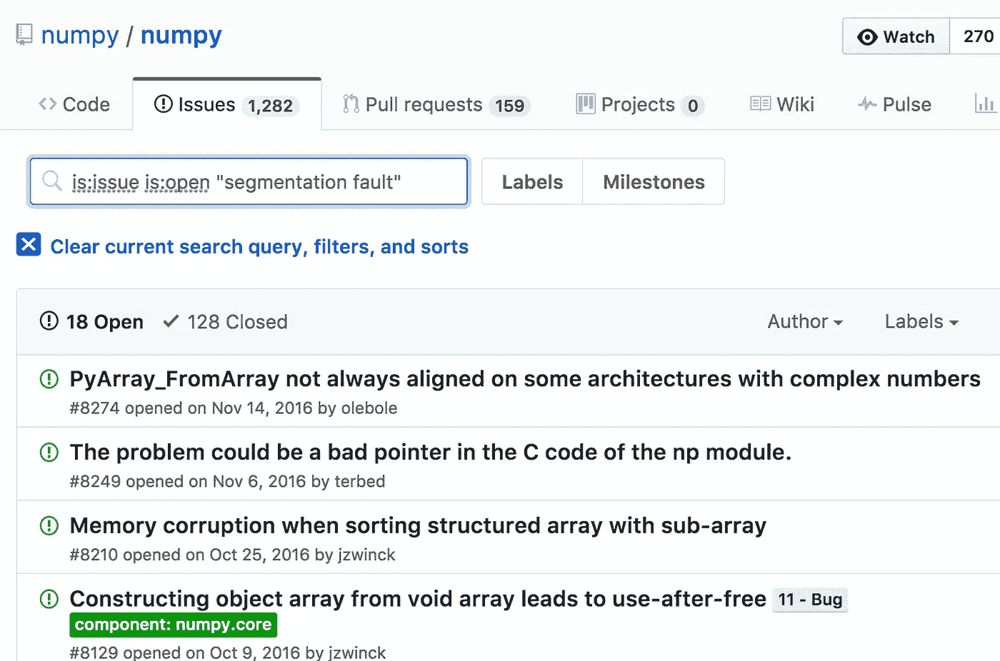
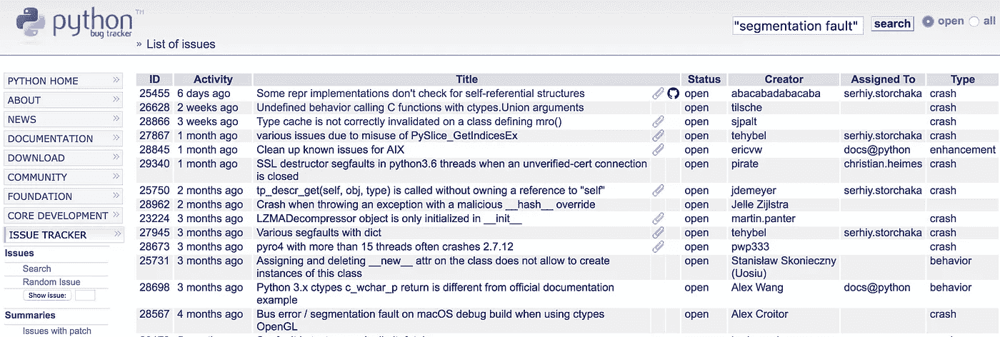
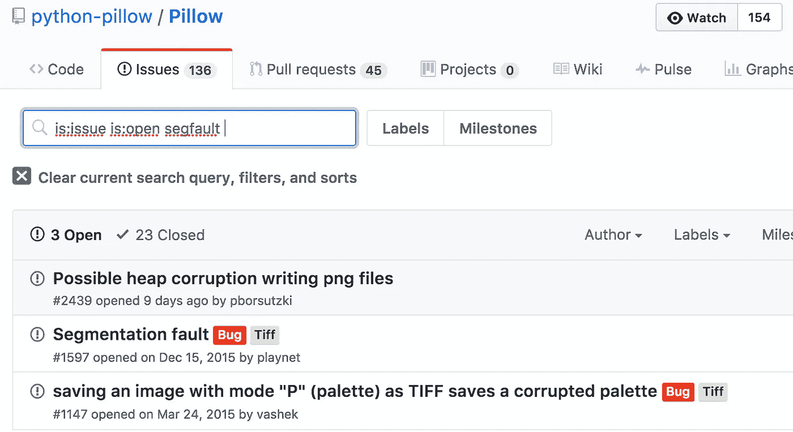

# 逃离带有内存损坏错误的 Python 沙盒

> 原文：<https://medium.com/hackernoon/python-sandbox-escape-via-a-memory-corruption-bug-19dde4d5fea5>

几周前，我决定挠一挠已经痒了一段时间的痒——参加一些臭虫奖励计划。也许 bug bounty 游戏中最艰巨的任务是选择一个投资回报率最高的程序。不过不久，我偶然发现了一个在 [Python](https://hackernoon.com/tagged/python) 沙箱中执行用户提交代码的 web 应用程序。这看起来很有趣，所以我决定继续下去。

Let me out of this god-forsaken sandbox!

经过一段时间的探索，我发现了如何通过对 Python 层的一些攻击来打破沙盒。报告存档。几天之内，bug 被修复，还有丰厚的奖励。太棒了。我的昆虫赏金冒险之旅有了一个好的开始。但是这篇文章不是关于那份报告的。总而言之，从技术角度来看，我发现的问题并不那么有趣。事实证明，这些问题只是因为回归才出现的。

但是我不相信保护 Python 沙盒会这么容易。在不涉及太多细节的情况下，沙箱使用了操作系统级隔离和锁定 Python 解释器的组合。Python 环境使用定制的白名单/黑名单方案来防止对未屏蔽的内置、模块、函数等的访问。基于操作系统的隔离提供了一些额外的保护，但以今天的标准来看已经过时了。突破锁定的 Python 解释器并不是 100%的胜利，但是它使攻击者危险地接近能够危害整个系统。

所以我回到应用程序，并刺激了一些。运气不好。这的确是一块难啃的饼干。但是后来我有了一个想法——Python 模块通常只是堆积如山的 C 代码库的薄薄的包装。肯定有一些内存损坏漏洞等着被发现。利用一个内存损坏错误可以让我脱离受限的 Python 环境。

从哪里开始？我知道一组 Python 模块，它们被列入白名单，可以在沙箱中导入。也许我应该运行一个 AFL fuzzers 的分布式网络？还是符号执行引擎？或者我应该用最先进的静态分析工具扫描它们？当然，我可以做任何这些事情。或者我可以只查询一些错误追踪器。

原来我在开始狩猎时没有这种后知之明，但这并不重要。我的直觉告诉我，通过手动代码审查和测试，在沙箱的白名单模块之一中发现了一个可利用的内存损坏漏洞。这个 bug 在 Numpy 中，它是科学计算的基础库，是许多流行软件包的核心，包括 scipy 和 pandas。为了大致了解 Numpy 作为内存损坏 bug 的潜在来源，让我们来看看代码行数。

Nearly 200,000 lines of C code. Surely there are some juicy bugs in here!

在这篇文章的剩余部分，我首先描述导致漏洞的条件。接下来，我将讨论开发人员应该注意的 CPython 运行时的一些奇怪之处，然后我将介绍实际的开发。最后，我总结了在 Python 应用程序中量化内存损坏风险的想法。

# 漏洞

我要介绍的漏洞是 Numpy v1.11.0(可能还有更老的版本)中的一个整数溢出错误。该问题自 1.12.0 版以来已得到修复，但没有发布[安全](https://hackernoon.com/tagged/security)建议。

该漏洞存在于用于调整 Numpy 的类似多维数组的对象、`ndarray`和朋友的 API 中。使用定义数组的*形状*的元组调用`resize`，其中元组的每个元素都是一个维度的大小。

*旁注:是的，数组正在泄漏未初始化的内存，但是我们不会在这篇文章中关注这个问题。*

在幕后，`resize`实际上是一个缓冲区，其大小计算为形状元组中每个元素与元素大小的乘积。所以在前面的代码片段中，`arr.resize((2, 3))`归结为 C 代码`realloc(buffer, 2 * 3 * sizeof(int32))`。下一个代码片段是用 c 语言大量解释的`resize`实现。

发现漏洞？您可以在 for 循环(第 13 行)中看到，每个维度都被相乘以产生新的大小。稍后(第 25 行),新大小和元素大小的乘积作为大小传递给保存数组的`realloc`内存。在`realloc`之前，对新的大小有一些验证，但是它不检查整数溢出，这意味着非常大的维度可能导致分配的数组大小不足。最终，这给了攻击者一个强大的利用原语:通过从溢出大小的数组中进行索引来读取或写入任意内存的能力。

让我们开发一个快速的概念证明来证明 bug 的存在。

# CPython 运行时的古怪之处

在我们开始开发漏洞利用之前，我想讨论一下 CPython 运行时简化漏洞利用的一些方法，以及它挫败漏洞利用开发人员的一些方法。如果您想直接研究这个漏洞，请随意跳过这一部分。

## 泄漏内存地址

通常，漏洞利用必须解决的第一个障碍是挫败地址空间布局随机化(ASLR)。对攻击者来说幸运的是，Python 让这变得很容易。内置的`id`函数返回一个对象的内存地址，或者更准确地说是封装该对象的`PyObject`结构的地址。

在现实世界的应用程序中，开发者应该确保不向用户公开`id(object)`。在沙盒环境中，你对这种行为无能为力，也许除了将`id`列入黑名单或者重新实现`id`来返回散列。

## 了解内存分配行为

理解您的分配器对于编写漏洞是至关重要的。Python 根据对象类型和大小有不同的分配策略。让我们看看我们的大字符串`0xa52cd0`、小字符串`0x7ffff7f65848`和 numpy 数组`0x7ffff7e777b0`在哪里着陆。

Big string is in the regular heap. Small string and numpy array are in separate mmap’d regions.

## Python 对象结构

泄漏和破坏 Python 对象元数据可能非常强大，因此了解 Python 对象是如何表示的非常有用。在幕后，Python 对象都源自`PyObject`，这是一个包含引用计数和对象实际类型描述符的结构。值得注意的是，类型描述符包含许多字段，包括函数指针，这对于读取或重写是很有用的。

让我们检查一下我们在上一节中创建的小字符串。

Lots of useful fields to read or write —type pointer, function pointers, data pointers, sizes, and more.

## 伪装成 1999 年的样子

ctypes 库是 Python 和 C 代码之间的桥梁。它提供 C 兼容的数据类型，并允许调用 dll 或共享库中的函数。许多具有 C 绑定或需要调用共享库的模块需要导入 ctypes。

我注意到导入 ctypes 会导致映射一个 4K 大小的内存区域，并设置读/写/执行权限。如果这还不明显的话，这意味着攻击者甚至不需要编写 ROP 链。假设您已经定位了 RWX 区域，那么利用 bug 就像将指令指针指向您的外壳代码一样简单。

自己测试一下吧！

通过进一步的调查，我发现 [libffi 的闭包 API](http://www.chiark.greenend.org.uk/doc/libffi-dev/html/The-Closure-API.html) 负责[RWX 区域的](https://github.com/libffi/libffi/blob/master/src/closures.c#L762)。但是，在某些平台上不能为该区域分配 RWX，例如带有 selinux enforced 或 PAX mprotect enabled 的系统，有代码可以解决这一限制。

我没有花太多时间来尝试可靠地定位 RWX 映射，但理论上，如果您有一个任意读取的漏洞利用原语，这应该是可能的。当 ASLR 应用于库时，动态链接器以可预测的顺序映射库的区域。库的区域包括库和代码本身私有的全局变量。Libffi 将对 RWX 区域的引用存储为一个全局。例如，如果您在堆上找到一个指向 libffi 函数的指针，那么您可以预先计算 RWX 区域指针的地址，作为 libffi 函数指针地址的偏移量。需要为每个库版本调整偏移量。

## 事实上的漏洞缓解

我在 Ubuntu 14.04.5 和 16.04.1 上测试了 Python2.7 二进制文件的安全相关编译器标志。有几个弱点对攻击者非常有用:

*   Partial RELRO:可执行文件的[get 部分](https://www.technovelty.org/linux/plt-and-got-the-key-to-code-sharing-and-dynamic-libraries.html)，包含指向动态链接到二进制文件的库函数的指针，是可写的。例如，漏洞利用可以用`system()`替换`printf()`的地址。
*   没有馅饼:二进制文件不是独立于位置的可执行文件，这意味着当内核将 ASLR 应用于大多数内存映射时，二进制文件本身的内容被映射到静态地址。因为 GOT 部分是二进制文件的一部分，所以没有 PIE 可以让攻击者更容易地定位和写入 GOT。

## 路障

虽然 CPython 是一个为漏洞开发者准备的充满工具的环境，但是有一些力量破坏了我的许多漏洞尝试，并且很难调试。

*   如果您不小心破坏对象元数据，垃圾收集器、类型系统以及可能的其他未知力量将会破坏您的漏洞。
*   `id()`可以靠不住。出于我无法确定的原因，Python 有时会在使用原始对象时传递对象的副本。
*   分配对象的区域有些不可预测。出于我无法确定的原因，某些编码模式导致在`brk`堆中分配缓冲区，而其他模式导致在特定于 python 的`mmap`堆中分配缓冲区。

# 利用

在发现 numpy 整数溢出后不久，我向 bug bounty 提交了一份报告，提供了劫持指令指针的概念证明，但没有注入任何代码。当我最初提交时，我没有意识到 PoC 实际上相当不可靠，并且我无法在他们的服务器上正确地测试它，因为验证指令指针的劫持需要访问核心转储或调试器。供应商承认这个问题的合法性，但是他们给的奖励没有我第一份报告给的多。

很公平！

我不是一个真正的漏洞开发者，但我挑战自己做得更好。经过反复试验，我终于写出了一个看起来可靠的漏洞。不幸的是，我从来没有能够在供应商的沙箱中测试它，因为他们在我完成之前更新了 numpy，但是当在 Python 解释器中进行本地测试时，它确实可以工作。

在高级别上，该漏洞利用通过溢出 numpy 数组的大小来获得任意读/写漏洞利用原语。该原语用于将`system`的地址写入`fwrite`的 GOT/PLT 条目。最后，Python 的内置`print`在幕后调用`fwrite`，所以现在你可以调用`print '/bin/sh'`来获得一个 shell，或者用任何命令替换/bin/sh。

除了高层次的解释之外，还有更多的东西，所以请查看下面的完整漏洞利用。我建议从下往上开始阅读，包括评论。如果您使用的是不同版本的 Python，请在运行之前调整`fwrite`和`system`的 get 位置。

运行漏洞会给你一个“被黑”的外壳。

If you are not running Python 2.7.12, see comments inside the exploit for how to make it work for your Python version.

# 量化风险

众所周知，Python 的大部分核心和许多第三方模块都是 C 代码的薄薄的包装。可能较少被认识到的事实是，在流行的 Python 模块中，内存损坏错误总是被报告，甚至没有 CVE、安全建议，甚至在发行说明中没有提到安全修复。

所以没错，Python 模块里有很多内存崩溃的 bug。当然不是所有的都可以利用，但是你必须从某个地方开始。为了解释内存损坏错误带来的风险，我发现用两个不同的用例来组织对话是有帮助的:常规 Python 应用程序和沙箱化不可信代码。

## 常规应用

我们关注的应用程序类型是那些具有有意义的攻击面的应用程序。想想 web 应用程序和其他面向网络的服务，处理不可信内容的客户端应用程序，特权系统服务等。这些应用程序中的许多都从项目中导入了针对堆积如山的 C 代码构建的 Python 模块，而这些项目并没有将它们的内存损坏错误视为安全问题。这种纯粹的想法可能会让一些安全专业人员夜不能寐，但在现实中，这种风险通常被淡化或忽略。我怀疑有几个原因:

*   远程识别和利用内存损坏问题的难度非常高，尤其是对于闭源和远程应用程序。
*   应用程序暴露不受信任的输入到达易受攻击的函数的路径的可能性可能非常低。
*   意识很低，因为 Python 模块中的内存损坏错误通常不作为安全问题来跟踪。

公平地说，由于某个随机 Python 模块中的缓冲区溢出而受到危害的可能性很低。但话说回来，内存损坏缺陷一旦发生，可能会造成极大的破坏。有时甚至不需要任何人明确地利用它们来造成伤害。更糟糕的是，当库维护者不考虑安全方面的内存损坏问题时，几乎不可能给库打补丁。

如果您开发了一个主要的 Python 应用程序，我建议您至少清点一下正在使用的 Python 模块。尝试找出您的模块对 C 代码的依赖程度，并分析本机代码暴露在应用程序边缘的可能性。

## 沙盒

有许多服务允许用户在沙箱中运行不受信任的 Python 代码。操作系统级沙盒特性，如 linux 命名空间和 seccomp，只是最近才以 Docker、LXC 等形式流行起来。不幸的是，较弱的沙盒技术今天仍在使用——以 chroot jails 的形式出现在操作系统层，或者更糟的是，沙盒可以完全在 Python 中完成(参见 [pypy-sandbox](http://doc.pypy.org/en/latest/sandbox.html) 和 [pysandbox](https://github.com/haypo/pysandbox) )。

内存损坏错误完全破坏了沙盒，而沙盒不是由操作系统强制执行的。执行 Python 代码子集的能力使得利用比在常规应用程序中更可行。甚至 pypy-sandbox 也可能被缓冲区溢出破坏，pypy-sandbox 声称是安全的，因为它的双进程模型虚拟化了系统调用。

如果您想运行任何类型的不受信任的代码，请努力构建一个安全的操作系统和网络架构来保护它。

> [黑客中午](http://bit.ly/Hackernoon)是黑客如何开始他们的下午。我们是 [@AMI](http://bit.ly/atAMIatAMI) 家庭的一员。我们现在[接受投稿](http://bit.ly/hackernoonsubmission)，并乐意[讨论广告&赞助](mailto:partners@amipublications.com)机会。
> 
> 如果你喜欢这个故事，我们推荐你阅读我们的[最新科技故事](http://bit.ly/hackernoonlatestt)和[趋势科技故事](https://hackernoon.com/trending)。直到下一次，不要把世界的现实想当然！

