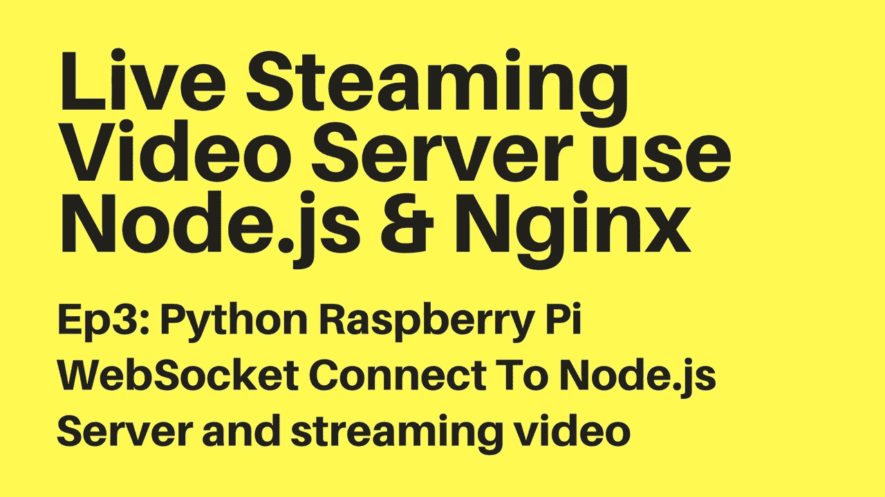

# Python WebSocket 客户端连接到 Node.js WebSocket 服务器 WebSocket

> 原文：<https://medium.com/hackernoon/python-websocket-client-connect-to-node-js-websocket-server-%C2%B5websocket-2580012901e2>

为从摄像机到服务器的 Raspberry Pi 实时流视频构建 Python 应用程序



使用 Python 语言为 RaspberryPi 3，pi Zero w 设置和创建从摄像机到服务器的视频流应用程序。

## 设置直播视频流的服务器

看到这个[帖子](https://hackernoon.com/nginx-nginx-rtmp-module-ffmpeg-build-live-video-streaming-server-88a52f7bab6f)

## Python 开发工具

我推荐你和我使用 Pycharm。只需下载社区版，它是免费的【https://www.jetbrains.com/pycharm/download 

## 在开发环境中设置 Python

当我们将应用程序部署到 Raspberry Pi 时，我们不需要安装 Python，因为它在默认情况下是在 MacOs & on Raspberry Pi 设备上启用的。(Pi 3，Pi Zero W…)在这里下载安装 Python【https://www.python.org/downloads/

## 设置 Pip (Python 包索引)

我们使用 Pip 来管理所有的 python 包，所以要设置 Pip 只需遵循这个[https://pip.pypa.io/en/latest/installing/](https://pip.pypa.io/en/latest/installing/)对于 Ubuntu 或其他 linux，我推荐遵循这个文档:[https://packaging . python . org/guides/installing-using-Linux-tools/# installing-Pip-setup tools-wheel-with-Linux-package-managers](https://packaging.python.org/guides/installing-using-linux-tools/#installing-pip-setuptools-wheel-with-linux-package-managers)

```
curl https://bootstrap.pypa.io/get-pip.py -o get-pip.pysudo python get-pip.py
```

## Websocket 客户端库

autobahn-python 是一个很好的库，我们将在这个项目中使用 Websocket 客户端[https://github.com/crossbario/autobahn-python](https://github.com/crossbario/autobahn-python)，所以我们的 RaspberryPi 将连接到 websocket 服务器作为客户端。我们可以控制它捕捉视频/图片或随时停止。我们可以检查它的状态是连接到互联网还是离线。

```
pip install autobahn[twisted]
```

在 MacOs 上，如果运行该命令后出现错误，请使用以下命令

```
pip install autobahn[twisted] --user
```

## 我们将使用的 Python 库

高速公路，扭曲，子流程

> **示例代码使用子流程**

```
cmd = 'ffmpeg -re -i /Users/toan/Tutorials/stream/video.mkv -c:v libx264 -preset veryfast -maxrate 3000k -bufsize 6000k -pix_fmt yuv420p -g 50 -c:a aac -b:a 160k -ac 2 -ar 44100 -f flv rtmp://localhost/live/tabvn'
subprocess.call(cmd, shell=True)
```

> 或者使用 Popen

```
cmd = 'ffmpeg -re -i /Users/toan/Tutorials/stream/video.mkv -c:v libx264 -preset veryfast -maxrate 3000k -bufsize 6000k -pix_fmt yuv420p -g 50 -c:a aac -b:a 160k -ac 2 -ar 44100 -f flv rtmp://localhost/live/tabvn'
streaming_process = subprocess.Popen(cmd, shell=True, stdin=subprocess.PIPE)
```

## Websocket 客户端的示例 Python 应用程序

> 观看视频:[https://www.youtube.com/watch?v=cV8uwjV4kaE](https://www.youtube.com/watch?v=cV8uwjV4kaE)
> 
> github:[https://github.com/tabvn/video-streaming-service](https://github.com/tabvn/video-streaming-service)