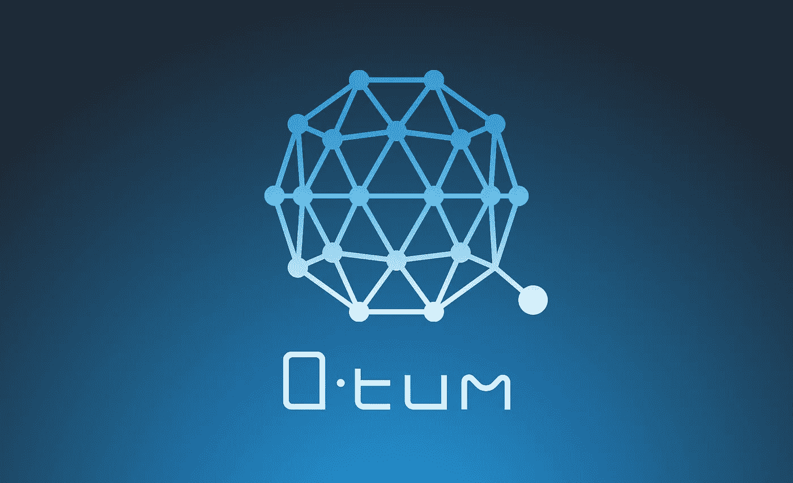

# QTUM:构建更好的区块链治理

> 原文：<https://medium.com/hackernoon/qtum-building-a-better-blockchain-governance-e2188cc34422>

比特币存在治理问题。

中本聪透过时间的迷雾看到了未来。他看到了一切，从小额支付的兴起到 T2 的 ASICs 统治采矿业的必然性。

但是他忽略了这个难题的一个关键部分:

我们*如何改变系统* *本身*？

换句话说，我们如何同意改变比特币软件？

现在，一个名为 [QTUM](https://qtum.org/en/) (量子的简称)的新社区认为他们找到了答案。他们迅速取得了早期 ICO 的成功，通过融合以太坊虚拟机的灵活性和比特币区块链的稳定性，筹集了 1500 万美元。但是要理解他们计划如何解决治理问题，我们首先需要理解我们是如何走到这一步的。

记住比特币是去中心化的。这意味着有许多有着截然不同议程的人掌握着王国的钥匙。也有敌对的演员，也有好的。在比特币的世界里，人们必须同意升级系统。实际上很多人都同意。例如，90%的人必须发出信号支持 [SegWit 升级才能上线](http://segwit.co/)。

支持率目前不到 50%。

还有一个替代提案 SegWit2X，也称为[纽约协议](https://cointelegraph.com/news/bitcoin-miners-agree-in-ny-on-segwit-activation-before-september-sources)，因为一个有影响力的企业和矿工团体在纽约市举行的 2017 年共识会议上宣布了这一提案。现在，奇迹般地， [90%的矿工都在为 SegWit2X](http://www.bitsonline.com/bitcoin-miner-segwit2x-block-size/) 发信号，它打算实现 SegWit 和一个 2MB 的区块链硬分叉。

如果能保持下去，那将是一个惊人的成就。这意味着一群人中 90%的人设法在某件事情上达成一致。

我想让你明白这对人类来说是多么的独特。

人们几乎不能就任何事情达成一致，更不用说任何重要的事情了。见鬼，把六个人放在一个房间里，看他们试着选择一家餐馆吃饭。

看看今天美国的政治是多么的两极化。1994 年，只有 30%的自由派在大多数问题上坚持“自己的立场”，而保守派的这一比例为 45%。但到了 2015 年，60%的自由派几乎对所有事情都采取强硬立场，53%的保守派也是如此。这使得达成妥协几乎是不可能的。共识就是妥协。这是民主的本质。

图片来自皮尤研究中心。

美国的开国元勋们为宪法改革设置了一个非常高的门槛——三分之二的多数——因为他们知道*几乎不可能让三分之二的人同意除了最重要的问题。*

即使比特币设法让*升级*，其他问题可能永远达不到所需的 90%同意。

可能有很多原因。这可能仅仅是因为这个问题太专业了，普通人无法正确理解。这可能是政治性的，例如，一项似乎会让加密货币变得更加集中或不那么稳健的变化。这可能是经济上的，例如降低费用的改变。那么即使这种改变对网络来说是有价值的，矿工也不会站在背后支持它，因为这是从他们的口袋里拿钱。

这些失败中的任何一个或全部都可能困扰加密公司多年，使他们更难获得牵引力或规模来满足社区的需求。我们需要一个更好的加密管理协议。

QTUM 是新一代加密货币的一部分，它希望从一开始就在系统中建立监管。第二个是 Tezos，由一些大的风险投资公司支持，目前在他们的 ICO 上赚了很多钱。但是这两个项目对治理的工作方式采取了非常不同的方法。

在这两种方法中，Tezos 是更激进的方法。根据其[立场文件](https://www.tezos.com/static/papers/position_paper.pdf)，它看起来“尽可能以最通用的方式代表区块链协议，同时试图保持与本地协议一样的效率。”它将其网络分为三部分:

1.  网络
2.  共识；一致
3.  处理

该网络定义了诸如块大小和交易多快被确认之类的事情。该网络定义了共识方法，如工作证明与利益证明。最后，事务概述了什么使事务有效。

Tezos 希望让一切都变得开放，从相对无争议的 1MB 到 2MB 的迁移，到无限更具挑战性和棘手的变化，如使交易有效的本质。想象一下，如果比特币上的每个人都可以投票，突然从工作证明转向股权证明，会怎么样？这是 Tezos 承诺给予其社区的权力。

虽然从长远来看，这可能是一个最终主宰世界的区块链将如何运行，但它确实回避了一个问题，即我们现在是否为这样的权力做好了准备。目前，在当今世界的任何地方，都没有类似的参考模型。所以我预见前方的路会崎岖不平，即使这条路值得一走。

相比之下，QTUM 项目的联合创始人之一[乔丹·厄尔斯](https://themerkle.com/qtum-co-founder-jordan-earls-we-hope-to-unify-different-cryptocurrency-communities/)告诉我，他们采取了一种更加“保守的方法”他们不想“动作太快，弄坏东西。”

“快速行动，打破常规”是今天 DevOps 风格的网络应用程序的口头禅，由 Gene Kim 和凤凰计划推广，但当有数十亿美元处于危险之中时，它就不那么管用了，任何变化都可能导致人们损失金钱。

QTUM 选择关注争议较小的网络部分的变化，如改变区块大小，以及系统的基本经济学，如为运行以太坊 [Solidity](https://solidity.readthedocs.io/en/develop/) 智能合约设定最低“天然气”价格。他们不允许对区块链的运行方式进行核心改变，而是着眼于“优化区块链的运行，并能够对攻击做出快速反应”

例如，当有人在合同中发现一个漏洞，让他们只花几便士就能在网络上获得处理能力时，你就受到了 DDoS 攻击。QTUM 希望调整天然气价格，以迅速粉碎这种对网络的攻击，这是以太坊最近一直在努力解决的问题。他们的 [testnet 刚刚上线](https://github.com/qtumproject/qtum/releases/tag/testnet-sparknet)，所以如果你是一名开发者，你现在就可以开始摆弄代码了。

他们还内置了一些更强大的变化，但还没有准备好发布。下一个你首先在这里听到的，因为他们还没有宣布，因为它还没有完全烤熟，它仍然只是在测试代码中休眠。他们称之为“共同利益的证明”这样做的目的是防止网络上出现垃圾交易。现在，谁创造了这个街区，谁就能得到所有的费用。因此，如果攻击者能够在链中获得一个区块，他们就可以通过这些交易冲击网络而受益。

互助 PoS 设置它，以便与其他赌注者分享费用。这使得对网络的攻击更加昂贵。创建一个街区后，你的地址在区块链注册，500 个街区后，你将获得 10 英镑的交易费和铸造硬币奖励。这是对奖励和激励系统的一种修正。矿工得到一些费用，但随机的一群其他矿工也一样。因此，该网络受到激励，与其他矿商分享一部分费用。

对于主测试网来说，它还不够稳定，但是希望能很快看到它投入使用。

最后，QTUM 确实计划进行更彻底的升级，比如让系统监控块大小，并在需要时自动触发投票来增加块大小。他们也想找出一种动态调整油价的方法，但乔丹告诉我，他们现在已经搁置了，因为他们还没有找到一种真正有效的方法。

所有这些都是区块链创新的“越简单越好”的方法。QTUM 不想马上采用最激进的技术。他们不想让他们的用户成为试验品。相反，当他们完全充实并顺利工作时，他们会从其他项目中吸取最好的想法。

这很像企业软件方法。与其采用当前令人喜爱的开源项目的技术，不如让赢家和输家相互交流，而不是试图预先挑选赢家。

如果 QTUM 是正确的，他们可能会有更好的区块链治理的答案。这是整个区块链社会所需要的。

在一个加密货币价格每天都在大幅波动的世界里，一点点坚如磐石的长期稳定可能会大有帮助。

###########################################

## 如果你和我一样热爱加密，那就来吧，加入 [DecStack，这是一个虚拟的加密货币和分散应用项目的合作场所](http://decstack.com/)，在这里你可以接触到这个领域的多个项目。永远完全免费。只是进来和社交，一起工作，分享代码和想法。通过反馈让你的想法更好。寻找新朋友。见见你的新家人。

############################################

**对于 QTUM Slack，你可以在这里** **获得你的邀请链接** [**。**](https://qtumslack.herokuapp.com/)

############################################

**如果你喜欢这篇文章，我很乐意你能打小心脏推荐给别人。之后，请随时将文章通过电子邮件发送给朋友！非常感谢。**

############################################

关于我:我是一名作家、工程师和连续创业者。在过去的二十年中，我涉及了从 Linux 到虚拟化和容器的广泛技术。

## 你可能会喜欢我的第一部小说《蝎子游戏》，因为它是免费的。读者称之为“神经癌的第一次严重竞争”和“像喝了几周掺水啤酒后的双份优质威士忌”

你也可以 [**加入我的私人脸书小组，纳米朋克后人类刺客**](https://www.facebook.com/groups/1736763229929363/) **，在这里我们讨论所有的科技、科幻、幻想等等。**

############################################

感谢阅读！

> [黑客中午](http://bit.ly/Hackernoon)是黑客如何开始他们的下午。我们是 [@AMI](http://bit.ly/atAMIatAMI) 家庭的一员。我们现在[接受投稿](http://bit.ly/hackernoonsubmission)并乐意[讨论广告&赞助](mailto:partners@amipublications.com)机会。
> 
> 如果你喜欢这个故事，我们推荐你阅读我们的[最新科技故事](http://bit.ly/hackernoonlatestt)和[趋势科技故事](https://hackernoon.com/trending)。直到下一次，不要把世界的现实想当然！

