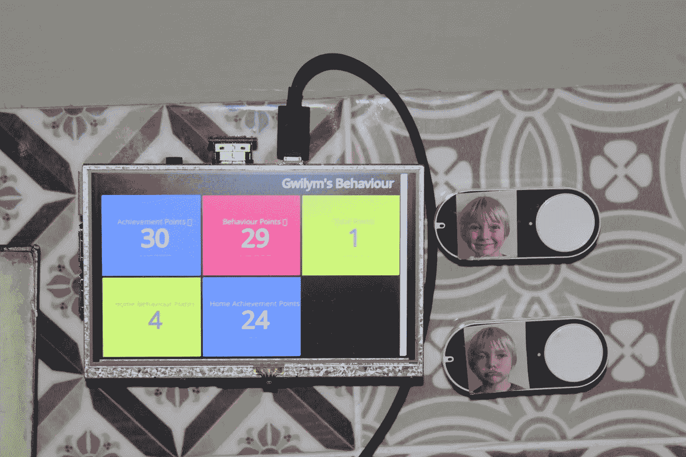

# 量化男孩

> 原文：<https://medium.com/hackernoon/quantified-boy-726e9558594f>

使用树莓派和亚马逊破折号按钮构建 21 世纪星图

这个世界充满了技术福音传播者，他们认为技术是我们的救赎之路。面对任何问题，他们认为你需要做的就是抹上一点科技，然后问题就消失了。我不是那种人，但我喜欢认为我正在帮助我的儿子在学校表现得更好，这都要归功于一个树莓派、几个[亚马逊 dash 按钮](https://www.amazon.co.uk/b?ie=UTF8&node=10833773031)和一些我在工作中编写的[软件](http://bothan.io/)。

我儿子的学校有一个行为和奖励积分系统。表现好的奖励成绩分，表现不好的奖励行为分。这都是登录在一个由凯德建立的可怕的专有系统上的。自从他去年开学，我就决定建一个 screen scraper 来监控这个系统。然后，如果那天有任何问题，它会给我和我的妻子发电子邮件，并在我自己安装的 [Bothan](http://bothan.io/) 中记录这些要点，这是我在工作中帮助构建的一个系统，用于跟踪和可视化指标。然后，我可以在仪表板上可视化这些点，省去了我每天登录可恶的学校系统的痛苦(你可以在 Github 上看到[代码](https://github.com/pezholio/gboard))。

这种方法相当有效，在我儿子上学的第一年里，它一直在后台运行(可能为我节省了很多时间)。然而，当我的儿子一年级时，我意识到我们需要一些别的东西。

在他上学的头几个星期，他已经积累了 29 个行为点，不是任何类型的主要顽皮，只是低水平的厚脸皮和乱搞，你知道，五岁孩子做的那种事情。不管我是否同意学校的做法，我知道我需要帮助他在学校变得更好。

因此，我和妻子决定在家里建立我们自己的行为和成绩积分系统——如果他在学校过得不好，他会得到一个行为积分(不像学校因为他的不端行为给他五分)，如果他过得好，他会得到两个奖励积分(我儿子对胡萝卜的反应比大棒好得多)。我们也会因为他在家里的总体表现给他加分。如果他在 11 月底(他的生日)之前获得一定数量的奖励积分，他就可以和所有的朋友一起举办一个大型的生日聚会。

接下来的问题是，我们如何以一种吸引他的方式记录这些点？我们以前尝试过星图，它们在几周内都很好，但后来新鲜感消失了，星图变得破旧，他最终脱离了整个过程。幸运的是，亚马逊 dash 按钮刚刚在英国发布，我很想找个借口用它们做点什么。

我点了两个按钮，加上一个树莓派 3，并开始工作。每当我着手这种性质的项目时，我总是会使用我觉得舒服的语言，那就是 Ruby。在我的 Pi 上安装了一个现代版的 Ruby 之后，我安装了[虚线宝石](https://github.com/kenyonj/dashed)，并按照说明进行设置。然而，无论我做什么，我都不能让它工作。在一番疯狂的谷歌搜索之后，我发现 Dash 按钮中的固件发生了变化，协议从 ARP 切换到了 UDP。我还发现了一个[节点库](https://github.com/hortinstein/node-dash-button)，它得到了更好的支持，并且附带了很棒的文档，所以我决定使用它。

在我的 Pi 上安装了 Node 和 node-dash-button 库，以及 libpcap(嗅探网络流量所需要的)，接下来我需要做的是设置我的 dash 按钮。我打开了亚马逊应用程序，在设置中，有一个设置你的 dash 按钮的链接。这使你的按钮通过你的 WiFi 网络连接到网络，并允许你每次按下按钮时选择你想要订购的产品。

我跳过了最后一步，按照指示在我的 Pi 上运行“node _ modules/node-dash-button/bin/find button ”,嗅探我的网络以获取我的按钮的 MAC 地址。我依次按下每个按钮，毫不费力地得到了这些按钮的 MAC 地址。

然后是我最喜欢的部分，写代码。我做的第一件事是捕捉每个按钮的按下并记录到控制台，以检查一切是否正常:

```
var dash_button = require('node-dash-button');
var bad_button = '' // The MAC address for the good button goes here
var good_button = '' // The MAC address for the bad button goes herevar dash = dash_button([bad_button, good_button], null, null, 'all');dash.on("detected", function (dash_id){
  if (dash_id === bad_button){
      console.log("Naughty!")
  } else if (dash_id === good_button){
      console.log("Good!");
  }
});
```

我保存了这个文件(作为 index.js ),并通过“sudo node index.js ”(您需要 sudo，因为 libpcap 需要管理员权限)从命令行运行代码，令我惊讶的是，它竟然成功了！我确实遇到了一个问题，每次我按下按钮时，我都会在手机上收到亚马逊应用程序的唠叨推送通知，告诉我完成设置按钮，但幸运的是，你可以在亚马逊应用程序设置中关闭这一功能。下一步是在某个地方记录这些按钮按压。

我之前提到过[博塔恩](http://bothan.io/)。我已经把学校的分数记录在那里了，所以把家里的分数也存储在那里是有意义的。

Bothan 最初是一个简单的 API，用于开放数据研究所记录财务和其他指标，然后我们构建了可视化组件(因此您可以将数据视为图表、饼图、简单数字或目标图)，最后是一个仪表板构建工具。任何人都可以部署他们自己版本的 Bothan，并且通过一个简单的 REST API 添加指标。我需要利用这个 REST API 来记录分数，因此，有了 [request](https://github.com/request/request) 库，我开始工作并编写了一个方法来获取行为或优点的当前分数，加 1，然后将最新的数据推送到 Bothan:

```
var bothan_url = '' // The URL of your Bothan install
var bothan_username = '' // The URL of your Bothan install
var bothan_password = '' // The URL of your Bothan installvar postPoint = function(metric) {
  var bothanURL = bothan_url
  var metricURL = bothanURL + '/metrics/' + metric + '.json'
  var date = new Date() request(metricURL, function(error, response, body) {
    json = JSON.parse(body)
    value = (json == null) ? 0 : json.value request.post(metricURL, {
      auth: {
        user: bothan_username,
        pass: bothan_password
      },
      json: {
        time: date.toISOString(),
        value: value + 1
      }
    })
  })
}
```

(我意识到获取最新的指标并添加一个指标(以及一个额外的 HTTP 请求)是一件很麻烦的事情，所以我想对 Bothan 做的一个改进是添加一个/append API 方法，只给一个给定的指标添加一个指标)

使用这种方法，只需要调用带有度量名称的方法来记录 Bothan 的行为或优点，就像这样:

```
dash.on("detected", function (dash_id) {
  if (dash_id === bad_button){
    console.log("Naughty!")
    postPoint('home-behaviour-points')
  } else if (dash_id === good_button){
    console.log("Good!");
    postPoint('home-acheivement-points')
  }
});
```

然后，我添加了一个带有依赖项的 package.json 文件，以及一个脚本定义，这样代码就可以通过 npm start 运行，然后查看如何在引导时在我的 Pi 上自动运行它。我以前在其他项目中也这样做过(比如 [Ellie Harrison 的](http://www.ellieharrison.com/)自动售货机艺术作品，我和一个同事在驱动它的原始笔记本电脑坏了之后重新设计了它)，并使用了 init.d 脚本，但这看起来有点大材小用。这一次，我只是在/etc/rc.local 中添加了以下命令，让脚本在后台愉快地运行:

```
cd /home/pi/quantified-boy && npm start &
```

(这里最后一个&很重要，因为它分叉了进程，否则 Pi 将只是运行这个脚本，永远不会正确引导)

我重新启动，测试，它的工作。拼图的最后一块是显示指标，所以我可以一眼看到我儿子做得怎么样，最重要的是，他可以在按下按钮后得到即时反馈。我使用 Bothan 的 dashboarding 特性来[构建一个仪表板](http://demo.bothan.io/dashboards/bothan)(在这里链接到一个演示)，并在~/中添加了以下内容。config/LX session/LXDE-pi/auto start 文件，以 kiosk 模式在 Chromium 中打开仪表板 URL，并阻止 Pi 进入睡眠状态，这样我就可以随时看到仪表板:

```
@xset s off
@xset -dpms
@xset s noblank
@chromium-browser --kiosk --incognito [http://demo.bothan.io/dashboards/bothan](http://demo.bothan.io/dashboards/bothan)
```

然后我重启 Pi，在启动完成后，我看到了我的仪表板。最后，我花了 27 英镑从亚马逊买了一个 5 英寸的屏幕，把所有东西都放在了厨房里:



大约一个星期过去了，我的儿子喜欢玩按钮(我说“按钮”，因为出于某种原因，他从来不想按行为点按钮)。他喜欢看到分数上升的即时满足感，这是让他超越正常星盘的好方法。

最终的代码可以在 Github 上的[这里](https://github.com/pezholio/quantified-boy/)获得，你可以通过 [bothan.io](https://bothan.io/) 安装你自己的免费 Bothan 实例。你可以用这个代码来测量任何东西。正如他们所说，唯一的限制是你的想象力！

[](http://bit.ly/HackernoonFB)[](https://goo.gl/k7XYbx)[](https://goo.gl/4ofytp)

> [黑客中午](http://bit.ly/Hackernoon)是黑客如何开始他们的下午。我们是 [@AMI](http://bit.ly/atAMIatAMI) 家庭的一员。我们现在[接受投稿](http://bit.ly/hackernoonsubmission)并乐意[讨论广告&赞助](mailto:partners@amipublications.com)机会。
> 
> 如果你喜欢这个故事，我们推荐你阅读我们的[最新科技故事](http://bit.ly/hackernoonlatestt)和[趋势科技故事](https://hackernoon.com/trending)。直到下一次，不要把世界的现实想当然！

[](https://goo.gl/Ahtev1)