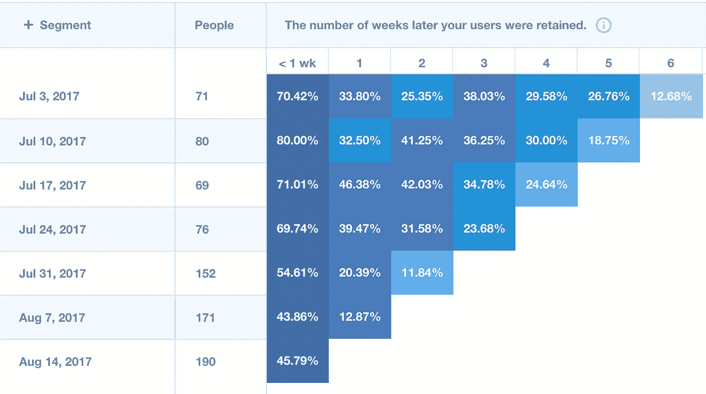

# 量化 YC 的“制造人们想要的东西”

> 原文：<https://medium.com/hackernoon/quantifying-ycs-make-something-people-want-2d07b7762f56>

Y Combinator 是世界上最著名的加速器之一。他们的口号和主要口号是“制造人们想要的东西”。起初，这一真理似乎是…真理。当然，如果你想建立一个可持续发展的公司，你应该制造人们想要的东西，否则没人会用它。

以下是我试图用一种对企业家可行的方式来解释“制造人们想要的东西”。

我的主要体会是“制造人们想要的东西”是 YC 给出的建议的集合。他们给出的几乎每一条建议都是针对这一点的。
在过去的几个月里，我花了一些时间去了解 YC。我读了[保罗·格拉厄姆的散文](http://www.paulgraham.com/articles.html)(YC 的创始人)，听了[山姆·奥特曼](https://en.wikipedia.org/wiki/Sam_Altman) (YC 总统)和其他 YC 合伙人的演讲和采访，参加了 YC 的就职[创业学校](https://www.startupschool.org/)(注意创业学校和“真实的”YC 是不同的。我没有参加 YC。).虽然这不应该被视为教条，但我认为他们有一些令人信服的建议。

YC 重复的一些比较著名的句子是:

*“做一个 100 个人喜欢的东西，不如做一个 1000 个人喜欢的东西。”(或其任何变体)*

*“与你的用户交流。每周和 100 个用户聊天。”(或其任何变体)*

*“关注每周的收入增长(如果你没有收入，则关注最接近的收入指标)。”*

*“为什么人们会在意你做的事情？”(换句话说，你的价值主张是什么，你在解决什么问题)*

“做一些能解决你自己问题的东西。”

*“尽快发射。”*

最终，这一切都围绕着制造人们需要(因此想要)的东西。你如何确定人们需要什么？很简单，找出人们的问题并提供解决方案。如何发现存在哪些问题？没什么大不了的，就看看自己有什么问题或者找一堆人聊聊问问。显然，这并不像听起来那么简单。

## 你的 H(0)几乎总是错的

通常，如果你开了一家新公司，你会从一个存在问题的假设开始，并且你的解决方案是一个比现有方案更好的解决方案。你的假设正确的可能性很小。毕竟，你怎么会知道呢？

所以你建造了一些东西，然后给人们使用。现在，你需要与使用你产品的人交流，而不是仅仅遵循你最初的产品计划。问他们为什么-问题。深入挖掘。问他们十个为什么的问题(就像一个小孩不停地问)。理解他们回答的潜在原因。

不管你有 10 个、100 个还是 1000 个初始用户，只要你有十几个忠实的超级粉丝。确保你的产品满足他们的需求。然后开始扩展，接纳越来越多需求略有不同的用户。就像火从中间开始，循环生长。这就是为什么我相信这个建议:“做一件 100 个人喜欢的东西比做一件 1000 个人喜欢的东西要好。”是一个很不明显但很有力的建议。

获得 10，000 名用户并不难，但获得 10，000 名长期使用你的产品的用户就很难了。如果你开始增加用户(例如，通过广告或其他付费渠道),而这些用户在一周后就离开了，那你的钱就打水漂了。但是，如果你确保用户留下来，那么每个新用户都更有价值，因为你知道你的产品正在解决他们的问题，他们会继续使用它。

这就是为什么我认为衡量你的留存率的增长比衡量新用户的增长重要得多。当然，最终需要一个正确的平衡——但在开始时，这才是最重要的。这很难，因为说你有 1000 名每周活跃用户比说你的 6 周留存增长了 10%要酷得多。

## 如何量化爱情？

留存！你如何衡量保持力？有不同的方法，但总的想法是，你采取一个特定的人在你的应用程序中做的动作(例如，打开它)，并查看他们在做了它之后保持这样做的频率。例如，你回顾六个星期，看看那个星期打开你的应用程序的所有人。之后，你查看直到今天的五周中的每一周，并测量这些用户中有多少人每周至少打开你的应用一次。几个分析工具可以帮助你轻松做到这一点。这是我们来自 [Mixpanel](https://mixpanel.com) 的真实留存报告:

Mixpanel’s weekly retention report (real numbers from [Humbot](https://humbot.io))

比如 17 年 7 月那一周，有 69 个人打开了我们的 app。四周后，23.19%的人又做了一次(截至本文写作时，这一周还没有结束)。

您现在的主要目标是确保列随着时间的推移而增长。因为这意味着人们越来越多地使用你的产品。

所以，每次你添加一个新功能或者做一个改变，你都可以观察它是让你的产品更有吸引力还是更没有吸引力。在 casu，我们的保留率在过去两周有所下降。这是因为我们在现有的 iPhone 和 Android 版本的 [Humbot](https://humbot.io) 旁边增加了一个浏览器版本。自然地，网站的留存率比应用程序低，这降低了我们的平均留存率。

留存率是“做出人们想要的东西”的标量。
我认为重要的是，尤其是对新的创业公司来说，首先要让你的客户保持在你满意的地方。如果有人经常使用你的产品，你就做对了。与你的用户交谈，找出他们使用它的原因。利用这些信息，在这个方向上增加更多的功能。看看你的保留率会有什么变化。与更多的用户交谈(顺便说一下，一个好主意是与你认为应该使用你的产品的潜在用户交谈，并找出他们为什么不使用的原因。).

如果你觉得你有一个强大的超级粉丝群，想想如何增加新用户和增加你的每周活跃用户。但是一定要注意你的每周活跃用户是由什么组成的(新用户还是经常用户)。

PS:我知道这个建议并不是对每个公司或创业公司都有效。我是从一家消费科技公司的角度来说的。尽管如此，我确信其中一些可以适用于其他垂直/行业。还有，留存率没有对错之分。这取决于你公司的中期战略。YC 最近整理了一份有趣的留存率调查，或许能帮你找到一个思路。[看这里](http://blog.ycombinator.com/growth-guide2017/)。

PPS:我没有参加 YC。这纯粹是来自公开信息。