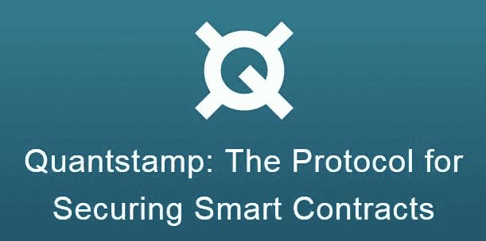
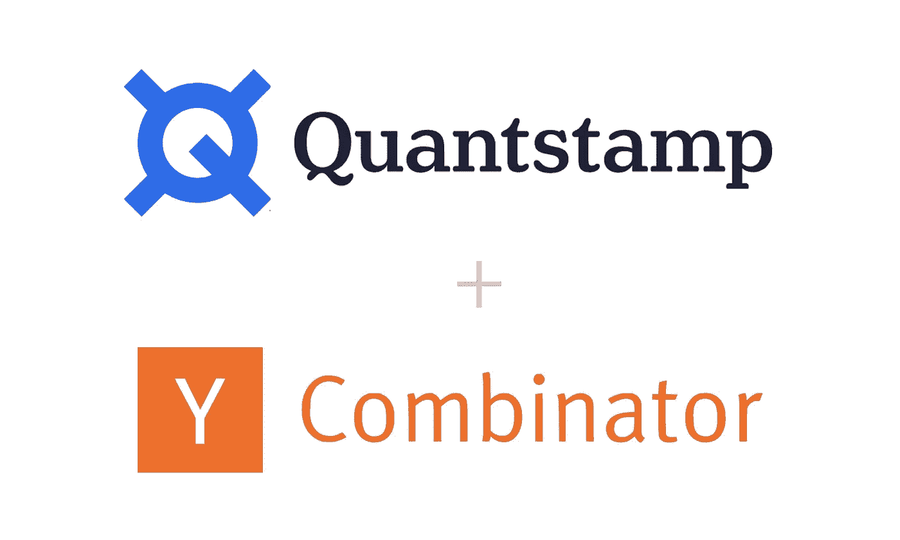
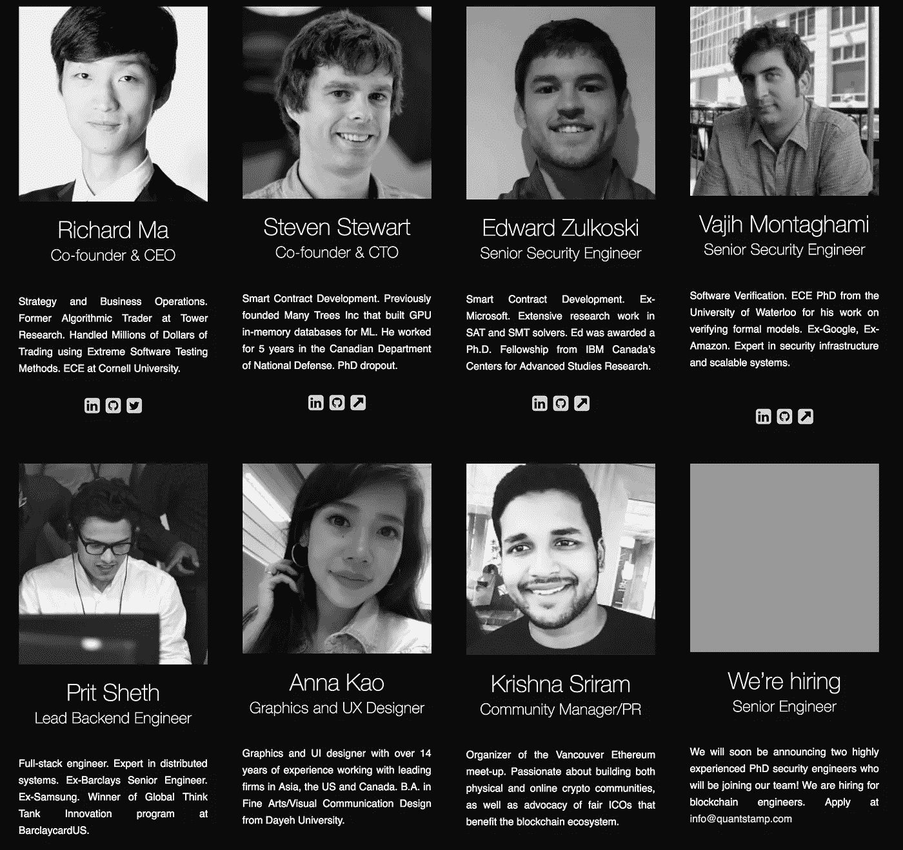
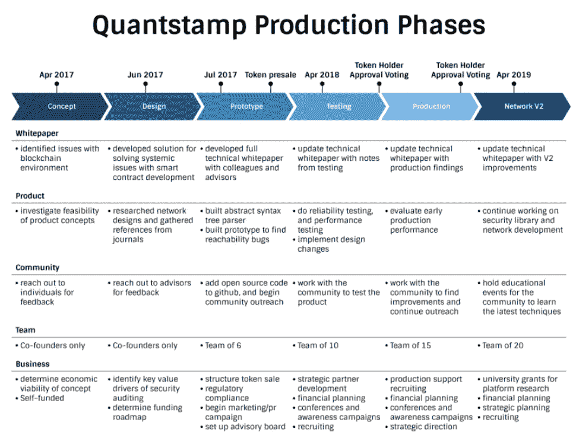
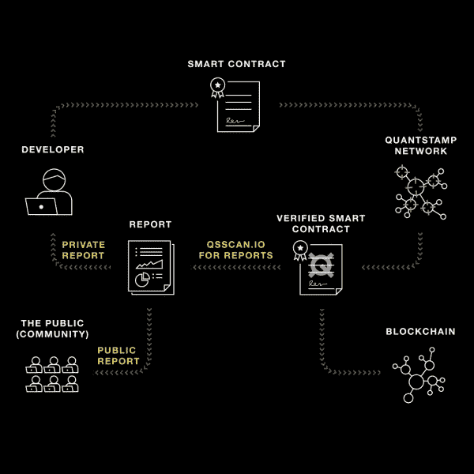
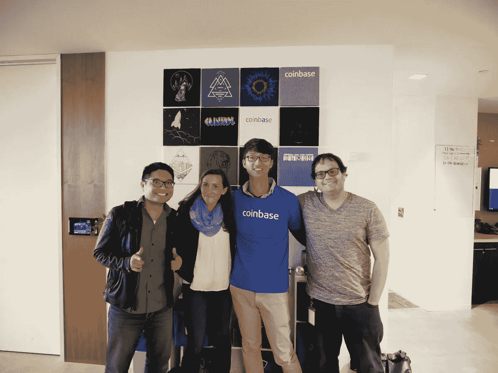

# quant stamp——区块链的 VeriSign

> 原文：<https://medium.com/hackernoon/quantstamp-verisign-of-blockchain-d7aff5d6cd57>

随着以太坊价格和投资激增，公司和消费者对安全性的需求不能再高了。今天，公司在一次黑客攻击中经历的平均损失约为**3000 万美元**，但在加密货币领域，这个数字可能会高得多。例如，今年早些时候，我们目睹了导致 512，774 以太网(2.42 亿美元)被盗的**平价钱包黑客**，以及 2016 年导致价值 6000 万美元以太网被盗的**道黑客**。如果我说这些黑客攻击可以通过正确审计他们的以太坊智能合同来防止呢？ **QuantStamp (QSP)** ，一个出自 Y Combinator 2018 年冬季班的项目，已经着手填补这个市场上的巨大空白，成为第一个去中心化的智能合约安全审核平台。今天，QSP **的交易价格为 0.16 美元**，但在**接下来的 12 个月**内，我预计这种象征性的交易价格为 3.20 美元，因为 Y Combinator 提供了资源和支持，计划进行 40 次审计，与 Request Network 和其他公司建立了合作伙伴关系，以及我将在下面概述的其他增长驱动因素。

# 基础知识:

1.  QuantStamp 是第一个可扩展的、经济高效的安全审计协议，旨在发现以太坊智能合约中的漏洞
2.  QuantStamp 项目源自孵化器 **Y Combinator** ，是他们 2018 年冬季班的一部分
3.  这些安全审计的唯一支付方式是使用 QSP 代币，一半用于支付的代币将被烧毁
4.  QuantStamp 项目位于加拿大温哥华，于 2017 年 11 月启动
5.  **股票代码:QSP**
    价格:$.16
    市值排名(Token): 135
    市值:100，964，819 美元
    流通供应量:617，314，171 QSP
    最大供应量:976，442，388 QSP
    平均交易量:2，209，547 美元
    共识:以太坊共识(目前是工作证明，将是证明

# 团队:

1.  QuantStamp 团队由理查德马领导。马云曾是 Tower Research 的算法交易员，在那里他用极端的软件测试方法处理了数百万美元的交易。马先生还在康奈尔大学获得了电子工程学士学位
2.  QuantStamp 的**首席技术官是史蒂文·斯图尔特**。Stewart 先生之前创建了许多树公司，专门从事构建 GPU 内存数据库。他还为加拿大国防部工作。
3.  QuantStamp 团队目前有 5 名额外的开发人员全职参与这个项目
4.  该团队还有另外 2 名**社交媒体经理和社区经理**
5.  团队的其他成员还有 **1 名平面设计师**和 **8 名经验丰富的顾问**

# 增长驱动因素:

1.  在接下来的一年内，预计将会建立另一个**1000 万份智能合同**，为 QuantStamp 提供的服务创造自然增长的需求
2.  截至 2017 年 10 月，约有**32 亿美元(1100 万瑞士法郎)被锁定在智能合同中**，公司将需要一种高效、经济且安全的方式来审计其智能合同，以保护自己免受损失
3.  QuantStamp 是**Y Combinator 2018 冬季班**的一部分。然而，QSP 还没有在 Y Combinator 的网站上正式上市，但预计当它上市时，人们的兴趣会激增
4.  QuantStamp 成功完成了对**请求网络**的智能合同审计，这是 Y Combinator 的另一个项目
5.  QuantStamp 团队已经为新的一年准备了另外 40 项审计
6.  QuantStamp 打算在未来将他们的服务扩展到其他协议，比如 Neo
7.  投资者持有 QuantStamp 代币的另一个动机是，他们将获得 QuantStamp 审计公司的代币。这是拥有 QuantStamp 代币的最大好处之一，因为在许多情况下，代币持有人可以接触到通常只有风投才能接触到的公司
8.  QuantStamp 的其他支持者包括:Blockfolio、Science Blockchain、Quoine、Team in Residence、Block Asset、Blockchain Partners Korea、Iconic Partners、Luna Capital、TLDR 和 Kenetic Capital……我认为这支 QSP 军队不言自明

# 逆风:

1.  如果一个已经通过 QuantStamp 审计的项目受到影响，QSP 代币的价值将会遭受巨大打击
2.  在这个项目的初始阶段，QSP 将不得不通过进行几次人工审计来建立他们的审计自动化协议，所以请记住，这是一个长期项目
3.  在 QuantStamp 团队将其服务扩展到其他协议之前，他们项目的成功与以太坊协议的发展直接相关

# 总结:

由于这个项目是独一无二的，而且是同类项目中的第一个，我们将使用一点估算来获得我们 12 个月的价格目标。首先，我将假设 QSP 当前价格的一半 0.08 美元是成功完成请求网络审计的结果。我们还知道，QSP 明年大约有 40 项审计。因此，我们将采用 **$.08 * 40 = $3.2** ，这给出了我们的 **12 个月目标价格**。最后，请记住这个价格目标不包括市场增长率。

我希望你喜欢今天的写作，因为这个硬币解决了太多问题，它不会成功。 **QuantStamp 团队……**我知道 2018 年将是属于你的一年！！

