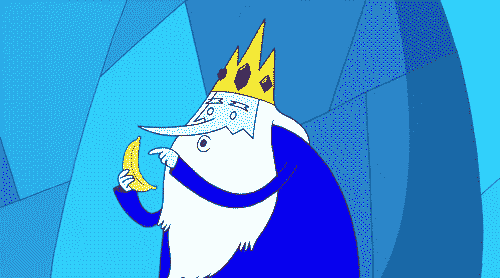
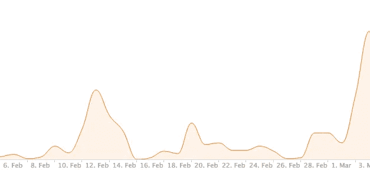

# 我如何通过一次更新将应用收入提高 600%

> 原文：<https://medium.com/hackernoon/questions-to-ask-yourself-about-mobile-user-acquisition-bb04b38d46f7>

Source: Giphy

几周前，我们发布了我们应用程序的第二次更新，[绿洲内容拦截器:赚取奖励，拦截广告](https://itunes.apple.com/us/app/oasis-content-blocker-earn/id1041122190?mt=8)。我们写了一篇关于更新的[媒体](/squarevibe-apps/you-re-doing-it-wrong-digital-advertising-52487a8486c5#.quqsr68xk)文章，到目前为止已经收到了超过 2500 次浏览。

随着我们对 Oasis 内容拦截器的第三次更新，我们的收入增长了 600%。一个应用程序更新可以极大地改善你的应用程序生活。

This graph indicates our user engagement. We released our latest app update early March; hence, the spike in user engagement.

通过这次更新，我们制定了用户获取策略来优化我们的应用。我们能够构建完善的改进来提供最终的用户体验。

> 在用户获取过程的每一步都要问自己这些问题。

## 用户通过 AppStore 或外部来源发现应用程序。

***1 —为什么用户会下载你的应用？他们有什么意图？***

AppStore 中有许多选项，为什么你的客户会选择你的应用？你需要竞争优势。有了 Oasis，我们想到了让这款应用脱颖而出的方法。

内容拦截器是 iOS 9 的巨大组成部分；它们允许更快的浏览速度，更低的数据利用率和更多的隐私。用户想要所有这些，所以他们下载内容拦截器。

经过深思熟虑，我们实现了一个功能，可以激励用户执行某些操作，例如阻止广告。在生活中，无论何时我们做了一些事情，我们都喜欢以某种方式得到回报，所以为什么不将回报的概念融入到 Oasis 中呢？

*简而言之，Oasis 内容拦截器用户可以兑换奖励并获得积分。这些积分可以兑换成各种零售商的礼品卡。*

这是我们的竞争优势。你呢？

***2——你的安装来自哪里？***

你的装置可以告诉你关于你的观众。我们的第二次更新在不到一周的时间里获得了超过 5000 次下载。

*   转诊系统引发了培养皿效应。我们的推荐系统发挥了作用，我们通过邀请码向邀请他人的人奖励额外的积分。被推荐的用户和推荐的用户都收到可兑换礼品卡的点数。对我们的用户来说，这是一个双赢的局面。
*   我们得到了第三方博客的大力支持。

**吸取的教训**

外在动机是我们下载的驱动力。Oasis 鼓励用户进行社交分享，以赚取可兑换礼品卡的积分。为了进一步激励这些用户，结合更多的方式来赚取积分应该会让用户保持更多的内容。

## 用户下载应用程序。他留着这个应用。

***3 —什么作品？用户为什么决定留下来？***

我们从中吸取了两个教训:

*   用户其实是在兑换奖励，赚取积分。
*   用户也相信我们的使命，正如我们上一篇媒体文章的高浏览量所指出的。

## 用户下载应用程序。他删除了应用程序。

***4 —有哪些痛点？是什么导致了用户流失，你如何减少用户流失？***

*   用户对兑换奖励的过程感到困惑。我们没有提供任何关于赎回的培训文档。一旦用户注册，用户将不得不等待推送通知，然后才能收到奖励。用户变得困惑，因为他们期望立即得到回报，而我们没有提供这个选项。
*   我们通过推送通知提供奖励。这样，我们忘记了包括关闭推送通知的用例。当用户禁用推送通知时，他将永远得不到奖励。
*   选择接收推送通知的用户抱怨说，每天接收多个推送通知比看到广告更糟糕。此时，大多数用户留下了负面评价或卸载了该应用。

**经验教训**

*   用户体验的扩展超过了实际的用户界面。它应该包含应用程序的可用性和可理解性。

***5 —你应该做哪些改进？***

我们吸取了这些经验教训，在最新更新中精心打造了新的解决方案。

*   我们不再依赖通知来发放奖励，而是创造了一种新方法，每天自动发放 3 到 5 份奖励，无论有无通知。
*   当用户打开通知时，该通知仅作为提醒。此外，如果用户没有兑换奖励，我们将允许他们累积奖励。
*   为了提高我们的注册转化率，我们增加了一个脸书登录按钮。
*   我们还添加了红色的 iOS 通知徽章，以通知用户未兑换的奖励。
*   我们增加了一个通用的奖励偏好，所以没有偏好的用户可以收到所有类别的奖励。
*   我们为 iPhone 6S 和 6S Plus 用户在 Oasis 应用中加入了 3D Touch。用户现在可以快速访问应用程序的奖励部分。

## 我们的成功

我们在开发和创建用户想要的应用程序方面取得了一些小小的成功。

也就是说，我们发布了第四次更新的[倾斜:生产战略](https://geo.itunes.apple.com/us/app/oblique-productive-strategies/id902143877?mt=8&at=1001l8cE)，它获得了超过 195 个评论，接近 5 颗星的评级。我们登上了英国 AppStore 生产力排行榜前 5 名，中国 AppStore 生产力排行榜前 20 名，美国 AppStore 生产力排行榜前 50 名。

我们另一个成功的应用， [Rap Hip-Hop Black Cards](https://itunes.apple.com/us/app/rap-hip-hop-black-cards/id978233925?mt=8) ，有超过 95 条评论，接近 5 星评级，并在 iTunes AppStore 中出现了 300 多次。也达到了美国 AppStore 前 50 的音乐(游戏)，美国 AppStore 前 100 的卡牌(游戏)。

**我们是怎么做到的？**

很简单。最大化您的应用更新。你的应用第一次可能不一定能吸引用户，但从以前的错误中吸取教训后，你肯定能在第二次甚至第三次改进。

## 感谢阅读！如果你喜欢这篇文章，请点击❤推荐给他人。

## 在 AppStore 查看 [Oasis](http://squarevi.be/oasis) ！

## 下一个阅读清单:[你做错了:数字广告](/squarevibe-apps/you-re-doing-it-wrong-digital-advertising-52487a8486c5#.8uistkwos)

 [## 你做错了:数字广告

### 自从 iOS 9 Safari 发布内容拦截器后，出版商不得不重新思考他们的盈利策略…

medium.com](/p/52487a8486c5) 

> [黑客中午](http://bit.ly/Hackernoon)是黑客如何开始他们的下午。我们是阿妹家庭的一员。我们现在[接受投稿](http://bit.ly/hackernoonsubmission)并乐意[讨论广告&赞助](mailto:partners@amipublications.com)机会。
> 
> 如果你喜欢这个故事，我们推荐你阅读我们的[最新科技故事](http://bit.ly/hackernoonlatestt)和[趋势科技故事](https://hackernoon.com/trending)。直到下一次，不要把世界的现实想当然！

